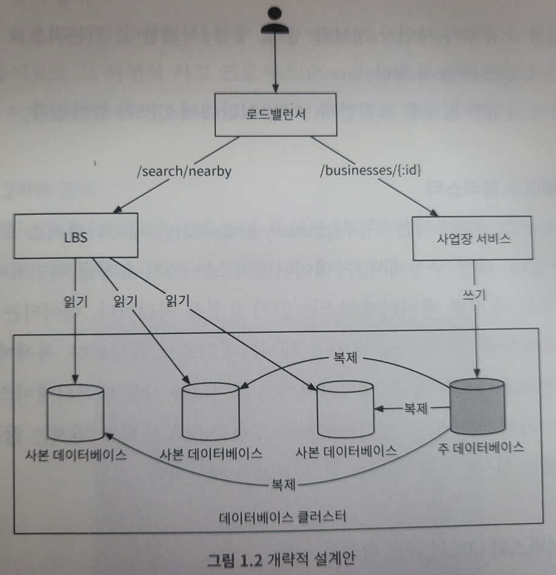
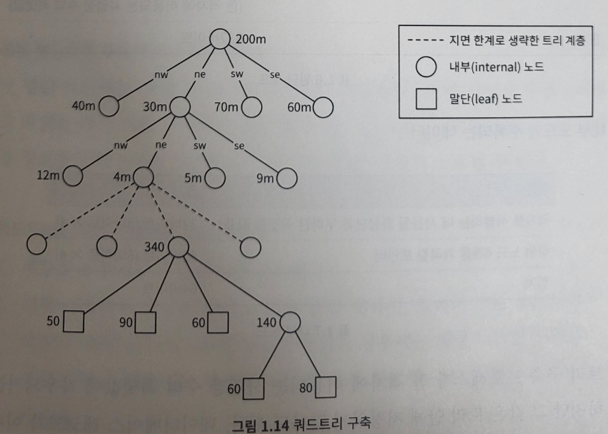

# 1. 근접성 서비스
- 현재 위치에서 가까운 시설을 찾는데 이용
  - 옐프 앱의 경우 주변에 있는 좋은 식당 검색
  - 구글 맵의 경우 가까운 k개 주유소 검색

## 1.1 문제 이해 및 설계 범위 확정
##### 기능 요구사항
- 사용자의 위치와 검색 반경 정보에 매치되는 사업장 목록을 반환
- 사업장 소유주가 사업장 정보를 추가/삭제/갱신할 수 있도록 하되, 실시간 반영될 필요는 없음
- 고객은 사업장의 상세 정보를 살필 수 있어야함

##### 비기능 요구사항
- 낮은 응답 지연: 주변 사업장을 신속히 검색 가능
- 데이터 보호: GDPR(General Data Protection Regulation) or CCPA(California Consumer Privacy Act) 같은 데이터 사생활 보호 법안 준수
- 고가용성 및 규모 확장: 인구 밀집 지역에서 특정 시간에 발생하는 대규모 트래픽 감당 가능하게 설계

##### 개략적 규모 추정
- DAU는 1억명, 등록된 사업장 수는 2억개라고 가정
- QPS(Query per second)계산
  - 1일 = 24(시간) x 60(분) x 60(초) → 86,400초
  - 계산을 쉽게 하기 위해 대략적으로 10<sup>5</sup>   초로 올림
  - 한 사용자가 하루에 5회 검색을 시도
  - QPS는 5,000으로 추정 => (1억 x 5) / 10<sup>5</sup>

## 1.2 개략적 설계안 제시 및 동의 구하기
 - 논의 내용
   - API 설계
   - 개략적 설계안
   - 주변 사업장 검색 알고리즘
   - 데이터 모델
   
##### API 설계
- RESTful API 관례를 따르는 간단한 API를 만들어 보도록 함
  - GET /v1/search/nearby
    - 특정 검색 기준에 맞는 사업장 목록 반환
      - 실제로 사용되는 애플리케이션의 경우, 검색 결과는 보통 페이지 단위로 나눠 반환
      - paramter는 아래와 같음

        | 필드        | 설명                             | 자료형     |
        |-----------|--------------------------------|---------|
        | latitude  | 검색할 위도                         | decimal |
        | longitude | 검색할 경도                         | decimal |
        | radius    | 선택적 인자(optional). 생략할 경우 5000M | int     |
      - 반환되는 결과는 다음과 같음\
      { "total" : 10, "businesses": [{business object}]}
        - business object, 즉 각 사업장을 표현하는 객체는 검색결과 페이지에 표시될 모든 정보를 포함
        - 하지만 상세정보는 추가 정보가 필요할 수 있기에 다른 API를 호출하여 상세 정보를 가져올 필요 있음
  - 사업장 관련 API
    - 사업장 객체 관련 API 목록

      | API                       | 설명               |
      |---------------------------|------------------|
      | GET /v1/businesses/:id    | 특정 사업장의 상세 정보 반환 |
      | POST /v1/businesses   | 새로운 사업장 추가       |
      | PUT /v1/businesses/:id    | 사업장 상세 정보 갱신     |
      | DELETE /v1/businesses/:id | 특정 사업장 정보 삭제     |

##### 데이터 모델
- 읽기/쓰기 비율 및 스키마 설계에 대해 논의
  - 읽기/쓰기 비율
    - 읽기 연산은 굉장히 자주 수행 → 두 기능의 이용 빈도가 높음
      - 주변 사업장 검색
      - 사업장 정보 확인
    - 쓰기 연산 실행 빈도는 낮음 → 사업장 정보를 추가하거나 삭제, 편집하는 행위는 빈번하지 않음
      - 읽기 연산이 압도적인 시스템에는 RDB가 바람직할 수 있음
  - 데이터 스키마
    - business 테이블과 지리적 위치 색인 테이블이 핵심 테이블
      - business 테이블: 사업장 상세 정보, business_id가 PK
        | business        |
        |-----------------|
        | business_id(PK) |
        | address         |
        | city            |
        | state           |
        | country         |
        | latitude        |
        | longtitude      |
    
      - 지리적 위치 색인 테이블: 위치 정보 관련 연산의 효율성을 높이는 데 활용

##### 개략적 설계
- 아래는 개략적인 설계안이며, 위치 기반 서비스와 사업장 관련 서비스로 나뉨\
  
  - 로드밸런서
    - 유입 트래픽을 자동으로 여러 서비스에 분산 시키는 컴포넌트
    - 통상적으로 로드밸런서에 단일 DNS 진입점을 지정하고 URL 경로로 분석하여 서비스에 트래픽 분산
  - 위치 기반 서비스
    - 시스템의 핵심 부분이며, 주어진 위치와 반경 정보를 이용해 주변 사업장을 검색
      - 쓰기 요청이 없는, 읽기 요청만 빈번하게 발생하는 서비스
      - QPS가 높고 특정 시간대의 인구 밀집 지역일수록 그 경향이 심함
      - 무상태(stateless) 서비스이므로 수평적 규모 확장이 쉬움
  - 사업장 서비스 
    - 주로 두 종류의 요청을 처리함 
      - 사업자 소유주가 사업장 정보 생성,갱신,삭제 함. 기본적으로 쓰기 요청이 많음으로 QPS가 높지 않음
      - 고객이 사업장 정보를 조회함. 특정 시간대에 QPS가 높아짐
  - 데이터베이스 클러스터
    - 주-부(primary-secondary) 데이터베이스 형태로 구성
      - 주 데이터베이스는 쓰기 요청을 처리하며, 사본 데이터베이스는 읽기 요청을 처리
      - 데이터는 주 데이터베이스에 기록된 다음에 사본 데이터베이스로 복사됨
      - 복제에 걸리는 시간 지연(delay) 때문에 주 데이터베이스 데이터와 사본 데이터베이스는 데이터 사이에는 차이가 존재
        - 보통은 그렇더라도 문제가 되지 않기에, 사업장 정보는 실시간으로 갱신될 필요가 없기 때문임
  - 사업장 서비스와 LBS의 규모 확장성
    - 사업장 서비스 및 LBS 둘다 무상태 서비스이므로 특정 시간대에 집중적으로 몰리는 트래픽에는 자동으로 서버 추가하여 대응, 유휴 시간 대에는 서버를 삭제하도록 구성
    - 시스템을 클라우드에 둔다면 여러 지역, 여러 가용성 구역에 서버를 두어 가용성을 높일 수 있음
      
##### 주변 사업장 검색 알고리즘
- 많은 회사가 레디스 지오해시(Geohash in Redis)나 PostGIS 확장을 설치한 포스트그레스(Postgres) DB를 활용
- 주변 사업장 검색에 대한 몇가지 방안을 살펴보고, 그 이면의 사고 프로세스(thought process)를 검토한 다음 타협적 측면(trade-off)에 대해 논의

- 방안 1: 2차원 검색
  - 주어진 반경으로 그린 원 안에 놓인 사업장을 검색하는 방법
    - 가장 직관적이지만 지나치게 단순하다는 문제 
    - 위도, 경도 및 반경을 통한 SQL 검색 → 테이블 전부를 읽어야 하므로 효율적이지가 않음
      - 색인을 만들면 효율적 개선이 될까? 그렇지 않음, 색인은 1차원 적인 검색 속도만 개선
        - 데이터가 2차원적이기에, 칼럼별로 가져온 결과도 여전히 엄청난 데이터임, 아래 그림과 같이 데이터 집합 1과 2에 대해 구할 수 있지만 교집합에 대해 구하는 것은 엄청난 양의 데이터 때문에 비효율적임\
          
      - 2차원 데이터를 1차원에 대응시킬 방법 존재 → 지도를 작은 영역으로 분할하고 고속 검색이 가능하도록 색인을 만드는 것
        - 지리적 정보에 색인을 만드는 방법은 두 종류\
          
          - 해시 기반 방안: 균등 격자, 지오해시, 카르테시안 계층 등
          - 트리 기반 방안: 쿼드트리, 구글 S2, R 트리 등

- 방안 2: 균등 격자\
  
  - 작은 격자 또는 구획으로 나누는 단순한 접근법
      - 하나의 격자는 여러 사업장을 담을 수 있고, 하나의 사업장은 오직 한 격자 안에만 속함
    - 단점
      - 전 세계를 동일한 크기의 격자로 나누면 데이터 분포는 전혀 균등하지 않음 → 지역마다 사업장 분포가 균등하지 않음
      - 주어진 격자의 인접 격자를 찾기 까다로울 수 있음

- 방안 3: 지오 해시\
  
  - 2차원의 위도 경도 데이터를 1차원의 문자열로 변환 → 비트를 하나씩 늘려가면서 재귀적으로 세계를 더 작은 격자로 분할
  - 해당 절차를 원하는 정밀도를 얻을 때까지 반복 후, base32표현법을 사용
    - 구글 본사 지오 해시(길이 6)
    ````
    1001 11010 01001 10001 11111 11110 (base32 이진 표기) → 9q9hvu (base32)
    ````
    - 12단계 정밀도를 갖으며, 이 정밀도가 격자 크기를 결정
    - 최적 정밀도는? 사용자가 지정한 반경으로 그린 원을 덮는 최소 크기 격자
  - 방법 이슈(edge case) 
    - 가까운 거리에도 공통 접두어를 갖지 못하는 경우 
    - 가까운 거리에 공통 접두어를 갖지만 서로 다른 격자에 놓이는 경우
  - 이슈 해결책으로 현재 격자를 비롯한 인접한 모든 격자의 모든 사업장 정보를 가져오는 것
    - 특정 지오해시의 주변 지오해시를 찾는 것은 상수 시간에 가능한 연산
  - 표시할 사업장이 충분하지 않은 경우는?
    - 주어진 반경 내 사업장만 반환 → 사용자 불만족
    - 검색 반경을 키움 → 지오해시 값의 마지막 비트를 삭제하여 주변 사업장을 검색

- 방안 4: 쿼드트리
  - 격자의 내용이 특정 기준을 만족할 때까지 2차원 공간을 재귀적으로 사분면 분활하는데 흔히 사용되는 자료 구조\
    \
    
    - 예를 들어 격자에 담긴 사업장 수가 100개 이하가 될 때까지 분할하는 것
    - 메모리 안에 놓이는 자료구조이며, 데이터베이스는 아님
    - 해당 자료구조는 각각의 LBS 서버에 존재해야 하며, 서버가 시작하는 시점에 구축됨
  - 메모리 사용량
    - 말단 노드에 수록되는 데이터

      | 이름                             | 크기                      |
      |--------------------------------|-------------------------|
      | 격자를 식별하는 데 사용될 좌상단과 우하단 꼭짓점 좌표 | 32바이트 (8바이트 X 4)        |
      | 격자 내부 사업장 ID 목록                | ID당 8바이트 X 100 (격자 최대치) |
      | 합계                             | 832 바이트                 |
    - 내부 노드에 수록되는 데이터

      | 이름                             | 크기               |
      |--------------------------------|------------------|
      | 격자를 식별하는 데 사용될 좌상단과 우하단 꼭짓점 좌표 | 32바이트 (8바이트 X 4) |
      | 하위 노드 4개를 가리킬 포인터              | 32바이트 (8바이트 X 4) |
      | 합계                             | 64 바이트           |
  - 아래와 같이 메모리 계산
    - 말단 노드의 수 =~ 200m/100 =~ 2m(2백만)
    - 내부 노드의 수 =~ 2m * 1/3 =~ 0.67m
    - 총 메모리 요구량 = 2m x 832 바이트 + 0.67 x 64 바이트 =~ 1.71GB
  - 전체 쿼드트리 구축에 소요되는 시간은?
    - 전체 사업장 수를 n 이라고 하면 트리를 구축하는데 시간 복잡도는 n/100 * log(n/100)
    - 2억개의 사업장 정보를 인덱싱하는 쿼드트리 구축에는 몇 분정도 소요 가능
  - 쿼드 트리로 주변 사업장 검색
    - 메모리에 쿼드트리 인덱스를 구축
    - 검색 시작점이 포함된 말단 노드를 만날 때까지, 트리의 루트 노드부터 탐색
      - 해당 노드에 100개 사업장이 있는 경우에 해당 노드만 반환
      - 그렇지 않은 경우에는 충분한 사업장 수가 확보될 때까지 인접 노드도 추가
  - 쿼드트리 운영 시 고려사항
    - 쿼드 트리 구축 시간 문제
      - 서버 시작 시 쿼드 트리 구축 하면 서버 시작 시간이 늦어짐
      - 동시에 너무 많은 서버가 배포되면 안됨
        - 서버 클러스터의 상당 부분이 동시에 꺼져서 서비스 품질이 저하되는 일을 막을 수 있음 
        - 동시에 배포 시, 초기 트리 구조에 필요한 데이터를 받아오기 위해 DB 부담을 줌
    - 운영 시 쿼드 트리 갱신 문제 
      - 가장 쉬운 방법은 점진적 갱신
        - 짧은 시간에 낡은 데이터가 반환될 수 있지만 요구사항이 엄격하지 않으면 활용 가능
      - 실시간 갱신도 가능하지만 설계가 많이 복잡해짐
- 방안 5: 구글 S2
  - 구글 S2 기하(geometry) 라이브러리는 이 분야에서 유명한 솔루션 
  - 메모리 기반의 지구를 힐베르트 곡선이라는 공간 채움 곡선을 사용하여 1차원 색인화하는 방식

##### 지오해시 vs 쿼드트리
- 지오해시
  - 구현과 사용이 쉬움, 트리를 구축할 필요 없음
  - 지정 반경 이내 사업장 검색을 지원
  - 정밀도를 고정하면 격자 크기도 고정됨 → 인구밀도에 따른 격자 조정이 안됨
  - 색인 갱신이 쉬움 → 색인에서 사업장 하나를 삭제하려면 해당 열만 삭제하면 가능
- 쿼드 트리
  - 구현하기가 살짝 더 까다로움, 트리 구축이 필요
  - k번째로 가까운 사업장까지의 목록을 구할 수 있음
  - 인구 밀도에 따라 격자 크기를 동적으로 조정할 수 있음
  - 지오 해시보다 색인 갱신이 까다로움 → 트리구조이면서, 시간 복잡도가 log n 임. 또한 트리 구조로 인한 리밸런싱 필요

## 1.3 상세 설계
- 아래 내용에 대해 더 상세히 살펴봄
  - 데이터 베이스 규모 확장
  - 캐시(cache)
  - 지역(region) 및 가용성 구역(availability zone)
  - 시간대 또는 사업장 유형에 따른 검색
  - 최종 아키텍처 다이어그램

##### 데이터 베이스 규모 확장
- 사업장(business)테이블과 지리 정보 색인(geospatial index)테이블의 규모 확장성을 살펴봄
- 사업장 테이블
  - 테이블 데이터를 한 서버에 담을 수 없음 → 샤딩을 적용하기 좋음
  - 사업장 ID를 기준으로 샤딩하는게 가장 간단한 방법
- 지리 정보 색인 테이블
  - 지오해시나 쿼드트리 둘 다 널리 사용되지만 단순하게 지오해시를 사용
    - 방안 1: 지오 해시에 연결된 모든 ID를 JSON 배열로 같은 열에 저장
    - 방안 2: 같은 지오해시에 속한 사업장 ID를 별도 열로 저장하는 방법
    - 추천: 방안2 → 방안 1 데이터 변경 시, lock 활용 등 경계 조건이 많아짐
- 지리 정보 색인의 규모 확장
  - 관계형 데이터베이스에서 부하 분산에는 두가지 전략 존재
    - 샤딩
    - 사본 데이터 서버
  - 지오 해시 테이블은 샤딩이 까다로우며, 해당 설계안은 하나의 서버에 다 담을 수 있기에 사본 데이터 서버 활용

##### 캐시
- 캐시 계층 도입 시, 진짜 필요한가에 대해 판별해야함
- 캐시 키
  - 사용자의 위도 경도 (x)
    - 사용자의 전화기에서 반환되는 위치 정보는 추정치
    - 사용자가 이동하면 해당 위도 및 경도 정보도 미세하게 변경 -> 거의 변화가 없음
  - 지오 해시나 쿼드 트리를 통해 같은 격자 및 사업자 정보를 캐시로 활용
- 격자 내 사업장 ID
  - 지오 해시(key) 사업장 ID 목록(value)를 미리 계산하여 레디스에 저장하여 활용
  - 새로운 사업장을 추가하거나 삭제 또는 편집할 때, DB에 갱신하고 캐시 무효화
  - 레디스 클러스터를 전 세계에 각 지역에 두고, 동일한 데이터를 각 지역에 중복해서 저장
    - 서버 한대로도 충분하지만 고가용성을 보장하고 트래픽의 전송 지연을 방지하\
- 클라이언트 애플리케이션에 표시할 사업장 정보
  - 사업장 디테일한 정보는 사업장 ID를 키를 바탕으로 레디스에 저장

##### 지역 및 가용성 구역
- 위치 기반 서비스는 여러 지역과 가용성 구역에 설치
  - 사용자와 시스템 사이의 물리적 거리를 최소한으로 줄일 수 있음
  - 트래픽을 인구에 따라 고르게 분산하는 유연성 확보
  - 그 지역의 사생활 보호법에 맞는 운영이 가능

##### 추가 질문: 시간대, 혹은 사업장 유형별 검색
- 지금 영업 중인 사업장, 혹은 식당 정보만 받아오고 싶다면?
  - 지오해시나 쿼드 트리를 통해 근처 사업장 ID를 전부 확보 한뒤, 사업장 정보에서 영업시간 필터링 처리

##### 최종 설계도


1. 클라이언트 앱은 사용자의 위치(위도와 경도 정보)와 검색 반경(500미터)을 로드밸런서로 전송
2. 로드밸런서는 해당 요청을 LBS로 전달
3. 사용자 위치와 반경 정보에 의거하여, 검색 요건을 만족할 지오해시 길이를 계산
4. 인접한 지오해시를 계산한 다음 목록에 추가
5. 지오해시 각각에 대해 '지오해시' 레디스 서버를 호출하여 대응하는 사업장 ID를 추출
6. 반환된 사업장 ID를 가지고 '사업장 정보' 레디스 서버 조회

- 사업장 정보 조회,갱신, 추가 그리고 삭제
  - 사업장 정보 관련 API는 LBS와는 분리되어 있음
  - 캐시에 사업장 정보가 있으면 사용, 아니면 DB에서 조회해서 캐시에 적재
  - 추가 및 갱신 정보는 밤 사이에 캐시에 갱신

## 1.4 마무리
- 몇가지 색인 방안
  - 2차원 검색
  - 균등 분할 격자
  - 지오해시
  - 쿼드트리
  - 구글 S2
- IT 기업에서 널리 쓰이는 기술은 지오해시, 쿼드트리, 그리고 S2
