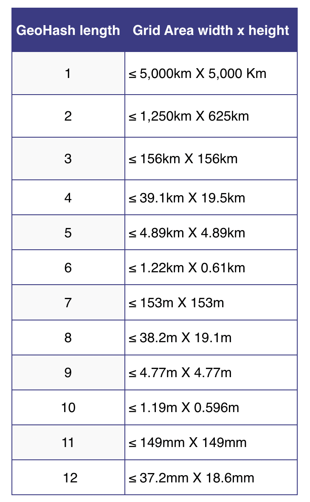

# Chapter 1. 근접성 서비스

proximity service

- 현재 위치에서 가까운 시설을 찾는 기능 구현에 이용된다.
    - Yelp앱의 경우 주변의 좋은 식당 검색
    - 구글 맵의 경우 가까운 k개 주유소 검색 등

## 1단계: 문제 이해 및 설계 범위 확정

- 설계의 범위 좁히기
    - 검색 반경(radius) 지정이 가능한가?
    - 최대 허용 반경은?
    - UI에서 검색 반경을 변경할 수 있는가?
    - 사업장 정보는 어떻게 시스템에 추가/삭제/갱신 되는가? 이 정보는 실시간으로 유저에게 제공되어야 하는가?
- 기능 요구사항 도출
    - 사용자의 위치(위도, 경도)와 검색 반경 정보에 매치되는 사업장 목록을 반환
    - 사업장 소유주가 사업장 정보를 추가/삭제/갱신 가능하고 실시간으로 반영될 필요는 없다
    - 고객은 사업장의 상세 정보를 볼 수 있어야 한다.
- 비기능 요구사항 도출
    - 늦은 응답 지연 latency: 신속하게 검색할 수 있어야 함
    - data privacy: 위치 기반 정보(Location-Based service, LBS) 설계시 사용자의 정보를 보호해야 함
        - GDPR(General Data Protection Regulation)이나 CCPA(California Consumer Privacy ACT) 등의 사생활 보호 법안을 준수
    - 고가용성(high availability) 및 규모 확장성(scalability)
        - 인구 밀집 지역의 트래픽도 감당 가능해야 함
- 개략적 규모 추정 back-of-the-envelope calculation
    - 일간 능동 사용자(DAU, daily active user)는 1억명, 등록된 사업장 수는 2억이라고 가정

      > QPS (Query per Second) 계산
      1일 = 24시간 * 60분 *60초 = 86400초 ⇒ 대략 10^5초
      한 사용자는 하루에 5회 검색 시도
      QPS ⇒ (1억 * 5) / 10^5 = 5,000
>

## 2단계: 개략적 설계안 제시 및 동의 구하기

### API 설계

- 특정 검색 기준에 맞는 사업장 목록을 반환하는 간단한 API

  > GET /v1/search/nearby
  >
    - api 호출시 전달할 인자


    | 필드 | 설명 | 자료형 |
    | --- | --- | --- |
    | latitude | 검색할 위도 | decimal |
    | longitude | 검색할 경도 | decimal |
    | radius | Optional. default = 5000m(대략 3마일) | int |
    
    - 반환값 예시
        
        ```jsx
        {
        	"total": 10,
        	"businesses: [{business object}] // 사업장을 표현하는 객체
        }
        ```

- 사업장 관련 api


    | API | 설명 |
    |-----|-----|
    | GET /vi/businesses/:id | 특정 사업장 상세 정보 반환 |
    | POST /v1/businesses | 새로운 사업장 추가 |
    | PUT /v1/businesses/:id | 사업장 정보 갱신 |
    | DELETE /v1/businesses/:id | 사업장 삭제 |

### 데이터 모델

- 읽기/쓰기 비율
    - 읽기 연산은 자주 수행되며
        - 읽기 빈도가 높은 요청: 주변 사업장 검색, 사업장 정보 확인
    - 읽기 빈도가 압도적으로 높은 경우 MySQL같은 관계형 데이터베이스가 바람직할 수 있음.
    - 쓰기 연산은 빈도가 낮음
- 데이터 스키마
    - 이 시스템의 핵심 테이블은 business 테이블과 geospatial index table (지리적 위치 색인 테이블)
    - business Table
        - 사업장 상세 정보
    - 지리적 위치 색인 테이블
        - 위치 정보 관련 연산의 효율성을 높이는데 사용

### 개략적 설계

- 그림 1.2
- LB
- 서비스
    - LBS
        - 읽기 요청만 빈번, QPS가 높으며 특히 특정 시간대 인구밀집 지역일수록 높다
        - stateless 서버이므로 수평 확장이 쉽다.
    - 사업장 서비스
        - 사업장 정보를 쓰고/갱신/삭제 하는 서비스
        - 기본적으로 write 요청이며 QPS가 높지 않다.
        - 고객이 사업장 정보를 조회하며, 특정 시간대 QPS가 높아진다.
        - 무상태 서비스.
    - 두 서비스 모두 무상태이므로 트래픽에 따라 확장/축소 가능하도록 구성한다.
        - 시스템을 클라우드에 둔다면 여러 가용 구역에 서버를 두어 시스템 가용성을 높일 수 있다.
- 데이터베이스 클러스터
    - primary-secondary 데이터베이스의 형태
        - 쓰기 전용 주 데이터베이스
        - 읽기 전용 사본의 부 데이터베이스 3개
        - 주 데이터베이스에 기록된 후 부 데이터베이스로 복사되며 이때 delay가 발생할 수 밖에 없다.
            - 하지만 이 서비스에서는 실시간 성일 필요는 없다고 가정함

### 주변 사업장 검색 알고리즘

- Geohash in Redis나 PostGIS 확장을 설치한 PostgresDB를 많이 활용
- 주변 사업장 검색 방법
    - 방안 1: 2차원 검색
        - 주어진 반경으로 그린 원 안에 노인 사업장을 검색하는 방법. 직관적이지만 지나치게 단순하다는 단점이 있다. (그림1.3)
        - SQL로 옮긴다면 테이블 전부를 읽어야 하므로 효율적이지 않다.

            ```jsx
            SELECT business_id, latitude, longitude
            FROM business
            WHERE (latitude BETWEEN {:my_lat} - radius AND {:my_lat} + radius)
            AND
            (longitude BETWEEN {:my_long} - radius AND {:my_long} + radius
            ```

        - 위도와 경도 데이터에 색인을 만든다고 해도 데이터가 방대하여 효율이 썩 좋지는 않다.
        - 2차원 데이터를 한  차원에 대응시킬 방법이 있을까?
            - 해시 기반 방안
                - 균등 격자 (even grid), geohash, 카르테시안 계층(cartesian tiers) 등
            - 트리 기반 방안
                - quadtree, 구글 S2, R-tree 등
            - 구현 방법만 다를 뿐 지도를 작은 영역으로 분할하고 고속 검색이 가능하도록 색인을 만든다는 점에서 아이디어는 같다.
                - 지오 해시, 구글 S2는 실제로 널리 쓰이는 방법
    - 방안2: 균등 격자 even grid
        - 지도를 작은 격자/구획으로 나누는 단순한 접근
        - 하나의 격자는 여러 사업장을 담을 수 있고, 하나의 사업장은 오직 한 격자 안에만 존재
        - 데이터 분포가 균등하지 못하다는 단점이 있다
            - 격자마다 인구 밀도도 다르고 사업장 분포가 고르지 못함
        - 주어진 격자의 인접 격자를 찾기 까다로울 수 있다.
    - 방안3: 지오해시 (Geohash)
        - 2차원의 위도/경도 데이터를 1차원의 문자열로 변환
            - 기준을 자오선과 적도 기준 사분면으로 나눈다
        - 지오해시 알고리즘은 비트를 하나씩 늘려가며 재귀적으로 세계를 더 작은 격자로 분할해 간다.

          

        - 그림 1.7
        - 이 절차를 원하는 정밀도 precision을 얻을 때 까지 반복
        - 지오 해시는 통상적으로 [base32 표현법](https://en.wikipedia.org/wiki/Base32)을 사용한다.
        - 지오 해시는 12단계 정밀도를 갖는다

          

        - 적정 지오해시는 길이가 4~6 사이. 4보다 작으면 격자가 너무 커지고 6보다 커지면 격자가 너무 작아진다.
        - 대게 잘 동작하지만 격자 가장자리 처리 방식에 관한 edge case가 몇가지 있다
            - 지오해시는 해시값의 공통 접두어가 긴 격자들이 서로 가깝게 놓이도록 보장한다.
            - 하지만 아주 가까운 두 위치가 어떤 공통 접두어도 갖지 않는 일이 발생할 수 있다.
                - 지오해시 나누는 기준이 적도이므로 적도 기준으로 아주 가까워도 ..
            - 이런 단점때문에 아래와 같은 단순한 SQL 질의문을 사용하면 주변 모든 사업장을 가져올 수 있다.

            ```jsx
            SELECT * FROM geohash_index WHERE geohash LIKE "9q8zn%"
            ```

            - 가장 흔한 해결책은 현재 격자를 비롯 인접한 모든 격자의 모든 사업장 정보를 가져오는 것이다. 이는 상수시간 내에 가능한 연산이다.
        - 표시할 사업장이 충분하지 않은 경우
            - 선택1: 주어진 반경 내 사업장만 반환한다.
            - 선택2: 적절한 검색결과가 있을 때까지 검색 반경을 키운다.
    - 방은 4: 쿼드트리

      

        - 격자의 내용이 특정 기준(ex. 격자에 담긴 사업장 수가 100개 이하)을 만족할 떄까지 2차원 공간을 재귀적으로 사분면 분할하는데 흔히 사용되는 자료 구조.

        ```java
        public void buildQuadtree(TreeNode node) {
        	if (countNumberOfBusinessesInCurrentGrid(node) > 100 ) {
        		node.subdivide();
        		for ( TreeNode child : node.getChildren() ) {
        			buildQuadtree(child);
        		}
        	}
        }
        ```

        - 쿼드트리는 메모리 안에 놓이는 자료 구조일 뿐 데이터베이스가 아니므로 각각의 LBS 서버에 존재해야 하며 서버가 시작되는 시점에 구축된다.
        - 쿼드트리의 루트노드는 세계 전체 지도를 나타낸다.
        - 말단 노드에 수록되는 데이터
            - 격자를 식별하는 데 사용될 좌상단과 우하단 꼭짓점 좌표 (32바이트) + 격자 내부 사업장 ID 목록 (ID당 8 * 100) = 합계: 832바이트
        - 내부 노드에 수록되는 데이터
            - 격자를 식별하는데 사용될 좌상단과 우하단 꼭짓점 좌표 32바이트 + 하위 노드 4개를 가리킬 포인터 32 바이트 ( 8바이트 *4) = 64 바이트
        - 메모리 사용량 계산
            - 격자 안에는 최대 100개 사업장이 있을 수 있고
            - 말단 노드의 수는 대략 200m / 100 = 대략 2백만
            - 내부 노드의 수 = 2m * [1/3](https://stackoverflow.com/questions/35976444/how-many-leaves-has-a-quadtree) = 대략 0.67m
            - 총 메모리 요구량 = 2m * 832바이트 + 0.67m * 64바이트 = 대략 1.71GB 로 생각보다 작으므로 서버 한대에 충분히 올릴 수 있다.
            - 읽기 연상 양이 많아지면 서버 한 대의 CPU나 네트워크 대역폭으로는 감당하기 어려우므로 읽기 연산을 여러 대의 쿼드트리 서버로 분산시켜야 할 것이다.
        - 전체 쿼드트리 구축에 소요되는 시간은?
            - 전체 사업장 수를 n 이라고 하고, 말단 노드에 대략 100개의 사업장이 저장되므로, n/100logn/100 이다.
            - 즉 200m개의 사업장 정보를 인덱싱하는 쿼드트리 구축에는 몇 분 정도 소요될 수 있다.
        - 쿼드 트리로 주변 사업장을 검색하려면
            - 쿼드 트리 구축 후
            - 검색 시작점이 포함된 말단 노드를 만들 때 까지 트리의 루트노드부터 탐색한다.
                - 노드에 100개 사업장이 있는 경우 해당 노드만 반환하고 부족한 경우 충분한 사업장 수가 확보될 때 까지 인접 노드도 추가한다.
        - 운영시 고려해야할 사항
            - 배포하는 경우 200m개의 사업장 정보를 데이터베이스에서 동시에 읽게 되어 시스템에 큰 부하가 된다.
            - 사업장이 추가/삭제 되었을 때 쿼드트리를 갱신하는 문제
                - 점진적으로 배포하더라도 일시적으로 오래된 데이터를 보이는 서버는 존재함을 인지해야 함.
            - 캐시 서버에 부하
    - 방안5: 구글 S2
        - 메모리 기반
        - 지구를 힐베르트 곡선이라는 공간 채움 곡선을 사용해 1차원 색인화 하는 방법
            - 힐베르트 곡선상 인접한 두 지점은 색인화 이후 1차원 공간 내에서도 인접한 위치에 있다.
        - 복잡한 라이브러리.
        - 다양한 수준의 영역 지정이 가능해 geofence 구현에 딱임.
            - geofence는 스쿨존같은 실세계 지리적 영역에 설정한 가상의 경계.
        - 영역 지정 알고리즘 Region cover algorithm을 제공함
            - 최소 수준, 최대 수준, 최대 셀 개수 등을 지정할 수 있어 반환되는 결과가 좀더 상세하다.
- 지오해시 vs 쿼드트리
    - 지오해시
        - 구현과 사용이 쉽고 트리를 구축할 필요가 없다
        - 지정 반경 이내 사업장 검색을 지원한다
        - 정밀도를 고정하면 격자도 고정되므로 인구밀도에 따라 동적으로 격자를 조정할 수는 없다. 하려면 복잡한 논리를 적용해야 한다.
        - 색인 갱신이 쉽다.
    - 쿼드트리
        - 트리 구축이 필요해 구현하기 살짝 까다롭다
        - k번째로 가까운 사업장까지의 목록을 구할 수 있다.
        - 인구밀도에 따라 격자 크기를 동적으로 조정할 수 있다.
        - 색인 갱신이 까다롭다.
            - 루트부터 말단트리까지 탐색해야 하므로 O(log n)의 시간복잡도
        - 다중 스레드를 지원해야 하는 경우 lock을 사용해야 하므로 구현이 더 복잡할 수 있다.
        - 리밸런싱이 필요하다면 더 복잡해질 수 있다
            - 말단 노드가 담당해야 하는 구간의 크기릉 필요한 양보다 크게 잡는 방법도 있다

## 3단계: 상세 설계

### 데이터베이스의 규모 확장성

- 사업장테이블
    - 데이터가 많아 샤딩 적용하기 좋은 후보이다.
- 지리정보 색인 테이블
    - 테이블 구성 방안
        - 방안 1: 지오해시에 연결되는 모든 사업장 ID 를 JSON 배열로 만들어 같은 열에 저장하는 방안
        - 방안 2: 같은 지오해시에 속한 사업장 ID 각각을 별도 열로 저장하는 방안
            - 사업장 정보를 추가 삭제하기 쉽고 락을 사용할 필요가 없어 추천
    - 규묘확장 방안
        - 읽기 연산을 지원할 사본 데이터베이스 서버를 늘리거나 샤딩을 적용
        - 지오해시는 샤딩을 application layer에 구축해야 하므로 까다로워 면접시 이야기하지 않는 편이 좋다.

### 캐시

- 캐시를 정말 도입해야 하는지 생각
    - 캐시 키
        - 사용자 전화기에서 반환되는 위치 정보는 추정치일 뿐 아주 정확하지는 않으므로 키로 적절하지 않다.
        - 쿼드트리는 격자 내 모든 사업장이 같은 해시값을 갖도록 만들 수 있어 키로 설정하기 좋다.
            - 격자 내 사업장 ID
    - 레디스 저장소에 필요한 메모리도 5G 정도
        - 사용자는 검색 반경을 선택할 수 있는데 (500m, 1km, 2km, 5km) 이는 각각 지오 해시 4,5,6에 해당한다. 이 세가지 정밀도 전부에 대한 검색 결과를 레디스네 캐시야해야 한다.
        - 장비 한대로 충분한 메모리이지만 고가용성을 보장하고 대륙 경계를 넘는 트래픽의 latency를 방지하기 위해 래디스 클러스터를 전세계 지역별로 배치
            - 사용자와 시스템간 물리적 거리를 줄일 수 있고
            - 트래픽을 인구에 따라 고르게 분산하는 유연성 확보
            - 지역별 사생활 보호법에 맞는 운영 가능
- 최종 설계도
    - 1.21
    - 주변 사업장 검색
        - 사용자의 위치와 반경을 로드밸런서로 전송
        - LB는 해당 요청을 LBS로 전송
        - 검색 요건을 만족할 지오해시 길이를 계산
        - 인접 지오해시를 계산하고 목록에 추가