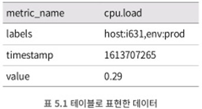
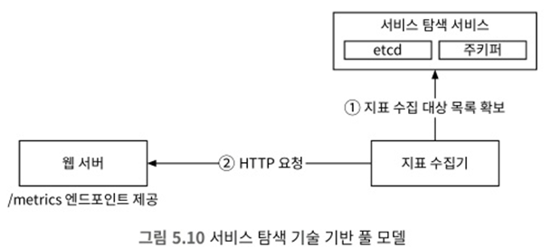
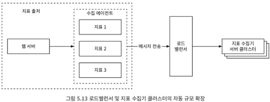
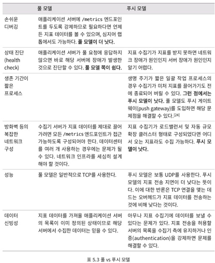
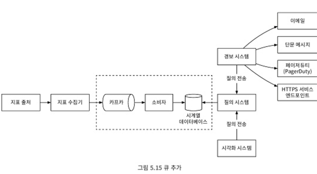
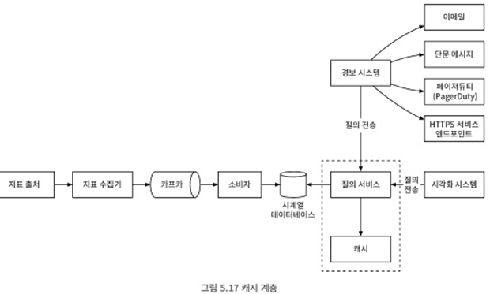
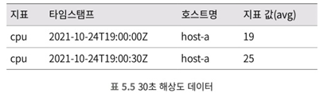
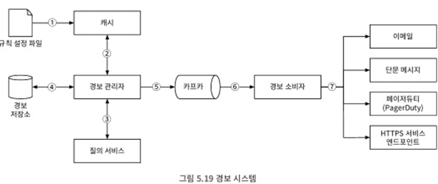
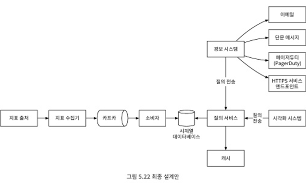

# 5. 지표 모니터링 및 경보 시스템
- 인프라 상태를 선명하게 볼수 있으며, 높은 가용성과 안전성을 달성하는 데 중추적인 역할

## 5.1 문제 이해 및 설계 범위 확정
##### 기능 요구사항
- 대규모 인프라를 모니터링 해야 함
  - 일간 능동 사용자 수 1억 명
  - 서버 풀 1,000개, 풀당 서버 수 100개. 서버당 100개의 운영 지표를 수집한다면 모니터링 해야하는 지표의 수는 천만 개 수준
  - 데이터 보관 기간 1년
  - 수집한 그대로 데이터 보관은 일주일. 그 뒤에는 1분 단위 데이터로 변환한 후에 30일간 보관. 그 뒤에는 1시간 단위 데이터로 1년 보관
- 모니터링할 지표는 다양함
  - CPU 사용률
  - 요청 수
  - 메모리 사용량
  - 메시지 큐 내의 메시지 수

##### 비기능 요구사항
- 규모 확장성: 늘어나는 지표 수와 경보의 양에 맞게 확장
- 낮은 응답 지연: 대시보드와 경보를 신속하게 처리 할 수 있도록, 질의(query)에 대한 낮은 응답 지연을 보장
- 안전성: 높은 안전성을 제공하여 중요 경보를 놓치지 않도록 해야함
- 유연성: 미래의 신기술을 쉽게 통합할 수 있도록 유연하게 변경 가능한 파이프라인을 이용해 구축한 시스템이어야 함

##### 비고려 해도 되는 요구사항
- 로그 모니터링
- 분산 시스템 추적: 서비스에 대한 요청이 분산 시스템 내부를 어떻게 흘러 다니는지 추척

## 5.2 개략적 설계안 제시 및 동의 구하기
- 아래와 같은 다섯가지 컴포넌트 활용
  - 데이터 수집: 여러 출처로부터 지표 데이터를 수집
  - 데이터 전송: 지표 데이터를 지표 모니터링 시스템으로 전송
  - 데이터 저장소: 전송되어 오는 데이터를 정리하고 저장
  - 경보: 밀려오는 데이터를 분석하고, 이후 징후를 감지 후 경보 발생
  - 시각화: 데이터를 차트나 그래프 등으로 제공

##### 데이터 모델
- 지표 데이터는 보통 시계열 데이터 형태로 기록 → 값 집합에 타임스탬프가 붙은 형태
  - 시계열 각각에는 고유한 이름이 붙고, 선택적 레이블을 붙이기도 함
- 사례 1 
   
  - 위와 같이 특정 시점에서의 시계열 데이터는 위와 같이 구성되어 있음
- 사례 2 
   
  - 10분간 모든 웹 서버의 cpu 부하 평균 값은 위와 같은 데이터를 저장소에서 가져와 평균 값을 구하면 됨
    - 각 행의 마지막 기록된 수치가 해당 값이 됨
  - 모든 시계열 데이터는 아래와 같은 정보로 구성됨 
     

##### 데이터 접근 패턴
  
- 데이터 접근 패턴
  - y축: 하나의 시계열 데이터(이름과 레이빌을 통해 유일하게 식별되는 데이터)
  - x축: 레이블 시간
- 쓰기 연산이 단연 압도적이면서, 읽기 연산은 일시적으로 증가
  - 지표 데이터 저장은 빈번
  - 시각화 및 경보에 대한 데이터는 일시적

##### 데이터 저장소 시스템
- 본 설계안의 핵심이며, 본 설계안은 직접 설계하거나 범용 저장소 시스템을 사용하는걸 추천하지 않음
  - 범용 데이터베이스로 기능 구현은 가능하지만 요구사항을 감당하려면 전문가 수준의 튜닝이 필요
  - 특히 관계형 데이터베이스는 시계열 데이터를 대상으로 하는 연산에 최적화 되어 있지 않음
    - 지수 이동 평균 등 연산 처리
  - 카산드라나 빅테이블과 같은 NoSQL도 사용은 가능하지만 효과적으로 저장 및 질의에 대해 확장에 용이한 스키마 설계가 어려움
- 시계열 데이터에 최적화된 저장소 시스템은 시장에 많음
  - 시계열 데이터 분석에 적합
  - SQL보다 사용하기 쉬운 질의 인터페이스를 갖춤
  - 데이터 보관 기간 설정 및 데이터 집계 기능도 있음
- InfluxDB와 프로메테우스는 시장에서 가장 인기있는 시계열 데이터베이스
  - 다량의 시계열 데이터 베이스 저장
  - 빠른 실시간 분석 지원
  - 메모리 캐시 및 디스크 저장소 사용
- 막대한 양의 시계열 데이터를 레비을 기준으로 집계하고 분석하는 기능은 매우 중요
  - 해당 기능은 시각화에 매우 중요하며, 범용 데이터베이스로 구축하기 까다로움

##### 개략적 설계안
 
- 지표 출저: 지표 데이터를 만드는 곳
- 지표 수집기: 지표 데이터를 수집하고 시계열 데이터에 기록하는 역할
- 시계열 데이터베이스: 지표 데이터를 시계열 데이터 형태로 보관
- 질의 서비스: 시계열 데이터베이스에 보관된 데이터를 질의
- 경보 시스템: 다양한 대상으로 경보 알림 전송
- 시각화 시스템: 지표를 다양한 형태의 그래프/차트로 제공

## 5.3 상세 설계

##### 지표 수집 (풀 vs 푸시 모델 존재)
- 카운터나 cpu 사용량 같은 지표는 데이터 소실되어도 아주 심각한 문제는 아님
  - 지표를 보내는 클라이언트가 성공적으로 데이터가 전송되었는지는 중요하지 않음
- 풀 vs 푸시 모델
  ##### 풀 모델
 
  - 애플리케이션에서 주기적으로 지표 데이터를 가져옴
  - 지표 수집기 서버 안에는 모든 서비스 엔트포인트의 DNS/IP 정보 존재
    - etcd나 아파치 주키퍼를 통해 서비스 탐색 기술 활용하면 대규모 운영 환경에서도 가능
    - 서비스 엔드포인트에 변화가 있을때 마다 지표 수집기에 통보 -> 서비스 엔드포인트 갱신
  - 수천 대 서버가 만들어 내는 지표 데이터를 수집하려면 한대로는 불가능 -> 안전 해시링을 통해 지표 수집 분산 
 

  ##### 푸시 모델
 
  - 웹서버 등 수집 에이전트를 통해 서버가 직접 지표를 수집기에 전송하는 모델
    - 에이전트가 직접 데이터 집계 등의 작업 처리 가능 -> 데이터 양 감소시킬 수 있음
    - 수집기가 일시적으로 데이터 수집을 못하면 에이전트 버퍼를 통해 일시적으로 보관 뒤 나중에 재전송 가능
  - 원활한 대규모 지표 데이터 수집을 위해 지표 수집기 클러스터 자체도 자동 규모 확장 가능하도록 처리

  ##### 풀 모델 vs 푸시 모델 장단점 비교
  - 풀 모델: 프로메터우스
  - 푸시 모델: 아마존 클라우드와치, 그래파이트

 

##### 지표 전송 파이프라인의 규모 확장
- 지표 수집기는 서버 클러스터 형태이며, 엄청난 양의 데이터를 받아 처리해야함 -> 자동 규모 확장으로 해결
- 시계열 데이터베이스에 장애가 생기면 데이터 손실 발생 -> 큐를 두어 해결 
   
  - 지표 수집기는 카프카와 같은 큐 시스템에 데이터 전송 
  - 아파치 스톰과 같은 스트림 처리 서비스가 데이터를 시계열 데이터 베이스에 저장
  - 해당 접근법 장점
    - 카프카는 안정적이고 규모 확장성이 뛰어난 분산 메시지 플랫폼
    - 데이터 수집과 처리 컴포넌트 사이의 결합도를 낮춤
    - 데이터베이스 장애가 생겨도 데이터는 소실되지 않음
- 카프카를 통한 규모 확장
  - 대역폭 요구사항에 따라 파티션 수 설정
  - 지표 이름에 따라 파티션 배치 결정
  - 태그/레이블에 따라 지표 데이터를 더욱 세분화한 파티션으로 나눔
  - 중요 지표가 먼저 처리될 수 있도록 지표 분류 및 우선순위 배정
- 카프카 대안
  - 큐 없이 대규모 데이터 처리가 가능한 모니터링 시스템 존재
    - 페이스북의 메모리 기반 시계열 데이터베이스 고릴라
- 데이터 집계 지점
  - 수집 에이전트가 집계하는 방안
    - 복잡한 로직 지원 어려움
    - 어떤 카운터 값을 분 단위로 집계하여 전달 가능
  - 데이터 수집 파이프라인에서 집계하는 방안
    - 스트림 프로세싱 엔진 필요
    - 실제로 엄청난 양의 데이터 감소 -> 데이터베이스에 결과만 적재
    - 정밀도나 유연성 측면에서 손해
  - 질의 시에 집계하는 방안
    - 데이터 손실 없음
    - 속도가 다소 느림
##### 질의 서비스
- 서버 클러스터 형태로 구현되며, 시각화 또는 경보 시스템에 접수된 요청을 시계열 데이터베이스를 통해 처리하는 역할
- 캐시 계층
  - 질의 결과를 저장할 캐시 서버를 도입하면 질의 부하를 낮추고 질의 서비스의 성능을 높일 수 있음 
     
- 질의 서비스를 두면 곤란한 경우
  - 대부분 상용 시각화 및 경보 시스템은 시계열 데이터베이스와의 강력한 플러그인을 갖춘 경우
- 시계열 데이터베이스 질의어
  - SQL이 아닌 독자 질의어를 제공
  - 시계열 데이터베이스 분석에 최적화된 플럭스(InfluxDB 질의어)라는 언어로 작성하면 다음과 같이 간단한 질의문 생성 -> SQL에 비해 이해하기 훨씬 쉬움 
     

##### 저장소 계층
- 시계열 데이터베이스 신중하게 선택할 것
  - 운영 데이터 저장소에 대한 질의의 85%는 지난 26시간 내 수집된 데이터 대상
  - 이 사실을 잘 활용한 시계열 데이터베이스를 고르면 성능 측면 이점 얻을 수 있음 -> InfluxDB
- 저장 용량 최적화
  - 데이터 인코딩 및 압축
    - 데이터 인코딩하고 압축하면 크기를 상당히 줄일 수 있음 -> 좋은 시계열 데이터베이스는 해당 기능 내장
    - 아래와 같이 상황에서 전체 데이터가 아닌 "1610087371,10,10,9,11" 방법으로 줄이는 거 가능 
       
  - 다운 샘플링
    - 데이터 해상도를 낮춰 저장소 요구량을 줄이는 기법
    - 아래는 10초 해상도를 30초 해상도 데이터로 집계하는 방법 
       
       
  - 냉동 저장소
    - 잘 사용되지 않는 비활성 상태 데이터 보관 -> 저장 비용이 일반 저장소에 비해 훨씬 삼

##### 경보 시스템
 
- 다음과 같은 흐름
  - 설정 파일을 가져와 캐시 서버에 보관, 규칙은 YAML이 널리 사용
  - 경보 관리자는 경보 설정 내역을 캐시에서 가져옴
  - 설정된 규칙에 근거하여 경보 관리자는 지정된 시간마다 질의 서비스 호출 -> 임계값 넘어가면 경보 이벤트 생성
    - 경보 필터링, 병합, 중복 제거: 짧은 시간 동안 같은 인스턴에서 발생한 경보를 병합
    - 접근 제어: 특정 경보 관리 작업은 특정 개인만 수행하도록 제한
    - 재시도: 경보 상태를 확인하고 알림이 최소 한번은 전달되게 보장
  - 경보 저장소는 카산드라와 같은 키-값 저장소, 모든 경보의 상태 보관 -> 적어도 한번 이상 경보 전달 보장
  - 경보 이벤트를 카프카에 전달
  - 경보 소비자는 카프카에서 경보 이벤트 읽음
  - 경보 소비자는 이메일, 단문 메시지등 다양한 채널로 알림
- 시장에는 다양한 경보 시스템 존재

##### 시각화 시스템
- 지표 대시보드는 지표를 다양한 시간 범위로 표시
- 경보 대시보드는 다양한 경보의 상태를 표시
- 품질 좋은 시각화 시스템 구현은 어렵기 때문에 상용품을 구입해서 사용
  - Grafana와 같은 제품 존재

## 5.4 마무리
 