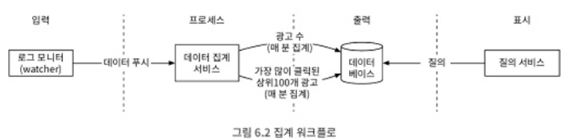
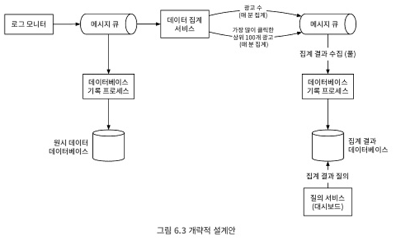
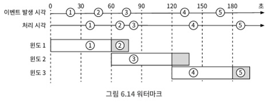
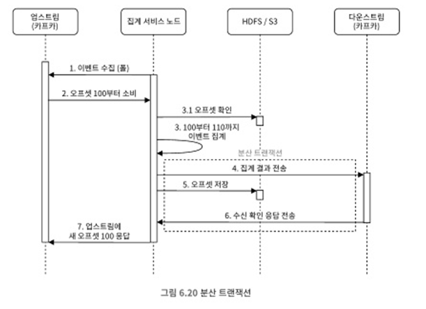
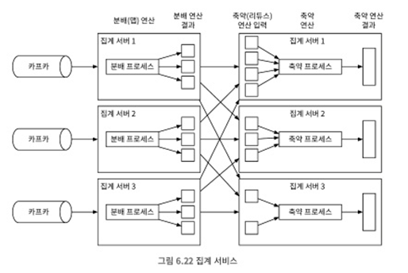
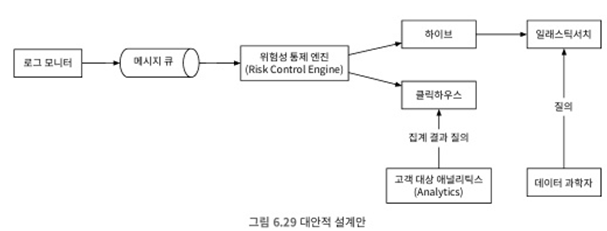

# 6. 광고 클릭 이벤트 집계
- 디지털 광고가 전체 광고 매출 비중이 높아짐 -> 광고 클릭 이벤트 추적 작업의 중요성 ▲
- 온라인 광고의 핵심적 혜택은 실시간 데이터를 통해 광고 효과를 정량적으로 측정할 수 있다는 점
- 디지털 광고의 핵심 프로세스는 실시간 경매(Real-Time Bidding)
  - RTB 프로세스에서 속도 중요 -> 보통 1초 내에 모든 프로세스가 마무리되어야 함
  - 데이터의 정확성 중요 -> 광고 클릭 이벤트 집계는 온라인 광고가 얼마나 효율적이었는지 측정하는데 결정적 역할
- 온라인 광고에 핵심 지표로는 CTR(Click-Through Rate, 클릭률), CVR(conversion Rate, 전환률) 등 존재

## 6.1 문제 이해 및 설계 범위 확정
##### 기능 요구사항
- 지난 M분 동안의 ad_id 클릭 수 집계
- 매분 가장 많이 클릭된 상위 100개 광고 아이드를 반환
- 다양한 속성에 따른 집계 필터링을 지원
- 데이터의 양은 페이스북이나 구글 규모

##### 비기능적 요구사항
- 집계 결과 정확성은 데이터가 RTB 및 광고 과금에 사용되므로 중요
- 지연되거나 중복된 이벤트를 적절히 처리할 수 있어야 함
- 견고성: 부분적인 장애는 감내할 수 있어야 함
- 지연 시간 요구사항: 전체 처리 시간은 최대 수 분을 넘지 않아야 함

##### 개략적 추정
- 시스템 규모 및 풀어야 할 잠재적 문제점을 파악하기 위해 개략적인 규모를 추정
  - DAU수는 10억 명
  - 각 사용자는 하루에 평균 1개 광고를 클릭한다고 가정. 따라서 하루에 10억건의 광고 클릭 이벤트가 발생
  - 광고 클릭 QPS = 10<sup>9</sup> 이벤트 / 하루 10<sup>5</sup> = 10,000
  - 최대 광고 클릭 QPS는 평균 QPS의 다섯 배, 즉 50,000 QPS로 측정
  - 광고 클릭 이벤트 하나당 0.1KB의 저장 용량이 필요하다고 가정. 일일 저장소 요구량 0.1KB x 10억 = 100GB이며 월간 요구량은 대략 3TB

## 6.2 개략적 설계안 제시 및 동의 구하기
##### 질의 API 설계
- 본 설계안의 클라이언트는 대시보드를 이용하는 데이터 과학자, 제품관리자, 광고주 같은 사람들임
  - 그들이 대시보드를 이용하는 순간 집계 서비스의 질의가 발생
- 더 좋은 질의 API를 설계할 수 있도록 기능 요구사항 검토 -> 아래 세가지 요구사항은 2개의 API로 지원 가능
  - 지난 M분 동안 각 ad_id에 발생한 클릭 수 집계
  - 지난 M분 동안 가장 많은 클릭이 발생한 상위 N개 ad_id 목록 반환
  - 다양한 속성을 기준으로 집계 결과를 필터링하는 기능 지원
- API 1: 지난 M분간 각 ad_id에 발생한 클릭 수 집계

| API                                   | 용도                            |
|---------------------------------------|-------------------------------|
| GET /v1/ads/{:ad_id}/aggregated_count | 주어진 ad_id에 발생한 이벤트 수를 집계하여 반환 |

  - 위에 API 호출에 이용할 수 있는 호출 인자는 다음과 같음

    | 인자명    | 뜻                                                | 자료형  |
    |--------|--------------------------------------------------|------|
    | from   | 집계 시작 시간 (기본값은 현재 시각부터 1분 전)                     | long |
    | to     | 집계 종료 시간 (기본값은 현재 시각)                            | long |
    | filter | 필터링 전략 식별자. 가령 filter=001는 미국 이외 지역에서 발생한 클릭은 제외 | long |    

  - 결과로 반환되는 응답은 다음과 같음

    | 필드명    | 뜻          | 자료형    |
    |--------|------------|--------|
    | ad_id  | 광고(ad) 식별자 | String |
    | count  | 집계된 클릭 횟수  | long   |

- API 2: 지난 M분간 가장 많은 클릭이 발생한 상위 N개 ad_id 목록

| API                     | 용도                                  |
|-------------------------|-------------------------------------|
| GET /v1/ads/popular_ads | 지난 M분간 가장 많은 클릭이 발생한 상위 N개 광고 목록 반환 |

  - 위에 API 호출에 이용할 수 있는 호출 인자는 다음과 같음

    | 인자명    | 뜻                   | 자료형      |
    |--------|---------------------|----------|
    | count  | 상위 몇 개의 광고를 반환할 것인가 | integer  |
    | window | 분 단위로 표현된 집계 윈도 크기  | integer  |
    | filter | 필터링 전략 식별자          | long     |    

  - 응답은 다음과 같음

    | 필드명    | 뜻         | 자료형   |
    |--------|-----------|-------|
    | ad_ids | 광고 식별자 목록 | array |

##### 데이터 모델
- 해당 시스템이 다루는 데이터는 두 종류
  - 원시 데이터
  - 집계 데이터
- 원시 데이터
```
[ADClickEvent] ad001, 2021-01-01 00:00:01, user 1, 207.148.22.22, USA
```
  - 위와 같은 원시 데이터를 구조화된 형식으로 표현하면 아래표와 같은 형태를 띄고, 여러 애플리케이션 서버에 산재
  
    | ad_id | click_timestamp     | user_id | ip            | country |
    |-------|---------------------|---------|---------------|---------|
    | ad001 | 2021-01-01 00:00:01 | user1   | 207.148.22.22 | USA     |
    | ad002 | 2021-01-01 00:00:02 | user1   | 207.148.22.22 | USA |
    | ad003 | 2021-01-01 00:00:03 | user2   | 207.148.22.22 | USA |


- 집계 데이터
  - 광고 클릭 이벤트가 매분 집계 된다고 가정하였을때 집계 결과

    | ad_id | click_minute | count |
    |-------|--------------|-------|
    | ad001 | 202101010000 | 5     |
    | ad002 | 202101010001 | 7     |

  - 광고 필터링을 지원하기 위해 테이블에 filter_id를 추가 -> 같은 ad_id와 click_minute값을 갖는 레코드를 filter_id가 가리키는 필터 적용
    
    | ad_id | click_minute | filter_id | count |
    |-------|--------------|-----------|-------|
    | ad001 | 202101010000 | 0012      | 2     |
    | ad001 | 202101010000 | 0023      | 3     |
    | ad001 | 202101010001 | 0012      | 1     |
    | ad001 | 202101010001 | 0023      | 6     |

    | filter_id | region | ip   | user_id   |
    |-----------|-------|------|-----------|
    | 0012      | US    | 0012 | *         |
    | 0013      | *     | 0023 | 123.1.2.3 |

    - 지난 M분 동안 가장 많이 클릭된 상위 N개의 광고를 반환하는 질의를 지원하기 위해 다음 구조 사용

    | most_clicked_ads   |           |                        |
    |--------------------|-----------|------------------------|
    | window_size        | integer   | 분 단위로 표현된 집계 윈도 크기     |
    | update_time_minute | timestamp | 마지막으로 갱신된 타임스탬프(1분 단위) |
    | most_clicked_ads   | array     | JSON형식으로 표현된 ID 목록     |

- 비교
  - 원시데이터만 보관하는 방안
    - 장점
      - 원본 데이터를 손실 없이 보관
      - 데이터 필터링 및 재계산 지원
    - 단점
      - 막대한 데이터 용량
      - 낮은 질의 성능
  - 집계 결과 데이터만 보관하는 방안
    - 장점
      - 데이터 용량 절감
      - 빠른 질의 성능
    - 단점
      - 데이터 손실
- 원시 및 집계 데이터 저장 둘다 추천
  - 문제 발생 시, 디버깅 용도로 원시 데이터 보관
  - 직접 질의에 대해 집계 데이터가 효율적
  - 원시 데이터는 백업 데이터로 활용 -> cold storage로 옮기면 비용 절감
  - 집계 결과 데이터는 활성 데이터 구실
  
##### 올바른 데이터베이스의 선택
- 올바른 데이터 베이스 선택 시 아래와 같은 사항 평가 필요
  - 데이터는 어떤 모습인지? 관계형 데이터? 문서 데이터? 이진 대형 객체(BLOB)?
  - 작업 흐름이 읽기 중심인가 쓰기 중심인가? 아니면 둘 다인가?
  - 트랜잭션을 지원해야 하는가?
  - 질의 과정에서 SUM이나 COUNT 같은 온라인 분석 처리(OLAP) 함수를 많이 사용해야하는가?
- 원시 데이터
  - 백업과 재계산 용도로만 이용되므로 이론적으로는 읽기 연산 빈도가 낮음 -> RDB 보단 카산드라나 InfluxDB 사용
  - ORC,파케이 등 칼럼형 데이터 형식 가운 하나를 선택해서 S3에 저장하는 방법도 있지만 본 설계안에서는 카산드라 활용
- 집계 데이터
  - 읽기 연산과 쓰기 연산이 많이 활용됨 -> 카산드라 활용
  
##### 개략적 설계안
<br>
- 입력은 원시데이터로 출력은 집계 데이터로 나옴
- 비동기 처리
  - 동기식 시스템의 경우, 특정 컴포넌트의 장애는 전체 시스템 장애로 이어짐
  - 해당 이슈를 해결하기 위해 카프카 같은 메시지 큐를 토입 -> 생산자와 소비자의 결합을 끊음<br>
    <br>
    - 첫번째 큐 데이터는? 광고 클릭 이벤트 
      - | ad_id | click_timestamp | user_id | ip | country |
    - 두번째 큐 데이터는?
      - 분 단위로 집계된 광고 클릭수
        - | ad_id | click_minute | count |
      - 분단위로 집계한, 가장 많이 클릭한 상위 N 광고
        - | update_time_minute | most_clicked_ads |
- 집계 결과를 데이터베이스에 바로 저장하지 않는 이유는? 정확하게 한번 데이터 처리를 위해

##### 집계 서비스
- 이벤트 집계에는 맵 리듀스 프레임워크를 사용하는 것 -> 좋은 모델로는 미 순환 그래프<br>
  <br>
- 맵 노드
  - 데이터 출처에서 읽은 데이터를 필터링 하고 변환하는 역할
    - ad_id % 2 =0의 조건을 만족하면 노드 1, 아니면 노드 2
  - 입력 데이터를 정리하거나 정규화해야 하는 경우에 필수
  - 데이터 생성 방식에 대한 제어권이 없을 경우 동일한 ad_id가 다른 파티션으로 가는 것을 방지
- 집계 노드
  - ad_id 별 광고 클릭 이벤트 수를 매 분 메모리에서 집계
  - 맵리듀스 패러다임에서 리듀스 프로세스의 일부
  - 맵 - 집계 - 리듀스 -> 맵 - 리듀스 - 리듀스
- 리듀스 노드
  - 모든 '집계' 노드가 산출한 결과를 최종 결과로 축약

## 6.3 상세 설계
##### 스트리밍 vs 일괄 처리
<br>
- 스트림 처리와 일괄 처리 모두 사용 -> 람다 아키텍처
  - 단점: 두가지 처리 경로를 지원
- 일괄처리와 스트리밍 처리 경로를 하나로 결합 -> 카파 아키텍처
- 본 설계안은 람다 아키텍처를 따르고, 개략적 설계안은 카파 아키텍처를 따름
- 데이터 재계산
  - 때로는 이미 집계한 데이터를 다시 계산하는 경우
  - 버그 발생 시점부터 원시 데이터를 다시 읽어 집계 데이터를 재계산하고 고침<br>
    <br>

##### 시간
- 집계를 하려면 타임스탬프 필요
  - 이벤트 시각: 광고 클릭이 발생한 시각
  - 처리 시각: 집계 서버가 클릭 이벤트를 처리한 시스템 시각<br>
    <br>
- 본 책은 이벤트 발생 시각 추천
  - 늦게 도착한 이벤트를 올바르게 처리하려면 '워터마크' 기술 활용
  - 각 윈도 마지막에 붙은 여분의 사각형이 워터마크임 -> 집계 결과의 정확도를 높일 수 있지만 이벤트 처리시간이 늘어남<br>
    <br>

##### 집계 윈도
- 윈도 종류
  - 텀블링 윈도(고정 윈도)
  - 호핑 윈도
  - 슬라이딩 윈도
  - 세션 윈도
- 본 설계안에서는 텀블링 윈도와 슬라이딩 윈도
- 텀블링 윈도는 시간을 같은 크기의 겹치지 않는 구간으로 분할<br>
  <br>
- 데이터 스트림을 미끄러져 나아가면서 같은 시간 구간 안에 있는 이벤트를 집계<br>
  <br>
##### 전달 보장
- 데이터 정확성 및 무결성 매우 중요
  - 이벤트의 중복 처리를 어떻게 피할 수 있는가?
  - 모든 이벤트의 처리를 어떻게 보장할 수 있는가?
- 전달 방식 선택
  - 중복 허용하지 않기 위해 '정확히 한번' 권장
- 데이터 중복 제거
  - 집계 서비스 노드에 발생한 장애의 결과로 중복 데이터 생김
  - DB를 활용해 오프셋 저장 매커니즘 활용<br>
    <br>

##### 시스템 규모 확장
- 트래픽이 늘어나면 시스템 규모 확장 필요 -> 각 컴포넌트는 독립적이기에 메시지 큐, 집계 서버, 데이터베이스 확장
- 메시지 큐
  - 생산자: 인스턴수 수 제한이 없기에 쉽게 확장 가능
  - 소비자: 소비자 그룹 내 재조정 매커니즘을 통해 노드 추가/삭제 가능
  - 브로커
    - 해시키: ad_id를 해시키로 활용
    - 파티션의 수: 충분한 파티션의 수 확보
    - 토픽의 물리적 샤딩: topic_north_america 등 다양한 토픽 활용
      - 장점: 대역폭 늘리수 있으며, 소비자 그룹의 재조정 기간 단축 가능
      - 단점: 복잡성 및 유지 관리 비용 증가
- 집계 서버<br>
  <br>
  - 방안1: ad_id마다 별도 처리 스레드
  - 방안2: 집계 서비스 노드를 아파치 하둡 YARN 같은 자원 공급자에 배포 -> 멀티 프로세싱
  - 방안 2가 많이 활용됨 -> 더 많은 컴퓨팅 자원 추가하여 시스템 규모 확장 가능
- 데이터베이스
  - 안전 해시를 통해 각 노드들에게 데이터 분산
##### 핫스팟 문제
- 하나의 노드에 트래픽이 몰려 과부하 문제 발생 이슈 -> 집계 노드 추가 할당하여 완화 가능<br>
  <br>
##### 결합 내성
- 집계는 메모리에서 이루어지므로 집계 노드 장애 발생 시, 결과 손실
- 카프카 데이터를 통해 다시 집계 가능 -> 카프카 데이터를 통해 데이터를 원점부터 집계하면 오래걸림
  - 업스트림 오프셋 같은 시스템 상태를 스냅숏으로 저장하고 마지막 저장된 상태부터 복구<br>
    <br>
##### 데이터 모니터링 및 정확성
- 시스템이 정상적으로 동작하는지 모니터링하고 데이터 정확성 보장은 매우 중요
- 지속적 모니터링
  - 지연 시간: 시스템 중요 부분마다 추적이 가능하도록 해야함
  - 메시지 큐 크기: 큐의 크기가 갖바기 늘어난다면 다 많은 집계 노드 필요
  - 집계 노드의 시스템 자원: CPU, 드스크 등 지표
- 조정
  - 데이터를 비교하여 데이터 무결성을 보증
  - 매일 각 파티션 기록된 클릭 이벤트를 이벤트 발생 시각에 따라 정렬 후 비교 -> 비교 후 수정<br>
    <br>

##### 대안적 설계
<br>
- 광고 클릭 데이터를 Hive에 저장
- 빠른 질의는 엘라스틱서치을 활용
- 집계는 클릭하우스나 드루이드 같은 OLAP 데이터베이스 활용
