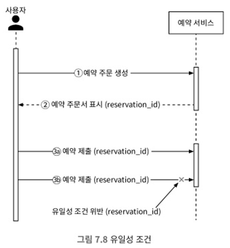
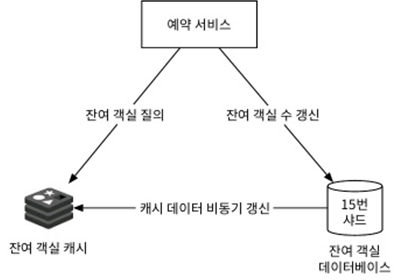

# 7. 호텔 예약 시스템
- 호텔 체인 예약 시스템이며, 아래와 같은 시스템에 활용 가능
    - 에어비앤비 시스템 설계
    - 항공권 예약 시스템 설계
    - 영화 티켓 예매 시스템 설계

## 7.1 문제 이해 및 설계 범위 확정
##### 비기능 요구사항
- 높은 수준의 동시성 지원: 성수기, 대규모 이벤트 기간에는 특정 객실을 예약하려는 고객이 많이 몰릴수 있음
- 적절한 지연 기간: 사용자가 예약을 할 때는 응답 시간이 빠르면 좋지만, 몇 초 정도 지연 가능

##### 개략적 규모 추정
- 총 5,000개 호텔, 100만 개의 객실이 있다고 가정
- 평균적으로 객실의 70%가 사용 중, 평균 투숙 기간은 3일 가정
- 일일 예상 예약 건수: 100만 x 0.7 / 3 = 233,333 (올림 하여 약 24,000)
- 초당 예약 건수(TPS) = 24,000/하루에 10<sup>5</sup> =~ 3.
- 모든 페이지의 QPS(일반적으로 고객이 웹사이트 사용 흐름)
  - 호텔/객실 상세 페이지: 호텔/객실 정보 조회
  - 예약 상세 정보 페이지: 날짜, 투숙 인원, 결제 방법 등 상세 정보 조회
  - 객실 예약 페이지: 사용자가 '예약' 버튼을 눌러 객실 예약
- 대략 10%의 사용자가 다음 단계로 진행하고 90% 사용자는 최종 단계 전 이탈
- 최종 예약 TPS는 3이며, 예약 페이지의 QPS는 30, 객실 정보 확인 페이지는 300


## 7.2 개략적 설계안 제시 및 동의 구하기
##### API 설계
- API를 RESTful 관례에 따름
- 호텔 관련 API

| API                  | 설명                     |
|----------------------|------------------------|
| GET /v1/hotels/id    | 호텔의 상세 정보 반환           |
| POST /v1/hotels      | 신규 호텔 추가. 호텔 직원만 사용 가능 |
| PUT  /v1/hotels/id   | 호텔 정보 갱신. 호텔 직원만 사용 가능 |
| DELETE /v1/hotels/id | 호텔 정보 삭제. 호텔 직원만 사용 가능 |

- 객실 관련 관련 API

| API                         | 설명                     |
|-----------------------------|------------------------|
| GET /v1/hotels/:id/rooms/id | 객실 상세 정보 반환            |
| POST /v1/hotels/rooms             | 신규 객실 추가. 호텔 직원만 사용 가능 |
| PUT  /v1/hotels/:id/rooms/id         | 객실 정보 갱신. 호텔 직원만 사용 가능 |
| DELETE /v1/hotels/:id/rooms/id       | 객실 정보 삭제. 호텔 직원만 사용 가능 |

- 예약 관련 관련 API

| API                                 | 설명                |
|-------------------------------------|-------------------|
| GET /v1/reservations                | 로그인 사용자의 예약 이력 반환 |
| GET /v1/reservations/id            | 특정 예약의 상세 정보 반환   |
| POST  /v1/reservations  | 신규 예약             |
| DELETE /v1/reservations/id    | 예약 취소             |

- 새 예약을 만들 때 API에 전달하는 인자는 다음과 같음
```
{
  "startDate": "2021-04-28",
  "endDate": "2021-04-30",
  "hotelID": "245",
  "roomID": "U12345673389",
  "reservationID": "13422445",
}
```
- reservationID는 이중 예약을 방지 및 동일한 예약은 단 한번만 이루게 하는 멱등 키

##### 데이터 모델
- 어떤 데이터베이스를 사용할지 결정하기 전 데이터 접근 패턴 확인
  - 호텔 상세 정보 확인
  - 지정된 날짜 범위에 사용 가능한 객실 유형 확인
  - 예약 정보 기록
  - 예약 내역 또는 과거 예약 이력 정보 조회
- 시스템 규모가 크지 않지만, 대규모 이벤트가 있는 경우에는 트래픽이 급증할 수도 있으니 대비해야 함
- 관계형 데이터베이스를 선택하는 이유
  - 관계형 데이터베이스는 읽기가 쓰기 연산에 비해 높은 작업 흐름을 지원 -> 호텔 방문 사용자 수가 객실 예약하는 사용자에 비해 압도적
  - 관계형 데이터베이스는 ACID 속성을 보장 -> ACID는 예약 시스템을 만드는 경우 중요
  - 관계형 데이터베이스를 사용하면 데이터를 쉽게 모델링 가능
- 아래는 단순하게 설계한 스키마<br>
  <br>
  - reservation 테이블 내 status는 아래와 같은 상태 값 중 하나를 가짐
    - pending(결제 대기),paid(결제 완료), refunded(환불 완료), canceled(취소), rejected(승인 실패)
  - 해당 스키마 디자인에서 room_id는 호텔에 적합하지 않음
    - 호텔은 특정 객실 예약이 아닌 특정 호텔의 특정 갤실 유형을 예약하기 때문 -> 객실 번호는 예약이 아닌 투숙객이 체크인 하는 시점에 부여

##### 개략적 설계안
- 본 설계안은 MSA를 사용하였으며, 많은 회사들이 해당 아키텍처를 채택함<br>
  <br>
  - 사용자: 휴대폰이나 컴퓨터로 객실 예약 당사자
  - 관리자(호텔 직원): 고객 환불, 객실 정보 갱신 등의 관리 작업 수행
  - CDN: 자바스크립트 코드 번들 등 모든 정적 콘텐츠를 캐시하여 웹사이느 로드 성능 개선
  - 공개 API 게이트웨이: 처리율 제한, 인증 등의 기능을 지원하는 완전 관리형 서비스
  - 내부 API: 승인된 호텔 직원만 사용 가능한 API, VPN 등의 기술을 사용해 외부 공격으로부터 보호
  - 호텔 서비스: 호텔과 객실에 대한 상세 정보를 제공, 캐시 활용
  - 요금 서비스: 미래의 어떤 날에 어떤 요금을 받아야하는지 데이터를 제공하는 서비스
  - 예약 서비스: 예약 요청을 받고 객실을 예약하는 과정을 처리
  - 결제 서비스: 고객의 결제를 맡아 처리 후 예약 상태를 결제 완료로 갱신 또는 승인 실패로 업데이트 
  - 호텔 관리 서비스: 승인된 호텔 직원만 사용 가능한 서비스, 고객 객실 예약 및 예약 취소 등의 기능 제공
- 실제 상업적으로 이용되는 시스템의 서비스 간 통신에는 gRPC와 같은 고성능 원격 프로세저 호출 프레임워크를 사용

## 7.3 상세 설계
##### 개선된 데이터 모델
- 스키마<br>
<br>
  - 예약 API의 경우 호출 인자 가운데 roomID는 roomTypeID로 변경
```
POST /v1/reservations

{
  "startDate": "2021-04-28",
  "endDate": "2021-04-30",
  "hotelID": "245",
  "roomTypeID": "U12345673389",
  "reservationID": "13422445",
}
```
  - 가장 중요하게 바뀐 부분
    - room: 객실 관계된 정보
    - room_type_rate: 특정 객실 유형의 특정 일자 요금 정보
    - reservation: 투숙객 예약 정보
    - room_type_inventory: 호텔의 모든 객실 유형을 담는 테이블
      - hotel_id: 호텔 식별자
      - room_type_id: 객실 유형 식별자
      - date: 일자
      - total_inventory: 총 객실 수에서 일시적 제외한 객실 수를 뺀 값, 일부 객실은 유지보수를 위해 예약 가능 목록 제외 
      - total_reserved: 지정된 hotel_id, room_type_id, date에 예약된 모든 객실의 수
      - 기본키는 복합키(hotel_id,room_type_id,date)
      - 2년 이내 모든 미래 날짜에 대한 가용 객실 데이터 질의 결과를 토대로 미리 채워놓음
- 저장 용량 추정
  - 5,000개의 호텔 및 20개의 객실 유형 가정
    - 5,000 x 20 x 2년 x 465일 = 7,300만개
    - 많은 데이터가 아니기에 데이터베이스 하나면 충분 -> SPOF 문제를 위해 여러 지역 또는 가용성 구역에 복제
- room_type_inventory는 특정 유형의 객실을 예약할 수 있는지 여부 확인할 때 사용

| hotel_id | room_type_id | date       | total_inventory | total_reserved |
|----------|--------------|------------|-----------------|----------------|
| 211      | 1001         | 2021-06-01 | 100             | 80             |
| 211      | 1001         | 2021-06-02 | 100             | 82             |
| 211      | 1001         | 2021-06-03 | 100             | 86             |
| 211      | 1001         | ...        | ...             | ...            |
| 211      | 1001         | 2021-05-31 | 100             | 0              |
| 211      | 1002         | 2021-06-01 | 200             | 164            |
| 2210     | 101          | 2021-06-01 | 30              | 23             |
| 2210     | 101          | 2021-06-02 | 30              | 25             |

  - 입력: startDate(2021-07-01), endDate(2021-07-03), roomTypeId, hotelId, numberOfRoomsToReserve
  - 출력: 해당 유형의 객실에 여유가 있고 사용자가 예약 가능한 상태이면 True, 아니면 False 반환
- SQL 관점에서 보자면 다음 두 절차로 구성
  - 주어진 기간에 해당하는 레코드들을 구함
  ```
  SELECT date, total_inventory, total_reserved
  FROM room_type_inventory
  WHERE room_type_id = ${roomTypeId} AND hotel_id = ${hotelId} AND date between ${startDate} and ${endDate}
  ```
  - 그 결과로 다음과 같은 데이터 반환
  
    | date       | total_inventory | total_reserved |
    |------------|-----------------|----------------|
    | 2021-07-01 | 100             | 97             |
    | 2021-07-02 | 100             | 96             |
    | 2021-07-03 | 100             | 95             |

  - 반환된 각 레코드마다 다음 조건 확인
```
if ((total_reserved + ${numberOfRoomsToReserve}) <= total_inventory)    
```
- 레코드의 모든 행을 검사한 결과 True 반환하면 충분한 객실 존재확인
- 요구사항 가운데 하나인 10%의 초과 예약이 가능하도록 하는 건 아래와 같이 가능
```
if ((total_reserved + ${numberOfRoomsToReserve}) <= 110% *total_inventory)    
```
- 예약 데이터가 단일 데이터베이스에 담기 너무 크면?
  - 현재 및 향후 예약 데이터만 저장 -> 예약 이력은 자주 접근하지 않으므로 아카이빙 하거나 냉동 저장소로 옮김
  - 데이터베이스를 샤딩
    - 가장 자주 사용되는 질의는 예약하거나 예약 확인
    - 두 질의 모두 우선 호텔을 알아야 하므로 hotel_id가 샤딩 키로 적합 -> hash(hotel_id) % number_of_servers로 샤딩

##### 동시성 문제
- 이중 예약 방지를 위해 2가지 문제 해결 필요
  - 같은 사용자가 예약 버튼을 여러 번 누를 수 있음
  - 여러 사용자가 같은 객실을 동시에 예약하려 할 수 있음
- '같은 사용자가 예약 버튼을 여러 번 누를 수 있음' 문제 해결
  - 일반적 접근법으로는 다음의 두 가지 존재
    - 클라이언트 측 구현
      - 클라이언트가 요청을 전송하고 난 다음에 '예약' 버튼을 회색으로 숨기거나 비활성화 하는 것
      - 그다지 안정적인 방법은 아님 -> 클라리언트 스크립트를 비활성화하면 우회 가능
    - 멱등 API
      - 예약 API 요청을 멱등 키를 추가하는 방안
      - reservation_id를 멱등 키로 사용하여 이중 예약 문제를 해결하는 방안<br>
        <br>
- '여러 사용자가 같은 객실을 동시에 예약하려 할 수 있음' 문제 해결
  - 비관적 락
    - 비관적 동시성 제어 방안이라 불리며, 레코드를 갱신하려고 하는 순간 즉시 락을 걸어 동시 업데이트를 방지하는 기술
    - 해당 레코드를 갱신하려는 다른 사용자는 먼저 락을 건 사용자가 변경을 마치고 락을 해제할 때까지 기다려야함
    - MySQL의 경우 'select ... for update'문을 실행하면 select가 반환한 레코드에 락이 걸림
    - 장점
      - 애플리케이션이 변경 중이거나 변경이 끝난 데이터를 갱신하는 일을 막을 수 있음
      - 구현이 쉽고 모든 갱신 연산을 직렬화하여 충돌을 막음
      - 데이터에 대한 경합이 심할 떄 유용
    - 단점
      - 여러 레코드에 락을 걸면 교착 상태가 발생할 수 있음 -> 교착 상태 발생하지 않게 코드 작성은 까다로울 수 있음
      - 확장성이 낮음. 트랜잭션이 너무 오랫동안 락을 해제하지 않고 있으면 다른 트랜잭션은 락이 걸린 자원에 접근 할 수 있음
      - 트랜잭션의 수명이 길거나 많은 엔티티 경우, 데이터베이스 성능에 심각한 영향을 끼침
  - 낙관적 락
    - 낙관적 동시성 제어라고 불리는 방안, 여러 사용자가 동시에 같은 자원을 갱신하려 시도하는 것을 허용
    - 버전 번호와 타임스탬프의 두 가지 방법으로 구현 -> 서버 시계는 시간이 지남에 따라 부정확 할 수 있으므로, 일반적으로 버전 번호를 더 나은 선택지로 봄
    - 낙관적 락은 비관적 락보다 빠름 -> 데이터베이스에 락을 걸지 않기 때문에
    - 하지만 동시 수준이 매우 높아지면 성능이 급격하게 나빠짐 -> 실패에 대한 retry 때문에
    - 장점
      - 애플리케이션이 유효하지 않은 데이터를 편집하는 일을 막음
      - 데이터베이스 자원에 락을 걸 필요가 없음
      - 경쟁이 치열하지 않은 상황에 적합함
    - 단점
      - 데이터에 대한 경쟁이 치열한 상황에서는 성능이 좋지 못함
    - 호텔 예약 시스템에 적합한 선택지 -> QPS가 높지 않기 때문
  - 데이터베이스 제약 조건
    - 낙관적 락과 아주 유사함
    - 아래와 같은 제약 조건을 추가
    - 장점
      - 구현이 쉬움
      - 데이터에 대한 경쟁이 심하지 않을 때 잘 동작함
    - 단점
      - 낙관적 락과 마찬가지로 데이터에 대한 경쟁이 심하면 실패하는 연산 수가 엄청나게 늘어날 수 있음
      - 데이터베이스 제약 조건은 애플리케이션 코드와 달라서 버전 통제가 어려움
      - 제약 조건을 허용하지 않는 데이터베이스도 존재
```
CONSTRAINT `check_room_count` CHECK((`total_inventory - total_reserved` >= 0))

```

##### 시스템의 규모 확장
- 일반적인 호텔 예약 시스템은 부하가 높지 않지만, 유명한 여행 예약 웹사이트와 연동하면 QPS는 천배로 늘어남
- 본 시스템의 모든 서비스는 무상태 서비스이므로, 서버를 늘리는 것으로 해결 가능
- 하지만 모든 상태 정보가 보관되는 데이터베이스는 단순히 데이터베이스 서버를 늘리는 것만으로 성능 문제 해결할 수 없음
- 데이터베이스 샤딩
  - 데이터베이스를 여러 대 두고, 각각에 데이터의 일부만 보관하도록 하는 것
  - 이 시스템의 대부분 질의는 hotel_id를 필터링 조건으로 사용하기에 샤딩 조건으로 쓰는 것이 좋음
  - 데이터베이스 부하를 16개 샤드로 분산 -> QPS가 30,000이면 샤딩 후에는 30,000/16 = 1875 QPS로 처리
- 캐시<br>
  <br>
  - 호텔 잔여 객실 데이터는 현재와 미래 데이터만 중요 -> 과거 이력은 중요하지 않음
  - 데이터를 보관할 때 낡은 데이터는 자동적으로 소멸되도록 TTL을 설정
  - 레디스는 이러한 상황에 적합한 TTL과 LRU 캐시 교체 정책 사용 가능
  - 데이터 로딩 속도와 데이터베이스 확장성이 문제가 되기 시작하면 데이터베이스 앞에 캐시 계층을 두고 객실 확인 및 객실 예약 로직 실행
  - 컴포넌트
    - 예약서비스: 잔여 객실 관리 API 제공
      - 지정된 호텔과 객실 유형, 주어진 날짜범위에 이용 가능한 객실의 수 질의
      - 객실을 예약하고 total_reserved의 값을 1 증가
      - 고객이 예약을 취소하면 잔여 객실 수를 갱신
    - 잔여 객실 캐시: 모든 잔여 객실 관리에 필요한 질의는 레디스로 구현되는 잔여 객실 캐시로 옮김
      - 키: hotelID_roomTypeID_{날짜}
      - 값: 주어진 호텔 ID, 객실 유형 ID, 그리고 날짜에 맞는 잔여 객실 수
      - 읽기 빈도가 쓰기 연산보다 훨씬 많음
    - 잔여 객실 데이터베이스: 잔여 객실 수에 대한 가장 믿을 만한 정보가 보관
  - 캐시가 주는 새로운 과제
    - 시스템 확장성과 처리량은 대폭 증가하지만, 데이터베이스와의 데이터 일관성 유지 문제 직면
    - 사용자가 객실을 예약할 때 아무 문제가 없는 경우는 다음의 두가지 작업이 이루어짐
      - 잔여 객실 수를 질의하여 충분한지 확인 -> 해당 질의는 캐시를 통해 진행
      - 잔여 객실 데이터를 갱신. 데이터베이스가 먼저 갱신되고 캐시에는 비동기적으로 반영
        - 변경 데이터 감지(Change Data Capture,CDC) 매커니즘을 통해 캐시에 반영 가능
    - 데이터베이스에 최종적으로 잔여 객실을 확인을 하도록 하면 해당 이슈는 문제가 되지 않음
      - 캐시 질의 결과 잔여 객실이 있다고 나오지만 데이터베이스에 유효성 검사하면 남은 객실이 없음을 확인
      - 장점
        - 읽기 질의를 캐시가 처리하므로 데이터베이스의 부하가 크게 줄어듬
        - 읽기 질의를 메모리에서 실행하므로 높은 성능 보장
      - 단점
        - 데이터베이스와 캐시 사이의 데이터 일관성을 유지하는 것은 어려운 문제 -> 사용자 경험에 어떤 영향 미칠지 고민

##### 마이크로서비스 아키텍처에서의 데이터 일관성 문제에 대한 해결 방안
- 전통적인 모노리스 아키텍처의 경우, RDB를 활용하여 데이터 일관성 보장
- 해당 설계안은 같은 데이터베이스 내 예약 테이블과 잔여 객실 테이블을 동일한 관계형 데이터베이스에 저장하는 하이브리드 접근법 선택
- 면접관이 MSA 순수주의라면 각 서비스에서의 데이터 일관성 해결 방안
  - 2단계 커밋(2-phase commit)
    - 여러 노드에 걸친 원자적 트랜잭션을 보증하는 데이터베이스 프로토콜
    - 모든 노드가 성공하든 아니면 실패하든 둘 중하나로 트랜색션이 마무리 되도록 보증
    - 성능이 뛰어난 프로토콜은 아님
  - 사가(Saga)
    - 각 노드에 국지적으로 발생하는 트랜잭션을 하나로 엮은 것
    - 각각의 트랜잭션은 완료되면 다음 트랜잭션을 시작하는 트리거로 쓰일 메시지를 만들어 보냄
    - 어느 한 트랜잭션이라도 실패하면 사가는 그 이전 트랜잭션의 결과를 전부 되돌리는 트랜잭션들을 순차적으로 실행
- 마이크로서비스 간의 데이터 불일치를 해결하기 위해 사용되는 복잡한 매커니즘은 시스템 전체 설계의 복잡성을 증가시킴
- 증가한 복잡성이 그만한 가치가 있는지는 결정하는건 설계자의 몫 -> 본 설계안의 경우 그만한 가치가 없다고 판단

## 7.4 마무리
- 경쟁 조건이 발생할 수 있는 시나리오에 대해 논의 후, 아래와 같은 해결책 살펴봄
  - 비관적 락
  - 낙관적 락
  - 데이터베이스 제약 조건