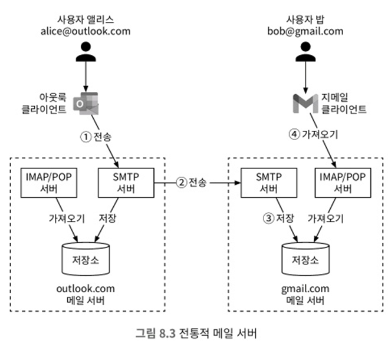
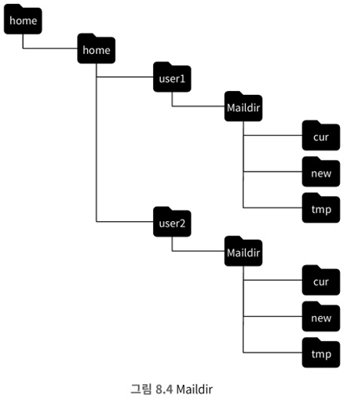
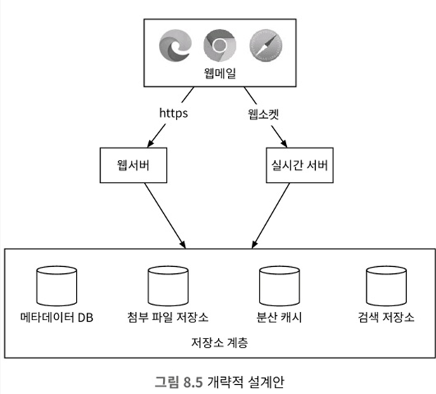
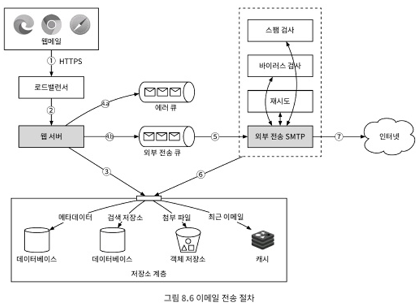
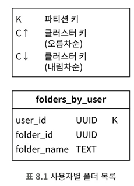
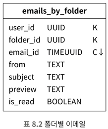
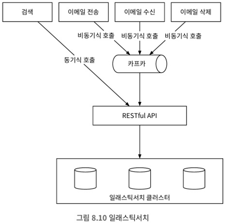
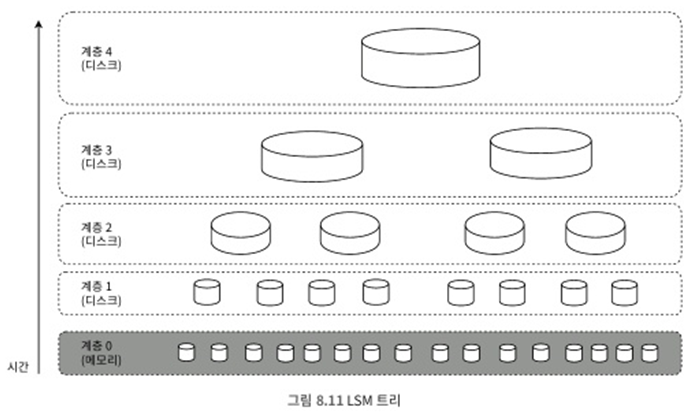

# 8. 분산 이메일 서비스
- 지메일, 아웃룩과 같은 대규모 이메일 서비스 설계

## 8.1 문제 이해 및 설계 범위 확정
- 오랜 세월 이메일 서비스는 복잡성과 규모 면에서 크게 달라짐 -> 45분동안 설계하기 힘듬
##### 비기능 요구사항
- 안전성: 이메일 데이터는 소실되어서는 안됨
- 가용성: 이메일과 사용자 데이터를 여러 노드에 복제하여 가용성 확보
- 확장성: 사용자 수가 늘어나도 감당 가능 및 시스템 저하 방지
- 유연성과 확장성: 새 컴포넌트를 쉽게 기능 추가 및 성능 개선할 수 있는 유연한 확장 가능 -> POP나 IMAP 같은 기존 이메일 프로토콜은 기능이 매우 제한적임

##### 개략적 규모 추정
- 10억 명의 사용자
- 한 사람이 하루에 보내는 평균 이메일 수 10건 가정 -> QPS = 10<sup>9</sup> x 10 / 10<sup>5</sup> = 100,000
- 한 사람이 하루에 수신하는 이메일 수는 평균 40건 가정, 이메일 하나의 메타데이터는 평균 50KB(첨부파일 포함x)
- 1년간 메타데이터를 유지하기 위한 스토리지 요구사항은 730pb
  - 메타데이터를 데이터베이스에 저장한다고 가정 
  - 10억명 사용자 x 하루 40건 이메일 x 365일 x 50kb = 730pb
- 첨부 파일을 포함하는 이메일의 비율은 20%이며, 첨부 파일의 평균 크기는 500kb라고 가정
- 1년간 첨부 파일을 보관하는 데 필요한 저장 용량은 1,460PB
  - 10억 명 사용자 x 하루 40개 이메일 x 365일 x 20% x 500kb

## 8.2 개략적 설계안 제시 및 동의 구하기
- 이메일 서버에 대해 알아야 할 몇가지 기본적인 사항과 더불어 이메일 서버 흐름 논의
##### 이메일 101
- 이메일을 주고 받는 프로토콜 존재
  - SMTP(Simple Mail Transfer Protocol)
    - 이메일을 한 서버에서 다른 서버로 보내는 표준 프로토콜
  - POP(Post Office Protocol)
    - 이메일 클라이언트가 원격 메일 서버에서 이메일을 수신하고 다운로드하기 위해 사용하는 표준 프로토콜
    - 일단 단말로 다운로드 된 이메일은 서버에서 삭제됨 -> 한대의 단말에서만 이메일을 읽을 수 있음
    - 클라이언트는 일부 이메일만 읽을 수 없음 -> 용량이 큰 첨부 파일이 붙은 이메일은 읽으려면 오래 걸림
  - IMAP(Internet Mail Access Protocol)
    - 이메일을 수신하는 또 다른 표준의 프로토콜
    - 클릭하지 않으면 메시지는 다운로드 되지 않으며, 메일서버에서도 지워지지도 않음 -> 여러 단말에서 이메일을 읽을 수 있음
    - 인터넷 속도가 느려도 잘 동작하며, 실제로 열기 전에는 헤더만 다운로드함
  - HTTPS
    - 메일 전송 프로토콜은 아니지만 웹 기반 이메일 시스템의 메일함 접속에 이용 가능
    - 아웃룩은 액티브싱크라는 HTTPS 기반 자체 프로톸콜을 통해 모바일 단말과의 통신을 처리
- 도메인 이름 서비스(DNS)<br>
  <br>
  - DNS 서버는 수신자 도메인의 메일 교환기 레코드(Mail Exchange,MX) 검색에 이용
  - 우선 순위 값은 선호도를 나타내며, 그 값이 낮으면 우선순위가 높아서 선호
    - 위에 그림에서 gmail-smtp-in.l.google.com. 이 우선순위가 가장 높으므로(5) 최우선
  - 우선 순위 높은 서버에 접속하여 메시지를 전송 시도 -> 실패 시, 다음 순위 서버 접속
- 첨부파일
  - 이메일 메시지와 같이 전송되며, base64로 인코딩되어 전송
  - 일반적으로 크기 제한 존재
##### 전통적 메일 서버
- 보통 서버 한대로 운용, 사용자가 많지 않을때는 잘 동작하는 시스템
- 전통적 메일 서버 아키텍처<br>
<br>
  - ① 앨리스가 아웃룩 메일서버로 SMTP 프로토콜을 통해 메일 발송
  - ② 아웃룻 메일서버는 DNS 질의를 통해 수신사 SMTP 서버 주소를 찾고, 수신사 지메일 SMTP 서버로 메일 발송(프로토콜 SMTP)
  - ③ 지메일 서버는 이메일을 저장하고 수신자인 밥이 읽어 갈 수 있도록 처리
  - ④ 밥이 지메일에 로그인하면 지메일 클라이언트는 IMAP/POP 서버를 통해 새 메일을 수신
- 저장소<br>
<br>
  - 이메일을 파일 시스템의 디렉터리에 저장 -> 각각의 이메일은 고유한 이름을 가진 별도 파일로 보관, 각 사용자의 설정 데이터와 메일함은 사용자 디렉터리에 보관
  - 사용자가 많지 않을때는 잘 동작하지만, 수십억 개의 이메일을 검색하고 백업하는 목적으로 활용 곤란
    - 파일 구조가 복잡해지고 디스크 I/O 병목 발생
    - 이메일을 서버의 파일 시스템에 보관하므로 가용성과 안전성 요구사항 미충족
- POP, IMAP, SMTP 같은 이메일 프로토콜은 멀티미디어, 메일 타래, 검색 등 미지원 
##### 분산 메일 서버
- 현대적 사용 패턴을 지원하고 확장성과 안전성 문제 해결
  - 이메일 API
    - 메일 클라이언트마다, 이메일 생명주기 단계마다 달라질 수 있음
      - 모바일 단말 클라이언트를 위한 SMTP/POP/IMAP API
      - 송신 측 메일 서버와 수신 측 메일 서버 간의 SMTP 통신
      - 대화형 웹 기반 이메일 애플리케이션을 위한 HTTP 기반 RESTful API
    - 웹메일 통신에는 일반적으로 HTTP 프로토콜이 쓰임
    - ① POST /v1/messages 엔드포인트
      - To,Tc,Bcc 헤더에 명시된 수신자에게 메시지를 전송
    - ② GET /v1/folders 엔드포인트
      - 주어진 이메일 계정에 존재하는 모든 폴더를 반환

    ```
    응답 형식
     [{
        id: string      고유한 폴더 식별자
        name: string    폴더 이름(다음 폴더 가운데 하나 [All, Archive, Drafts, Flagged, Junk, Sent, Trash])
        user_id: string 계정 소유자 ID
     }]
    ```

    - ③ GET /v1/folders/{:folder_id}/messages 엔드포인트
      - 주어진 폴더 아래의 모든 메시지를 반환
      - 실제로는 페이지 분할을 지원하는 등 훨씬 복잡할 수 있음

    ```
    응답 형식
    페이지 객체 목록
    ```

    - ④ GET /v1/messages/{:message_id} 엔드포인트
      - 주어진 특정 메시지에 대한 모든 정보를 반환
      - 핵심 구성 요소로, 발신자, 수신자, 메시지 제목 등의 정보로 구성

    ```
    응답 형식
     [{
        user_id: string                       계정 주의 ID
        from: name: string, email:string      발신자의 <이름, 이메일> 쌍
        to: [name: string, email:string]      수신자 <이름, 이메일> 쌍의 목록
        subject: string                       이메일 제목
        body: string                          이메일 본문
        is_read: Boolean                      수신자가 메시지를 읽었는지 여부
    }]
    ```

- 분산 이메일 서버 아키텍처<br>
  - 소수 사용자를 처리하는 이메일 서버 구성은 어렵지 않지만, 한대 이상의 서버 규모를 늘리는 것은 어려움
  - 여러 서버간의 데이터 동기화 부분도 어려우며, 수신자 메일 서버에서 이메일이 스팸 처리되지 않도록 하는 문제도 까다로움
  - 클라우드 기술을 활용한 개력적인 설계안은 다음과 같음<br>
    <br>
    - 웹메일: 웹브라우저를 사용해 메일을 받고 보냄
    - 웹서버: 로그인, 가입, 사용자 프로파일등에 관리 기능 담당, 이메일 발송 및 폴더 목록 확인도 웹서버를 통함
    - 실시간 서버: 새로운 이메일 내역을 클라이언트에 실시간으로 전달
      - 실시간 통신 지원 방안으로 롱 폴링이나 웹 소켓 존재
      - 웹 소켓이 좀더 우아하지만 여의치 않으면 롱폴링 사용
    - 메타데이터 데이터베이스: 이메일 제목, 본문, 발신인, 수신인 등 메타데이터를 저장하는 데이터베이스
    - 첨부 파일 저장소: 아마존 S3 같은 객체 저장소를 활용, 대용량 파일 저장에 적합
      - 카산드라 같은 컬럼 기반 NoSQL 데이터베이스는 용도로 적합하지 않음
        - 카산드라가 BLOB 자료형을 지원하고 최대 크기가 2GB지만 실질적으로 1MB 이상 파일 지원 못함
        - 카산드라에 첨부 파일을 저장하면 레코드 캐시를 사용하기 어려움 -> 첨부 파일이 너무 많은 메모리를 잡아 먹음
    - 분산 캐시: 수신된 이메일은 자주 읽을 가능성이 높으므로 메모리에 캐시를 두어 메일 표시 시간 단축
    - 검색 저장소: 검색 저장소는 분산 문서 저장소, 고속 텍스트 검색을 지원하는 역 인덱스를 자료 구조로 사용

- 이메일 전송 절차<br>
  <br>
  - ① 메일 작성 후 전송 요청, 요청은 로드밸런스로 전송
  - ② 처리율 제한 한도를 넘지 않은 선에서 요청을 웹서버로 전달
  - ③ 웹서버 역할
    - 기본적인 이메일 검증: 이메일 크기 한도와 같은 사전 정의된 규칙으로 검사
    - 수신자 이메일 주소 도메인이 송신자 이메일 주소 도메인과 같은지 검사
      - 같다면? 스팸여부와 바이러스 감염 여부 검사
      - 검사 이상 없다면? 송신인의 '보낸 편지함'과 수신인의 '받은 편지함'에 저장
  - ④ 메시지 큐
    - 4.a 기본적인 검증을 통과한 이메일은 외부 전송 큐로 전달, 크기가 너무 크면 첨부 파일은 객체 저장소에 따로 저장하고 이메일 안에 저장 위치에 대한 참조 정보만 보관
    - 4.b 기본적인 검증에 실패한 이메일은 에러 큐에 보관
  - ⑤ 외부 전송 담당 SMTP 작업 프로세스는 외부 전송 큐에서 메시지에 대해 스팸 및 바이러스 감염 여부 확인
  - ⑥ 검증 절차를 통과한 이메일은 '보낸 편지함'에 저장
  - ⑦ 외부 전송 담당 SMTP 작업 프로세스가 수신자의 메일 서버로 메일 전송
  - 분산 메시지 큐는 비동기적 메일 처리를 가능케 하는 핵심적 컴포넌트
  - 웹서버와 외부 전송 담당 SMTP 분리로 독립적으로 조정 가능
  - 외부 전송 큐의 크기를 모니터링할 때 각별 주의 -> 메일 처리 되지 않고 큐에 오랫동안 남아있으면 이유 분석 필요
    - 수신자 측 메일 서버에 장애 발생: 나중에 메일 다시 전송해야 함, 지수적 백오프가 좋은 전략
    - 이메일을 보낼 큐의 소비자 수가 불충분: 더 많은 소비자를 추가하여 처리 시간을 단축

- 이메일 수신 절차<br>
  <br>
  - ① 이메일이 SMTP 로드밸런서에 도착
  - ② 로드밸런서는 트래픽을 여러 SMTP 서버로 분산, SMTP 연결에는 이메일 수락 정책 구성 적용 가능(유효하지 않은 이메일 반송)
  - ③ 첨부 파일이 큐에 들어가기 너무 큰 경우에는 첨부 파일 저장소에 보관
  - ④ 이메일을 수신 이메일 큐에 넣음, 큐는 메일 처리 작업 프로세스와 SMTP 서버 간의 결합도를 낮추어 독립적 규모 확장 가능
  - ⑤ 메일 처리 작업 프로세스는 스팸 메일을 걸러내고 바이러스 차단 역할, 아래 절차는 검증이 끝난 이메일 대상
  - ⑥ 이메일을 메일 저장소, 캐시, 객체 저장소 등에 보관
  - ⑦ 수신자가 온라인 상태인 경우 이메일을 실시간 서버로 전달
  - ⑧ 실시간 서버는 클라이언트에게 새 메일에 대해 실시간 전달(웹 소켓)
  - ⑨ 오프라인 상태 사용자의 이메일은 저장소 계층에 보관, 추후 RESTful API를 통해 확인 가능
  - ⑩ 웹 서버는 새로운 이메일을 저장소 계층에서 가져와 클라이언트에게 반환

## 8.3 상세 설계
##### 메타데이터 데이터베이스
- 이메일 메타데이터의 특성
  - 헤더는 일반적으로 작고, 빈번하게 이용
  - 본문의 크기는 작은 것부터 큰 것까지 다양하지만 사용 빈도는 낮음
  - 이메일 가져오기, 검색 등 이메일 관련 작업 사용자별로 격리 수행되어야 함
  - 데이터의 신선도는 데이터 사용 패턴에 영향을 미침 -> 보통 최근 메일만 읽고, 16일 이하 메일이 전체 질의 82% 점유
  - 데이터의 높은 안정성 보장
- 올바른 데이터베이스의 선정
  - 지메일이나 아웃룩 정도의 규모가 되면 보통 초당 입/출력 연산 빈도(IOPS)를 낮추기 위해 맞춤 제작 데이터 베이스 사용 -> 시스템에 큰 부담
  - 가능한 모든 선택지를 살펴 봄
    - 관계형 데이터베이스
      - 선택 주된 동기는 이메일을 효율적으로 검색 가능 -> 헤더와 본문에 대한 인덱스를 통해 간단한 검색 질의 빠르게 처리
      - 데이터 크기가 작을 때 적합 -> 메일은 수 KB보다 크가 HTML 포함되면 100KB도 쉽게 넘어감
      - 비정형 BlOB 활용도 검색 질의 성능에 좋지 않음 -> 고정된 페이지 연결하여 큰 데이터를 저장하기에 접근 시, 많은 디스크 I/O 발생
      - 위와 같은 이유로 부적합
    - 분산 객체 저장소
      - 이메일 원시 데이터를 아마존 S3 같은 객체 저장소에 보관
      - 백업 데이터 보관은 좋지만, 이메일 읽음 표시, 키워드 검색 등 기능 구현에는 좋지 않음
    - NoSQL 데이터베이스
      - 지메일은 구글 빅테이블을 저장소로 사용 -> 오픈 소스로 공개되어 있지 않음
      - 카산드라도 좋은 대안 가능. But 대형 이메일 서비스 제공 업체 가운데 사용하는 곳은 아직 없음
  - 적합한 데이터 베이스가 없다고 봐도 무방 -> 제한된 면접 시간에 새로운 분산 데이터 베이스 설계 및 구현 불가능
  - 데이터베이스가 충족해야하는 점 인지
    - 어떤 단일 컬럼의 크기는 한 자릿수 MB 정도일 수 있음
    - 강력한 데이터 일관성 보장
    - 디스크 I/O가 최소화되도록 설계
    - 가용성이 아주 높아야하며, 일부 장애 감내 가능
    - 증분 백업이 쉬어야 함

- 데이터 모델
  - user_id를 파티션 키로 사용하여 특정 사용자의 데이터를 샤드에 보관 하는 방법
    - 단점은 여러 사용자와 공유할 수 없음
  - 기본 키는 파티션 키와 클러스터 키의 두가지 부분으로 구성
    - 파티션 키: 데이터를 여러 노드에 분산하는 구실
    - 클러스터 키: 같은 파티션에 속한 데이터를 정렬하는 구실
  - 이메일 서비스 데이터 계층은 다음과 같은 질의를 지원
    - ① 주어진 사용자의 모든 폴더를 구함<br>
      <br>
      - 파티션 키는 user_id이며, 어떤 사용자의 모든 폴더는 같은 파티션 존재
    - ② 특정 폴더 내의 모든 이메일을 표시<br>
      <br>
      - 가장 최근 이메일부터 오래된 순서대로 정렬 표시
      - 같은 폴더에 속한 모든 이메일이 같은 파티션에 속하도록 하려면 <user_id, folder_id> 형태의 복합키 사용
      - email_id 자료형이 TIMEUUID이며, 시간순으로 정렬하는 클러스터 키
    - ③ 메일을 새로 만들거나, 삭제하거나, 가져옴<br>
      <br>
      - 'SELECT * FROM emails_by_user WHERE email_id = 123;'을 통해 상세 정보 조회 가능
      - email_id와 filename필드를 같이 사용하면 모든 첨부 파일 질의 가능
    - ④ 이미 읽은 메일 전부, 또는 아직 읽지 않은 메일 전부를 가져옴
      - 관계형 데이터베이스로 모델 구현한 경우, 읽은 메일 전부는 아래와 같은 쿼리로 질의 가능
      ````
       SELECT * FROM email_by_folder WHERE user_id=<user_id> and folder_id = <folder_id> and is_read = true ORDER BY email_id
       ````
      - 읽지 않은 메일을 가져오는 것은 'is_read = false'로만 바꾸면 됨
      - NoSQL은 보통 파티션 키와 클러스터 키에 대한 질의만 허용 -> 위와 같은 질의는 실행 힘듬
        - 방안 1: 주어진 폴더 속한 모든 메시지를 가져온 다음 애플리케이션에서 필터링하는 방법으로 위에 문제 해결 -> 대규모 서비스에는 비적합
        - 방안 2: 테이블 비정규화 하여 해결하는 것이 보통 -> emails_by_folder 테이블을 두개로 분할
          - read_emails: 읽은 상태의 모든 이메일을 보관하는 테이블
          - unread_emails: 읽지 않은 모든 이메일을 보관하는 테이블
          - 읽지 않은 메일을 읽은 메일로 변경 -> unread_emails에서 삭제 후, read_emails 추가
          - 특정 폴더 안의 읽지 않은 모든 메일을 가져오는 질의는 아래와 같음
          ````
           SELECT * FROM unread_emails WHERE user_id=<user_id> and folder_id = <folder_id> ORDER BY email_id
          ````
    - ⑤ 이메일 타래 가져오기
      - 모든 답장을 최초 메시지에 타래로 엮어 보여주는 기능
      - 전통적으로 이메일 타래는 JWZ 같은 알고리즘을 통해 구현 <br>
        <br>
        - 헤더에 위와 같은 필드 존재 -> 이메일 클라이언트는 해당 필드를 통해 타래 재구성
- 일관성 문제
  - 가용성 다중화에 의존하는 분산 데이터베이스는 일관성과 가용성 사이에 타협적인 결정 필요
  - 이메일 시스템은 일관성이 주용하기에, 반드시 하나의 주 사본을 통해 서비스 된다는 가정 필요함
  - 장애 발생하면 클라이언트는 다른 사본을 통해 주 사본이 복원될 때까지 동기화/갱신 작업 불가능 -> 가용성 희생
##### 이메일 전송 가능성
- 메일 서버를 구성하고 이메일을 보내는건 쉽지만, 특정 사용자의 메일함에 실제 메일이 전달되도록 하는 것은 어려움 -> 스팸 이슈
- 새로 구성한 메일 서버가 보내는 메일은 거의 스팸 폴더로 떨어짐 -> 좋은 평판 쌓을 기회가 없기 때문에
- 이메일의 전송 가능성을 높이기 위해 다음과 같은 요소 고려
  - 전용 IP: 이메일을 보낼 때 전용 IP 사용
    - 아무 이력 없는 새로운 IP 메일 무시
  - 범주화: 범주가 다른 이메일은 다른 IP 주소를 통해 전송
    - 마케팅 이메일과 중요한 이메일을 같은 서버로 발송하지 말기 -> ISP에서 판촉 메일로 분류
  - 발신인 평판: 새로운 이메일 서버의 IP 주소는 사용 빈도를 서서히 올리는 것이 중요
    - 그래야 좋은 평판이 쌓이고, 지메일 등의 대형 사업자가 해당 IP 주소를 신뢰
  - 스팸 발송자의 신속한 차단: 스팸을 뿌리는 사용자는 서버 평판을 심각하게 훼손하기 전 신속히 차단 필요
  - 피드백 처리: ISP 측에서의 피드백을 쉽게 받아 처리할 수 있는 경로 생성
    - 불만 신소 접수되는 비율을 낮추고 스팸 계정을 신속히 차단하기 위해
    - 이메일을 전달되지 못하거나 사용자로부터 불만 신고가 접수된 경우 아래와 같은 상황 발생
      - 경성 반송: 수신인의 이메일 주소가 올바르지 않아 ISP가 전달 거부
      - 연성 반송: ISP 측의 이메일 처리 자원 부족 등의 이유로 일시적 이메일 전달 불가능
      - 불만 신고: 수신인 스팸 신고 버튼 누름
  - 이메일 인증: 피싱에 대응하는 보편적 전략을 활용
##### 검색
- 이메일 제목이나 본문에 특정 키워드가 포함된 검색 기능-> 고급 기능에는 발신인, 읽지 않음 과 같은 메일 속성에 따른 필터링
- 검색 기능 제공하려면 이메일 전송,수신, 삭제때 마다 색인 작업 수행, 검색은 사용자가 '검색' 버튼을 누를때만 실행 -> 쓰기 연산이 읽기 연산보다 훨씬 많이 발생
- 엘라스틱서치<br>
  <br>
  - 질의 대부분 사용자의 이메일 서버에서 실행되므로 user_id를 파티션 키로 사용하여 같은 사용자의 이메일은 같은 노드로 묶음
  - 검색 요청은 동기(sync)방식으로 처리 -> 이메일 전송, 이메일 삭제 등은 비동기(async)
  - 색인 작업은 후면 작업 형태로 처리하며, 위의 설계안은 색인 작업을 시작하는 서비스와 수행하는 서비스 사이의 결합도를 낮춤
  - 까다로운 부분은 주 이메일 저장소와 동기화를 맞추는 부분
- 맞춤형 검색 솔루션<br>
  <br>
  - 대규모 이메일 서비스 사업자는 보통 자체 검색 엔진을 개발하여 활용 -> 매우 복잡하기에 해당 장에서 다루지는 않음
  - 메타데이터와 첨부 파일의 양은 페타바이트(PB) 수준이기에 하나의 이메일 계정에 오십 만개 넘는 이메일 저장 발생 -> 병목은 보통 디스크 I/O
  - LSM(Log-Structured Merge)트리를 사용하여 디스크에 저장되는 색인을 구조화
    - LSM은 카산드라, RockDB 같은 데이터베이스 핵심 자료 구조
      - 새로운 이메일 도착하면 0번 계층에 추가 -> 데이터 양 임계치가 넘어가면 다음 계층에 병합
    - LSM을 사용하는 이유는 자주 바뀌는 데이터와 그렇지 않은 데이터 분리
  - 순차척 쓰기 연산으로 쓰기 최적화
- 소규모 이메일 시스템은 일래스틱서치가 좋은 선택지
- 대규모는 일래스틱서치 사용도 가능하지만 일반적으로 전용 검색 솔루션 활용
##### 규모 확장성
<br>
- 가용성 향상을 위해 데이터를 여러 데이터센터에 다중화 필요
- 사용자는 자신과 물리적으로 가까운 메일 서버와 통신
- 네트워크 파티션, 즉 통신 불가능 네트워크 영역이 생기면 다른 데이터센터에 보관된 메시지 이용

## 8.4 마무리
- 좀더 논의해 볼만한 주제
  - 결함 내성: 노드 장애, 네트워크 문제, 이벤트 전달 지연 등의 문제에 어떻게 대처할지 살펴보기
  - 규정 준수: 기준에 따라 개인 식별 정보를 처리하고 저장해야함
  - 보안: 피싱 방지, 안전 브라우징, 사전 경고 등의 이메일 보안
  - 최적화: 같이 이메일이 여러 수신자에게 전송되기에, 동일한 첨부 파일이 이미 저장되어 있는지 확인 후 저장