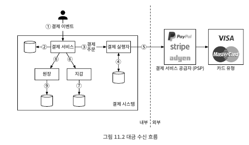
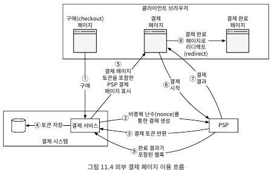
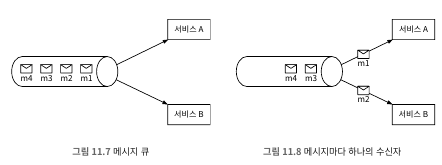
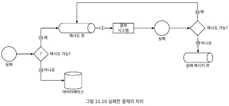

# 11. 결제 시스템
- 금전적 가치의 이전을 통해 금융 거래를 정산하는 데 사용하는 모든 시스템
- 전자상거래를 가능하게 하는 시스템 -> 안전적이고 확장 가능하며, 유연해야함
- 작은 실수로도 상당한 매출 손실이 발생

## 11.1 문제 이해 및 설계 범위 확정
##### 기능 요구사항
- 대금 수신(pay-in) 흐름: 판매자를 대신하여 고객으로부터 대금 수령
- 대금 정산(pay-out) 흐름: 전 세계의 판매자에게 제품 판매 대금 송금
##### 비기능 요구사항
- 신뢰성 및 내결함성: 결제 실패는 신중하게 처리
- 내부 서비스(결제 시스템)와 외부 서비스(결제 서비스 제공업체)간의 조정 프로세스: 시스템 간의 결제 정보가 일치하는지 비동기적으로 확인
##### 개략적인 규모 추정
- 하루에 100만 건의 트랜잭션을 처리해야 하는데, 100만/105 = 10TPS
- 10TPS는 일반적인 데이터베이스로 별 문제 없이 처리 가능한 양
- 처리 대역폭 보단 결제 트랜잭션의 정확한 처리에 초점을 맞춰 면접 진행

## 11.2 개략적 설계안 제시 및 동의 구하기
- 결제 흐름 반영을 위해 크게 두단계 세분화
  - 대금 수신 흐름
    - 구매자가 주문하면 아마존의 은행 계좌로 돈 입금
    - 돈을 판매자가 상당 부분을 소유하며, 아마존은 수수료만 받고 자금 관리자 역할만 수행
  - 대금 정산 흐름
    - 나중에 제품 배송되고 나면, 판매자에게 수수료를 제외한 판매 대금 전달
##### 대금 수신 흐름
 
- 결제 서비스
  - 사용자로부터 결제 이벤트를 수락하고 결제 프로세스를 조율
  - AML/CFT와 같은 규정 준수 및 범죄 행위의 증거가 있는지 판별 등 위험 점검(risk check) -> 위험 확인을 통과한 결제만 진행
  - 위험 확인서비스는 매우 고도로 전문화되어 있음 -> 제 3자 제공업체 활용
- 결제 실행자
  - 결제 서비스 공급자(PSP)를 통해 결제 주문 하나를 실행
  - 하나의 결제 이벤트에는 여러 결제 주문 포함 가능
- 결제 서비스 공급자(PSP: Payment Service Provider)
  - A 계정에서 B 계정으로 돈을 옮기는 역할 담당
  - 예제로 구매자의 신용 카드 계좌에서 돈을 인출하는 역할
- 카드 유형
  - 신용 카드 업무를 처리하는 조직
- 원장
  - 결제 트랜잭션에 대한 금융 기록
  - 전자상거래 웹사이트의 총 수익을 계산하거나 향후 수익을 예측하는 등, 결제 후 분석에서 매우 중요 역할
- 지갑
  - 판매자의 계정 잔액을 기록
  - 특정 사용자가 결제한 총 금액 기록
- 일반적인 흐름
  - ① 사용자 주문하기 버튼 클릭 -> 결제 이벤트 생성 후 결제 서비스 전송
  - ② 결제 서비스는 결제 이벤트 DB에 저장
  - ③ 때로는 단일 결제 이벤트에 여러 결제 주문이 포함 가능
  - ④ 결제 실행자는 결제 주문을 DB에 저장
  - ⑤ 결제 실행자는 외부 PSP를 호출하여 신용 카드 결제를 처리
  - ⑥ 결제 실행자가 결제 성공적으로 처리 후, 결제서비스는 지갑을 갱신하여 특정 판매자의 잔고 기록
  - ⑦ 지갑 서버는 갱신된 잔고 정보를 DB에 저장
  - ⑧ 지갑 서비스가 판매자 잔고를 성공적으로 갱신 후 결제 서비스는 원장 호출
  - ⑨ 원장 소비스는 새 원장 정보를 DB 추가

##### 결제 서비스 API
- POST /v1/payments
  - 결제 이벤트를 실행, 하나의 결제 이벤트에는 여러 결제 주문 포함 가능
    
    | 필드        | 설명     | 자료형 |
    |-----------|--------|--|
    | buyer_info | 구매자 정보 | json |
    | checkout_id | 결제 이벤트 식별하는 고유 ID | string |
    | credit_card_info | 암호화된 신용 카드 정보 또는 결제 토큰 | json |
    | payment_orders | 결제 주문 목록 | list |

  - payment_orders 형태는 아래와 같음

    | 필드               | 설명                       | 자료형              |
    |------------------|--------------------------|------------------|
    | seller_account   | 대금을 수령할 판매자              | string           |
    | amount           | 해당 주문으로 전송되어야 할 대금       | string           |
    | currency         | 주문에 사용된 통화 단위            | string(ISO 4217) |
    | payment_order_id | 해당 주문을 식별하는 전역적으로 고유한 ID | string           |
  - payment_order_id가 전역적 고유 ID -> 멱등 키
  - amount 필드의 데이터 유형이 double이 아닌 string 유의 -> 아래와 같은 이유로 전송 및 저장 시 숫자는 문자열로 보관하는것이 좋음
    - 직렬화/역직렬화에 사용하는 숫자 정밀도 이슈 존재 -> 의도치 않은 반올림 오류 유발
    - 해당 숫자의 크기가 매우 클수도 작을수도 있음

- POST /v1/payments/{:id}
  - payment_order_id가 가리키는 단일 결제 주문의 실행 상태를 반환

##### 결제 서비스 데이터 모델
- 결제 서비스에는 결제 이벤트와 결제 주문의 두개 테이블이 필요
- 결제 시스템용 저장소 솔루션을 고를 때 일반적으로 성능은 가장 중요한 고려사항이 아님
  - 안전성이 검증되었는가? 다른 대형 금융회사에서 수년동안 긍정적인 피드백을 받으며 사용된 적이 있는가?
  - 모니터링 및 데이터 탐사에 필요한 도구가 풍부하게 지원되는가?
  - DBA 채용 시장이 성숙했는가? 숙련된 DBA를 쉽게 채용할 수 있는가?
- 일반적으로 NoSQL/NewSQL보단 ACID 트랜잭션을 지원하는 전통적인 관계형 데이터베이스를 선호
- 결제 이벤트 테이블은 결제 이벤트 정보가 저장

| 이름               | 자료형             |
|------------------|-----------------|
| checkout_id      | string PK       |
| buyer_info       | string          |
| seller_info      | string          |
| credit_card_info | 카드 제공업체에 따라 다르다 |
| is_payment_done  | boolean         |
- 결제 주문 테이블에는 각 결제 주문의 실행 상태가 저장

| 이름                   | 자료형       |
|----------------------|-----------|
| payment_order_id     | string PK |
| buyer_account        | string    |
| amount               | string    |
| currency             | string    |
| checkout_id          | string FK |
| payment_order_status | string    |
| ledger_updated       | boolean   |
| wallet_updated       | boolean   |

- 표를 살펴보기 전에 몇가지 배경 정보
  - checkout_id는 외래키, 하나의 결제 행위는 하나의 결제 이벤트 생성, 하나의 결제 이벤트는 여러 결제 주문 포함 가능
  - 대금 수신에서는 구매자의 카드 정보만 필요 -> 대금 정산때는 판매자의 은행 계좌는 따로 확인 가능
- 결제 주문 테이블에서 payment_order_status는 열거 자료형 -> NOT_STARTED, EXECUTING, SUCCESS, FAILED 
  - 초기 값은 NOT_STARTED
  - 결제 서비스는 결제 실행자에 주문을 전송하면 EXECUTING으로 변경
  - 결제 서비스는 결제 처리자의 응답에 따라 SUCCESS 또는 FAILED 변경
- payment_order_status의 값이 SUCCESS로 결정되면 결제 서비스는 지갑 서비스를 호출하여 판매자의 잔액을 업데이트하고 wallet_updated 필드의 값은 TRUE로 변경
  - 지갑 업데이트는 항상 성공한다는 가정하여 설계 단순화
- 위의 절차가 끝나면 원장 서비스를 호출하여 ledger_updated 필드 TRUE로 갱신
- 동일한 checkout_id아래의 모든 결제 주문이 성공적으로 처리되면 결제 이벤트 테이블의 is_payment_done을 TRUE로 변경
- 종결되지 않은 결제 주문을 모니터링 하기 위해 주기적으로 실행되는 작업을 마련
  - 임계값 형태로 설정된 기간이 지나도록 완료되지 않은 결제 주문 존재 시, 엔지니에게 알림

##### 복식부기 원장 시스템
- 모든 결제 시스템에 필수 요소, 정확한 기록을 남기는 데 핵심적 역할
  - 모든 결제 거래를 두 개의 별도 원장 계좌에 같은 금액으로 기록 -> 한 계좌에서 차감과 다른 계좌 입금
- 복식부기 시스템에서 모든 거래 항목의 합계는 0이어야 함
- 해당 시스템을 활용하면 자금 흐름을 추적 가능하며, 일관성 보장 가능

##### 외부 결제 페이지
- 신용 카드 정보를 내부에 저장하지 않음 -> 미국의 PCI DSS 같은 복잡한 규정 준수
- 신용 카드 정보 수집을 하지 않기 위해 PSP에서 제공하는 외부 신용 카드 페이지 활용
  - 위젯, iframe 또는 결제 SDK 활용

##### 대금 정상 흐름
- 대금 정산 흐름은 대금 수신 흐름과 아주 유사
- 대금 수신에서 PSP를 통해 돈을 이체하는 것처럼, 수신도 타사 정산 서비스를 활용
  - 티팔티와 같은 외상매입급 지급 서비스 제공 업체 활용
  - 대금 정산에도 다양한 부기 및 규제 요구사항 존재

## 11.3 상세 설계
- 시스템을 더 빠르고 강력하며 안전하게 만드는 데 초점을 맞춤 -> 분산 시스템 오류와 장애는 피할 수 없음
  - 고객이 '결제' 버튼을 여러 번 누르면 어떻게 될까? 여러 번 요금이 청구되나?
  - 네트워크 연결 불량으로 인한 결제 실패는 어떻게 처리해야 하나?

##### PSP 연동
- 비자 또는 마스터 카드와 직접 연동하면 PSP 없이도 결제 가능 -> 직접 연결 투자는 아주 큰 회사나 할 법한 일
- 대부분 회사는 다음 2가지 방법 중 하나로 결제 시스템을 PSP와 연동
  - 회사가 민감한 결제 정보를 안전하게 저장 -> 회사가 결제 웹페이지를 개발하고 API를 통해 PSP와 연동
  - 회사가 민감한 결제 정보 저장 안함 -> PSP에서 외부 결제 페이지 제공 (대부분 기업 사용)
- 외부 결제 페이지의 작동 방식 
   
  - ① 결제 버튼 클릭 -> 클라리언트는 결제 주문 정보를 담아 결제 서비스 호출
  - ② 결제 서비스는 결제 등록 요청을 PSP로 전송 
    - 등록 요청: 결제 금액, 통화, 결제 요청 만료일, 리다이렉션 URL 등 포함
  - ③ PSP 결제 토큰(UUID) 반환
    - UUID 활용 -> 결제 주문의 ID 사용
    - 결제 등록 및 결제 실행 상태 확인 가능
  - ④ 결제 서비스는 PSP가 제공하는 외부 결제 페이지 호출 전, 토큰을 DB에 저장
  - ⑤ 클라이언트는 외부 결제 페이지 표시, 민감 결제 정보는 본 시스템에서 수집되지 않음
    - 외부 페이지는 아래와 같이 2가지 정보 필요
      - 4단계에서 받은 토큰: 토큰을 통해 사용자에게 받을 금액 확인
      - 리다이렉션 URL: 결제 완료되면 호출될 웹페이지 URL
  - ⑥ 사용자는 결제 세부 정보를 웹페이지에 입력하고 결제 버튼 클릭
  - ⑦ PSP가 결제 상태 반환
  - ⑧ 사용자는 리다이렉션 URL 가리키는 페이지로 이동 -> 수신 결제 상태가 URL에 추가
  - ⑨ 비동기적으로 PSP는 웹훅(결제 시스템에서 등록한 URL)을 통해 결제 상태와 함께 결제 서비스 호출 -> 주문 데이터베이스 테이블의 payment_order_status 필드 최신 상태 변경

##### 조정
- 비동기적으로 통신하는 경우 메시지가 전달되거나 응답이 반환된다는 보장은 없음 -> 조정을 통해 정확성 보장
  - 관련 서비스간의 상태를 주기적으로 비교하여 일치하는지 확인
- 매일 밤 PSP나 은행은 고객에게 정산 파일을 보냄 -> 하루 동안 해당 계좌에서 발생한 모든 거래 내력이 기재
  - 세부 거래 내역을 읽어 원장과 비교
- 조정 프로세스 
   
  - 조정에서 발견된 차이는 일반적으로 재무팀에 의로하여 수동으로 고침
  - 발생 가능한 불일치 문제 및 해결 방안은 아래 세가지 범주로 나눌수 있음
    - 문제 유형 인지 -> 가능, 해결절차 자동화 -> 가능
      - 자동화 프로그램을 작성하는 것이 효율적이므로 모두 자동화 처리
    - 문제 유형 인지 -> 가능, 해결절차 자동화 -> 불가능
      - 자동 조정 프로그램의 작성 비용이 너무 높음
      - 발생한 불일치 문제는 작업 대기열에 넣고 재무팀에서 수동적으로 수정하게함
    - 문제 유형 인지 -> 불가능, 해결절차 자동화 -> 불가능
      - 불일치 되는 문제를 특별 작업 대기열에 넣고, 재무팀에게 조사 요청
##### 결제 지연 처리
- 대부분의 경우 결제 요청은 몇 초 만에 처리되지만, 완료되거나 거부되기까지 몇 시간 또는 며칠이 걸리는 경우도 존재
  - PSP가 해당 결제 요청의 위험성이 높다고 보고 담당자 검토를 요구하는 경우
  - 신용 카드사가 구매 확인 용도로 카드 소유자의 추가 정보를 요청하는 3D 보안 인증 같은 추가 보호 장치를 요구하는 경우
- 해당 이슈를 다음과 같이 처리 -> 구매 페이지가 외부 PSP에 호스팅 되는 경우
  - PSP 결제가 대기(pending) 상태임을 알리는 상태 정보를 클라이언트에 반환 -> 클라이언트는 이를 사용자에게 표시
  - PSP는 우리 회사를 대신하여 대기 중인 결제의 진행 상황을 추적, 상태가 바뀌면 PSP에 등록된 웹훅을 통해 결제서비스에 알림
- 결제 서비스는 내부 기록된 정보를 업데이트하고 고객에게 배송을 완료
##### 내부 서비스간 커뮤니케이션
- 내부 서비스 통신에는 동기식과 비동기식의 두 가지 패턴 존재
  - 동기식
    - 소규모 시스템에서는 잘 작동하지만 규모가 커지면 단점 드러남
    - 한 요청에 응답을 만드는 처리 주기는 관련된 서비스가 많을수록 길어짐
    - 다음과 같은 단점 존재
      - 성능 저하: 요청 처리에 관계된 서비스 가운데 하나에 발생한 성능 문제가 전체 시스템 성능에 영향을 미침
      - 장애 격리 곤락: PSP 등의 서비스에 장애가 발생하면 클라이언트는 더 이상 응답을 받지 못함
      - 높은 결합도: 요청 발신자는 수신 발신자를 알아야만 함
      - 낮은 확장성: 큐를 버퍼로 사용하지 않고서는 트래픽 증가에 대응할 수 있도록 시스템 확장이 어려움
  - 비동기식
    - 크게 두가지 범주로 나눌수 있음 
       
      - 단일 수신자
        - 각 요청은 하나의 수신자 또는 서비스가 처리
        - 일반적으로 공유 메시지큐 사용
        - 복수의 구독자가 있을 수 있으나 처리된 메시지는 큐에서 바로 제거
      - 다중 수신자
        - 각 요청은 여러 수신자 또는 서버가 처리
        - 카프카는 이런 시나리오를 잘 처리 -> 동일한 메시지를 여러 서비스가 받아 처리 가능
        - 결제 시스템 구현에 적합 -> 하나의 요청이 푸시 알림 전송, 재무 보고 업데이트 등의 다양한 용도에 사용
- 일반적으로 동기식 통신은 설계하기는 쉽지만 서비스의 자율성을 옾이기에는 적합하지 않음 -> 의존성 그래프가 커지면 전반적인 성능이 낮아짐
- 비동기 설계는 단순성과 데이터 일관성을 시스템 확장성과 장애 감내능력과 맞바꾼 결과
- 비즈니스 로직이 복잡하고 타사 서비스 의존성이 높은 대규모 결제 시스템에는 비동기 통신이 더 나은 선택

##### 결제 실패 처리
- 모든 결제 시스템은 실패한 결제를 적절히 처리할 수 있어야 함 -> 안전성 및 결함 내성은 핵심 요구사항
- 문제를 해결하는 몇가지 기법
  - 결제 상태 추적
    - 결제 주기의 모든 단계에서 결제 상태를 정확하게 유지하는 것은 매우 중요
    - 실패가 일어날 때마다 결제 거래의 현재 상태를 파악하고 재시도 또는 환불 필요한지 여부 결정
    - 결제 상태는 데이터 추가만 가능한 DB 보관
  - 재시도 큐 및 실패 메시지 큐
    - 실패를 우아하게 처리하기 위해 재시도 큐와 실패 메시지 큐를 두는 것이 바람직함
      - 재시도 큐: 일시적 오류 같은 재시도 가능 오류는 재시도 큐에 보냄
      - 실패 메시지 큐: 반복적으로 처리에 실패한 메시지는 결국에는 실패 메시지 큐로 보냄, 문제 분석 검사에 유용
    - 프로세스 
     
      - ① 재시도 가능한지 확인
        - (a) 재시도 가능 실패는 재시도 큐로 보냄
        - (b) 잘못된 입력과 같이 재시도가 불가능한 실패는 오류 내역을 데이터베이스로 저장
      - ② 결제 시스템은 재시도 큐에 쌓인 이벤트를 읽어 실패한 결제를 재시도
      - ③ 결제 거래가 다시 실패하는 경우에는 다음과 같이 처리
        - (a) 재시도 횟수가 임계값 이내라면 해당 이벤트를 다시 재시도 큐로 보냄
        - (b) 재시도 횟수가 임계값을 넘으면 실패 메시지 큐에 넣음
        
##### 정확히 한번 전달
- 고객에게 이중으로 청구하는건 가장 심각한 문제 중 하나 -> 정확히 한 번만 실행되도록 결제 시스템 설계 중요
- 메시지를 정확히 한 번 전달하는 것은 매우 어렵지만 두 부분으로 나누면 훨씬 쉬움
  - 최소 한 번은 실행
  - 최대 한 번 실행
- 재시도(최소 한 번 실행)
  - 재시도 메커니즘 활용하여 어떤 결제가 최소 한 번은 실행되도록 보장 가능
  - 재시도 매커니즘을 도입할 때는 얼마나 간격을 두고 재시도할지 정하는 것 중요
    - 즉시 재시도: 클라이언트는 즉시 요청을 다시 보냄
    - 고정 간격: 재시도 전에 일정 시간 기다리는 방안
    - 증분 간격: 재시도 전에 기다리는 시간을 특정한 양 만큼 점진적으로 늘려 나가는 방안
    - 지수적 백오프: 재시도 전에 기다리는 시간을 직전 재시도 대비 두 배씩 늘려 나가는 방안
    - 취소: 요청을 철회하는 방안, 실패가 영구적이거나 재시도를 하더라도 성공 가능성은 낮음
  - 적절한 재시도 전략을 결정하는 것은 어려움 -> 모든 상황에 맞는 해결책은 존재하지 않음
    - 일반적으로 적용 가능한 지침은 네트워크 문제는 단시간 해결 불가능 -> 지수적 백오프 사용 권고
    - 에러 코드 반환할 때는 'Retry-After' 헤더를 붙여 보낸 것이 바람직
- 멱등성 검사(최대 한 번 실행)
  - 최대 한 번 실행을 보장하기 위한 핵심 개념 -> 여러번 반복해도 동일한 결과 처리
  - HTTP 헤더에 <명등키: 값>의 형태로 멱등 키를 추가
  - 처음 처리 가능 -> 두번째 처리 불가능 -> 동일한 멱등 키로 동시에 많은 요청 받으면 Status 429 내림
  - 데이터베이스의 고유 키 제약 조건 활용 (멱등성 지원 방법 중 하나)
    - 데이터 베이스 테이블의 기본 키를 멱등키로 활용 -> 중복 삽입 불가
##### 일관성 
- 결제 실행 과정에서 상태 정보를 유지 관리하는 여러 서비스 호출 -> 분산 환경에서 데이터 불일치 발생 가능
- 내부 서비스 간에 데이터 일관성을 유지하려면 정확히 한 번 처리되도록 보장 중요
- 내부 서비스와 외부 서비스 간의 데이터 일관성을 유지를 위해서는 멱등성과 조정 프로세스 활용
  - 외부 서비스가 멱등성을 지원하는 경우, 결제 재시도할 때는 멱등 키 사용 -> 항상 옳다고 가정 X 
  - 멱등 키를 사용하더라도 조정 절차 필수
- 데이터를 다중화 하는 경우에는 복제 지연으로 인해 원본과 사본이 불일치 가능
  - 주 데이터베이스에서만 읽기와 쓰기 연산을 처리, 사본은 트래픽 처리 X -> 규모 확장성이 떨어짐
  - 모든 사본이 항상 동기화 되도록 함

##### 결제 보안
- 사이버 공격과 카드 도난에 대응하기 위해 아래와 같은 기술 필요

| 문제                 | 해결책                                    |
|--------------------|----------------------------------------|
| 요청/응답 도청           | HTTPS 사용                               |
| 데이터 변조             | 암호화 및 무결성 강화 모니터링                      |
| 중간자 공격             | 인증서 고정과 함께 SSL 사용                      |
| 데이터 손실             | 여러 지역에 걸쳐 데이터베이스 복제 및 스냅숏 생성           |
| 분산 서비스 거부 공격(DDOS) | 처리율 제한 및 방화벽                           |
| 카드 도난              | 토큰화. 실제 카드 번호를 사용하는 대신 토큰을 저장하고 결제에 사용 |
| PCI 규정 준수          | PCI DSS는 신용카드를 처리하는 조직을 위한 정보 보안 표준    |
| 사기                 | 주소 확인, 카드 번호 확인, 사용자 행동분석 등            |

## 11.4 마무리
- 언급할 가치가 있는 주제
  - 모니터링
    - 주요 지표를 모니터링 하는 것은 매우 중요
    - '특정 결제 수단의 평균 승인율' ,'서버의 CPU 사용량은 얼마?' 등과 같은 지표를 대시보드로 만들수 있음
  - 경보
    - 비정상적인 상황이 발생하면 온콜 중인 개발자에게 알림
  - 디버깅 도구
    - 엔지니어와 고객 지원팀이 더 쉽게 디버깅할 수 있도록 도구 개발 중요
  - 환율
    - 국제적인 결제 시스템을 설계할 때는 환율 고려
  - 지역
    - 지역마다 가용한 결제 수단이 달라질 수 있음
  - 현금 결제
    - 인도, 브라질 등의 국가에서 매우 일반적인 사항 -> 고려 필요
  - 구글/애플 페이 연동