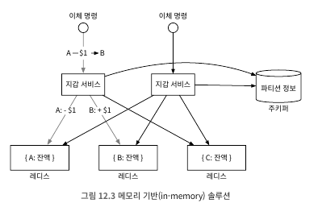
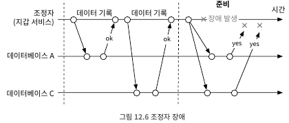
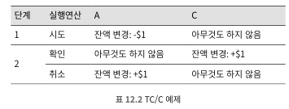
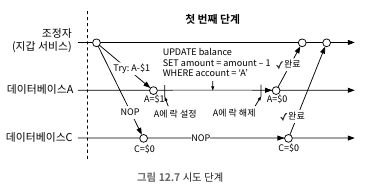
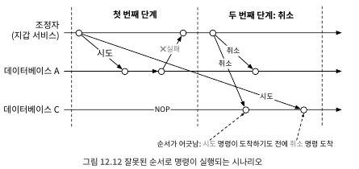
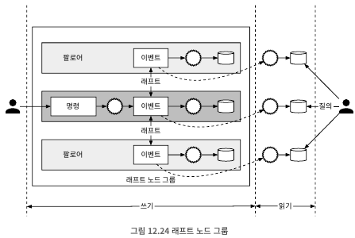

# 12. 전자 지갑
- 고객으로 하여금 지갑에 돈을 넣어 두고 필요할 때 사용할 수 있도록 하는 결제 기능 제공
- 페이팔과 같은 플랫폼은 송금 기능까지 지원 -> 은행 간 이체보다 빠르며 수수료를 부과하지 않음

## 12.1 문제 이해 및 설계 범위 확정
##### 요구사항
- 전자 지갑 간 이체
- 1,000,000TPS
- 99.99%의 안전성
- 트랜잭션
- 재현성

##### 개략적 추정
- TPS 거론은 배후의 트랜잭션 기반 DB를 사용한다는 뜻 -> 데이터센터 노드에서의 RDB는 초당 수천 건의 트랜잭션 지원
    - 데이터베이스 노드는 1,000 TPS 지원 가능 -> 백만 tps 지원은 1,000개의 데이터베이스 노드 필요
    - 이체 명령은 2개의 TPS 처리 필요 -> 인출 연산과 입금 연산 필요
    - 그러하기에 백만 tps는 실질적으로 2백만 tps 필요 -> 2,000개의 데이터베이스 노드 필요
- 하드웨어가 같다고 가정하면 한 노드당 처리할 수 있는 트랜잭션 수가 많을수록 총 노드 수는 줄어듬 -> 하드웨어 비용 절감
- 해당 장 설계 목표 중 하나는 하나의 노드에서 처리할 수 있는 트랜잭션 수를 늘리는 것

## 12.2 개략적 설계안 제시 및 동의 구하기
- 아래와 같은 내용 설명
    - API 설계
    - 세가지 개략적 설계안
        - 간단한 메모리 기반 솔루션
        - 데이터베이스 기반 분산 트랜잭션 솔루션
        - 재현성을 갖춘 이벤트 소싱 솔루션

##### API 설계
- 하나의 API만 구비하면 됨

| API                               | 기능                   |
|-----------------------------------|----------------------|
| POST /v1/wallet/balance_transfer | 한 지갑에서 다른 지갑으로 자금 이체 |

- 요청 인자는 다음과 같음

| 필드             | 설명                           | 자료형              |
|----------------|------------------------------|------------------|
| from_account   | 자금을 인출할 계좌                   | string           |
| to_account     | 자금을 이체할 계좌                   | string           |
| amount         | 이체할 금액                       | string           |
| currency       | 통화 단위                        | string(ISO 4217) |
| transaction_id | 중복 제거(deduplication)에 사용할 ID | uuid             |

- 응답 본문 사례
```
{
  "status": "success",
  "transaction_id": "01589980-2664-11ec-9621-0242ac130002"
}
```
- amount 자료형은 string -> 이기종 간 다른 자료형 인식으로 인한 오차 발생 위험 제거
##### 인메모리 샤딩
- 지갑 애플리케이션은 모든 사용자 계정의 잔액을 유지
    - <사용자,잔액> 관계의 해시 테이블 구조의 map 또는 키-값 저장소 활용 선호
- 인메모리 저장소로 redis 선호
    - 한대로 100만 TPS처리는 한계가 있음 -> 클러스터 구성 및 사용자 데이터 분산(파티셔닝 또는 샤딩)
- 키-값 데이터를 n개의 파티션에 고르게 분포하려면? 해시 값을 계산하고 파티션 n으로 나눔 -> 파티션 번호
```
String accountID = "A";
Int partitionNumber = 7;
Int myPartition = accountID.hashCode() % partitionNumber;
```
- 모든 레디스 노드의 파티션 수 및 주소는 한군데 저장 -> 높은 가용성 보장을 위해 주키퍼 이용도 좋음
- 해당 방안 마지막 요소는 이체 명령 처리를 담당하는 서비스 -> 지갑 서비스(wallet service)
    - 이체 명령 수신
    - 이체 명령 유효성 검증
    - 명령이 유효한 것으로 확인되면 이체에 관계된 두 계정의 잔액 갱신
- 무상태이며, 수평적 규모 확장 용이


<br>
- 위 예제는 3개의 레드스 노드가 존재
- 클라이언트 A에서 B로 1달러 이체 명령
    - 한개의 노드는 A의 계정이 포함된 레디스 노드는 1달러 차감
    - 클라이언트 B의 계정이 포함된 레디스 노드는 1달러 더함
- 문제점: 원자적 트랜잭션 보장 못함
    - 첫번 째 업데이트를 끝낸 후 두 번째 업데이트를 완료하기전 서비스 노드가 죽으면 데이터 일관성 이슈 생김

##### 분산 트랜잭션
- 데이터 베이스 샤딩
    - 서로 드란 두 개 저장소 노드를 갱신하는 연산을 원자적으로 수행하려면?
        - 레디스 노드를 트랜잭션을 지원하는 관계형 데이터베이스 노드로 교체
        - 서로 다른 두 데이터베이스 서버에 있는 계정 2개 업데이트 해야하지만 동시 처리 보장 없음
    - 분산 트랜잭션: 2단계 커밋<br>
      <br>
        - 분산 트랜잭션은 여러 프로세스를 원자적인 하나의 트랜잭션으로 묶는 방법
        - 저수준 방안이며, 단 두 단계(준비, 커밋)로 실행
        - 저수준인 이유: 모든 데이터베이스가 X/Open XA 표준을 만족
        - 문제점
            - 다른 노드의 메시지를 기다리는 동안 락이 걸려있기에 성능이 좋지 못함
            - SPOF가 발생할 수 있음<br>
              <br>
    - 분산 트랜잭션: TC/C(Try-Confirm/Cancel)
        - 두 단계로 구성된 보상 트랜잭션
            - 조정자는 모든 데이터베이스에 트랜잭션에 필요한 자원 예약을 요청
            - 조정자는 모든 데이터베이스로부터 회신 받음
                - (a) 모두 예이면, 모든 데이터베이스에 작업 확인 요청 -> 시도-확정
                - (b) 어느 하라도 '아니요', 데이터베이스에 작업 취소 요청 -> 시도-취소
        - 2PC는 두 단계는 한 트랜잭션이지만 TC/C에서는 별도 트랜잭션
        - TC/C 사례<br>
          <br>
            - 첫 번째 단계: 시도(지갑 서비스가 두개의 트랜잭션 명령을 두 데이터베이스로 전송)<br>
              <br>
                - 조정자는 계정 A의 잔액을 1달러 감소시키는 트랜잭션 시작
                - 조정자는 계정 C가 포함된 데이터베이스에는 아무 작업도 하지 않음 -> NOP(No Operation) 전달
            - 두 번째 단계: 확정 (두 데이터베이스가 모두 '예'라고 응답하면 확정)<br>
              <br>
                - 계정 A의 잔액은 첫 번째 단계일때, 이미 갱신 -> 변경 X
                - 계정 C의 잔액에 $1를 추가하여 확정
            - 두 번째 단계: 취소 (시도 단계 실패시, 보상 트랜잭션 실행)<br>
              <br>
                - 분산 트랜잭션을 취소하고 관련된 자원을 반환
        - 2PC와 TC/C 비교<br>
          <br>
            - 2번째 단계일때 2PC는 락 상태, TC/C는 로컬 트랜잭션은 완료된 상태
        - 장점: 특정 데이터베이스에 구애받지 않음
        - 단점: 애플리케이션 계층의 비즈니스 로직에서 세부 사항을 관리 -> 분산 트랜잭션의 복잡성 처리
            - 불균형<br>
              <br>
                - 시도 단계가 끝났을 시, 계정 A에 1달러만 차감되고 C 계정은 변화가 없음 -> 데이터 불일치
                - TC/C의 실행 주체는 애플리케이션이며 독립적 로컬 트랜잭션이 만드는 중간 결과 확인 가능
                    - DB 트랜잭션이나 2PC 같은 분산 트랜잭션은 중간 실행 값 확인 불가능
                - 분산 트랜잭션 데이터 불일치에 대해 개발자가 직접 처리
            - 유효한 연산 순서
                - 시도 단계에서 할 수 있는 일은 세가지<br>
                  <br>
                    - 2번째 경우, 시도 후 계정 C에서 $1를 이체해 간다면? -> 분산 트랜잭션 보증 위반
                    - 3번째 경우, C계정은 $1는 추가되었지만 A계정이 실패하면? -> 2번째 경우와 유사한 상황 발생
                    - 1번만 유효
            - 잘못된 순서로 실행되는 경우<br>
              <br>
                - TC/C에서 실행 순서가 어긋날 수 있음
                    - 위와 같은 네트워크 이슈로 인해 데이터베이스 C가 시도 -> 취소가 아닌 취소 -> 시도로 순서가 꼬일때
                - 다음과 같이 수정
                    - 취소 명령이 먼저 도착하면 데이터베이스에 아직 상응하는 시도 명령을 못 보았음을 나타내는 플래스 참으로 설정 및 저장
                    - 시도 명령이 도착하면 항상 먼저 도착한 취소 명령이 있는지 확인 -> 있으면 실패 반환
    - 분산 트랜잭션: 사가<br>
      <br>
        - 분산 트랜잭션 솔루션 가운데 MSA 아키텍처에서 사실상 표준
            - 모든 연산은 순서대로 정렬. 각 연산은 독립 트랜잭션으로 실행
            - 연산은 첫 번째부터 마지막까지 순서대로 실행. 한 연산이 완료되면 다음 연산 개시
            - 연산 실패하면 전체 프로세스는 실패한 연산부터 역순으로 보상 트랜잭션을 통해 롤백
                - n개의 연산을 실행하는 분산트랜잭션은 보상 트랜잭션까지 2n개의 연산 필요
        - 연산 실행 순서 조율하는 방법
            - 분산 조율(choreography, 안무): 모든 서비스가 다른 서비스의 이벤트를 구독하여 작업을 수행, 탈 중앙화된 조율 방식
            - 중앙 집중형 조율(orchestration): 하나의 조정자가 모든 서비스가 올바른 순서로 작업을 실행하도록 조율
        - 서로 비동기식으로 통신하기 때문에 이벤트 결과로 어떤 작업 실행할지 내부적으로 상태 기계를 유지해야 함
        - 중앙 집중형 조율 방식 선호 -> 복잡한 상황을 잘 처리
        - TC/C와 사가 비교<br>
          <br>
        - 실무에서는 방안 선택은 지연 시간 요구사항에 따라 다름
            - 지연 시간 요구사항이 없거나 서비스 수가 매우 적다면 아무거나 사용, MSA는 흔히 사가 선택
            - 지연 시간에 민감하고 많은 서비스/운영 관계된 시스템이라면 TC/C
##### 이벤트 소싱
- 전자 지갑 서비스 제공 업체도 감사를 받을 수 있음
  - 특정 시점의 계정 잔액 확인 여부
  - 과거 및 현재 계쩡 잔액이 정확 여부
  - 코드 변경 후에도 시스템 로직이 올바른지 여부
- 위와 같은 질문의 답할 수 있는 설계 철학 중 하나는 도메인 주도 설계 개발된 기법인 이벤트 소싱
- 이벤트 소싱에는 4가지 중요한 용어 존재
  - 명령
    - 외부에서 잔달된 의도가 명확한 요청
    - 'A에서 C로 이체'는 명령이며 순서가 매우 중요, FIFO 큐에 저장 
  - 이벤트
    - 명령은 의도가 명확하지만 사실이 아니기에 유효하지 않을 수 있음 -> 이체하였지만 잔액이 음수일수도..
    - 작업 이행 전에는 명령의 유효성 검사 필수이며, 이행 결과를 이벤트라 부름
    - 명령과 이벤트 차이점
      - 이벤트는 검증된 사실로 실행이 끝난 상태 -> 과거 시제 사용
      - 명령은 무작위성이나 I/O 포함될 수도 있지만, 이벤트는 결정론적
    - 이벤트 생선 프로세스 특성
      - 하나의 명령으로 여러 이벤트가 만들어 질수 있음
      - 이벤트 생성 과정에는 무작위성이 개입될 수 있음 -> 같은 명령에 항상 동일한 이벤트 x
    - 이벤트 순서는 명령 순서를 따라야 하며, 이벤트도 FIFO 큐에 저장
  - 상태
    - 이벤트가 적용될 때 변경되는 내용
    - 지갑 시스템에서의 상태는 모든 클라이언트 계정의 잔액
  - 상태 기계
    - 이벤트 소싱 프로세스를 구동 시키는 요소
      - 명령의 유효성을 검사하고 이벤트를 생성
      - 이벤트를 적용하여 상태를 갱신
    - 결정론적으로 동작되어야 하며, 무작위성을 내포할 수 없음 -> 이벤트 상태를 반영하는 것에 대해 항상 같은 결과 보장
    - 명령을 이벤트로 변환하고 이벤트를 적용하는 두가지 기능 지원<br>
    <br>
- 지갑 서비스 예시<br>
    <br>
  - 계정 잔액(상태)는 관계형 데이터베이스에서 관리
  - 상태 기계는 명령을 큐에 들어간 순서대로 확인, 명령 하나를 읽을 때 마다 충분한 잔액 확인 후 이벤트 생성
    - "A-> $1 -> C"라는 명령이면 상태 기계는 "A:-$1", "C:+$1" 두개의 이벤트 생성
- 재현성<br>
  <br>
  - 이벤트 소싱이 다른 아키텍처에 비해 갖는 가장 중요한 장점은 재현성
    - 이벤트를 처음부터 자시 재생하면 과거 잔액 상태 재구성 가능 -> 이벤트 리스트는 불변이고, 상태 기계 로직은 결정론이기에
  - 아래와 같은 질의 답변 가능
    - 특정 시점의 계정 잔액 확인 여부 -> 이벤트 재생으로 가능
    - 과거 및 현재 계쩡 잔액이 정확 여부 -> 이벤트 이력으로 재 계산으로 가능
    - 코드 변경 후에도 시스템 로직이 올바른지 여부 -> 동일한 이벤트 이력 입력을 통해 동일한 결과 출력 확인
- 명령-질의 책임 분리(CQRS)<br>
  <br>
  - 외부 클라이언트에서 잔액(상태)를 확인 방법 필요 -> 직관적 해결책은 읽기 전용 사본 생성 후 제공
  - CQRS는 이벤트 소싱은 외부에 모든 이벤트를 보내어 이벤트를 수신하는 외부 주체가 직접 상태 재구축
    - 상태 기록을 담당하는 상태 기계는 하나, 읽기 전용 상태 기계는 여러개
  - 읽기 전용 상태 기계는 실제 상태에 어느 정도 뒤쳐질 수 있음 -> 결과적 일관성 따라옴 
## 12.3 상세 설계
##### 고성능 이벤트 소싱
- 카프카를 명령 및 이벤트 저장소로, 데이터베이스를 상태 저장소로 활용 -> 최적화 방안 고려
- 파일 기반의 명령 및 이벤트 목록<br>
  <br>
  - 카프카 같은 원격 저장소가 아닌 로컬 디스크에 저장하는 방안 고려
    - 네트워크를 통한 전송시간 피할 수 있고, 쓰기 연산도 빠름
  - 해당 최적화에 mmap 기술을 활용
    - 로컬 디스크에 쓰는 동시에, 최근 데이터 자동 캐시도 가능
    
- 파일 기반 상태<br>
  <br>
  - 관계형 데이터베이스에서 로컬 디스크에 저장하는 방안 고려
    - 파일 기반 로컬 관계형 데이터베이스 SQLite 또는 로컬 기반 키-값 저장소 RocksDB 활용
- 스냅숏<br>
  <br>
  - 재현성 확보를 위해 이벤트를 처음부터 다시 읽도록 처리 -> 너무 많음
  - 시간별로 상태 파일을 저장 -> 스냅숏이라고 함
    - 스냅숏은 과저 특정 시점의 상태로 변경이 불가능
  - 특정 시점에 스냅숏을 통해 효율적인 재현성 확보 가능
##### 신뢰할 수 있는 고성능 이벤트 소싱
- 신뢰성 분석
  - 노드에서 보면 데이터와 연산을 위주 -> 데이터가 매우 중요(연산은 데이터만 있으면 다시 돌리면 됨)
  - 데이터 관점에서 이벤트 데이터가 제일 중요
    - 상태와 스냅숏은 이벤트 목록만 존재하면 언제든 재생성 가능
    - 명령어는 이벤트가 단순 명령어만이 아닌 여러 외부 요인으로도 만들어질 수 있음
- 합의
  - 데이터의 높은 안전성을 보장하려면 여러 노드에 복제해야함
    - 데이터 손실 없음
    - 로그 파일 내 데이터의 상대적 순서는 모든 노드에 동일
  - 합의 기반 복제 방안이 적합하며, 리더 선출을 활용하는 래프트(raft) 알고리즘 활용<br>
    <br>
- 고신뢰성 솔루션<br>
  <br>
  - 복제 메커니즘을 통해 이벤트 소싱 아키텍처에서 SPOF 문제 해결
    - 리더는 외부에서 들어 오는 명령 요청을 받아 이벤트로 변환하고 로컬 이벤트 목록 추가
    - 래프트 알고리즘으로 팔로어는 새로운 이벤트를 모두 복제
  - 리더 장애 발생시, 새로운 리더 선출 -> 해당 상황 발생시 다운 타임이 생기며, 클라이언트는 일정 시간 후 같은 명령을 보내야함
  - 팔로어 장애 발생시, 죽은 노드가 다시 시작되면 재시도하여 싱크 맞춤
##### 분산 이벤트 소싱
- 신뢰성 문제는 해결되었지만 아래 문제 존재
  - 전자 지겁 업데이트 결과를 즉시 받고 싶음
  - 단일 래프트 그룹의 용량은 제한 -> 샤딩과 분산 트랜잭션 구현
- 풀 vs 푸쉬
  - 풀 모델은 외부 사용자가 주기적으로 질의 -> 실시간이 아니며 짧은 주기는 불필요한 과부화 야기
  - 단순 풀 모델은 역방향 프록시(reverse proxy)를 통해 해결
    - 여전히 통신이 실시간으로 이루어지지 않지만 클라이언트 로직은 단순해짐
  - 이벤트를 수신하자마자 실행 상태를 역방향 프락시에 푸시하도록 수정 -> 실시간 응답이 이루어지는 느낌을 줄 수 있음<br>
    <br>
- 분산 트랜잭션
  - 이벤트 소싱 노드 그룹이 동기적 실행 모델을 채택 -> TC/C나 사가 같은 분산 트랜잭션 솔루션 활용 가능<br>
    <br>
    - ① 사가 조정자에게 분산 트랜잭션을 보냄 -> 두개의 연산 포함(A:-$1,C:+$1)
    - ② 단계별 상태 테이블에 레코드 생성하여 트랜잭션 상태 추적
    - ③ 사가 조정자가 작업 순서 검토 후 A:-$1 부터 처리 -> 해당 연산을 파티션 1로 보냄
    - ④ 파티션1의 래프트 리더는 A:-$1 명령을 수신하고 명령 목록에 저장, 유효성 검사 및 이벤트 변환 -> 노드 동기화 완료되면 이벤트가 실행(A의 계정 잔액 $1 차감)
    - ⑤ 이벤트 동기화 되면 파티션 1의 읽기 경로도 동기화
    - ⑥ 파티션 1의 읽기 경로는 사가 조정자에게 상태를 푸시
    - ⑦ 사가 조정자는 파티션 1에서 성공 상태 수신
    - ⑧ 사가 조정자는 단계별 상태 테이블에 파티션 1의 작업이 성공했음을 레코드에 생성
    - ⑨ 첫번재 작업 성공으로 두번째 작업인 C:+$1 명령을 파티션 2로 전달
    - ⑩ 파티션 2도 명령 수신, 명령 목록 저장, 유효성 검사 및 이벤트 변환 -> 노드 동기화 완료되면 이벤트가 실행(A의 계정 잔액 $1 증가)
    - ⑪ 이벤트 동기화 되면 파티션 2의 읽기 경로도 동기화
    - ⑫ 파티션 2의 읽기 경로는 사가 조정자에게 상태를 푸시
    - ⑬ 사가 조정자는 파티션 2에서 성공 상태 수신
    - ⑭ 사가 조정자는 단계별 상태 테이블에 파티션 2의 작업이 성공했음을 레코드에 생성
    - ⑮ 모든 작업 성공하고 분산 트랜잭션 완료 후 호출자에게 결과 응답

## 12.4 마무리
- 초당 100만건 이상의 결제 명령을 처리하려면 수천개의 노드가 필요하다는 결론
- 첫 번째 설계안
  - 레디스 같은 인메모리 키-값 저장소 활용
  - 데이터 내구성이 없다는 단점
- 두 번째 설계안
  - 캐시를 트랜잭션 데이터베이스로 변경
  - 분산 트랜잭션 지원을 위해 2PC, TC/C, 사가와 같은 다양한 트랜잭션 프로토콜 활용
  - 데이터 감사가 어렵다는 단점
- 마지막 설계안
  - 이벤트 소싱 방안이며, 외부 데이터베이스와 큐를 사용
  - 성능이 좋지 않기에 로컬 파일 시스템을 활용하여 성능 개선
  - 데이터를 한곳에 두면 문제(SPOF)가 생기므로, 래프트 합의 알고리즘을 통해 여러 노드 복제
  - 이벤트 소싱에 CQRS 도입