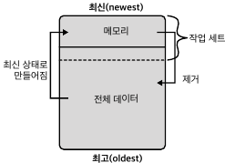

# 4. 접근 패턴
- 애플리케이션이 MySQL을 사용하여 데이터에 접근하는 방법
- 쿼리, 인덱스, 데이터 최적화 다음에  접근 패턴을 최적화
- MySQL은 애플리케이션에 대해 충분히 빠름 -> 애플리케이션이 MySQL을 효율적으로 사용하느냐고 중요
### 4.1 MySQL은 아무것도 하지 않는다
- 애플리케이션 상태에 따라 MySQL도 영향을 받음
  - 애플리케이션이 유후(idle) 상태면 MySQL도 유후 상태임
- MySQL이 느리게 실행된다면, 외부 문제가 없으면 원인은 애플리케이션
- MySQL은 애플리케이션이 사용자 모르게 쿼리를 실행하지 않는 이상 고스트 미존재
- 쿼리 경합(로우락)은 MySQL이 바쁜것처럼 보이게 할 수 있음 -> MySQL은 애플리케이션 쿼리만 실행할 뿐
### 4.2 한계에 도달하면  성능이 불안정해진다
- 선형 스케일링은 모든 DBA와 엔지니어의 이상 -> 실현될 수가 없음 

  - 선형 스케일링(선형 확장): 시스템 용량을 100% 사용할 때까지 증가한 다음, 성능 일정하게 유지
  - 데이터베이스 성능은 시스템 용량의 100% 미만의 한계까지만 부하 증가 -> 현실적으로 80% ~ 95%
  - 부하가 한도를 증가하면 성능 불안정 -> 성능 저하 및 최악의 경우 운영 중단
- 범용 확장성 법칙 -> 실제 MySQL 성능을 놀라울 정도로 잘 모델링함 

  - 동시성과 부하가 증가함에 따라 처리량 증가
  - 경합과 일관성은 처리량 감소
- 한계를 밀어붙일 때 실제 중단에서 발생한 3개의 차트 

##### 상승기(오전 6시 ~ 9시)
- 메트릭이 꾸준히 상승
- 개발자들은 트래픽 처리를 위해 트랜잭션 처리량을 늘림 -> MySQL 한계에 다다름 및 더이상 작동하지 않음
##### 한계점(오전 9시 ~ 정오)
- 애플리케이션 한계점이 유지되는 동안 불안정한 상태
- 스레드의 톱날 패턴은 MySQL이 불안정해졌음을 나타내는 신호 -> 하나의 쿼리 실행은 하나의 스레드
- 변함 없이 높은 CPU 사용량과 QPS는 오해 소지 존재 -> 약간의 변동 있는 것이 좋음
  - 오케스트라가 올바르게 연주되면 다양한 측면에서 변화 -> 평평한 선을 그리는 메트릭은 매우 강하게 연주하는 클라리넷 연주자
- MySQL은 CPU의 5%를 사용하지 못하고, QPS가 증가히자 않으며 실행중인 스레드가 안정화되지 않음
##### 수정(정오 ~ 오후 3시)
- 수정 사항은 트랜잭션 처리량을 줄이는 것 -> cpu 50% 감소 QPS와 실행 중인 스레드 안정적인 변동 폭
  - 고속도로가 막히는데 해소하려면? 자동차의 수를 줄이는 것 -> 더 적은 자동차가 더 빨리 달릴수 있음
- 높은 부하는 애플리케이션을 불안정하게 하여 MySQL에서 부하가 증가하는 것을 방지 -> 쓰로틀링
- 한계에 도달한 MySQL 성능에 대한 2가지 추가 사항
  - 일부러 부족한 하드웨어를 사용하지 않는 한 한계에 도달하기 어려움
    - 애플리케이션이 모든 하드웨어를 동시에 활용하는 것은 어려움 -> 하드웨어 한 부분에서 병목 현상 발생이 더 현실적임(DB 한계가 아닌 하드웨어 한계)
  - 높은 부하로 인해 MySQL이 느리게 응답한다고 해서 한계에 도달했다는 의미는 아님
    - 동시성을 높이면 한계가 증가 -> 느린 데이터베이스가 한계에 도달했다고 하지 않음
    - 경합을 중리면 한계도 높아짐
- MySQL 성능에서 핵심은 쿼리 응답 시간이기 때문에 동시 성과 경합 값은 직접 측정 불가능 -> 성능 향상보단 시스템 용량을 이해
### 4.3 도요타와 페라리
- 일부 애플리케이션은 놀라운 MySQL 성능 달성 <-> 다른 애플리케이션은 낮은 처리량으로 어려움 겪음
- 같은 부품을 쓰지만 도요타와 페라리는 성능적 차이 존재 -> 페라리의 엄격한 세부 사항 수준은 더 나은 성능 달성
- MySQL의 성능을 최대로 끌어올리기 위해 모든 세부 사항 설계가 필요
### 4.4 데이터 접근 패턴
- 애플리케이션이 MySQL을 사용하는 데이터 접근 방법
- 접근 패턴 3가지 세부 사항
  - 접근 패턴을 복수형으로 논의하는 것이 너무 일반적이어서 모호
    - 그것들이 구분되지 않는 부분들이 아니라는 것을 이해하는 것이 중요
  - 접근 패턴은 쿼리와 애플리케이션을 변경하지만 쿼리가 초점이 아님
    - 접근 패턴에 대해 구현보단 인터페이스에 집중 필요
  - 접근 패턴은 이름과 기술적인 특성 목록으로 구성
    - 다른 엔지니어와 소통하는데 사용
- 접근 패턴은 순수 지식이지만, 이전 절(4.3)과 다음 절(4.5)을 연결
##### 읽기/쓰기
- 읽기는 명확하지만 세부 사항을 고려할 때 쓰기는 덜 명확함
  - SELECT 는 읽기가 명확
  - INSERT... SELECT는 읽기와 쓰기 접근
  - UPDATE와 DELETE는 WHERE 절을 통해 읽기와 쓰기 접근이 가능
- 내부적으로 읽기와 쓰기는 같지 않음 -> 다른 내부 부분을 호출
  - INSERT와 DELETE는 내부적으로 다른 쓰기
- 읽기 확장은 일반적으로 읽기를 오프로드하여 수행 -> 4.5절에서 다룸
- 쓰기 확장은 어렵지만 쓰기 대기열에 추가 -> 5장 샤딩 다룸
- 애플리케이션이 읽기 중심인지 쓰기 중심인지 알면 신속하게 애플리케이션 변경 집중 가능
##### 처리량
- 처리량(QPS)는 성능이 아님
  - 1QPS에 불가한 낮은 처리량의 접근만으로 큰 피해를 줄수 있음 -> SELECT...FOR UPDATE로 모든행을 잠그면?
- 매우 높은 QPS는 낮은 QPS로 만들려고 해야하는 해소되어야할 문제
- 변동(QPS 증감)도 똑같이 중요
  - QPS는 일정 기간 증감 -> QPS가 높아지면 개발자는 스키마 변경을 수행하거나 재처리할 수 없음
##### 데이터 수명
- 데이터 수명은 데이터 삽입된 시간이 아니라 데이터가 접근된 시간
- 해당 특성은 작업 세트에 영향을 미침 

  - 위에 사각형은 모든 데이터를 나타냄
  - 메모리는 실선에서 맨 위까지로 모든 데이터보다 작고 작업 세트보다도 작음
  - 데이터 접근 했을 때 최신 상태로 만들어지며, 데이터 접근을 오랫동안 하지 않으면 메모리에서 제거됨
- 데이터는 여유 페이지(메모리 내) 적재됨(InnoDB 내부 논리 스토리지는 16KB)
  - MySQL은 모든 메모리를 사용하지만 여유 페이지도 몇 개 유지
  - 사용할 수 있는 여유 페이지는 정상, 문제는 스토리지에서 데이터를 읽는 것은 속도가 느림 -> 비정상으로 여유페이지가 없으면 속도가 3배는 느려짐
- 오래된 데이터를 자주 가져오는 것은 문제가 됨 -> 가끔 오래된 데이터에 접근하는 것은 문제가 안됨
- 접근 했던 데이터 수명을 추정해야하며, 애플리케이션, 데이터, 접근 패턴을 이해해야함
- 4.5 절 데이터 분할과 5장의 샤딩을 이해하기 위한 전제 조건
##### 데이터 모델
- MySQL은 관계형 스토리지만 키-갑, 문서, 복잡한 분석, 그래프 등과 같은 다른 데이터 모델과 함께 사용됨
- 비관계형 접근은 MySQL에 상당히 부적합함 -> 그렇지 않으면 최상의 성능을 얻기 힘듬
  - MySQL은 키-값 데이터 스토리지로 잘 작동하지만 RocksDB 처럼 특별히 제작된 키-값 스토리지가 훨씬 우수
- 데이터 모델 특성은 프로그래밍 방식으로 측정 불가능 -> 접근 방식이 제시하는 데이터 모델을 결정
- 접근 방식에 이상적인 데이터 모델을 결정한 다음, 해당 데이터 모델로 구축된 데이터 스토리지를 사용
##### 트랜잭션 격리
- 격리성은 ACID 4가지 속성중 하나
- InnoDB는 트랜잭션 속성을 가지며, 모든 쿼리는 기본적으로 단일 SELECT문을 포함하여 트랜잭션에서 실행됨
  - 접근이 필요하든 필요하지 않든 격리됨
- 격리 필요성에 대한 질문을 하면 대답은 3가지 범주 중 하나로 분류
  - 없음
    - 데이터 접근에는 격리가 필요하지 않음 -> 비트랜잭션 스토리지 엔진에서 올바르게 실행
  - 기본
    - 데이터 접근에는 격리가 필요하지만 어떤 수준이 필요한지 불투명
    - MySQL은 기본 트랜잭션 격리 수준이 REPEATABLE READ로 작동 -> 다른 격리 수준 확인
  - 특정
    - 격리 수준이 필요하며 특정 격리 수준이 없으면 잘못된 버전의 데이터 조회 -> 심각한 문제 발생
- 이 특성에 대한 대답은 '없음'이나 '특정'으로 이어져야 함
  - 데이터 접근에 격리가 필요하지 않으면 트랜잭션 데이터 스토리지는 불필요
  - 데이터 격리가 필요하다면 격리 수준과 그 이유를 구체적으로 알수 있음
##### 읽기 일관성
- 강력한 일관성
  - 읽기가 가장 최신 값을 반환 의미
  - 원본 MySQL 인스턴에 대한 읽기는 강력한 일관성을 가짐(트랜객션 격리 수준에 따라 현재 값 결정)
  - 강력한 일관성이 원본 MySQL 인스턴스 기본
- 최종 일관성
  - 읽기가 이전 값을 반환할 수도 있지만 결국 현재 값을 반환
  - MySQL은 복제본에 대한 읽기 본제 지연 발생 -> 결국 최종 일관성 보장
- MySQL 세계는 공통적으로 모든 접근은 원본 인스턴스 사용 -> 기본적으로 강력한 일관성 보장
##### 동시성
- 높은 동시성은 같은 데이터를 동시에 자주 읽거나 쓰기로 접근하는 것을 의미
  - 동시성이 제로면 동시에 같은 데이터를 읽거나 쓰지 않는다는 의미
- 동시성은 쓰기 접근에 대해 로우 락이 얼마나 중요한지 나타냄 -> 동시성이 높을수록 로우 락 경합이 커짐
- 로우락 경합으로 인해 락 대기 시간 초과가 발생하는 문제에 대한 해결책
  - 동시성을 낮춤(접근 패턴 변경)
  - 확장을 위한 샤드 구성
- 동시성 측정은 불가능하지만, 애플리케이션, 데이터, 접근 패턴을 탱해 추정하기만 하면 됨
##### 행 접근
- 행 접근 방법 유형
  - 포인트 접근: 단일행
  - 범위 접근: 두 값 사이의 정렬된 행
  - 임의 접근: 임의의 순서로 된 여러 행
- 특성이 단순하지만 2가지 이유로 쓰기 접근에 중요
  - 갭락: 범위와 임의 접근 쓰기에 락 경합 악화
  - 데드락: 임의 접근 쓰기 시, 2개의 트랜잭션이 다른 트랜잭션에 필요한 로우락 보유
- 행 접근은 샤딩 방법을 계획할 때도 중요
  - 효과적 샤딩하려면 접근 패턴을 단일 샤드로 해야함
  - 밤위와 임의 접근은 너무 많은 샤드에 접근하게 되어 이점을 무효화 함
##### 결과 세트
- 접근 방법에 'GROUP BY', 'ORDER BY' 또는 'LIMIT' 절은 접근 방법 영향을 미침
- 최소한 행을 그룹화하거나 정렬하는 접근 방법을 최적화 필요
### 4.5 애플리케이션 변경
- 데이터 접근을 변경하려면 애플리케이션을 변경해야함
- 코드 검사를 제외하면 추가적인 인프라가 필요 -> 많은 노력이 들어감
- 데이터 변경(3장)은 잠재적 효과가 있지만 접근 패턴은 확실한 효과가 있음 -> 토요타에서 페라리로 바뀌는 효과
- 직접 쿼리 최적화와 데이터 변경보다 더 많은 노력이 필요하지만 많은 성능 문제 해결
##### 코드 감사
- 문제를 일으키지 않는다고해서 효율적이거나 필수적이지는 않음
- 모든 코드를 다 검사할 필요는 없으며, 데이터 접근 코드만 감사하면 됨
  - 더이상 필요하지 않은 쿼리
  - 너무 자주 실행되는 쿼리
  - 너무 빠르게나 자주 재실행되는 쿼리
  - 크거나 복잡한 쿼리 -> 단순화할 수 있는지 여부
- 코드가 ORM이나 추상화를 사용하는 경우 기본값과 구성을 다시 확인
  - 일부 라이브러리는 쿼리 실행 후 'SHOW WARNING' 실행
- 애플리케이션 실행하는 쿼리 확인을 위해 쿼리 프로파일 사용하여 코드를 간접적 감사
- 마지막으로 오류 로그 검토 -> 오류 및 경고가 없어야함
##### 오프로드 읽기
- 소스에서 읽기를 오프로드하여 성능 향상 가능 -> MySQL 복제본이나 캐시 서버 활용하여 읽기 처리
  - 소스 부하를 줄이고 나머지 쿼리를 더 빠르게 실행 시켜 여유 시간과 리소스 확보
  - 읽기를 제공하는 복제본 또는 캐시가 쓰기를 하지 않아 응답 시간 향상
- 복제본 또는 캐시는 소스와의 최신값 갱신에 대한 지연 시간 존재 -> 최종 일관성 보장
  - 서비스가 오래된 데이터 읽기가 허용되는지 확인 필요
- '복제본이나 캐시가 오프라인 상태일 때 애플리케이션 성능이 떨어진 상태로 실행될 경우 어떻게 하는지?' 에 대한 질문의 답은? 정답은 없지만 '모른다'는 오답임
  - 성능이 저하되더라도 서비스가 중단되게 하지 말자
- 모든 읽기를 오프로드하면 안됨 -> 느린 읽기만 오프로드 처리
##### MySQL 복제본
- 캐시 서버 보단 선호하는 이유
  - 가용성: 고가용성을 기반을 두므로 소스와 같은 가용성을 가짐
  - 유연성: 캐시는 CPU와 메모리를 중심으로 하기에 구성 매개변수에 의해 제한 -> 복제본은 고가용성을 위해 소스와 같은 스펙
  - 단순함: 캐시는 갱신, 무효화, 제거 등을 관리해야함 -> 복제본은 신경 안써도 됨
##### 캐시 서버
- SQL, 트랜잭션, 지속성 스토리지로부터 방해 받지 않음
- MySQL에 비해 엄청 빠르지만 애플리케이션에서 더 많은 작업 필요(갱신, 무효화, 제거 관리 필요)
- 접근 빈도가 변경 빈도보다 높을 경우 좋음 -> 반대면 오히려 캐시 가치가 없음
- 캐시 사용할 때, 데이터가 일시적 또는 지속 가능한지 판단 중요
  - 일시적이라면 애플리케이션 영향 안주고 'TRUNCATE TABLE'과 같은 작업 수행 가능해야함
  - 지속 가능하려면 외부 데이터 소스에서 캐시를 재구성할 수 있게 해야함
- 캐시가 실패하고 복구될 때, 애플리케이션이 예상대로 작동하는지 확인 필요
##### 쓰기 대기열에 넣기
- 대기열을 사용하여 쓰기 처리량을 안정화
- 대기열 없는 쓰기-> 불규칙한 쓰기 처리량으로 규모에 따라 악화 가능 

- 대기열 있는 쓰기 -> 안정적으로 쓰기 처리 

- 대기열을 사용하면 엄청난 양의 요청들이 MySQL에 영향을 주지 않음
- 대기열 존재 장점
  - MySQL 가용성에서 애플리케이션 분리 -> MySQL이 오프라인 일때도 변경 사항 적용 가능
  - 손실되거나 버려진 변경 사항 복구 가능 -> 단계 실패 시, 재시도 가능
  - 대기열이 Kafka면 변경사항을 재실행 가능
##### 데이터 분할
- 데이터를 삭제하거나 보관할 수 없을 때, 최소한 데이터를 분할 필요
- 애플리케이션 개발자가 구현하기 쉬운 파티셔닝 유형은 핫 데이터와 콜드 데이터 분리
- 핫 데이터와 콜드 데이터를 분리하는 것은 핫 데이터에 대한 최적화
  - 더 많은 핫 데이터가 메모리에 적합
  - 쿼리가 콜드 데이터를 검사하는 데 시간 낭비하지 않음
  - 작업(예:스키마 변경)이 더 빠름
- 콜드 데이터는 같은 데이터베이스의 다른 테이블에 보관(INSERT...SELECT) -> 같은 트랜잭션에서 모든 것을 마무리
##### MySQL을 사용하지 않기
- MySQL이 접근 패턴에 가장 적합한 데이터 스토리지가 아니면 MySQL을 사용하지 않는 것
### 4.6 더 좋고 빠른 하드웨어?
- 하드웨어를 확장해야하는 시점은? 아래 표에서 왼쪽 전체 체크와 오른쪽 적어도 2개 이상 체크일 때  

##### 읽기 집약
- 읽기 집약적인 접근 패턴에서는 지속적으로 IOPS가 높은 것은 메모리 부족 때문일 수도 있음
  - 데이터가 메모리에 없으면 디스크를 조회
- 디스크와 메모리 간에 너무 많은 데이터를 교환하여 문제가 높은 IOPS로 표시
##### 쓰기 집약
- 쓰기 집약적인 접근 패턴에서 지속적으로 높은 IOPS가 발생하는 원인은 IOPS가 충분하지 않기 때문일 수도 있음
  - 스토리지는 데이터를 원하는 만큼 빠르게 쓸수 없음
  - 캐시가 아닌 디스크에 물리적으로 데이터를 저장하는 지속성 있는 스토리지가 필요 -> 데이터 플러시하여 강제 기록