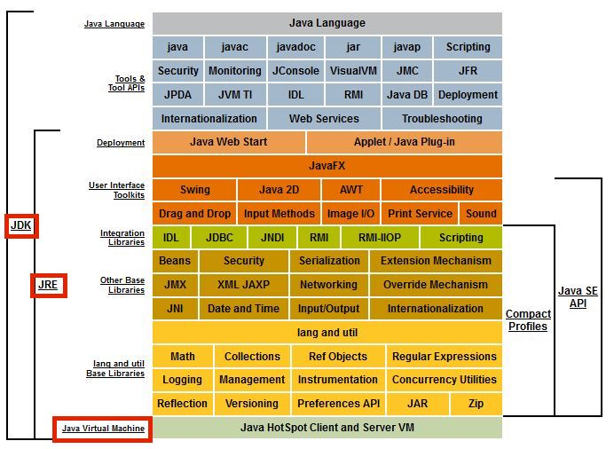

# 1장. 자바 기술 시스템 소개

### 1-1. 들어가며

- 자바
    - 프로그래밍 언어 뿐 아니라 여러 소프트웨어와 명세로 구성된 기술 시스템을 통칭함.
    - 한번 실행하면 어디서든 실행된다는 이상을 실현
    - 안전한 메모리 관리 시스템 → 메모리 누수, 엉뚱한 메모리를 포인트 하는 문제를 피할 수 있음
    - 런타임에 핫코드 감지, 컴파일, 최적화하여 java application이 최상의 성능을 내도록 도와줌
    - 표준 api 풍부, 다양한 서드파티 라이브러리
    - → 소프트웨어 개발 생산성 향상

### 1-2. 자바 기술 시스템



- 다음을 포함
    - 자바 프로그래밍 언어
    - 자바 가상 머신 구현
    - 클래스 파일 포멧
    - 자바 클래스 라이브러리 API(표준 API)
    - 서드파티 클래스 라이브러리
- JDK
    - java development kit, 자바 프로그램 개발에 필요한 최소한의 환경
    - 자바 기술 시스템 전체 세대를 지칭할 때도 자주 쓰임
- JRE
    - java runtime environment, *JRE*는 컴퓨터의 운영체제 소프트웨어 상에서 실행되고 *클래스 라이브러리* 및 특정 [Java](https://www.ibm.com/kr-ko/topics/java) 프로그램이 실행해야 하는 기타 리소스를 제공하는 소프트웨어 계층
    - java se api + jvm + 배포 기술까지 묶어서 jre라고 함

### 1-3. 자바의 과거와 현재

- https://stackoverflow.com/questions/13901292/timeline-creation-library-for-java
- 1991년 5월 23일 오크 → 자바로 변경하며 탄생
- 오픈 소스의 세계
    - 2006년 11월 13일, 썬은 자바를 오픈소스로 전환할 계획을 발표
- 오라클의 품으로: 2009년 4월 20일 썬 인수
    - 상업적인 방식으로 전환
        - 원래 jdk 7에서 내기로 했던 람다 등의 기능을 8로 미루고 출시
    - jdk 7부터 맥도 지원
- 모던 자바의 시작
    - 2024년 3월 18일 jdk 8 출시
        - 람다 지원, 핫스팟에서 펄머넌트 gen 완전 제거 등

### 1-4. JVM

- 가상 머신의 조상 썬 클래식 VM, 이그젝트 VM
    - 썬 클래식 VM → 최초 상용 JVM
    - 이그젝트 VM → 정확한 메모리 관리
- 핫스팟 VM
    - openJDK 기본 가상 머신이자 가장 널리 사용되는 가상 머신
    - 썬이 1997년 롱뷰 테크놀로지를 인수하여 스트롱토크 가상머신을 사용하여 만듬
- 임베디드 VM
    - mobile vm
- BEA JRockit, IBM J9VM
    - hotspotVM과 함께 세계 3대 VM
- BEA 리퀴드 VM, 어줄 VM
    - 특정 하드웨어에서만 동작하는 하드웨어와의 통합된 VM.
    - 운영 체계가 필요 없다
- 아파치 하모니, 안드로이드 아트VM
    - 아파치가 자바 기술 시스템과의 호환성을 확인할 수 있는 TCK 호환성 테스트를 위해 썬 제단에 TCK 라이센스를 제공해달라고 요청했으나 차일피일 미루어 아파치가 JCP에서 탈퇴하는 사건이 있었음.
    - 상용에는 많이 못쓰였으나 후에 안드로이드 개발에 크게 기여
- 마이크로소프트 JVM
    - 한번 작성하면 어디서든 실행된다는 자바의 구호에 맞지 않게, 마소가 개발한 jdk는 ie3만의 jvm에서만 동작. 소송에서 패소..
- 그 외
    - KVM
        - 성능이 낮음. ios, 안드로이드 등이 등장하기 전까지 널리 쓰였던 모바일 플랫폼,
    - JCVM
        - 자바 애플릿을 인터프리터 방식으로 실행.
        - 심카드, 스마트 카드 등에 들어갈 정도로 간소화 됨
    - 스쿽 VM
        - 휴대용 와이파이 기기인 썬 스팟, 자바 카드에 쓰임. 임베디드 가상 머신.
    - 자바 인 자바
        - 메타 순환 가상머신(자바 언어 자체를 자바 언어로 구현)
        - JIT 컴파일러가 없어 인터프리터로만 코드를 실행
    - 맥신 VM
        - 메타 순환 가상 머신
        - JIT 과 GC를 가지고 있어 자바 인 자바보다 효율이 좋았음.
    - 자이크스 RVM
        - 역시 메타순환 가상 머신
    - IKVM.NET
        - 마소 닷넷 기반으로 구현된 자바 가상 머신.
- vm check

    ```bash
    java -version
    
    # hotspot
    openjdk version "21" 2023-09-19
    OpenJDK Runtime Environment (build 21+35-2345)
    OpenJDK 64-Bit Server VM (build 21+35-2345, mixed mode, sharing)
    
    # eclipse openJ9
    openjdk version "21" 2023-09-19
    Eclipse OpenJ9 VM (build openj9-0.37.0, JRE 21 Linux amd64-64-Bit Compressed References 20230919_000000 (JIT enabled, AOT enabled)
    OpenJDK 64-Bit Server VM Eclipse OpenJ9 (build openj9-0.37.0, JRE 21 Linux amd64-64-Bit Compressed References 20230919_000000)
    
    # GraalVM
    openjdk version "21" 2023-09-19
    OpenJDK Runtime Environment GraalVM CE 21.3.0 (build 21+35-2345)
    OpenJDK 64-Bit Server VM GraalVM CE 21.3.0 (build 21+35-2345, mixed mode, sharing)
    
    ```


### 1-5. 자바 기술의 미래

- 언어 독립.
- Graal VM
    - 기본적으로 각종 언어 소스코드 (자바스크립트)나 컴파일된 중간 형식 (LLVM 비트코드) 를 인터프리터를 통해 Graal VM이 이해할 수 있는 중간 표현 (IR)로 변환하는 식으로 작동.
    - 진정한 의미에서 물리 머신에 대응하는 고수준 가상 언어 머신
    - 입력된 중간 표현을 자동으로 최적화하고 런타임에 JIT 컴파일까지 해주기 때문에 때로는 네이티브 컴파일러들 보다 실행 성능이 나을 수 있음.
        - V8 기본의 NodeJS보다 빠르고 루비, R보다 빠르다..
    - Java VM으로 활용될 수 있음.
    - 그림 1-5 openjdk17과 그랄 vm 성능 비교
- 차세대 JIT 컴파일러
    - 핫스팟 VM은 기본적으로 JIT 컴파일러를 두 개 내장, 여기에 인터프리터까지 총 3개의 실행 매커니즘이 협력하여 실행 서브 시스템을 구성
        - C1 컴파일러 - 컴파일 속도가 빠른 대신 최적화를 적게 하는 클라이언트 컴파일러
        - C2 컴파일러 - 컴파일 속도는 느리지만 더 많은 최적화를 적용하는 서버 컴파일러
        - JDK10부터 하나가 Graal compiler가 추가됨. → C2 컴파일러를 대체할 목적으로 핫스팟에 도입.
            - Graal compiler는 java로 작성되었고
            - C2의 대부분을 앞지른다. (더 복잡한 최적화도 수행함)
- 네이티브를 향한 발걸음
    - 애플리케이션 아키텍처의 중심이 거대한 모놀리식에서 작은 마이크로 서비스 아키텍쳐로 변화하고 있다
    - 마이크로 서비스 아키텍쳐에서는 분할된 서비스 각각이 더 이상 수십에서 수백 GB 메모리를 쓸 일이 없다
    - but, 자바는 구동 시간이 길고 최상의 성능을 위해 예열이 필요하다. → MSA가 요구하는 특성과는 반대
    - 최근 JDK는 application class data sharing, AppCDS와 no-op GC인 엡실론 등의 기술이 포함되었다
        - AppCDS
            - 로딩한 클래스 정보를 캐시해 두어 다음 구동 시간을 줄임
        - 엡실론은 메모리를 할당만 해주고 회수는 하지 않음. 간단한 작업을 빠르게 처리 후 즉시 종료하는 애플리케이션에 매우 적합
    - AOT(ahead of time) compile
        - just-in-time과 상대적인 개념
        - 컴파일을 미리 해두면 예열 과정을 건너뛰어 처음부터 네이티브 코드를 실행할 수 있다는 장점.
        - but, 한 번 작성하면 어디서든 실행된다는 java의 약속에 위배
            - 다시 말해 하드웨어와 운영체제별로 따로 컴파일 해 배포해야 한다는 의미
    - 서브스트레이트 VM substrateVM
        - Graal VM의 한 요소
        - 사전 컴파일된 네이티브 코드를 핫스팟 VM없이 실행하는 기술
        - 독자적 예외처리, 스레드 관리, 메모리 관리 Java native interface(JNI) 메커니즘 등을 갖춘 극히 작은 런타임 환경
        - 메모리 사용량도 크게 줄임 → 핫스팟VM에 비해 최대 50배 빨라지고 메모리는 최대 5배까지 줄었음
        - 그림 1-6, 1-7, 1-8 참고
        - 어디서든 더 빠르게 실행한다는 비전을 실현하기 위한 마지막 퍼즐 조각 → Graal VM이 무거운 런타임이라는 부담을 떨치고 여러 언어를 지원할 수 있게 해줌
- 언어 문법의 지속적인 개선
    - 추론 타입 var 도입
    - 람다식을 매게 변수로 사용할 수 있도록 지역 변수 구문 개선
    - 레코드 클래스
    - sealed class
    - switch 문 표현식의 패턴 매칭 능력개선,
    - _ 를 이용한 무명 변수 작성 지원
    -
- https://www.ibm.com/docs/ko/sdk-java-technology/8?topic=techniques-debugging-gdb