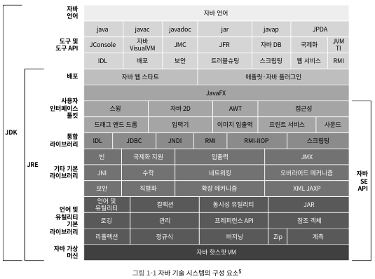
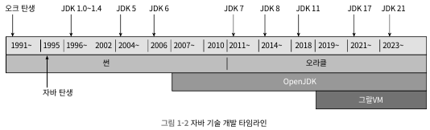

# 1. 자바와 친해지기
## 1.1 들어가며
- 자바는 임베디드 시스템, 모바일 기기, 기업용 서버, 메인 프레임에 이르기 까지 아주 널리 쓰임
- 대표적인 특징
  - 하드웨어 플랫폼이라는 족쇄를 제거 -> 한번 작성하면 어디서든 실행 가능
  - 상당히 안전한 메모리 관리 시스템을 갖춤 -> 메모리 누수 문제와 엉뚱한 메모리를 가리키는 문제 제거
  - 런타임에 핫 코드를 감지, 컴파일 하고 최적화 -> 최상의 성능 보장
  - 표준 API 자체도 풍부, 수많은 기업과 오픈 소스 커뮤니티에서 제공하는 다양한 기능의 서드 파티 라이브러리 존재
## 1.2 자바 기술 시스템
- 자바 기술 시스템 요소
  - 자바 프로그래밍 언어
  - 자바 가상 머신 구형
  - 클래스 파일 포맷
  - 자바 클래스 라이브러리 API
  - 다른 기업과 오픈 소스 커뮤니티에서 제공하는 서드 파티 클래스 라이브러리
  - JDK: 자바 프로그래밍, 가상 머신, 클래스 라이브러리
  - JRE: 자바 SE API와 자바 가상 머신, 배포기술 

- 자바 기술 시스템을 다음 네 가지 주요 제품군으로 구분
  - 자바 카드: 스마트 카드와 같은 소형 기기에서 실행되는 자바 플랫폼
  - 자바 ME: 휴대 전화, PDA 같은 모바일 기기에서 사용되는 자바프로그램용 플랫폼(안드로이드용 애플리케이션과는 관련 無)
  - 자바 SE: 데스크톱 애플리케이션용 자바 플랫폼
  - 자바 EE: 전사적 자원 관리(ERP), 고객 관계 관리(CRM) 애플케이션 등 다중 계층 구조로 이루어진 기업 규모 애플리케이션용 자바 플랫폼
## 1.3 자바의 과거와 현재

- 자바와 관련하여 수많은 제품, 기술, 표준이 나타나고 사라짐
- 오라클의 썬 인수는 자바 개발 역사에서 분명한 분기점임
## 1.4 자바 가상 머신 제품군
- 썬 클래식 VM 및 이그잭트 VM -> 핫스팟 VM
- 다양한 JVM이 여러 회사를 통해 개발됨(Apache, IBM, MS 등)
- 연구 목적이나 특정 기능 또는 아이디어를 검증해 볼 목적으로 만들어 진 가상 머신도 존재
## 1.5 자바 기술의 미래
- 오라클 연구소에서는 미래 지향적인 프로잭트가 진행 중
  - 그랄VM, 바할라, 앰버, 파나마 등
- 그랄VM: hotspot VM과 Substrate VM이 둘다 포함
  - hotspot VM으로 표준 JVM 가동
  - Substrate VM으로 네이티브 이미지 가동