# 2. 자바 메모리 영역과 메모리 오버플로
## 2.1 들어가며
- 가장 머신이 제공하는 자동 메모리 관리 메카니즘으로 메모리 누수나 오버플로 문제를 거의 겪지 않음
  - 메모리 관리 방식을 이해하지 못하면 문제 발생 시, 해결하기가 어려움
## 2.2 런타임 데이터 영역
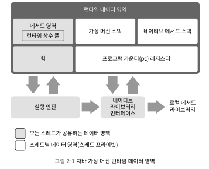 
- 필요한 메모리를 몇 개의 데이터 영역으로 나눠 관리
  - 각각 목적과 생성/삭제 시점이 존재 -> 가상 머신 프로세스의 시작과 동시에 만들어지기도 하며, 사용자 스레드 시 생성되기도 함
### 2.2.1 프로그램 카운터
- 현재 실행 중인 스레드의 '바이트코드 줄 번호 표시기'
- 프로그램의 제어 흐름, 분기, 순환, 점프 등을 표현
- 스레드 전환 후 이전에 실행하다 멈춘 지점을 표시
- 스레드 프라이빗함
- <<자바 가상 머신 명세>>에서 OutOfMemoryError 조건이 명시 되지 않은 유일한 영역
### 2.2.2 자바 가상 머신 스택
- 스레드 프라이빗하며, 연결된 스레드와 운명(생성/삭제)을 같이함
- 가상 머신은 스택 프레임을 가상 머신 스택에 푸쉬하고, 끝나면 팝하는 일을 반복
  - 자바 머신은 각 메서드 호출 시 스택 프레임을 만들어 지역 변수 테이블, 피 연산자 스택, 동적 링크, 메서드 반환 값 등의 정보를 저장
- <<자바 가상 머신 명세>>에서 두 가지 오류가 발생할 수 있도록 정의
  - StackOverflowError: 스레드가 요청한 스택의 깊이가 가상 머신이 허용한 깊이보다 클 때
  - OutOfMemoryError: 스택 용량을 동적으로 확장할 수 있는 머신에서 여유 메모리가 충분하지 않을 때
### 2.2.3 네이티브 메서드 스택
- 네이티브 메서드를 실행할 때 사용
  - 가상 머신 스택은 자바 메서드(바이트 코드)를 실행할 때 사용
- <<자바 가상 머신 명세>> 메서드를 어떤 구조로 어떻게 표현하는 지와 관련하여 아무 명세하지 않음
  - 네이티브 메서드 스택과 가상 머신 스택을 합쳐놓은 곳도 존재(핫스팟 가상 머신 포함)
- 자바 가상 머신 스택과 마찬가지로 두 가지 오류 발생(StackOverflowError,OutOfMemoryError)
### 2.2.4 자바 힙
- 애플리케이션이 사용할 수 있는 가장 큰 메모리이며, 모든 스레드가 공유, 가상 머신이 구동될 때 만들어짐
- 객체 인스턴스를 저장하고, 거의 모든 객체 인스턴스가 해당 영역의 할당
- 가비지 컬렉터가 관리하는 메모리 영역이기 때문에 GC 힙이라고도 불림
  - 현대적 가비지 컬렉터는 세대별 컬렉션 이론을 기초로 설계됨
  - 오늘날 가비지 컬렉터 기술은 세대별 컬렉션 이론을 따르지 않음
- <<자바 가상 머신 명세>>에서 자바 힙 절에는 세부 영역 구분에 관한 이야기는 없음
- <<자바 가상 머신 명세>>에서 자바 힙은 물리적으로 떨어진 메모리에 위치해도 되지만, 논리적으로는 연속되어야 함
- 자바 힙은 크기를 고정할 수도, 확장할 수도 있게 구현할 수 있음
  - 새로운 인스턴스에 할당해 줄 힙 공간이 부족하면 OutOfMemoryError 발생
### 2.2.5 메서드 영역
- 자바 힙처럼 모든 스레드가 공유
- 가상 머신이 읽어 들인 타입 정보, 상수, 정적 변수, 그리고 JIT 컴파일러가 컴파일한 코드 캐시 등 저장
- <<자바 가상 머신 명세>>에서는 메서드 영역도 힙으로 불리지만, 구분을 위해 논힙(non-heap)이라 부르기도 함
- JDK 7까지 메서드 영역을 영구 세대라 부르며 두 개념을 혼동함
  - 메서드 영역이 가비지 컬렉터의 수집 범위에 들어왔기 때문
- <<자바 가상 머신 명세>>에서 특정 구현방식을 고집하지 않음 -> 가상 머신 구현하는 쪽에서 결정
- JDK8에 와서는 영구 세대가 없어지고, 네이티브 메모리에 메타스페이스를 구현함 -> 영구 세대 데이터가 메타스페이스로 옮겨감
- <<자바 가상 머신 명세>> 메서드 영역의 제한을 두지 않음 > 크기 고정도 확장도 가능
- 해당 영역에서 GC가 실행될 일은 거의 없음
- <<자바 가상 머신 명세>>에 따르면 메서드 영역이 꽉차서 필요한 만큼 메모리 할당이 안되면 OutOfMemoryError 발생
### 2.2.6 런타임 상수 풀
- 메서드 영역의 일부
- 상수 풀 테이블에는 클래스 버전, 필드, 메서드, 인터페이스 등 클래스 파일에 포함된 설명 정보를 더해, 다양한 리터럴과 심벌 참조가 저장
  - 가상 머신이 클래스를 로드할 때 이러한 정보를 상수 풀에 저장
- <<자바 가상 머신 명세>>에서 요구사항을 상세하게 정의하지 않음 -> 가상 머신 제공자 스타일로 구현
- 클래스 파일의 상수 풀과 비교해 동적이라는 특징 존재
- 상수 풀의 공간이 부족하면 OutOfMemoryError 발생
### 2.2.7 다이렉트 메모리
- 가상 머신 런타임에 속하지 않으며, <<자바 가상 머신 명세>> 미정의지만, OutOfMemoryError의 원인이 될 수 있어서 언급함
- NIO는 힙이 아닌 메모리를 직접 할당할 수 있는 네이티브 함수 라이브러리 이용(DirectByteBuffer 객체를 통해 작업)
- 자바 힙 크기의 제약과는 무관하지만, 메모리를 사용하고 있다는 것
  - 모든 메모리 영역의 합이 물리 메모리 한계를 넘어서면 동적 확장 시도 때 OutOfMemoryError 발생
## 2.3 핫스팟 가상 머신
- 메모리 모델 알아 보기
### 2.3.1 객체 생성
- 객체 생성
  - new 명령어 만남 -> 상수 풀 안의 클래스를 가리키는 심벌 참조 확인(없으면 로딩)
  - 로딩이 완료되면 메모리 할당(클래스를 로딩하면 필요한 메모리 크기 확인 가능)
  - 포인터 밀치기를 통해 메모리 할당? -> 자바 힙은 규칙적이지 않음 
  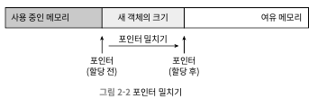 
  - 대신 가용 메모리 블록들 목록을 따로 관리하여 충분한 공간을 찾아 갱신(여유 목록)
  - 자바 힙이 규칙적이냐 아니냐에 따라 방법이 다름
    - 규칙적이냐는 가비지 컬렉터가 컴팩트(모으기)를 할 수 있느냐에 따라 결정됨\
      - 시리얼 파뉴 처럼 모으기가 가능한 컬렉터를 사용하면 포인터 밀치기 방식 사용, 아니면 여유 목록 방식 사용
- 가용 공간 나누는 방법
  - 메모리 할당 동기화 방법
    - 실제로 비교 및 교환(CAS), 실패 시 재시도 방식 활용
  - 스레드 마다 다른 메모리 공간을 할당 
    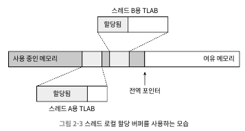 
- 각 객체에 필요한 설정
  - 클래스의 인스턴스, 메타 정보 찾는 방법, 해시 코드 등은 각 객체의 헤더에 저장됨
- 3가지 과정이 끝나면 새로운 객체는 만들어 졌지만, 생성자 미실행 및 모든 필드는 기본값인 상태
  - new 명령어에 이어 <init>() 메서드까지 실행되어야 진짜 객체 완성
### 2.3.2 객체의 메모리 레이아웃
- 가상 머신은 객체를 세 부분으로 나눠 힙에 저장 
  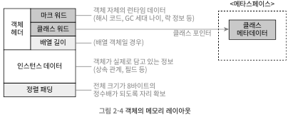 
  - 객체 헤더
    - 마크워드(런타임 데이터)
      - 해시 코드, GC 세대 나이, 락 상태 플러그 등
      - 32비트 가상머신에서는 32비트, 64비트에서는 64비트 차지 
    - 클래스 워드
      - 객체의 클래스 관련 메타데이터를 가리키는 클래스 포인터가 저장
    - 배열 길이
      - 자바 배열의 경우 배열 길이 저장
  - 인스턴스 데이터
    - 객체가 실제로 담고 있는 정보
      - 다양한 타입의 필드 내용, 부모 클래스 유무 등
  - 정렬 패딩
    - 특별한 의미 없이 자리 확보 역할
      - 객체 시작 주소는 8바이트 정수배여야함 -> 인스턴스가 조건 충족 못하면 패딩에서 채움
### 2.3.3 객체에 접근하기
- 참조 데이터를 통해 객체들에 접근
  - <<자바 가상 머신 명세>>에서 '객체를 가리키는 참조'라고 정했을 뿐, 구체적인 방법은 미제시
- 주로 2가지 방식을 씀
  - 핸들 
    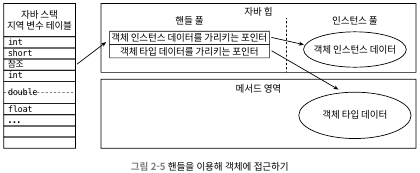 
    - 자바 힙에 핸들 저장용 풀이 별도로 존재
    - 안정적인 핸들의 주소가 저장됨 -> 가비지 컬렉션 과정에서 객체의 위치가 비뀌는 상황에서도 참조 자체는 손댈 필요 없음
  - 다이렉트 포인터 
    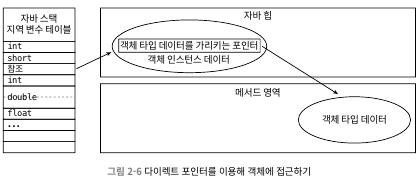 
    - 스택의 참조에는 객체의 실제 주소가 바로 저장
    - 핸들의 경유하는 오버헤드가 없어 접근 속도가 빠름
- 핫스팟은 다이렉트 포인터 방식을 이용
## 2.4 실전: OutOfMemoryError 예외
- 해당 절은 두가지 실용적인 목적
  - 각 런타임 영역에 저장되는 내용을 검증
  - 실제 메모리 오버플로가 일어나는 과정을 검증
### 2.4.1 자바 힙 오버플로
- 객체 인스턴스를 저장하는 공간
- 객체를 계속 생성하고, 접근할 경로가 살아 있으면 언젠가는 힙의 최대 용량을 넘어설 것 -> 메모리 오버플로
  - -Xms: 최소크기 설정
  - -Xmx: 최대 크기 설정
  - -XX:+HeapDumpOnOutOfMemoryError: 예외 발생 시점에서 힙 메모리 스냅숏을 파일로 저장(dump)

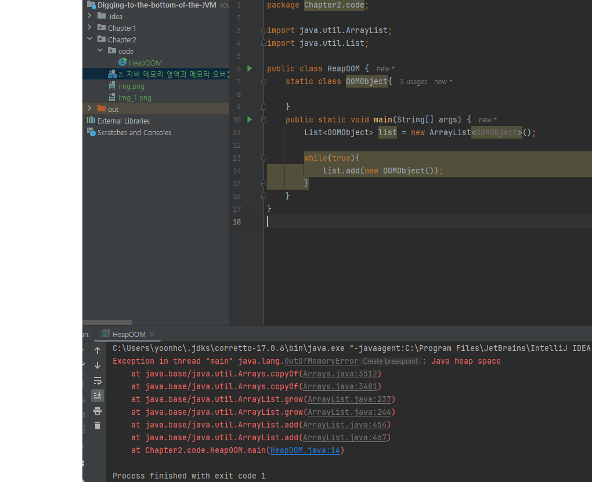 
- 자바 애플리케이션에서 OutOfMemoryError이 제일 많이 발생하는 영역이며, 'java.lang.OutOfMemoryError: Java heap space' 로 출력됨
- 문제를 해결하는 일반적인 방법은 메모리 이미지 분석 도구로 힙 덤프 스냅숏을 분석해보는 것
  - 오버플루를 일으킨 객체가 메모리 누수인지, 오버플루인지 확인 필요 -> 필요 없는 객체가 원인이라면 메모리 누수임
  - 메모리 누수라면? 
    - 도구를 이용해 누수된 객체로부터 GC루트까지의 참조 사실을 확인 -> 누수 부분 확인 및 수정
  - 메모리 누수가 아니면?
    - -Xms와 -Xmx을 통해 컴퓨터 가용 메모리를 비교하여 더 많이 할당
    - 코드에서 수명 주기가 너무 길거나 상태를 너무 오래 유지하는 객체 없는지 확인

### 2.4.2 가상 머신 스택과 네이티브 스택 오버플로
- 핫스팟 가상 머신은 가상 머신 스택과 네이티브 메서드 스택을 구분하지 않음
  - 네이티브 메서드 스택의 크기를 설정하는 -Xoss 매개 변수를 설정하더라도 아무런 효과가 없음
  - 스택크기는 오직 -Xss 매개변수로만 변경 가능
- <<자바 가상 머신 명세>>에 따르면 가상 머신 스택과 네이티브 메서드 스택에서는 다음 경우에 예외 발생
  - 스레드가 요구하는 스택 깊이가 가상 머신이 허용하는 최대 깊이보다 크면 StackOverflowError를 던짐
  - 가상 머신이 스택 메모리를 동적으로 확장하는 기능을 지원하나, 가용 메모리가 부족해 스택을 더 확장할 수 없다면 OutOfMemoryError을 던짐
- 핫스팟은 확장을 지원하지 않음 -> 스택 용량 부족하여 새로운 스택 프레임을 담을 수 없을때만 StackOverflowError를 발생
- 다음 2가지 상황 테스트
  - -Xss 매개 변수로 스택 용량 줄이고, StackOverflowError 발생 
    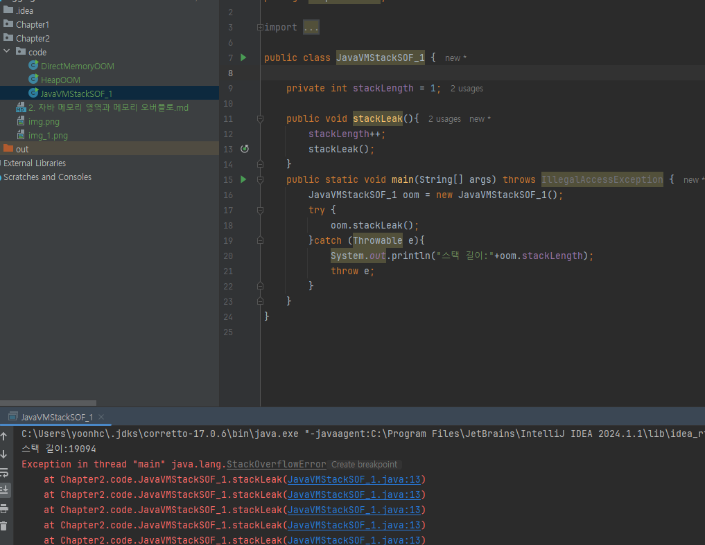 
  - 지역 변수를 많이 선언해서 메서드 프레임의 지연 변수 테이블 크기를 키움 -> StackOverflowError 발생 
    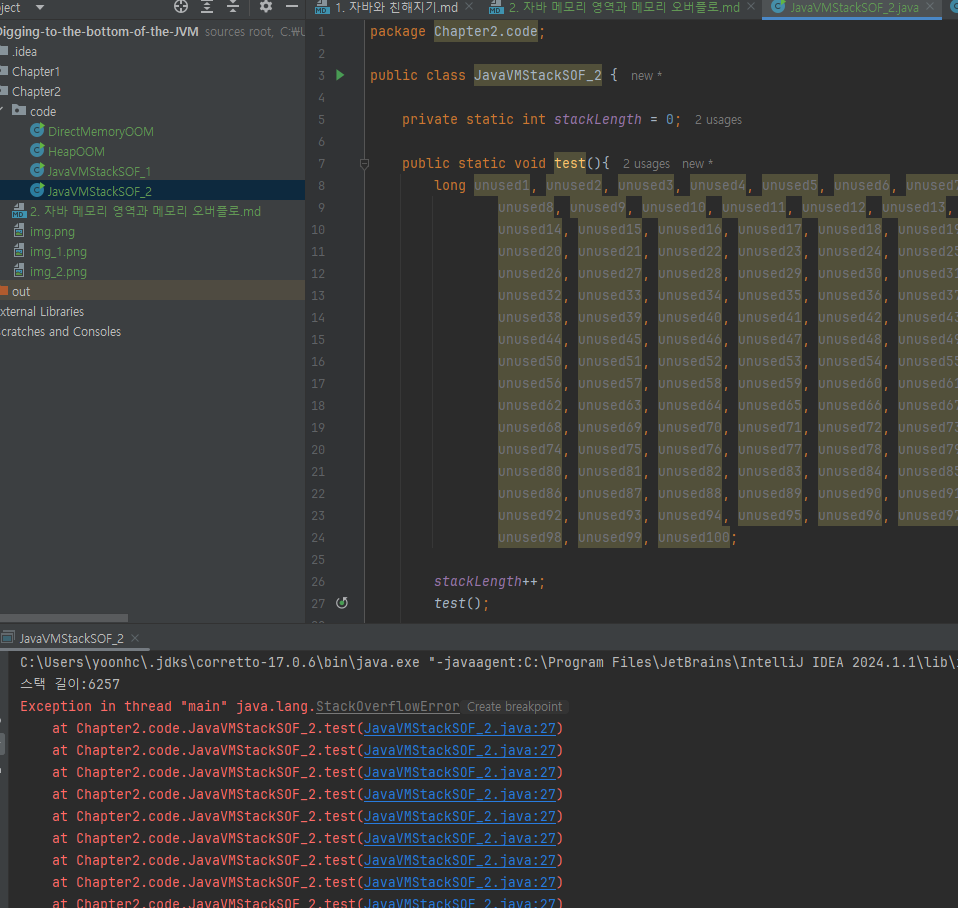 
- OutOfMemoryError 발생 코드 
  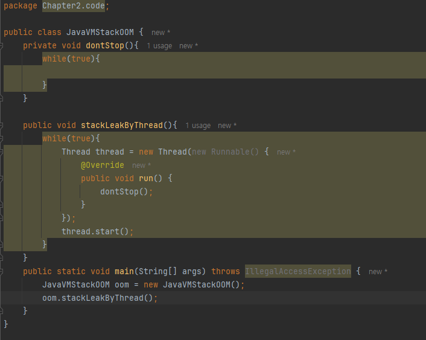 
- 너무 많은 스레드를 만들어 메모리 오버플로가 일어나는 경우라면, 프로그램에서 사용하는 스레드 수를 줄일 수 없고 64비트 가상 머신도 사용할 수 없는 상황이라면?
  - 최대 힙 크기와 스택 용량을 줄이는 것
### 2.4.3 메서드 영역과 런타임 상수 풀 오버플로
- 런타임 상수 풀은 메서드 영역에 속하므로 오버 플로 테스트를 함께 수행 가능
- JDK7부터 영구 세대를 점진적으로 없애고 JDK8에 와서 메타스페이스로 완전히 대체
- 영구세대 또는 메타스페이스에 에러가 발생하는지 확인하는 코드 
  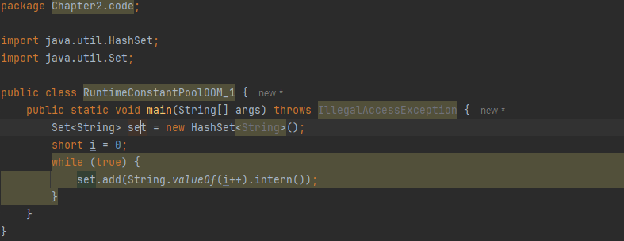 
  - JDK6이면 아래와 같이 에러남(영구세대) -> 런타임 상수 풀이 메서드 영역(영구세대)이라는 것 확인 
    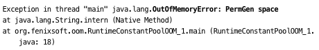 
  - JDK7이면 아래처럼 에러남 -> 문자열 상수 풀이 힙 메모리로 옮겨 졌다는거 확인 가능 
    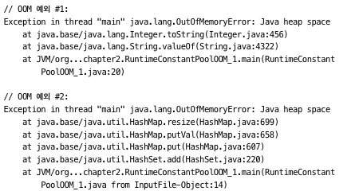 

### 2.4.4 네이티브 다이렉트 메모리 오버플로
- -XX:MaxDirectMemorySize 로 설정, 따로 설정하지 않으면 -Xms로 설정한 자바 힙의 최댓값과 같음
- 아래 코드는 DirectByteBuffer 클래스를 건너뛰고 리플렉션을 이용해 Unsafe 인스턴스를 직접 얻어 메모리 할당 
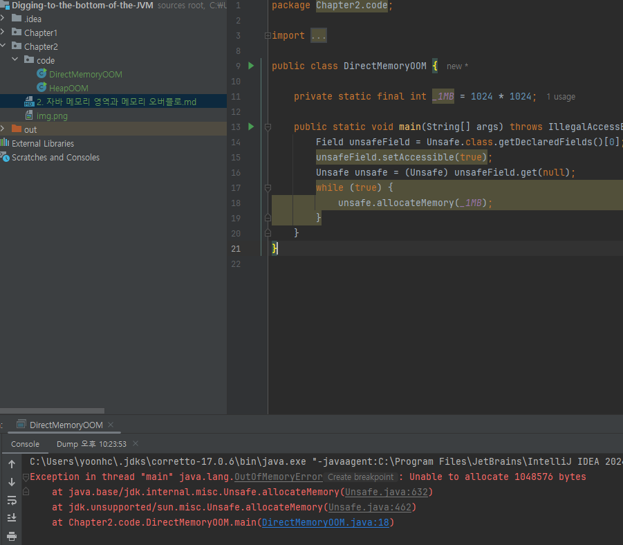 
- 다이렉트 메모리에서 발생한 메모리 오버플로는 힙 덤프 파일에서는 이상한 점을 찾을 수 없음
  - 덤프 파일이 매우 작고 DirectMemory를 직접 또는 간접으로 사용했다면, 다이렉트 메모리에서 원인을 찾는데 집중 필요