# 3. 가바지 컬렉터와 메모리 할당 전략
## 3.1 들어가며
- 오늘날 동적 메모리 할당과 가바지 컬력션 기술은 상당히 성숙됨 -> 모든 것이 자동화
- 그럼 위에 내용을 이해를 해야 하는 이유는? 
  - 다양한 메모리 오버플루와 누수 문제를 해결해야 하는 상황이나, 더 높은 동시성을 달성하는데 가비지 컬렉션이 방해가 되는 상황을 조율하기 위해
- 자바 힙과 메서드 영역이 '메모리 할당과 회수'에 속함
## 3.2 대상은 죽었는가?
- 청소를 하려면 자바 힙에 어떤 객체가 살았고 죽었는지 판단해야함
### 3.2.1 참조 카운팅 알고리즘
- 많은 교제에서 객체가 살아 있음을 판별하는 알고리즘
  - ① 객체를 가리키는 참조 카운터 추가, 참조가 늘어날 수록 1씩 증가
  - ② 참조하는 곳이 하나 사라질 때마다 카운터 값을 1씩 감소
  - ③ 카운터 값이 0이 된 객체는 더는 사용 불가능
- 자바 가상머신에서는 참조 카운팅을 사용하지 않음
  - 고려해야할 특이 상황이 적지 않고, 모든 상황에 대해 계산해야 할 게 많음
- 참조 카운팅은 순환 참조 문제를 가짐
  - 서로 참조하면 참조 숫자가 0이 되지 않음
### 3.2.2 도달 가능 분석 알고리즘
- 오늘날 주류 프로그래밍 언어들은 도달 가능 분석 알고리즘을 이용 
  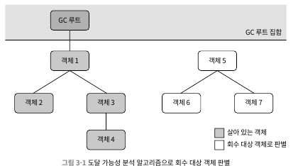 
  - GC 루트라고 하는 루트 객체를 시작 노드 집합으로 사용
  - 어떤 객체가 GC 루트 사이를 이어 주는 참조 체인이 없으면 회수 대상이 됨
- 자바에서 GC루트로 이용할 수 있는 객체
  - 가상 머신 스택에서 참조하는 객체
  - 메서드 영역에서 클래스가 정적 필드로 참조하는 객체
  - 메서드 영역에서 상수로 참조되는 객체
  - 네이티브 메서드 스택에서 JNI가 참조하는 객체
  - 자바 가상 머신 내부에서 쓰이는 참조: 기본 데이터 타입에 해당 하는 Class 객체, 일부 상주 예외, 시스템 클래스 로더
  - 동기화 락(synchronized 키워드)으로 잠겨 있는 모든 객체
  - 자바 가상 머신 내부 상황을 반영하는 JMXBean
- 최신 가바지 컬렉터들은 예외 없이 부분 컬렉션을 지원 및 GC 루트가 너무 많아 지지 않도록 다양한 최적화 적용
### 3.2.3 다시 참조 이야기로
- 객체의 생사 판단과 '참조'는 떼어서 생각할 수 없음
  - 참조 카운팅 알고리즘이나 GC 루트나 모두 활용
- JDK 1.2부터 참조 개념을 4가지로 구분
  - 강한 참조(strong)
    - 가장 전통적인 정의의 참조
    - Object obj = new Object()처럼 프로그램 코드에서 참조 할당
    - 강한 참조 관계가 남아 있는 객체는 절대 회수되지 않음
  - 부드러운 참조(soft)
    - 유용하지만 필수는 아닌 객체
    - 부드러운 참조만 남은 객체면 메모리가 오버플루가 나기 직전 두 번째 회수를 위한 회수 목록에 추가
    - 두번 째 회수 후에도 메모리가 부족하면 메모리 오버플루 발생
  - 약한 참조(weak)
    - 부드러운 참조와 비슷하지만 연결 강도가 더 약함
    - 약한 참조뿐인 객체는 다음번 가비지 컬렉션까지만 살아 있음
    - 메모리가 넉넉하더라도 약하게 참조된 객체는 모두 회수
  - 유령 참조(phantom)
    - 참조 중에 가장 약함
    - 객체 수명에 아무런 영향을 주지 않으며, 참조를 통해 객체 인스턴스를 가져오는 것마저 불가능
    - 대상 객체가 회수될 때 알림을 받기 위한 목적만 존재
### 3.2.4 살았나 죽었나?
- 도달 가능성 분석 알고리즘이 '도달 불가능' 객체라고 판단해도 반드시 죽어야하는 건 아님
  - '유예' 단계 존재하며, 확실한 사망 선고를 내리려면 두 번의 표시 과정 필요
  - GC 루트와 연결된 참조 체인을 찾지 못한 객체에는 `첫번 째 표시`가 이루어지며 필터링(finalize 진행 여부)이 진행됨
  - finalize를 실행해야 하는 객체로 판명되면 F-큐라는 대기열에 추가됨
    - 가상 머신에서 우선 순위가 낮은 종료자 스레드를 생성해 F-큐에 들어 있는 개체들의 finalize 메서드를 실행
      - 참고로 가상 머신은 이 메서드를 시작만 시킬 뿐 끝날 때까지 기다려주지 않음
  - finalize 메서드는 죽음을 직면한 객체가 부활할 수 있는 마지막 기회 -> 참조 체인의 아무 객체나 다시 연결
  - 이때 빠져 나오지 못하면 진짜로 회수 
  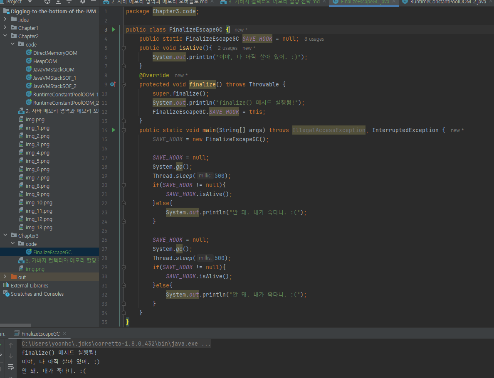 
    - 어떤 객체든 finalize 함수는 한번만 실행됨 -> 주간 2번째 GC때 finalize 실행 안됨
    - 독자들은 위와 같은 예시로 객체를 구원하면 안됨 -> 가능한 사용하지 말기
    - 리소스 정리에 유용하다고 소개하는 책도 있지만, finalize보단 try-finally 등의 다른 방법 활용하지
### 3.2.5 메서드 영역 회수하기
- <<자바 가상 머신 명세>>에 따르면 가비지 컬렉터가 메서드 영역을 반드시 청소해야 하는 건 아님
  - JDK 11에 처음 탑재된 ZGC 컬렉터는 클래스 언로딩을 미지원
- 대체로 메서드 영역 가비지 컬렉터는 대체로 `비용 효율`이 좋지 않음 -> 회수 조건이 까다로움
- 메서드 영역의 가비지 컬렉션은 크게 두 가지를 회수함 -> 더 이상 사용하지 않는 `상수`와 `클래스`
  - 다 쓴 '상수'를 회수하는 방법은 자바 힙 객체 회수와 유사
    - 상 수 풀 안의 상수를 참조하는 객체가 전혀 없고, 가상 머신에서 사용하는 코드도 없으면 회수
    - 상수 풀에 있는 다른 클래스, 메서드 등도 비슷한 방법으로 회수
  - 클래스는 상수보다 회수 조건이 더 까다로움
    - 다음 세 가지 조건 만족해야함
      - 클래스 인스턴스가 모두 회수 되었는가 -> 자바 힙에 미 존재
      - 이 크래스를 읽어 들인 클래스 로더가 회수 되었는가
      - 이 클래스에 해당하는 java.lang.class 객체를 아무 곳에서도 참조하지 않고 리플렉션 기능으로 메서드 이용하는 곳도 전혀 없는가
    - 세 가지 조건을 만족해도 회수를 `허용`하지 반드시 회수는 아님
- 리플렉션, 동적 프락시 등 바이트 코드 프레임 워크를 많이 사용 하는 경우나, J클래스 로더를 자주 사용하는 환경에서 타입 언로딩을 지원해야함
  - 메서드 영역 과도한 압박에 시달리는 일을 막을 수 있음
## 3.3 가바지 컬렉션 알고리즘
- 수많은 기법과 가상 머신 또는 플랫폼에 따라 차이를 지님
- 객체 생사 판별 방식 기준으로 알고리즘은 `참조 카운팅 GC`와 `추적 GC`로 나눌 수 있음
  - `직접 가바지 컬렉션`과 `간접 가비지 컬렉션`이라 부르기도 함
  - `참조 카운티 GC`는 이 책에서 다루는 주류 가상 머신에서 사용하지 않음 -> 추적 GC만 다룸
### 3.3.1 세대 단위 컬렉션 이론
- 대부분 채택한 방법이며, 대다수 프로그램에서 관측된 실제 상황들에서 얻은 경험 법칙을 구현한 것
- 두가지 가정이 뿌리를 내림
  - 약한 세대 가설: 대다수 객체는 일찍 죽는다
  - 강산 세대 가설: 가비지 컬렉션 과정에서 살아남은 횟수가 늘어날수록 더 오래 살 가능성이 커짐
- 위의 가정으로 자바 힙을 몇 개의 영역으로 나누고 객체들을 나이에 따라 다른 영역에 할당
  - 영역 안의 객체 대부분이 곧바로 죽을 운명이라면, 한데 몰아 넣고 회수 -> 적은 비용으로 대량의 메모리 확복 가능
- 가바지 컬렉터는 한 번에 하나 또는 몇개 영역만 선택해 회수 -> 마이너 GC, 메이저 GC, 전체 GC
- 각 영역에 담긴 객체들의 생존 특성에 따라 마크-스윕(표시 후 쓸기), 마크-카피(표시 후 복사), 마크-컴팩트(표시 후 모으기) 등 구분해 적용
- 세대 단위 컬렉션 이론은 자바 힙을 최소 두 개의 영역으로 나눔(신세대, 구세대)
  - 신세대는 다수의 객체가 죽고 소수만 구세대로 승격
### 3.3.2 마크-스윕 알고리즘
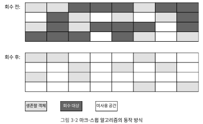 
- 먼저 회수할 객체들에 모두 표시한 다음, 표시된 객체들을 쓸어 담는 식
  - 살릴 객체들에 표시한 다음, 표시되지 않은 객체를 회수하기도 함
- 다른 알고리즘들이 이 알고리즘을 기초로 하여, 단점을 보완하는 식으로 발전함
- 해당 알고리즘의 큰 단점 두가지
  - 실행 효율이 일정하지 않음
    - 힙 내 다량의 객체 대부분이 표시되고 회수되면 작업이 많아짐 -> 효율이 떨어짐
  - 메모리 파편화가 심함
    - GC 후 불연속적으로 메모리 파편이 만들어짐 -> 맞는 메모리 찾기가 어려워 또 다른 GC 유발
### 3.3.3 마크-카피 알고리즘
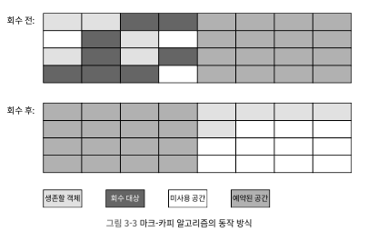 
- 회수 객체가 많아질수록 효율이 떨어지는 마크-스윕 알고리즘을 보완한 알고리즘
- 가용 메모리를 똑같은 크기의 두 블록으로 나눠 활용
  - 한쪽 블록이 꽉차면 다른 블록에 복사하고 기존 블록은 청소
  - 메모리 파편화 방지를 하며, 구현이 쉽고 실행 효율도 좋음
  - 가용 메모리를 절반으로 줄여 낭비가 심함
- 오늘날 사용 가상 머신에서 대부분 해당 알고리즘 활용
  - 신세대 객체중 98%가 첫번 째 GC에서 죽기 때문에 메모리 영역을 1:1로 나누지 않아도 됨
  - 아펠 스타일 컬렉션으로 더욱 진화
    - 신세대를 하나의 큰 공간과 작은 두 개의 공간으로 나눔 -> 에덴 공간 및 작은 공간에서 살아남은 객체들은 또 다른 작은 공간으로 이전
    - 에덴과 생존자 공간 비율은 기본적으로 8:1 -> 전체 메모리 90% 사용, 낭비 공간 10%
    - 살아남는 케이스가 10% 이상이면? 생존자 공간이 모자르면 구세대에게 메모리 할당(핸들 승격), 구세대로 승격하는 것
### 3.3.4 마크-컴팩트 알고리즘
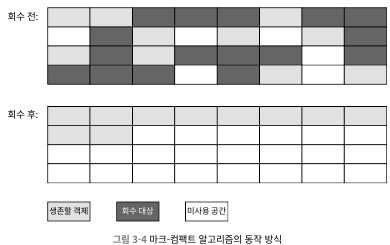 
- 마크-카피 알고리즘은 객체 생존율이 높을수록 복사할 게 많아져 효율이 나빠지며, 공간을 50%나 낭비 -> 구세대에는 적합하지 않음
- 마크-컴팩트는 표시 단계는 마크-스윕과 같지만 컴팩트 단계에서 생존한 모든 객체를 한쪽 끝에 모은 다음, 나머지를 한꺼번에 비움 
- 마크-스윕과의 핵심적인 차이는 메모리 이동이 일어남
  - 사용자 애플리케이션을 모두 멈춘 상태에서 진행해야하는 단점 존재 -> 스탑 더 월드
  - 객체를 전혀 이동시키지 않는다면 힙이 파편화 -> 메모리 할당과 접근 방식을 더 어렵게 만듬
- 각자의 관점에서 단점이 존재
  - 객체를 이동시키면 회수 작업이 복잡, 이동시키지 않으면 할당 작업이 복잡
  - 일시 정지 시간을 기준으로 보면 객체 이동 시키지 않는게 좋음, 하지만 처리량 기준이면 이동시키는게 좋음
    - `처리량`은 사용자 프로그램과 가비지 컬렉터의 효율을 포괄하는 개념
- 핫스팟 가상 머신에서는 처리량에 중점을 둔 패러렐 올드 컬렉터는 마크-컴팩트 알고리즘을 기반으로 하고, 지연 시간에 중점을 둔 CMS 컬렉터는 마크-스윕 알고리즘을 기초함
## 3.4 핫스팟 알고리즘 상세 구현
## 3.5 클래식 가바지 컬렉터
## 3.6 저지연 가비지 컬렉터
- GC를 측정하는 가장 중요한 지표 세가지 -> 처리량, 지연 시간, 메모리 사용량
  - 세가지 지표는 불가능의 삼각 정리를 만듬 -> 셋 다 만족할 수는 없고, 좋은 컬렉터도 최대 2가지만 달성
- 세가지 지표 중 지연 시간의 중요성이 점점 커짐
  - 하드웨어 발전으로 메모리를 더 많이 사용하는건 큰 문제가 되지 않음
  - 하드웨어 성능 향상으로 처리량도 어느정도 커버 가능
  - 지연 시간은 다른 문제
    - 메모리를 늘리면 지연 시간에 악영향 -> 회수할 게 많으면 지연이 오래거림
- 아래 그림은 가비지 컬렉터들에서 일 시 정지되는 단계를 보임(밝은 색: 사용자 스레드 멈춤, 어두은 색: 동시 수행) 
  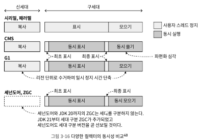 
  - CMS 전 GC는 모든게 `stop the world`
  - CMS와 G1은 증분 업데이트 및 스냅숏으로 동시 수행 시작 -> 힙 메모리 사용 ▲, 표시 객체(처리량) ▲, 일시 정지 기간 늘지 않음
    - 표시 단계 이후 처리를 제대로 해결 못함
      - CMS 일시 정지를 피했지만, 파편화 지속 -> 추후 `stop world` 발생
      - G1은 리전 단위 회수로 일시 정지 시간 단축 -> 여전히 동시 수행 불가
  - ZGC와 셰넌도어는 거의 모든 과정이 동시에 수행 됨 -> 최초 표시와 최종 표시에만 일시 정지(저 지연 컬렉터 이유)
### 3.6.1 셰넌도어
- oracle JDK에는 존재하지 않고, openJDK에 존재 -> redHat에서 시작한 프로젝트이기 때문
- ZGC보다 G1을 더 잘 계승함 -> 힘 레이 아웃 비슷, 여러 단계의 처리 방식에도 공통점 존재
##### 개선 사항
- G1과 유사(리전을 활용한 GC 방식), 하지만 차이점 존재
  - 동시 모으기 지원 -> G1은 여러 스레드를 활용하여 모으기 단계를 병렬로 활용하지만 사용자 스레드와 동시 수행 불가
  - JDK 21까지의 세대 단위 컬렉션을 사용하지 않음 -> 신세대 리전과 구세대 리전을 구별하지 않음
    - 세대 구분이 필요하지 않다는 건 아님 -> 개발에 대한 우선 순위가 낮아 밀림
  - 메모리와 컴퓨팅 자원을 많이 사용하는 기업 집합 대신 `연결 행렬`로 리전 간 참조 관계를 기록 -> 관리비용 ▼, 거짓 공유 문제 발생 확률 ▼ 
    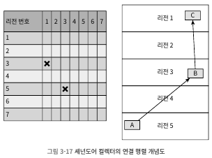 
##### 동작 방식
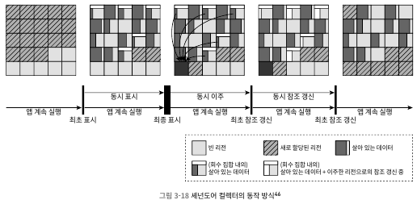 
- 9단계로 나눌 수 있음
  - 최초 표시
    - (G1 처럼) GC 루트에서 직접 참조하는 객체들에 표시
    - `stop the world`지만 일시 정지 시간은 매우 짧으며, GC 루트 수에만 영향을 받음
  - 동시 표시
    - (G1 처럼) 객체 그래프를 타고 힙을 탐색하며, 도달 가능한 모든 객체를 표시
    - 사용자 스레드와 동시 수행 -> 수행 시간은 살아 있는 객체 수와 객체 그래프의 복잡도에 달림
    - 사용자 스레드가 새로운 객체를 생성할 수 있음
  - 최종 표시
    - (G1 처럼) 보류 중인 모든 표시를 완료하고 GC 루트 집합을 다시 스캔
    - 회수 가치가 가장 큰 리전들을 추려 회수 집합을 생성
    - `stop the world`지만 일시 정지 시간은 매우 짧음
  - 동시 청소
    - 살아 있는 객체가 하나도 없는 리전들을 청소
  - 동시 이주
    - 동시 이주는 `셰넌도어를 핫스팟의 다른 컬렉터들과 구분하는 핵심적인 차이`
    - 회수 집합 안에 살아 있는 객체들을 다른 빈 리전으로 복사
    - 사용자 스레드가 멈춰 있으면 문제가 없지만 실행 중이면 문제가 복잡
      - 객체를 이동하는 동안 사용자 스레드가 계속 그 객체를 읽고 쓸수 있다는게 문제
    - 위와 같은 해결을 위해 읽기 장벽과 포워딩 포인터를 이용
    - 실행 시간은 회수 집합의 크기에 달림
  - 최초 참조 갱신
    - 동시 이주 단계에서 객체를 복사한 다음, 힙에서 옛 객체를 가리키는 모든 참조를 복사 후의 새로운 주소로 수정 -> 참조 갱신
    - 동시 이주 단계의 모든 GC 스레드와 사용자 스레드가 이주를 끝마쳤음을 보장
    - 사용자 스레드를 일시 정지 시키지만, 아주 금방 끝남
  - 동시 참조 갱신
    - 참조 갱신을 사용자 스레드와 동시에 수행
    - 수행 시간은 메모리 존재하는 참조의 수에 달림
    - 물리 메모리 주소의 순서대로 참조 타입을 선형 검색하여 이전 값을 새로운 값으로 수정
  - 최종 참조 갱신
    - 힙의 참조를 다 갱신했다면 GC 루트 집합의 참조도 갱신해야함
    - 마지막 일시 정지 단계
    - 정지 시간은 GC루트의 개수에 달림
  - 동시 청소
    - 이주와 참조 갱신이 끝나면 회수 집합의 모든 리전에는 살아 있는 객체가 더 이상 남지 않게 됨
    - 동시 청소를 다시 수행하여 새로운 객체를 할당할 공간 확보
- 이중 가장 중요한 단계는 동시 표시, 동시 이주, 동시 참조 갱신
  - 동시 표시: 회수할 객체를 찾는 방법
  - 동시 이주: 살아 있는 객체를 옮기는 방법
  - 동시 참조 갱신: 생존한 객체들의 참조를 모두 수정 하는 방법
##### 동시 이주의 핵심, 포워딩 포인터
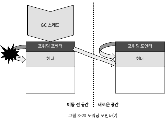 
- 객체 레이아웃 구조 상단에 참조 필드를 추가하고, 동시 이주가 아닌 갱우 참조 필드가 객체 자신을 가르킴 -> 참조 필드를 통해 객체 필드 접근 
  - 장점: 포인터 하나의 값만 수정 하면 참조할 객체 변경 용이 
  - 단점: 우회 방식의 접근 기술에서는 잘못된 접근을 피할 수 없음
- 아래 시나리오와 같이 참조 변경은 필연적으로 스레드들의 경쟁에 직면
  1. GC스레드가 객체의 복사본을 만듬
  2. 사용자 스레드가 객체의 필드를 덮어씀
  3. GC스레드가 옛 객체의 포워딩 포인터 값을 복사본의 주소로 수정
- 위와 같은 이슈를 없애기 위해서는 하나의 스레드만 접근해야함 -> CAS(Compare And Sweep)을 활용하여 해결
- 객체로의 접근(객체 비교, 객체 해시 값)에 속하는 동작 보호를 위해 읽기 장벽과 쓰기 장벽을 동시에 설정 필요
  - 객체는 쓰기보다 읽기가 더 빈번하므로, 읽기 장벽은 무거운 일을 하면 안됨
##### 계속되는 개선
- 로드 참조 장벽 도입
  - JDK13에서 로드 참조 장벽을 이용해 셰넌도어의 메모리 장벽 모델을 개선
    - 로드 참조 장벽이란 객체 참조 타입의 데이터를 읽거나 쓸 때만 끼어드는 메모리 장벽 모델 -> 참조 타입이 아닌 필드(원시)는 간섭하지 않음 
  - JDK14에서는 자가 수리 장벽을 도입
- 포워딩 포인터를 객체 헤더에 통합 
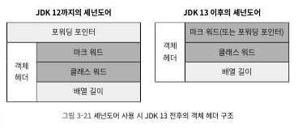 
  - JDK 13에서는 포워딩 포인터를 객체 헤더에 통합하는 작업도 함께 이루어짐
  - 통합 이전에는 포워딩 포인트 때문에 메모리를 5~10% 정도 추가 사용함
  - 포워딩 포인터 통합은 다음과 같은 이점 제공
    - 같은 공간에 더 많은 객체를 담을 수 있어, 가비지 컬렉션 수행 횟수가 줄어듬
    - CPU 캐시에 더 많은 객체를 담을 수 있어서 캐시 적중률이 높아짐
    - 다른 가비지 컬렉터들과 객체 할당 코드를 공유할 수 있어서 구현 로직이 단순
  - 해당 개선으로 가비지 컬렉션에 민감한 벤치마크에서 10~15% 높은 성능을 보임
- 스택 워터마크를 활용한 스레드 스택 동시 처리 
  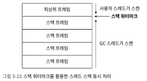 
  - JDK 17에 반영된 개선
  - 일시 정지 후, 스택 내 참조 객체에 대해 스캔 후 참조 표시 큐에 담은 다음 사용자 스레드를 깨움 -> 다소 시간이 걸림
  - `스레드 스택 중 변화가 생기는 부분은 최상위 스택 프레임 뿐`이라는 개념으로 최상위 스탠을 제외하고 하단 스택을 사용자 스레드가 진행 중 스캔
- 실전 성능 
   
  - 셰넌도어는 `짧은 보폭으로 빠르게 달리기` 전략을 택함
    - 정지 시간이 매우 짧음
### 3.6.2 ZGC
- 오라클이 개발한 저지연 가비지 컬렉션으로, ZGC 및 세대구분 ZGC 존재
- 셰넌도어처럼 처리량에 미치는 영향을 최소로 억제하고 일시 정지 시간을 10밀리초 안쪽으로 줄이고자 했음
  - 구현 방향은 셰넌도어는 G1 후계자와 유사했지만, Zgc는 C4컬렉터와 유사
##### 리전 기반 메모리 레이아웃
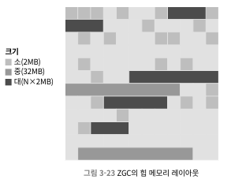 
- 셰넌도어 및 G1과 유사하게 리전들로 나뉘지만, `동적으로 생성/파괴`된다는 차이점 존재
  - 소리전: 2MB 고정, 256KB미만의 작은 객체를 담음
  - 중리전: 32MB 고정, 256KB 이상 4MB미만 객체를 담음
  - 대리전: 크기가 동적으로 변함, 단 2MB 배수여야함. 4MB 이상의 큰 객체용 공간. 단 하나의 객체만 존재하며, 해당 객체는 복사되지 않음
##### 병렬 모으기와 컬러 포인트
##### ZGC의 동작 방식
- 크게 4단계로 나뉘며, 중간 사용자 스레드를 일시 정지 키시는 작은 단계가 껴 있음 
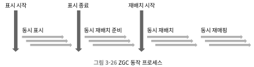 
  - 동시 표시
    - 객체 그래프를 탐색하며 도달 가능성을 분석하는 단계
    - G1이나 셰넌도어와 다른점은 표시가 객체가 아닌 컬러 포인터로 이루어짐
  - 동시 재배치 준비
    - 청소해야 할 리전들을 선정하여 재배치 집합
    - 스캔을 광범위 하게 하여, 리전 안의 생존 객체들을 다른 리전으로 복사한 후 회수 할지 여부만 결정
  - 동시 재배치
    - 재배치 집합 안의 생존 객체들을새로운 리전으로 복사
  - 동시 재매핑
    - 힙 전체에서 재배치 집합에 있는 옛 객체들로 향하는 참조 전부를 갱신하는 작업
- ZGC의 설계는 PGC나 C4 컬렉터와 맥을 같이함
##### 다른 컬렉터들과의 비교
- 최신 GC와 상세 구면에서 다른 절충안 존재
  - G1은 세대 간 참조와 리전들의 점진적 회수를 위해 기억 집합 활용 -> 메모리 공간 부담 및 애플리케이션 성능 영향
  - ZGC는 기억 집합을 쓰지 않음 -> 애플리케이션 부담 적음
- ZGC 거대 힙에서 동시 회수보다 객체 할당 속도가 빠르면 고갈 발생 -> 힙 크기를 늘리는 방법 밖에 없음
  - 해당 이슈로 세대 구분 필요 -> 신세대 부분에 빠르게 회수 처리
- ZGC는 NUMA 메모리를 고려한 메모리 할당 존재
  - 객체 생성을 요청한 스레드가 수행중인 프로세서의 지역 메모리에 우선적으로 할당 -> 메모리 접근 효율을 높임
- 비교 성능 지표 
  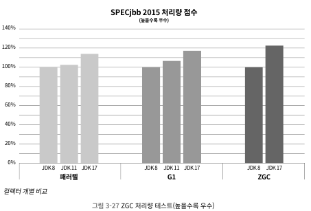 
  - JDK 11까지는 다른 GC에 밀렸지만 JDK17에 와서 역전 성공

  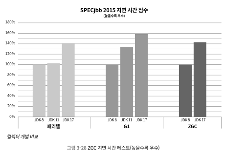 
  - `지연 시간`은 요청을 한 후 응답을 받기까지의 시간

  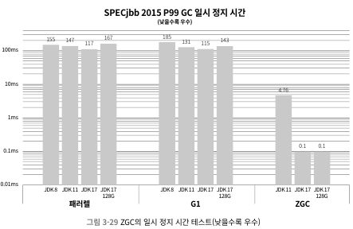 
  - CMS나 G1보다 1000배 이상 우수
### 3.6.2 세대 구분 ZGC
- 세대 구분을 통해 수명이 짧은 젊은 객체들을 더 자주 회수 가능 -> 메모리 회수 용이
- JDK 21 기준으로 세대 구분 ZGC가 ZGC를 대체한 것은 아님 -> `java -XX:+UseZGC -XX:+ZGenerational` 옵션을 주어야 동작함
  - 결국 추후에는 세대 구분 ZGC로 대체 될 것
- 세대 구분 ZGC는 컬러 포인터와 읽기 장벽, 그리고 세대 간 참조를 위해 쓰기 장벽도 활용
##### 다중 매핑 메모리 제거
- 기존 ZGC는 읽기 장벽의 부하를 줄이기 위해 다중 매핑 메모리 기법 사용
  - 힙 메모리를 세 개의 독립된 가상 주소로 매핑 -> 메모리 사용량이 실제보다 3배가량 높게 측정
- 세대 구분 ZGC는 읽기 장벽과 쓰기 장벽의 코드를 명확하게 구분 -> 메모리 사용량을 더 정확히 측정 가능
##### 다양한 장벽 최적화
- 쓰기 장벽이 도입되고 읽기 장벽의 역할도 바뀌면서 더 많은 가비지 컬렉터 코드가 애플리케이션 코드에 섞여 실행
  - 기업 집합 장벽, 시작 단계 스냅숏 표시 장벽, 쓰기 장벽 버퍼 등 수많은 기법 고안 및 적용
##### 이중 버퍼를 이용한 기억 집합 관리
- 다수의 GC들은 세대 간 포인터 관리에 기억집합을 이용
  - 스레드가 객체 필드에 값을 쓸때, 카드 테이블이라는 거대한 바이트 배열의 한 바이트에 더럽혀졌다고 표시
- 세대 구분 ZGC는 비트맵을 이용해서 객체 필드의 위치를 정확하게 기록 
  - 비트맵 비트 하나가 객체 필드 주소 하나를 표현
  - 구세대 리전 각각이 한 쌍의 기억 집합 비트맵을 가지고 있음
  - 애플리케이션 스레드들은 쓰기 장벽에서 수정, 읽기 전용 비트맵은 GC 스레드에서 참고 -> 추후 원자적으로 교환하여 애플리케이션 스레드와 GC스레드 는 서로 간섭되지 않음 
##### 밀집도 기반 리전 처리
- 어느 리전부터 회수해야 할지 정하기 위해 신세대 리전들의 밀집도를 분석
  - 회수 대상으로 성정되지 않은 리전들은 나이 먹기 or 구세대 리전으로 승격
##### 거대 객체 처리
- 거대한 객체도 신세대에 바로 할당, But 거대한 객체를 구세대로 재배치 비용 없음
  - 리전을 노화시킬 수 있기 때문
- 신세대 할당된 거대 객체가 곧바로 죽으면 GC 회수, 오래 살아 남으면 해당 리전 자체가 구세대 리전으로 승격
## 3.7 적합한 가비지 컬렉터 선택하기
- 가장 진보한 컬렉터를 선택한다고 해서 모든 시나리오에 최상의 성능을 내는 것은 아님 -> 가장 적절한 컬렉터를 선택해야함
### 3.7.1 엡실론 컬렉터
- `노옵 가비지 컬렉터`로 불리며, 실제 메모리 회수 역할을 하지 않음
  - 실제 가비지 컬렉터는 메모리 회수 외에도 힙 관리, 레이아웃, 객체 할당 등 많은 역할을 수행함
- 대규모 애플리케이션이 아닌 단 몇분 및 몇초만 동작하는 애플리케이션에 적합함
  - 힙 메모리가 가득 차기 전에 일을 마치고 없어지기에 
### 3.7.2 컬렉터들 간 비교 및 취사선택
- 각 애플리케이션에서 맞는 컬렉션 선택 요인은 아래 세가지에 좌우됨
  - 애플리케이션의 주목적이 무엇인가?
    - 데이터 분석이나 과학 계산을 수행 -> 최대한 빠르게 결과를 도출해야하니 처리량이 중요
    - SLA 애플리케이션 -> 일시 정지 시간이 서비스 품질의 영향을 미침
    - 임베디드 애플리케이션 -> 메모리 사용량 고려
  - 애플리케이션을 구동하는 서브 시스템은 무엇인가?
    - 프로세서 개수, 가용 메모리 용량, 운영 체제 등
  - JDK 제공자는 어디인가? 버전은?
    - 오라클 JDK, OpenJDK, OpenJ9
- 예시로 사용자에게 직접 서비스를 제공하는 브라우저-서버 시스템 -> 지연 시간 중요
  - 자금 사정은 여유로우나 최적화 경험이 부족하면?
    - 유료 기술 지원을 받을 수 있는 전용 하드웨어와 소프트웨어 솔루션이 좋은 선택임 ->어줄의 이전 베가 시스템과 현재의 징 VM, C4컬렉터를 사용
    - 상용 제품을 쓸 형편은 못 되나 소프트웨어와 하드웨어 모델을 제어할 능력이 된다면?
      - 최신 버전 사용, 지연 시간이 중요하다면 ZGC를 시도
    - 제법 오래된 하드웨어와 소프트웨어 시스템에서 운영해야하면?
      - 메모리 용량에 따라 선택해야하며, CMS 또는 G1 시도
- 일반적으로 가장 많은 독자가 오라클 JDK 또는 OpenJDK를 사용하고 있을꺼임 -> 오라클은 아래와 같이 안내
  - 최대 100MB 정도의 작은 데이터를 다루는 애플리케이션 -> 시리얼 컬렉터
  - 애플리케이션이 단일 프로세서만 사용하고 일시 정지 시간 관련 제약이 없다면 -> 시리얼 컬렉터
  - 애플리케이션 최대 성능이 가장 중요하고, 지연 시간 관련 제약이 없거나 1초 이상의 지연 시간도 허용 가능 -> 가상 머신의 기본 컬렉터나 패러럴 컬렉터
  - 처리량보다 응답 시간이 중요하고 가비지 컬렉션에 따른 일시 정지가 짧아야 한다면 -> G1
  - 응답 시간이 매우 중요하면 -> (세대 구분)ZGC
### 3.7.3 가상 머신과 가비지 컬렉터 로그
- 가상 머신 메모리 문제를 다룰려면 가상 머신 및 GC 로그를 읽고 분석할 줄 알아야 함 -> 로그에 대한 표준이 없음
- JDK 9에 와서야 `-Xlog` 매개 변수로 모든 핫스팟 기능의 로그 설정 가능
  - `-Xlog[:[selector][+[output][:decorators][:output-options]]]`
  - 가장 중요한 매개 변수는 실렉터(태그와 로그 레벨로 구성)
    - 태그: 가상 머신의 기능 모듈 이름을 뜻함, 어떤 기능의 로그를 보고 싶은지 로깅 프레임 워크에 알려줌 -> 가비지 컬렉터는 gc이며, 아래 같이 많은 모듈이 존재 
      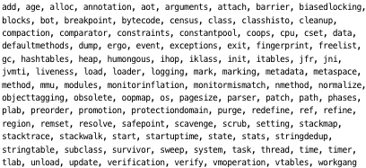 
    - 로그 레벨: 출력 정보의 상세함 정도를 정함, Trace ~ Error + off(끔) 으로 총 6 단계 존재, 기본은 Info
- 핫스팟 로그 규칙은 Log4j나 SLF4j와 같은 규칙임(아래는 기본 규칙) 
  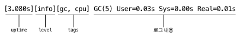 
  - uptime: 가상 머신 구동 시각 부터 흐른 시간(단위: 초)
  - level: 로그 레벨
  - tag: 출력된 로그와 관련된 기능 모듈들의 태그들
- `-Xlog:gc*(JDK 8까지는 -XX:+PrintGCDetails) 실제 구동 시켜봤을 때` 
  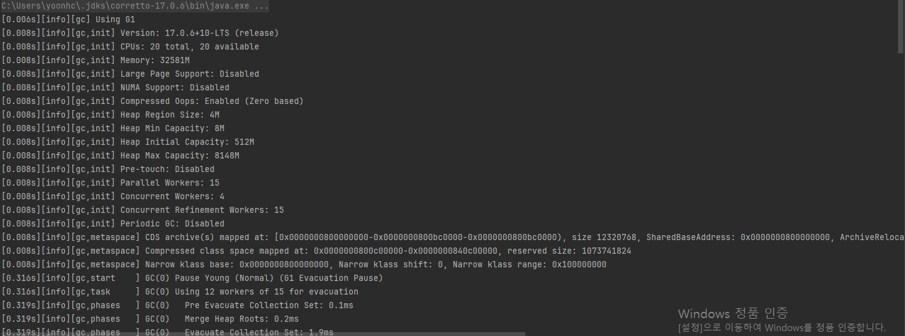 
### 3.7.4 가바지 컬렉터 매개 변수 정리
- 필요한 매개 변수는 아래와 같음 
  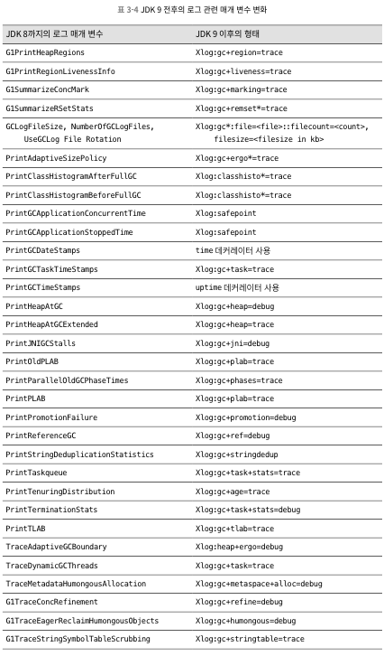 
  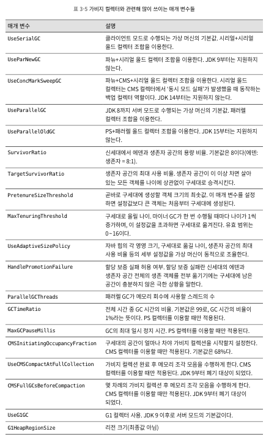 
  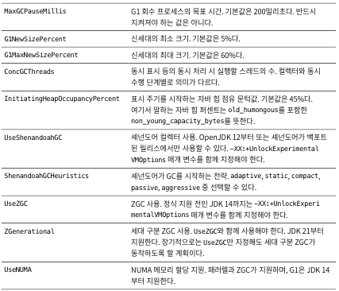 
## 3.8 실전: 메모리 할당과 회수 전략
- 객체 메모리 할당은 힙에 할당 된다는 뜻
  - 전통적인 세대 단위 설계에서는 새로운 객체는 신세대, 특수한 경우(객체 크기가 특정 문턱 값보다 큰 경우)에는 곧바로 구세대 할당
- <<자바 가상 머신 명세>>에 객체 생성과 저장 방식은 상세 하게 명시 되지 않음 -> 사용 하는 GC와 메모리 관련 가상 머신 매개 변수 설정 값에 따라 달라짐
- 해당 절에는 기본 적인 메모리 할당 정책과 코드 검증
  - 쉽게 해석하기 위해 시리얼 컬렉터 사용
### 3.8.1 객체는 먼저 에덴에 할당된다
- 대부분의 경우 신세대의 에덴에 할당, 에덴 공간이 부족하면 마이너 GC 시작
- 코드 실행 시, 아래와 같은 로그 나옴 
  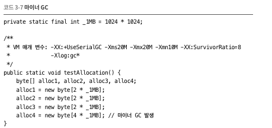 
   
  - 가상 머신 매개 변수 `-Xms20M -Xmx20M -Xmn10M`은 자바 런타임 힙 크기를 20MB로 제한
    - 확장은 불가하고 10MB는 신세대에 할당 -> 나머지는 구세대 배정
  - `-XX:SurvivorRatio=8` 신세대의 에덴과 생존자 공간 비율을 8:1로 설정 
    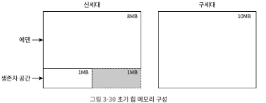 
  - alloc4 할당 시, 신세대 메모리 공간에 할당이 안되기에 마이너 GC 실행 -> alloc1~3은 구세대로 옮겨지고 alloc가 신세대에 존재 
    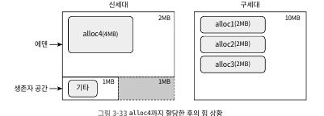 
### 3.8.2 큰 객체는 바로 구세대에 할당된다
- 큰 객체 등장 또는 곧 사라질 큰 객체들을 떼로 만나는건 마이너 GC(메모리 복사)를 야기 시킴
- `-XX:PretenureSizeThreshold`를 사용하여 임계치보다 큰 값들은 바로 구세대로 할당
### 3.8.3 나이가 차면 바로 구세대에 할당된다
- `-XX:MaxTenuringThreshold`매개 변수를 통해 구세대 승격 나이 설정 가능(승격 나이는 마이너 GC 실행 횟수)
  - `-XX:MaxTenuringThreshold` 기본 값은 가비지 컬렉터 종류와 JDK 버전 마다 다름
- `-XX:TargetSurvivorRatio`는 생존자 공간이 지정한 비율 이상 차면 살아 남은 객체들을 구세대로 승격 
### 3.8.4 공간이 비좁으면 강제로 승격시킨다
- `생존자 나이(MaxTenuringThreshold)`보다 `생존자 공간 메모리 비율(TargetSurvivorRatio)` 이 더 우선 시 됨
