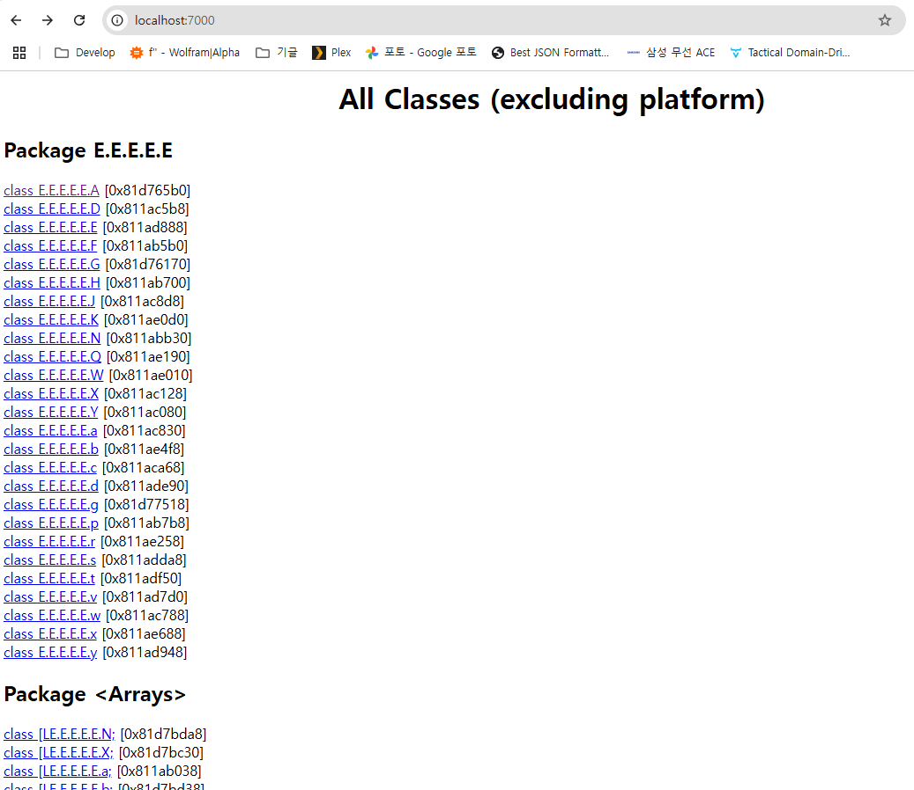
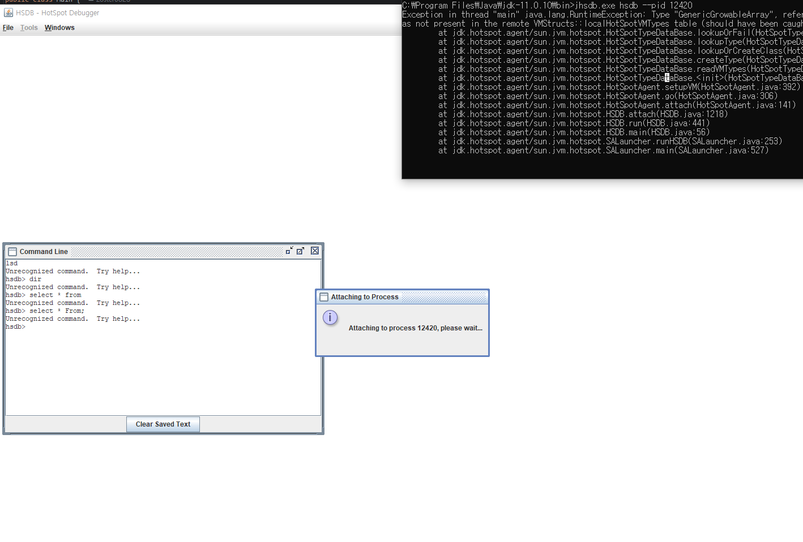
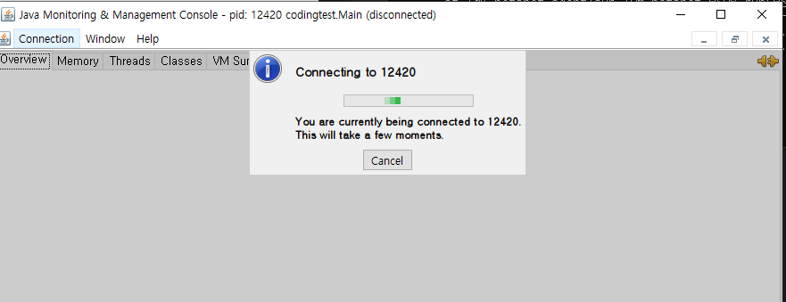
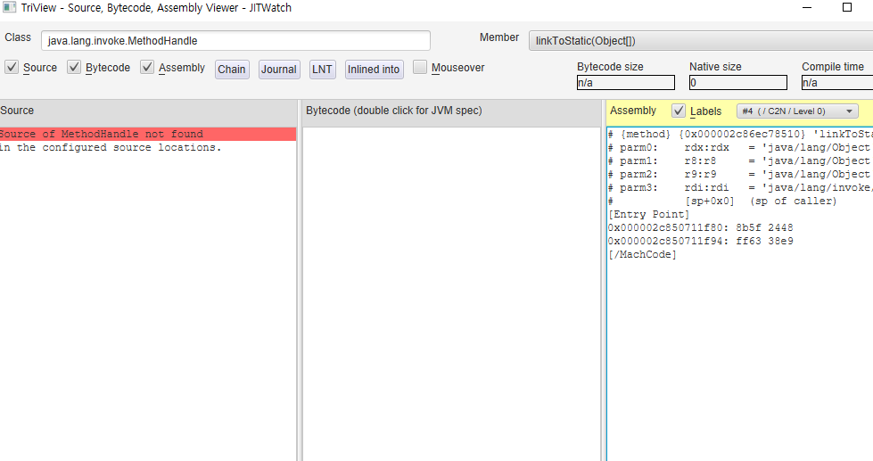

# 4. 가상머신 성능 모니터링과 문제 해결 tool
## 4.1 들어가며
* 우리의 최종 목표는 배운 지식을 현실에 적용하는 것이다.
* 시스템에서 발생한 문제의 원인을 찾을 때 관련 기초 지식은 토대가 되고 데이터는 근거가 되며 tool는 지식을 활용해 데이터를 처리하는 수단이 된다.
## 4.2 기본적인 문제 해결 tool
* JDK의 tool는 세가지로 나눌 수 있다.
* 상용 인증 tool, 공식 지원 tool, 실험적 tool
### 4.2.1 jps:가상 머신 프로세스 상태 tool
* 유닉스의 ps와 비슷한 역할
  ```shell 
  C:\Program Files\Java\jdk-11.0.10\bin>jps
    8144 Main
    8976 Main
    10292 Jps
  ```
* > ps | grep java 보다 뭐가 좋은지 잘 모르겠음
### 4.2.2 jstat:가상 머신 통계 정보 모니터링 tool
* 로컬 또는 원격 가상 머신 프로세스의 런타임 데이터를 보여준다.
```shell
C:\Program Files\Java\jdk-11.0.10\bin>jstat -gc 8976
S0C    S1C    S0U    S1U      EC       EU        OC         OU       MC     MU    CCSC   CCSU   YGC     YGCT    FGC    FGCT    CGC    CGCT     GCT
0.0   48128.0  0.0   48128.0 934912.0 731136.0  849920.0   760383.7  381824.0 377303.5 47872.0 45541.1     93    1.773   0      0.000  56      0.483    2.256
```
* > production에서 수행 가능할지 모르겠으나, 간단하게 gc 확인하기 좋을 듯
### 4.2.3 jinfo:Java 설정 정보 tool
* 가상 머신의 다양한 매개 변수를 실시간으로 확인하고 변경하는 tool
```shell
C:\Program Files\Java\jdk-11.0.10\bin>jinfo -flag ConcGCThreads 8976
-XX:ConcGCThreads=3

C:\Program Files\Java\jdk-11.0.10\bin>jinfo -flag ConcGCThreads=4 8976
Exception in thread "main" com.sun.tools.attach.AttachOperationFailedException: flag 'ConcGCThreads' cannot be changed
        at jdk.attach/sun.tools.attach.VirtualMachineImpl.execute(VirtualMachineImpl.java:130)
        at jdk.attach/sun.tools.attach.HotSpotVirtualMachine.executeCommand(HotSpotVirtualMachine.java:309)
        at jdk.attach/sun.tools.attach.HotSpotVirtualMachine.setFlag(HotSpotVirtualMachine.java:282)
        at jdk.jcmd/sun.tools.jinfo.JInfo.flag(JInfo.java:146)
        at jdk.jcmd/sun.tools.jinfo.JInfo.main(JInfo.java:127)
```
* 모든값이 modifiable 한 것은 아닌듯
### 4.2.4 jmap:Java 메모리 매핑 tool
* 힙 스냅숏을 파일로 덤프해 주는 메모리 맵 명령어
```shell
C:\Program Files\Java\jdk-11.0.10\bin>jmap -dump:format=b,file=this.heap 8976
Dumping heap to C:\Program Files\Java\jdk-11.0.10\bin\this.heap ...
Heap dump file created [1950923915 bytes in 1.835 secs]
```
### 4.2.5 jhat:가상 머신 힙 덤프 스냅샷 분석 tool
* JDK 8까지 제공되던 힙 분석 tool, JDK9부터 jhsdb가 대신한다.
* 웹 서버에서 이걸 띄울일은 없으므로 다른 시스템으로 가지고 와서 수행
* > 그렇다면 eclipse MAT를 사용하는 것이 좋아보임
* > 수행에 굉장히 오래 걸림 약 10분 (2GB heap dump)
```shell
C:\Program Files\Java\jdk1.8.0_241\bin>jhat.exe ../../jdk-11.0.10/bin/this.heap
Reading from ../../jdk-11.0.10/bin/this.heap...
Dump file created Sun Jan 05 19:05:26 KST 2025
Snapshot read, resolving...
Resolving 27689988 objects...
```

* > 가독성도 별로 좋지 않음
### 4.2.6 jstack:Java stack 추적 tool
* 현재 가상 머신의 스레드 스냅샷을 생성 
* > 처음 안 툴인데, 유용할 수도 있을 것 같음
```shell
"DefaultDispatcher-worker-22" #34829 [16516] daemon prio=5 os_prio=0 cpu=281.25ms elapsed=211.39s tid=0x0000027328600b20 nid=16516 waiting on condition  [0x000000d5ab4ff000]
   java.lang.Thread.State: TIMED_WAITING (parking)
        at jdk.internal.misc.Unsafe.park(java.base@21.0.5/Native Method)
        at java.util.concurrent.locks.LockSupport.parkNanos(java.base@21.0.5/LockSupport.java:410)
        at kotlinx.coroutines.scheduling.CoroutineScheduler$Worker.park(CoroutineScheduler.kt:924)
        at kotlinx.coroutines.scheduling.CoroutineScheduler$Worker.tryPark(CoroutineScheduler.kt:860)
        at kotlinx.coroutines.scheduling.CoroutineScheduler$Worker.runWorker(CoroutineScheduler.kt:795)
        at kotlinx.coroutines.scheduling.CoroutineScheduler$Worker.run(CoroutineScheduler.kt:750)

   Locked ownable synchronizers:
        - None

"DefaultDispatcher-worker-11" #34830 [16628] daemon prio=5 os_prio=0 cpu=203.12ms elapsed=211.39s tid=0x00000273555f14b0 nid=16628 waiting on condition  [0x000000d5ab6ff000]
   java.lang.Thread.State: TIMED_WAITING (parking)
        at jdk.internal.misc.Unsafe.park(java.base@21.0.5/Native Method)
        at java.util.concurrent.locks.LockSupport.parkNanos(java.base@21.0.5/LockSupport.java:410)
        at kotlinx.coroutines.scheduling.CoroutineScheduler$Worker.park(CoroutineScheduler.kt:924)
        at kotlinx.coroutines.scheduling.CoroutineScheduler$Worker.tryPark(CoroutineScheduler.kt:860)
        at kotlinx.coroutines.scheduling.CoroutineScheduler$Worker.runWorker(CoroutineScheduler.kt:795)
        at kotlinx.coroutines.scheduling.CoroutineScheduler$Worker.run(CoroutineScheduler.kt:750)

   Locked ownable synchronizers:
        - None

"JobScheduler FJ pool 5/15" #34855 [23512] daemon prio=6 os_prio=0 cpu=203.12ms elapsed=209.71s tid=0x00000273555f6370 nid=23512 waiting on condition  [0x000000d5ac7ff000]
   java.lang.Thread.State: WAITING (parking)
        at jdk.internal.misc.Unsafe.park(java.base@21.0.5/Native Method)
        - parking to wait for  <0x0000000081851488> (a java.util.concurrent.ForkJoinPool)
        at java.util.concurrent.ForkJoinPool.awaitWork(java.base@21.0.5/ForkJoinPool.java:2145)
        at java.util.concurrent.ForkJoinPool.runWorker(java.base@21.0.5/ForkJoinPool.java:2036)
        at java.util.concurrent.ForkJoinWorkerThread.run(java.base@21.0.5/ForkJoinWorkerThread.java:187)

   Locked ownable synchronizers:
        - None
```
## 4.3 GUI tool
* CLI 외에도 더 많은 기능을 통합한 GUI tool도 몇 가지 제공한다
* GUI tool로는 JConsole, JHSDB, VIsualVM, JMC가 대표적이다

### 4.3.1 JHSDB:서비스 에이전트 기반 디버깅 tool
* 매우 저수준 디버깅 tool로, JVM 내부를 상세히 조사하거나 원인 불명인 비정상 종료 상태를 분석할 때 유용
* 주로 프로덕션 문제가 아니라 개발 환경이나 QA 단계에서 사용
* 대규모 서버에서는 사용 빈도가 적고, 다른 자동화된 모니터링 tool가 더 효율적
* > 실행 실패, jwt로 draw해주는 툴인듯
  
### 4.3.3/4 JConsole, VisualVM
* 개발 및 테스트 단계에서 JVM 상태를 실시간으로 확인하기에 유용
* > 마찬가지로 실행 실패
  
* > MAT에 의해 대체되었다고 봐야 할듯

### 4.3.5 JMC(Java Mission Control):지속 가능한 온라인 모니터링 tool
* Java Flight Recorder(JFR) 데이터를 기반으로 상세한 분석을 제공
* > jmx 포트이용해 metric 뽑아낼 수 있으나 grafana 이용한 대규모 분석에 비해서 부족해보임

## 4.4 핫스팟 가상 머신 플러그인과 tool
### 4.4.1 HSDIS(HotSpot Disassember)
* JVM의 HotSpot 컴파일러가 생성한 Native code를 disassembling하여 읽을 수 있게 출력하는 tool
* <<Java 가상 머신 명세>>에는 가상 머신 명령어 세트에 속한 명령어의 의미가 정의되어 있다
* 기술이 발전하면서 실제 구현은 정의와 차이가 조금씩 생겼다
* <<Java 가상 머신 명세>>의 조항은 interface가 되어갔다
* 따라서 가상 머신이 무엇을 하는지는 바이트코드 수준에서 분석해야 한다
* 가상 머신이 어떻게 하고 성능은 어떠한지를 논할때는 다른 수단을 찾아야 한다
  * 이것이 HSDIS가 데뷔한 배경이다
```shell
PS C:\Users\darje\IdeaProjects\TechSnack\LeetCode\src\main\java> java -XX:+UnlockDiagnosticVMOptions -XX:+PrintAssembly -XX:CompileCommand=compileonly,*Bar.sum -XX:+LogCompilation -XX:CompileCommand=dontinline,*Bar.sum -XX:LogFile=logfile.log -Xcomp codingtest.Bar
Java HotSpot(TM) 64-Bit Server VM warning: PrintAssembly is enabled; turning on DebugNonSafepoints to gain additional output
CompileCommand: compileonly *Bar.sum
CompileCommand: dontinline *Bar.sum

============================= C1-compiled nmethod ==============================
----------------------------------- Assembly -----------------------------------

Compiled method (c1)      64    1       3       codingtest.Bar::sum (11 bytes)
 total in heap  [0x0000025a590b0010,0x0000025a590b0370] = 864
 relocation     [0x0000025a590b0170,0x0000025a590b0198] = 40
 main code      [0x0000025a590b01a0,0x0000025a590b02a0] = 256
 stub code      [0x0000025a590b02a0,0x0000025a590b02d8] = 56
 oops           [0x0000025a590b02d8,0x0000025a590b02e0] = 8

```
### 4.4.2 JITWatch
* JITWatch는 HotSpot JIT 컴파일러용 로그 분석 및 시각화 tool이다

* HSDIS로 생성한 로그를 이용하여 시각화할 수 있다
## 4.5 마치며
* 시스템에서 발생한 문제의 원인을 찾을 때 관련 기초 지식은 토대가 되고 데이터는 근거가 되며 tool는 지식을 활용해 데이터를 처리하는 수단이 된다.