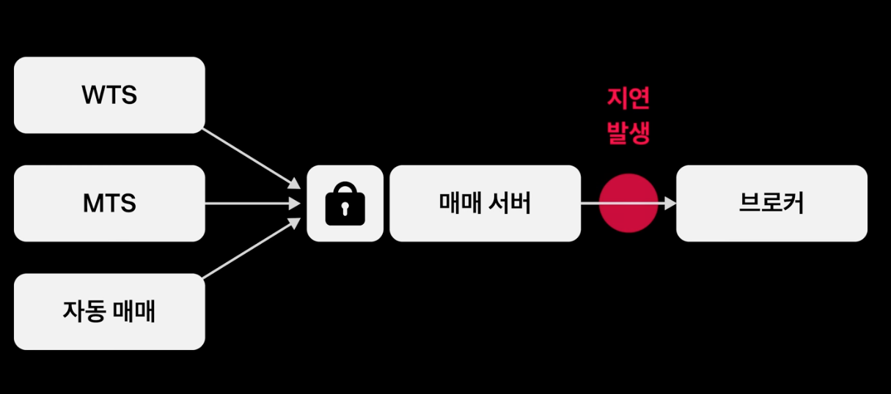

# 토스ㅣSLASH 22 - 애플 한 주가 고객에게 전달 되기까지
> https://www.youtube.com/watch?v=UOWy6zdsD-c

## 동시에 발생하는 트랜잭션에서 안전하게 동시성 처리
- 방안 1) FOR UPDATE로 락 처리 -> 데드락 발생 가능성
- 방안 2) 락을 위한 테이블을 별도로 두고 처리 -> MSA 환경에서 처리 어려움
- 해결 방안) Redis 분산 락을 사용한 동시성 해결
  - 분산 락을 통해 모든 서버는 락을 중앙화된 Redis 서버로부터 공유하고, 제어
  - 여러 서버들에서 모두 요청하기 때문에 높은 처리량(throughput) 이 보장

### Redis 분산 락의 문제점 및 해결 방안
- 타임아웃에 따른 갱신 분실 문제(Lost Updates Problem)
- 하나의 쓰레드만 진입 가능한데 무한정 대기시 데드락 발생 가능성
- 사례

    ```mermaid
    sequenceDiagram
        participant Client1 as 클라이언트 1 (-3000원)
        participant Client2 as 클라이언트 2 (-1000원)
        participant Redis as Redis (분산락)
        participant DB as 데이터베이스
    
        Note over DB: 초기 잔액 = 3,000원
    
        Client1->>Redis: 락 획득 (SETNX lock_account, TTL=5s)
        Redis-->>Client1: 락 획득 성공
    
        Client1->>DB: 잔액 조회 (SELECT balance FROM account)
        DB-->>Client1: balance = 3000
    
        Note over Client1: 예상보다 작업이 오래 걸림 (5초 초과)
    
        Redis-->>Client1: TTL 만료 → 락 자동 해제
    
        Client2->>Redis: 락 획득 (SETNX lock_account, TTL=5s)
        Redis-->>Client2: 락 획득 성공
    
        Client2->>DB: 잔액 조회 (SELECT balance FROM account)
        DB-->>Client2: balance = 3000 (문제 발생!)
    
        Client2->>DB: balance - 1000 적용 (UPDATE account SET balance = 2000)
        DB-->>Client2: 업데이트 성공
    
        Client1->>DB: balance - 3000 적용 (UPDATE account SET balance = 0)
        DB-->>Client1: 업데이트 성공 (갱신 분실!)
        
        Note over DB: 최종 잔액 = 0원 (Client2의 갱신이 사라짐)
    ```

- 해결 방안
  - 명시적 잠금 (FOR UPDATE 절) ⚠️-> 여러 테이블 트랜잭션 처리 어려움
  - 원자적 연산 사용 (atomic 하게 연산 처리. mutex, sempahore 등) ⚠️-> DBMS에 의존적, ORM과 좋지 않음
  - 갱신 손실 자동 감지 (낙관적 락 기반 Version 관리와 유사) ⚠️-> DBMS에 의존적, ORM과 좋지 않음
  - CAS(Compare-And-Swap) 연산 ✅
    - CAS ? https://velog.io/@appti/CASCompare-And-Set
    - JPA에서 제공하는 @OptimisticLocking 을 사용(낙관적 락)
    - 분산락으로 동시성 제어(트랜잭션 대기 및 재시도 처리)
    - 낙관적 락으로 갱신 분실 문제 해결 

## 네트워크 지연 시점의 문제점 및 해결방안


- 타임아웃 발생시 재시도 대상으로 판단
  - 재시도를 하기 위해 멱등한 API 설계 필요 (토스 주문 식별자)
- 타임아웃 발생시 재시도 요청 패턴 지수 간격으로 처리하여 네트워크 지연 악화 최소화
- 재시도 실패시 별도 오퍼레이션(대사 배치)으로 처리

## 브로커 의존성 격리
- 외부 브로커가 추가될 경우 매매 서버와 강결합 구조에서 영향 발생
- 서버 레벨에서 격리 (매매서버-브로커 -> 매매서버-매매요청서버-브로커)
  
- 내부 인터페이스만 노출하여 외부 브로커 추가시 영향 최소화
- 브로커 처리량에 따라 매매 요청 서버만 scale-out
- (추가) 카프카로 메세지 발생히 유니크 아이디 처리로 중복 메세지 처리
  
---

## 🧐
- 물리 데이터베이스 분리의 MSA경험이 없는데 관리포인트가 늘어나진 않을까?
- 레이어가 추가되면 관리 포인트가 늘어나지만, MSA의 장점을 살리기 위해 레이어를 추가하는 것이라고 생각하면 좋을 것 같다.
- 비동기가 무조건 좋은건 아니지만 비동기로 처리할 수 있는 부분은 비동기로 처리하는 것이 좋아보인다 (개발 -> 기획 의견발의)
- 왜 지수 간격으로 재시도를 하는가?
  - 지수 백오프(Exponential Backoff) : https://en.wikipedia.org/wiki/Exponential_backoff
  - https://aws.amazon.com/ko/blogs/architecture/exponential-backoff-and-jitter/
    - https://gist.github.com/eugene70/87e15438bcde0a71a16c3fc1e7c9bfbc
- 카프카 메세지 처리시 유니크 아이디는 어떻게 처리하는가? uuid? 별도 라이브러리?
