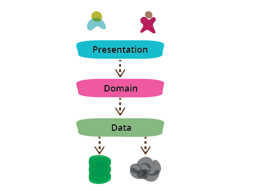

# Presentation-Domain-Data Layering
## Introduction
* 정보가 많은 프로그램을 만들 때 흔히 모듈화 하는 방법은 3가지 레이어로 나누는 것이다.
  * Presentation Layer(UI)
  * Domain Layer(business logic)
  * Data Layer(data access)
* Presentation Layer는 http request를 핸들링 하고 html을 렌더링 하는 등의 행위를 한다.
* Domain Layer는 data 변경에 대한 validation을 하고 비즈니스 로직을 처리한다.
* Data Layer는 데이터베이스와 관련된 코드를 포함한다.

## Pros of P-D-D layering
* Martin Fowler는 이것이 전반적으로 효과적인 방법이라고 말한다.
* 이것은 각 topic을 독립적으로 생각할 수 있도록 하여 우리가 집중해야 하는 scope을 줄여주기 때문이다.
* 각 레이어 간의 연결은 추상화된 메소드를 통해 이루어지므로 각 요구사항을 만족하는 것 만으로 내부의 변경은 자유롭게 할 수 있다.
  * 다른 레이어를 신경쓰지 않아도 된다.
* 이렇게 scope을 좁힌다고 해서 순서가 달라지거나 각 레이어간의 반복 작업이 없어지는 것은 아니다.
* 그러나 이러한 변경 사항을 한 레이어에만 집중할 수 있다는 것이 큰 이점이다.
  * Martin Fowler는 이것이 refactoring에서 모자를 바꿔 쓰는 것과 유사하다고 이야기 하고 있다.
* 또한 이 방법은 각 모듈의 다양한 구현을 허용한다.
  * 예를 들어, Presentation Layer는 웹 페이지를 렌더링 할 수도 있고, API를 제공할 수도 있다.
  * 이 과정에서 Domain layer의 변경은 필요할 수도 없을 수도 있다.
  * Database의 교체와 같은 변경이 단지 Data layer에만 국한되게 만들 수 있다.
* 이러한 모듈화는 또한 테스트를 더 쉽게 만드는 장점이 있다
  * UI 테스트는 종종 테스트하기 어려운데, (Selenium 등을 사용해야 한다.)
  * Domain Layer는 테스트하기 쉽다.
  * Data layer는 테스트가 느리고 이상하므로,
  * 테스트가 쉬운 Domain layer에 로직을 집중한다.

## What to be careful
* 이것을 나누는 방법은, 작은 프로그램에서는 단순히 method나 file을 나누는 것으로 충분하며 큰 프로그램에서는 package, module, library로 나누게 될 것이다.

* 위와 같은 더 다양한 계층으로 나누더라도 핵심 분리가 유지되는 한 본질은 훼손되지 않는다.
* 여기서 Domain이 data source에 의존하지 않도록 mapper를 두는 것을 흔히 Hexagonal architecture라고 부른다.
* presentation-domain-data layering은 작은 단위로 사용해야 한다.

* 일반적으로 프레임워크는 이러한 구조 분리를 namespace레벨로 권장한다.(java의 경우 module 또는 package)
* 소규모 시스템에서는 괜찮지만 계층 중 하나가 너무 커지면 문제가 발생한다.
* 이러한 계층화가 잘못된 길로 이끄는 것 중 하나는 계층에 따라 개발팀을 분리하는 것이다.
* 흔히 FE-BE는 서로 다른 프레임워크, 언어를 사용하기 때문에 이를 분리하는 것은 일견 합리적으로 보일 수 있다.
* 그러나 이러한 계층 간 풍부한 상호 작용은 잦은 계층 간 교체를 요구한다.
  * 캐주얼하게 협업할 수 있다면 문제가 없겠지만, 팀 경계는 점점 마찰을 증가시키고 cross layer 작업을 하려는 개인의 동기를 축소시킨다.
* 또한 사용자와 domain layer간의 거리를 점점 더 멀어지게 만든다.
* 개발자는 풀스택일 필요는 없지만 개발팀은 풀스택이어야 한다.

## Common Usage

## ANTI-PATTERN

## To-Be

---
* Presentation-Domain-Data Layering(2015.08.16)
  * https://martinfowler.com/bliki/PresentationDomainDataLayering.html
* 2 Hats
  * https://martinfowler.com/articles/workflowsOfRefactoring/#2hats