# 보상 트랜잭션으로 분산 환경에서도 안전하게 환전하기
- 토스뱅크는 외화 통장 출시 -> 양방향 환전 수수료 무료로 시증 은행이게도 영향을 미치는 서비스 
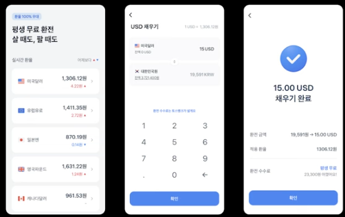
- 분산환경에서도 환경 구현이 큰 도전
  1. 분산 환경이 만들어진 이유
  2. 2PC vs saga 분산 트랜잭션 비교
  3. SAGA를 이용한 환전 구현
  4. 에러 핸들링
  5. 모니터링
  6. 결론 및 성과
## 1. 분산 환경이 만들어진 이유
- 개발팀 규모가 커질수록 배포, 확장성 및 단일 장애 등 이슈로 인해 MSA 도전 
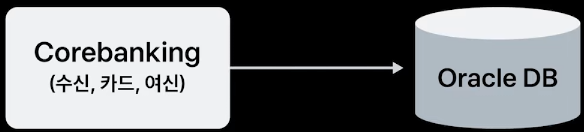
- 기존 서비스는 기존 DB(oracle), 신 서비스(외화 계좌)는 새로운 DB(MySQL) 
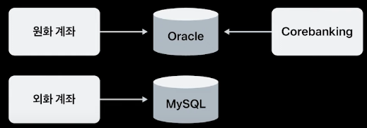
- 환전 시, 같은 DB면 트랜잭션을 통해 데이터를 변경하는건 쉬운 일 
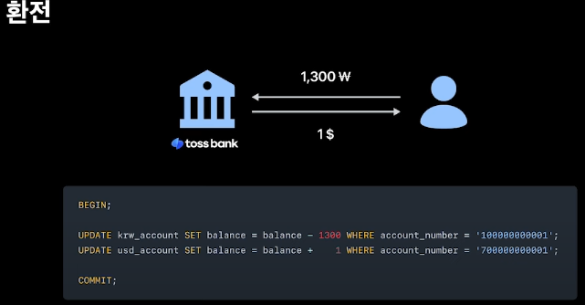
- 분산 환경에서의 원자성 보장을 해줘야해서 분산 트랜잭션 필요 
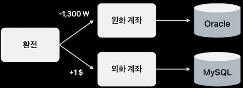

## 2. 2PC vs saga 분산 트랜잭션 비교
- Two Phase Commit(2PC) 
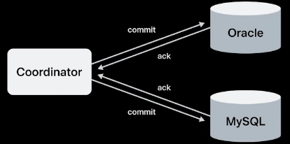
- saga Pattern -> 보상 트랜잭션을 통해 롤백 
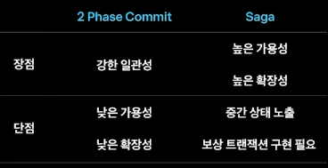
- saga 종류 
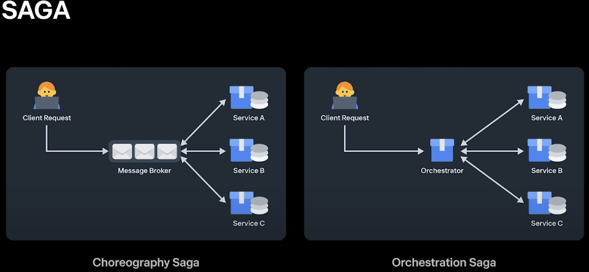
  - choreography saga: 중앙 제어자 없이 메시지 브로커를 통해 이벤트 전달
    - 단일 장애 지점 없이 느슨한 결합, 현재 진행 중인 트랜잭션 추적이 힘듬
  - orchestration saga: 각 서비스들에게 트랜잭션과 보상 트랜잭션 실행
    - 단일 장애 지점 존재, 현재 진행 중인 트랜잭션 추천이 쉬움
- 현재 진행중인 상태 관리가 필요(환전 금액 등 상태 확인이 필요) -> orchestration saga 처리

## 3. SAGA를 이용한 환전 구현
- 분산 트랜잭션 구현 -> 성공 
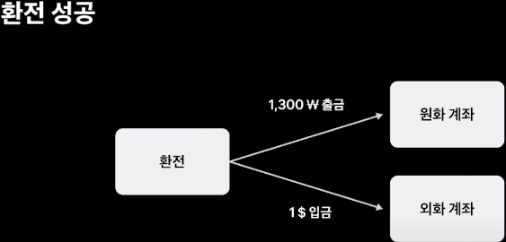
- 실패 케이스 
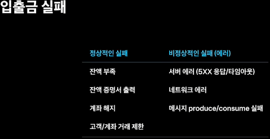
- 출금부터 진행하는 이유 -> 보상 트랜잭션 진행 시, 중간에 카드 정산(외부적 요인)으로 입금한 금액을 출금을 하지 못하는 케이스 발생 
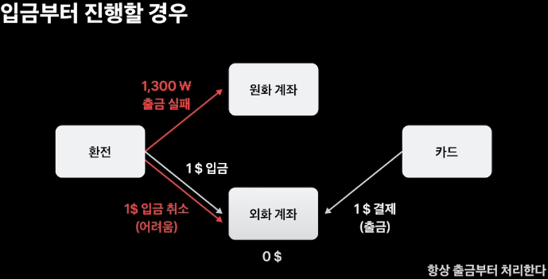
- 요청에 대해 동기적 vs 비동기적 
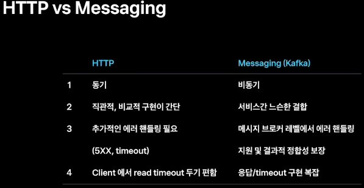
- 입금, 출금은 HTTP(동기적)
  1. 입출금 결과를 알고 넘어가야함
  2. 유저는 환전이 즉시 완료되기를 기대함
- 출금 취소는 messaging
  - 출금 취소는 마지막 과정
  - 유저가 기다릴 필요 없음
  - 결과적 정합성 보장만 되면 됨
  
## 4. 에러 핸들링
- 보상 트랜잭션 실행 이슈(네트워크 이슈, 서버 이슈) -> backoff 지연 처리 
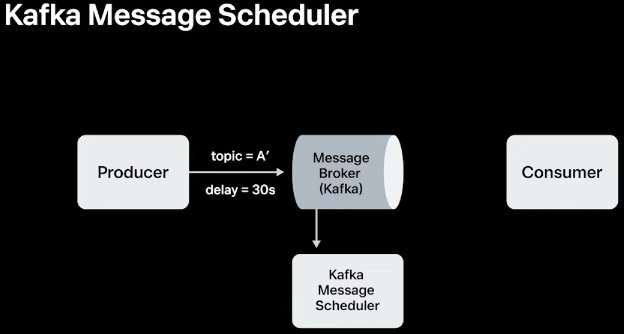
- 환전 서버의 문제로 환전 지연 이벤트 발행 못하면?(장비 결함, container OOM 등) 
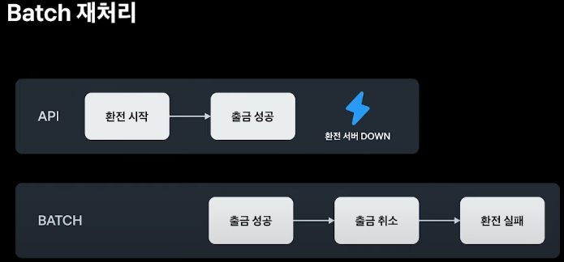
- 원화 계좌에서 처리 실패 시 -> Consumer Dead Letter를 통해 재시도 처리 
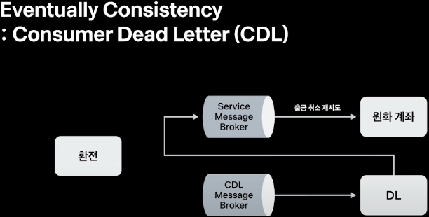
- Transactional messaging -> Producer Dead Letter 활용
  - 트랜잭션 commit과 message 발행이 원자적으로 이뤄저야함 
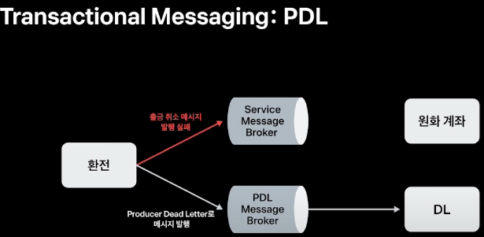
## 5. 모니터링
- DB state path -> 상태 관리를 통해 이슈 체크(지연, 오류 등) 
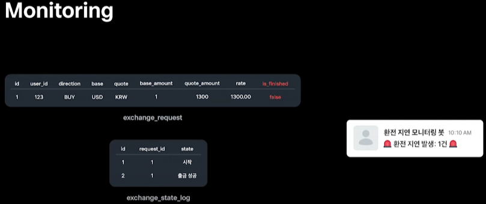
- 정보계 DB로 쌍으로 확인 
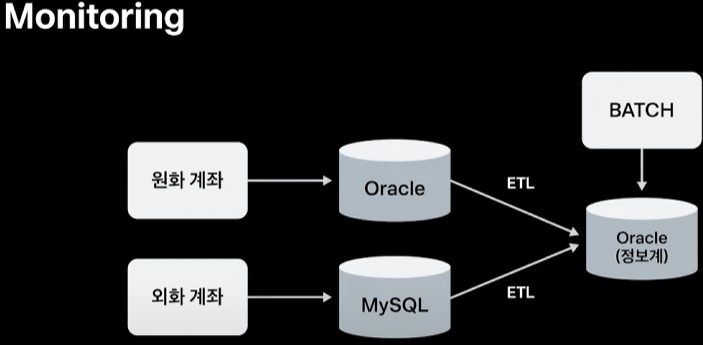
## 6. 결론 및 성과
- saga를 활용하여 좋은 예 
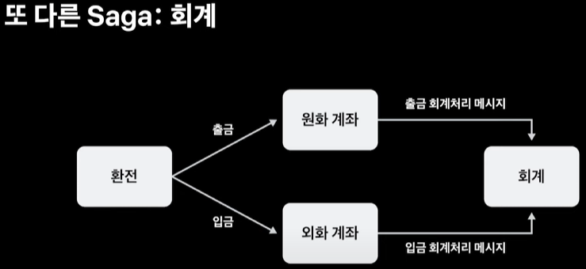 
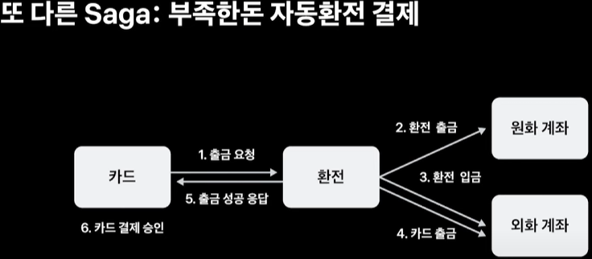
- 분산 트랜잭션은 트레이드 오프 존재 -> 트랜잭션 복잡성 증가

** 생각해보기
- 분산 트랜잭션을 활용하는 조직들은? 어느정도 수준? 코드로 어떻게 구현할까?
  - 현재 조직에서 kotlin saga dsl을 써서 사용하고 있는데, 이걸 java에서 구현을 어떻게 할까? 
- 트랜잭션 아웃박스 패턴 대신 어떤 장점 때문에 PDL 을 사용하셨을까요? -> 평소 도입에 대한 명확한 구분을 못했던 거 같음
  - `MSA에 일괄적으로 아웃박스 패턴을 적용하려면, DB종류, 물리서버, 스키마마다 아웃박스 테이블들을 만들어줘야하고, 테이블에서 메시지를 발행하는 어플리케이션도 각각 작성해야 합니다. 반면 PDL은 모든 서버에서 동일한 메시지 브로커를 바라볼 수 있기 때문에, 라이브러리 형태로 제공되어 일괄 적용하는데 편리한 점이 있습니다.`
- 분산락 이야기가 없던데 여기서 환전 서버에서 분산락을 사용했을까? 계좌 서비스에서 금전적 이슈가 있으면 에러를 주기 때문에 특별히 안걸어도 됐을까?