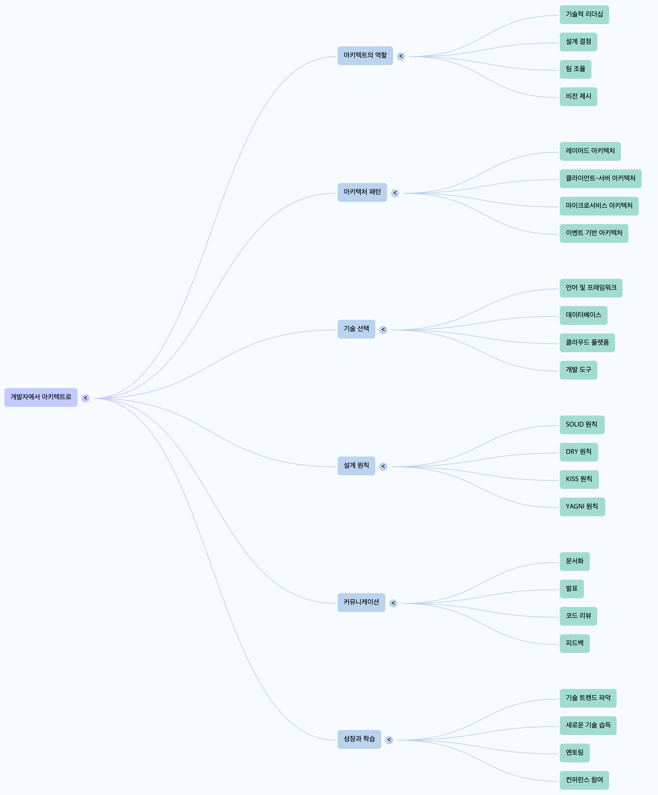

# 개발자에서 아키텍트로

## 개발자와 아키텍트의 역할 차이

개발자와 아키텍트의 가장 큰 차이는 **집중하는 범위**

- 개발자는 특정 기능의 코드 구현에 집중함
- 반면, 아키텍트는 시스템 전체 설계, 기술 선택, 팀 조율까지 더 넓은 범위를 다룸
- 이러한 역할 확장이 개발자에서 아키텍트로 성공적으로 전환하는 데 중요한 요소

---

## 아키텍트의 주요 역할

### 기술 리더십 (Technical Leadership)

- 아키텍트는 기술적 전문성을 기반으로 팀을 이끌고 기술 방향을 제시하는 역할
- 개발자 시기에는 코드를 통해 동료에게 영향력을 주었다면, 아키텍트는 소통과 설득을 통해 영향력을 행사하고 팀 내 합의를 이끌어냄

### 설계 및 의사 결정 (System Design and Decision-Making)

- 소프트웨어 시스템의 구조를 설계하고 주요 기술 결정을 내리는 것이 핵심 역할
- 시스템 구성 요소, 데이터 흐름, 컴포넌트 간 상호작용 등을 설계하고 시스템 전체적으로 큰 그림을 그림

### 팀 협업 및 소통 (Team Collaboration and Communication)

- 개발팀뿐만 아니라 비즈니스 팀 등 다양한 이해관계자와 긴밀히 소통해야 함
- 아키텍처 비전과 설계 의도를 명확히 설명하고 공유하는 능력이 필요
- 팀원들의 의견을 경청하고 기술적 난제를 함께 해결하며 합의를 이끌어내는 것도 포함

### 기술 트렌드 파악 및 적용 (Technology Trend Identification and Application)

- 기술 발전 속도가 빠르기 때문에, 새로운 기술과 패러다임을 학습하는 능력이 필요함
- 기술 트렌드를 파악하고 적절히 시스템에 적용할 수 있어야 함
- 지속적인 학습과 자기개발은 아키텍트로서 전문성을 유지하는 데 필수적임

---

## 아키텍트의 팀 조율 역할 (Team Coordination Role of Architect)

- 아키텍트는 시스템 전체 설계, 기술 선택, 팀 조율 등 개발자보다 넓은 범위를 다루는 존재
- 개발자는 기능 단위 코드에 집중하는 반면, 아키텍트는 팀 조율을 통해 시스템 전체를 조망하고 이끌어야 함
- 아키텍트의 팀 조율 역할은 다음과 같이 다양한 역량과 연결되어 있음

  ### 팀 협업 및 소통 (Team Collaboration and Communication)

    - 아키텍트는 팀원들과 효과적으로 협업하고 소통해야 함
    - 아키텍처 비전과 설계 의도를 명확하게 공유하고 팀원들의 의견을 경청하고 기술적 난제를 함께 해결하며 합의를 형성하는 능력이 필수적임
    - 이 모든 과정은 팀이 하나의 목표를 향해 나아가도록 조율하는 행위에 포함됨

  ### 기술 리더십 (Technical Leadership)

    - 아키텍트는 기술적 전문성을 기반으로 팀을 이끌고 기술 방향을 제시함
    - 단순한 관리자가 아니라, 기술 방향에 맞춰 팀원들이 효과적으로 움직일 수 있도록 조정하는 역할을 수행함
    - 개발 단계에서는 코드 영향력이 중심이었다면 아키텍트 단계에서는 소통과 설득을 통한 영향력 행사로 발전함

  ### 시스템 설계 및 의사 결정 (System Design and Decision-Making)

    - 아키텍트의 시스템 설계 및 주요 기술적 결정은 팀 전체 작업 방향에 큰 영향을 미침
    - 팀 조율은 이 결정사항들이 팀 내에서 일관성 있게 이해되고 구현되도록 만드는 역할을 포함함

---

## 결론: 개발자에서 아키텍트로의 성장

- 개발자에서 아키텍트로 성장하는 것은 개별 모듈이나 기능 코드에 대한 깊은 이해를 넘어 시스템 전체를 조망하고, 팀 전체를 이끌고 조율하는 리더십 역할로 확장하는 것을 의미
- 이는 기술적 역량만으로 충분하지 않고 커뮤니케이션, 협업, 리더십 같은 비기술적 역량까지 함께 발휘되어야 가능
- 아키텍트에게 필요한 문제 해결 능력과 시스템 사고 능력은 팀 조율 과정에서 발생하는 복잡한 기술적·인적 문제들을 해결하는 데 핵심적으로 기여함
- 결론적으로, 아키텍트는 기술적 깊이 위에 팀 조율 및 리더십 역량을 더하여 시스템 개발 전반을 이끌어가는 핵심 역할로 성장해 나간다고 할 수 있음

---

# 용어 정리

- **Architect(아키텍트)**: 소프트웨어 시스템 구조를 설계하고 주요 기술 결정을 내리는 사람
- **Stack(스택)**: 소프트웨어 개발에 사용되는 기술 조합
- **Scalability(확장성)**: 시스템이 확장되어도 성능을 유지하거나 개선할 수 있는 능력
- **Reliability(신뢰성)**: 시스템이 안정적으로 동작할 수 있는 능력
- **Maintainability(유지보수성)**: 시스템을 쉽게 수정, 업데이트하거나 오류를 수정할 수 있는 능력
- **Technical Leadership(기술 리더십)**: 기술 전문성을 바탕으로 팀을 이끌고 기술 방향성을 제시하는 능력
- **Problem-Solving Skills(문제 해결 능력)**: 복잡한 문제를 분석하고 창의적으로 해결하는 능력
- **System Thinking(시스템 사고)**: 전체 시스템을 연결된 하나의 체계로 이해하고 분석하는 사고 방식

  