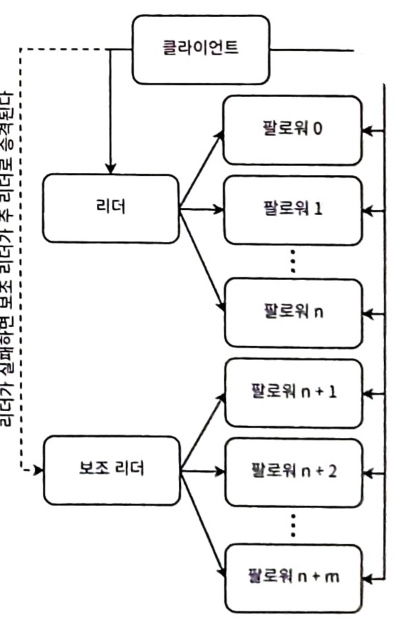
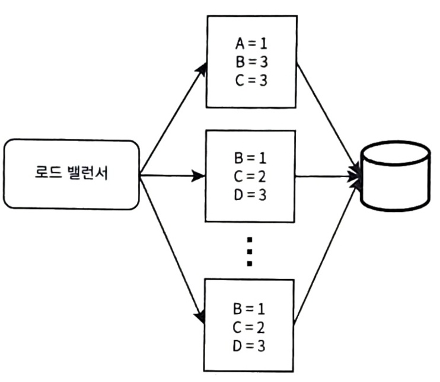
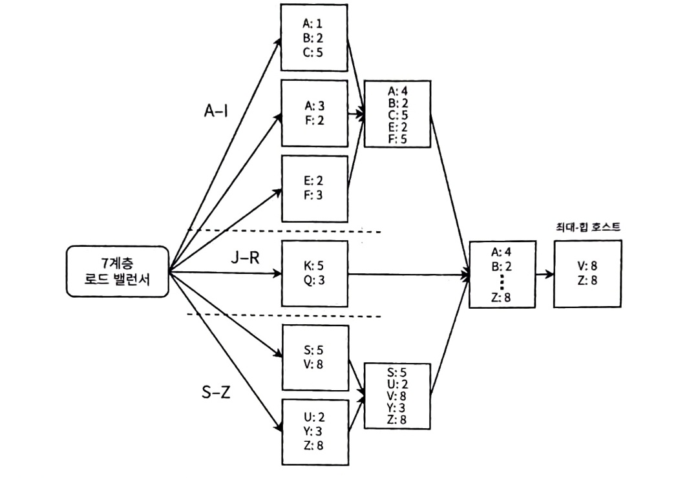
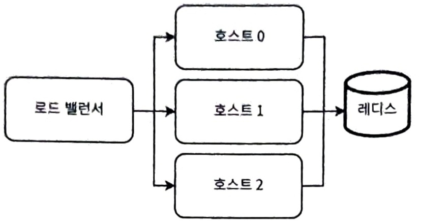

# 4 데이터베이스 확장
- 데이터베이스 확장 개념, 트레이드오프 등을 설명
### 4.1 저장 서비스의 이해
- 상태 저장 서비스이며, 일관성 보장 메커니즘과 데이터 손실을 피하기 위한 복제 필요
  - 강한 일관성 보장 또는 최종 일관성 메커니즘 선택
- 일관성, 복잡성, 보안, 지연 시간등 다양한 요구사항에 따라 트레이드오프 해야함
  - 최대한 상태 비저장 서비스를 유지하고 상태 저장 서비스에만 상태를 유지하는 이유
- 모든 상태를 저장 서비스로 미뤄냄으로써 적합한 저장/데이터베이스 기술을 선택할 수 있고, 상태 관리 등 실수를 피할 수 있는 이점 존재
- 스토리지 분류
  - 데이터베이스
    - SQL
      - 테이블과 테이블 간의 관계
      - ACID 속성
    - NoSQL
      - 모든 SQL 속성을 갖지 않음
    - 칼럼 지향
      - 효율적인 필터링을 위해 데이터 행 대신 열 구성. 카산드라
    - 키-값
      - 키는 해싱 알고리즘을 통해 디스크 위치에 대응
      - 읽기 성능이 좋음
      - 주로 캐싱에 사용되며, LRU와 같은 다양한 기법 사용
      - Memcached와 레디스
  - 문서
    - 값 크기 제한이 없거나 키-값 DB보다 훨씬 큰 제한이 있는 키-값 DB로 해석 가능
    - 값은 다양한 형식(텍스트,Json 등)
    - MongoDB
  - 그래프
    - 엔티티 간의 관계를 효율적으로 저장하게 설계
    - Neo4j, 아마존 넵튠 
  - 파일 스토리지
    - 데이터가 파일에 저장, 디렉터리/폴더 구성
  - 블록 스토리지
    - 고유 식별자가 있는 균일한 크기의 청크로 저장
    - 저장 시스템의 저수준 구성 요소로 설계가 됨
  - 객체 스토리지
    - 파일 스토리지보다 더 평평한 계층 구조를 가짐
    - HTTP API로 접근
    - 객체 쓰기가 느리고 객체 수정이 불가능
    - AWS s3

### 4.2 데이터베이스 사용 결정
- 저장 방법 결정
  - DB? 파일? 블록? 객체스토리지?
- 면접 중 특정 접근 방식을 선호할 수 있다고 할 수 있지만 모든 요인 설명 후 의견 고려가 필요할 수도 있음
- 저장 방법 결정에는 정답은 없음 -> 재량과 경험 방법에 따름
  - MS에서는 256kb보다 작으면 DB, 1M보다 크면 파일시스템, 그 사이면 읽기:쓰기 비율과 객체 덮어쓰기나 교체 비율이 중요

### 4.3 복제
- DB를 확장하는 방법은 복제, 분할, 샤딩
  - 복제: 데이터 사본을 만들어 다른 노드에 저장
  - 분할과 샤딩: 모드 데이터 집합을 부분 집합으로 나누는 것
    - 샤딩은 부분 집합이 여러 노드에 분산
- 단일 호스트 한계
  - 내결함성
    - 노드 또는 네트워크 장애 시, 데이터를 백업
    - 장애 발생 시, 다른 노드로 전환하도록 장애 조치 프로세스 정의 가능
  - 더 높은 스토리지 용량
    - 단일 노드는 사용 가능한 큰 용량의 여러 하드 드라이브를 포함
    - 단일 노드는 수직 확장할 수 있지만 금전적으로 비쌈
  - 더 높은 처리량
    - 여러 동시에 프로세스와 사용자의 읽기 쓰기 처리
    - 수직 확장은 한계에 빨리 도달
  - 더 낮은 지연 시간
    - 분산 사용자와 더 가까워지게 복제본을 지리적으로 분산 가능
    - 특정 지역에서 데이터 읽기가 많다면 데이터 센터의 특정 복제본 수 늘림
- 읽기기 확장하려면 복제본 수를 늘리면 됨, 쓰기 확장은 더 어려움

##### 4.3.1 복제본 분산
- 같은 랙의 호스트에 하나의 백업, 또는 다른 랙이나 다른 데이터 센터 둘 다에 백업을 둠
- 데이터는 샤딩이 될수 있으며, 샤딩의 주요 트레이드오프는 샤드 위치를 추적해야하는 복잡성 증가
  - 스토리지 확장: 데이터가 단일 노드 커버가 힘들면 노드간 샤딩
  - 메모리 확장: 수직 확장은 금전적 많은 부담이기에 샤딩 필요
  - 처리 확장: 샤딩된 데이터베이스는 병렬 처리의 이점 활용
  - 지역성: 특정 클러스터 노드가 필요로 하는 데이터는 로컬 저장될 가능성 높게끔 샤딩

##### 4.3.2 단일 리더 복제
 
- 모든 쓰기 작업이 리더라고 하는 단일 노드에서 발생 -> 쓰기가 아닌 읽기 확장에 관한 것
  - SQL 서비스는 ACID 일관성을 잃음
  - 높은 트래픽 서비스 제공을 위해 수평 확장으로 고려
- 주 리더가 실패하면 장애 조치 프로세스가 보조 리더를 주 리더로 승격 시킴 -> 주 리더는 보조 리더로
- 단일 노드는 팔로워와 동유할 수 있는 처리량 제한 -> 다중 수준 복제로 확장
  - 일관성이 더 지연된다는 트레이드 오프 존재
- 구현하기 가장 간단하다는 장점, 전체 데이터 베이스가 단일 호스트와 맞아야 한다는 것과 최종 일관성이라는 조건 존재
- 단일 리더 복제를 확장하기 위한 좋은 방법 -> 애플리케이션 계층의 쿼리 로직
  - 데이터 양이 점점 많아 질 수록 SQL 연동 부분에 대한 수정 작업 진행
##### 4.3.3 다중 리더 복제
- 단일 리더 복제에는 없는 경쟁 조건을 처리해야함
- 여러 노드가 리더로 지정되며 모든 리더에게 쓰기를 수행 가능 -> 리더는 자신의 쓰기 내용을 다른 모든 노드에게 복제
- 일관성 문제와 접근 방식
  - 복제는 순서가 중요한 작업, 작업 순서를 정하기 위해 타임스탬프를 사용할 순 없음 -> 책에서는 복제 문제를 다루지 않겠음(면접에서는 일관성과 관련된 복제 문제와 시나리오를 다루기 때문)
    - 클록 스큐 현상 발생 -> 여러 장치나 서버 간의 시간 차이를 나타냄
  - 일관성은 트랜잭션이 유효한 상태에서 다른 유효한 상태로 전환하면서 불변성을 유지하게 끔 보장하는 것
    - 모든 데이터는 제약 조건, 연쇄, 트리거나 조합을 포함한 모든 정의된 규칙에 따라 유효
    - 간단한 해석은 모든 사용자에게 데이터가 동일해야 한다는 것
  - 일관성 요구사항을 유연하게 조정할 방법을 찾아야함 -> 모든 사용자에게 일관성을 유지해야하는 데이터의 양을 최소화하는 접근 방식 필요
    - 케이스 마다 다양한 접근 방식 존재
##### 4.3.4 리더 없는 복제
- 모든 노드가 동등 -> 읽기와 쓰기는 어느 노드에서나 일어날 수 있음
- 경쟁 조건은 정족수 개념을 도입 -> 일관성을 원한다면 빠른 쓰기와 빠른 읽기 중 선택
  - 빠른 쓰기 -> 낮은 쓰기 정족수와 높은 읽기 정족수
  - 빠른 읽기 -> 높은 쓰기 정족수와 낮은 읽기 정족수
- 카산드라나 다이나모에서 해당 형태로 사용
##### 4.3.5 HDFS 복제
- HDFS 복제는 위의 세가지 방식 중 어느 것에도 깔끔하게 들어맞지 않음

##### 4.3.6 추가 읽을 거리
- 마틴 클레프만 저서(데이터 중심 애플리케
- 이션 설계)에서 다음과 같은 주제에 대해 더 자세히 알수 있음
  - 읽기 복구, 안티 엔트로피, 튜블과 같은 일관성 기법
  - CouchDB, MySQL 그룹 복제, Postgres에서의 다중 리더 복제 합의 알고리즘 구현
  - 스플릿 브레인과 같은 장애 조치 문제
  - 이러한 경쟁 조건을 해결하기 위한 다양한 알고리즘

### 4.4 샤딩된 데이터베이스로 저장 용량 확장하기
- 데이터베이스 크기가 단일 호스트의 용량을 초과해 증가하면 오래된 행을 삭제해야함 -> 오래된 데이터를 보존해야한다면?
  - 샤딩된 스토리지는 수평으로 확장 가능하고 이론상 더 많은 호스트를 추가하는 것만으로 무한한 저장용량 지원 가능
- 다른 접근 방식으로 소비자의 기기나 로컬스토리지에 데이터를 저장하는 것 -> 프론트가 처리해야함
##### 4.4.1 샤딩된 RDBMS
- 아마존 RDS와 같은 샤딩된 RDBMS 솔루션을 사용하거나 자체 샤딩된 SQL을 구현 가능
  - JOIN 쿼리가 훨씬 느려짐 -> 각 노드와 다른 모든 노드사이의 트래픽을 수반함
  - 집계 작업에는 DB와 애플리케이션이 모두 관여
    - 각 노드는 값을 계산하여 집계된 값을 애플리케이션을 반환하고, 애플리케이션은 산술로 최종결과 반환

### 4.5 이벤트 집계하기
- 샘플링과 집계는 DB 쓰기 빈도를 줄이는 일반적인 기법
- 데이터 샘플링은 특정 데이터 포인트만 고려하고 다른 것은 무시하는 것
  - 쓰기에서 샘플링을 하면 모든 데이터 포인트를 쓰는 것보다 낮은 빈도로 데이터를 씀
  - 개념적으로 간단하며 면접 중 언급 가능
- 이벤트 집계는 여러 이벤트를 단일 이벤트로 집계/결합하는 것
  - 스트리밍 파이프라인을 사용해 구현 가능
##### 4.5.1 단일 계층 집계
 
- 로드 밸런스를 통해 균등하게 분산
- 각 호스트 메모리에 집계 -> 주기적 또는 메모리 부족해 때 데이터베이스에 기록
##### 4.5.2 다중 계층 집계
- 이전 계층의 상위 호스트로부터 이벤트를 집계
- 최종 계층에서 원하는 수의 다다를 때까지 호스트 수를 점진적으로 줄일 수 있음
- 집계 트레이드 오프는 최종 일관성과 증가된 복잡성
  - 쓰기 지연으로 인해 DB 데이터는 과거의 데이터
  - 복제, 로깅 모니터링 등 시스템 복잡성
##### 4.5.3 분할
 
- 7계층 로드밸런서가 필요 -> 이벤트를 처리하여 특정 호스트에게 전달
- 이벤트 트래픽은 정규 분포를 따를 것으로 예상, 특정 파티션이 불균형적으로 높은 트래픽을 받을 수 있음 -> 각 파티션에 다른 수의 호스트를 할당
- 파티션의 수와 범위 조정
  - {A-I, J-R, S-Z} -> {{A-B,D-F},{C, G-J},{K-S},{T-Z}} 와 같이 재구성
##### 4.5.4 대규모 키 공간 처리하기
- 실제 키 공간은 예시와 다른게 방대할 수 있음 -> 다음 계층에서 집계를 하기에 오버플로우 가능성 예상
  - 초기 집계 계층의 호스트는 추후 계층을 고려하여 적은 메모리 활용 필요
##### 4.5.5 복제와 내결함성
 
- 호스트가 다운되면 집계된 모든 이벤트를 잃게 됨 -> 체크 포인팅과 데드 레더큐 고려 가능? 여러 계층이 있는 집계에는 비추천
  - 많은 반복 처리 발생 -> 리소스 낭비 및 집계 지연
- 각 노드를 레디스와 같은 공유 인메모리 데이터베이스에 요청을 보내는 여러 상태 비 저장 클러스터로 구성된 독립된 서비스로 전환
  - 각 서비스는 레디스 클러스터를 갖고 있어 같은 키에 대한 쓰기 경쟁이 없음
  - 집계된 이벤트는 플러쉬 되기에 무제한으로 증가 되지 않음

### 4.6 배치와 스트리밍 ETL
- ETL은 하나 이상의 소스에서 데이터를 복사해 대상 시스템으로 옮기는 절차
- 배치는 주기적으로 데이터를 배치하는 것을 의미하지만 수동으로 트리거될 수 있음(Polling 유사)
  - 에어플로, 루이지
- 스트리밍은 실시간으로 처리될 데이터의 연속적인 흐름을 의미함(Interrupt 유사)
  - 카프라, 플링크
  - Flume, Scribe는 로깅을 위한 특화된 스트리밍 도구
- ETL 파이프라인은 작업의 방향성 비순환 그래프(DAG)로 구성
  - 노드는 작업에 해당
  - 선행자는 의존성을 나타냄 
  - 작업은 ETL 파이프라인의 단일 실행을 의미

##### 4.6.1 간단한 배치 ETL 파이프라인
- 간단한 배치 ETL 파이프라인은 크론탭,두 개의 SQL 테이블, 각 작업을 위한 스크립트를 사용해 구성
  - 크론은 병렬성이 없고 단일 서버로 충분한 작업 규모의 중요하지 않은 작업에 적합
- 위와 같은 설정의 단점
  - 확장성이 없고, 모든 작업이 단일 호스트에서 실행
    - 단일 장애 지점
    - 특정 시간 모든 작업을 실행하기에 충분한 계산 리소스가 없을 수 있음
    - 호스트의 저장 용량을 초과 가능
  - 작업은 수많은 작은 태스크로 구성 -> 작업 실패 시, 재반복 이슈(명등성 보장 x)
  - 스트립트와 테이블에서 작업 일관성 보장하는 검증 도구가 없어, 프로그래밍 오류에 취약
  - GUI 미존재
  - 로깅이나 모니터링, 경로가 추가적으로 필요

##### 4.6.2 메시징 용어
- 메시징 시스템
  - 데이터 전송과 공유의 복잡성을 줄이기 위해 한 APP에서 다른 APP으로 데이터를 전송하는 시스템
- 메시지 큐
  - 메시지를 대기하면서 처리되기 기다리는 큐
- 발행자/구독자
  - 이벤트를 생성하는 서비스와 이벤트를 처리하는 서비스를 분리하는 비동기 메시지 시스템
- 메시지 브로커
  - 발시자 메시징 프로토콜에서 수신자 메시징 프로토콜로 메시지를 번역하는 프로그램
- 이벤트 스트리밍
  - 실시간으로 처리되는 연속적인 이벤트 흐름
- 풀(pull)과 푸쉬(push)
  - 서비스간 통신은 풀이나 푸시로 수행
    - 풀이 구독자의 부하를 줄일 수 있는 방법이기에 선호
    - 푸쉬가 나은 경우는 손실을 허용하는 애플리케이션 경우

##### 4.6.3 카프카와 RabbitMQ
- 카프카는 RabbitMQ보다 더 복잡하며 더 많은 기능을 제공
  - 카프카는 RabbitMQ를 대신 활용할 수 있지만 그 반대는 아님
- 차이점

| 카프카                             | RabbitMQ                                |
|---------------------------------|-----------------------------------------|
| 확장성,신뢰성, 가용성 적용 설계.  복잡한 설정 필요 | 설정 간단, 기본적 확장성 없음                       |
| 주키퍼에서 호스트 IP 구성                 | 로드밸런서 따로 필요 ->  카프카보다 더 많은 설정 필요하며 더 열등함 |
| 복제 기능 존재, 내구성 있는 메시지 브로커    | 기본적인 확장성 및 내구성 미존재                      |
| 이벤트 소비 후에도 제거되지  않은 같은 이벤트 반복 소비 가능 | 디큐잉 시 제거                                |
| 큐라는 개념보단 리스트 개념                 | 메시지당 여러 구독자 허용을 위해  여러 큐를 만들수 있음         |
| 이벤트 보존 기간 구성 가능                 | 큐 우선 순위 개념 존재                           |

##### 4.6.4 람다 아키텍처
- 배치와 스트리밍 파이프라인을 병렬로 실행해 빅데이터를 처리하는 아키텍처
  - 고속 파이프라인은 낮은 지연시간, 빠른 업데이트를 위해 일관성과 정확성을 타협 -> 저속은 반대
- 고속 파이프라인은 아래와 같은 기법 사용
  - 근사 알고리즘
  - 레디스와 같은 메모리 내 데이터베이스
  - 더 빠른 처리를 위해 복제하지 않아 노드 중단 시, 데이터 손실과 낮은 정확도 존재
- 저속 파이프라인은 보통 하이브나 HDFS와 함께 사용되는 스파크와 같은 맵리듀스 데이터베이스 사용
- 람다 아키텍처 대안으로 카파 아키텍처 존재

### 4.7 비정규화
- 데이터를 단일 호스트에 저장할 수 있다면 SQL을 선택하고 스키마를 정규화 하는 것
- 정규화의 단점
  - Join 쿼리가 개별 테이블 쿼리보다 훨씬 느림 -> 실제 비정규화가 자주 수행
  - Join 쿼리는 단일 쿼리보다 일반적으로 더 복잡하고 길기 때문에 작성과 유지보수가 어려움
- Join 쿼리를 피하기 위해 스키마를 비정규화 해 저장 공간을 속도와 맞바꾸는 것
  
### 4.8 캐싱
- DB에서 빈번히 조회되는 데이터 또는 쿼리를 메모리에 캐시 가능
- 캐시 이점
  - 성능: 디스크보다 빠르고 비싼 메모리를 사용
  - 가용성: DB를 사용할 수 없더라도 대체 가능
  - 확장성: 자주요청 되는 데이터를 제공함으로서 서비스 부하를 낮출 수 있음
- gateway, 각 서비스 등 여러 수준에서 캐시가 활용 가능
##### 4.8.1 읽기 전략
- 캐시 어사이드(지연로드)
  - 데이터베이스 '옆에' 위치하며 데이터를 지연 로드함
  - 읽기 요청에서 애플리케이션이 캐시에 먼저 요청하고 있으면 데이터 반환, 없으면 DB에 요청 후 캐시에 쓰기
  - 읽기 위주의 부하 처리 방식에 가장 적합
  - 장점
    - 읽기 요청 수와 리소스 소비를 최소화
    - 필요한 캐시 용량을 쉽게 결정하고 필요에 따라 조정해 비용 절감
    - 구현 단순
  - 단점
    - 캐시된 데이터가 오래되거나 일관성이 없어질 수 있음
    - 캐시 미스가 있는 요청은 DB에서 읽는것보다 느림
- 읽기 통과
  - 애플리케이션은 캐시에 요청을 보내고, 필요하면 캐시가 데이터베이스에 요청
  - 읽기 위주의 부하에 가정 적합
  - 트레이드오프로는 캐시 어사이드와 달리 여러 데이터베이스 요청을 단일 캐시 값으로 그룹화할 수없음
##### 4.8.2 쓰기 전략
- 더 높은 지연시간이나 복잡성을 대가로 캐시가 오래되지 않도록 최적화
- 쓰기 통과 방식
  - 모든 쓰기 작업은 캐시를 거쳐 DB에 전달
  - 장점
    - 일관성이 있음 -> 캐시가 오래된 상태가 되지 않음
  - 단점
    - 캐시와 DB쪽에 쓰기가 되기에 쓰기 속도가 느림
    - 누락된 데이터와 캐시 미스로 인한 콜드 스타트 문제 -> 캐시 어사이드 방식으로 해결 가능
    - 대부분 데이터는 읽히지 않아도 되기에 불필요한 비용 발생 -> TTL을 통해 해결 가능
    - 캐시 크기가 DB보다 작으면 가장 적절한 캐시 제거 정책을 결정 필요
- 지연 쓰기/후속 쓰기 방식
  - 데이터를 캐시에 쓰지만 캐시가 DB에 바로 쓰지 않고 주기적으로 갱신
  - 장점
    - 쓰기 통과 방식보다 쓰기가 빠름
  - 단점
    - 쓰기 속도를 제외하면 단점은 쓰기 통과 방식과 같음
    - 캐시 가용성이 높아야하므로 성능/지연 시간을 개선하기 위해 가용성을 줄일 수 없어 복잡도가 높음
- 쓰기 우회 방식
  - 애플리케이션은 데이터베이스에만 기록
  - 캐시 어사이드 방식이나 읽기 동시 방식과 결합해 사용 -> 캐시 미스 발행할 때 캐시 갱신

### 4.9 독립 서비스로서의 캐싱
- 캐싱을 왜 독립적으로 하는 이유
  - 서비스는 상태 비저장으로 설계되어 있으며 각 요청은 무작위로 분배됨 -> 캐시 히트율 고려
  - 캐싱 핫샤드를 유발하는 불균형한 요청 패턴이 있을 경우 유용함
  - 호스트에 캐쉬가 있으면 배포마다 초기화 이슈
  - 캐시를 서비스하는 대상과 독립적으로 확장 가능
  - 많은 클라이언트가 캐시 미스되는 데이터를 보내면 데이터베이스에서 중복되는 쿼리를 여러번 실행 -> 불필요한 서비스 트래픽 발생

### 4.10 캐시할 수 있는 다양한 종류의 데이터와 캐싱 방법 예시
- HTTP 응답이나 데이터베이스 쿼리를 캐시 가능
- 캐시는 개인용 혹은 공용이거나 공유 가능
  - 개인용 캐시는 클라이언트에 있으며 개인 컨텐츠에 유용
  - 공용 캐시는 CDN과 같은 프록시나 서비스에 존재
- 캐시 하지 말아야할 정보
  - 개인 정보
  - 주식 가격과 같은 실시간 공개 정보
  - 책과 같은 결제가 필요한 유료 저작권 콘텐츠
  - 변경될 수 있는 공개 정보는 캐시할 수 있지만, 원본 서버를 재검증해야 함
- 오랫동안 변경되지 않을 공개 정보는 긴 캐시 만료 시간으로 캐시 가능(기차표 등)
- 모든 계층(gateway, 로드 밸런서, 백엔드 등)에 캐시해 지연 시간과 비용을 낮출 수 있음

### 4.11 캐시 무효화
- 캐시 항목을 교체하거나 제거하는 과정
- 캐시 버스팅은 파일에 대한 캐시 무효화
##### 4.11.1 브라우저 캐시 무효화
- 보통 max-age로 설정
- 만료전 새 파일에 대해서는 핑거 프린트 기법을 통해 파일의 새로운 식별자(버전 번호 등)를 부여
  - image.png -> imageb12334.png or image.png?ajskdjksjd
  - immutable cache-control 옵션을 사용해 원본 서버에 대한 불필요 요청 방지
  - Get요청이나 파일을 캐싱할 때 중요
##### 4.11.2 캐싱 서비스의 캐시 무효화
- 클라이언트 캐시는 직접 접근할 수 없어 max-age or 핑거 프린트 기법 활용
- 캐싱 서비스의 항목은 직접 생성, 교체, 제거 가능
- 몇가지 정책
  - 무작위 교체: 캐시가 가득 찼을 때, 무작위 항목 교체
  - LRU: 가장 최근 사용된 항목을 먼저 교체
  - FIFO: 추가 순서대로 교체
  - LIFO: 추가 역순대로 교체

### 4.12 캐시 워밍
- 해당 항목에 대한 첫 요청 전에 캐시를 항목으로 미리 채우는 것을 의미 -> 첫 요청에 대한 캐시 미스 방지, 후속 요청과 같은 낮은 지연시간을 가짐
  - 브라우저 캐시에는 적용되지 않음
- 캐시 워밍 단점
  - 추가적인 복잡성과 비용, 캐싱 서비스는 수천 개의 호스트를 포함할 수 있으며 이를 워밍하는 것은 복잡하고 비용이 많이 듬
  - 캐시를 채우기 위해 서비스에 쿼리하는 과정에서 추가적인 트래픽 부하
  - 캐시 만료 시간이 짧으면 캐시 워밍 의미가 퇴색
- 캐시 없이 처리된 요청의 P99는 일반적으로 1초 미만 필요
