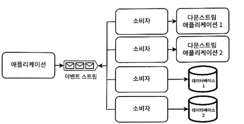

# 5 분산트랜잭션
- 트랜잭션은 서비스 간 데이터 일관성을 유지하기 위해 여러 읽기와 쓰기를 논리적 단위로 그룹화
  - 원자적으로 실행 -> 전체 커밋 or 롤백
- ACID 개념에 대한 이해는 데이터베이스마다 다르므로 구현도 다름
- 분산트랜젹션에서 일관성을 유지하기 위한 알고리즘
  - 이벤트 소싱, 변경 데이터 캡처, 이벤트 기반 아키텍쳐(EDA)의 관련 개념
  - 체크포인팅과 데드 레더 큐
  - 사가 패턴
  - 2단계 커밋
  
### 5.1 이벤트 기반 아키텍쳐(EDA)
- 이미 발생한 이벤트를 알림으로써 실현되는 아키텍처
- 비동기적이고 논블로킹 방식
  - 상당한 시간이 걸리고 높은 지연을 초래할 수 있음
  - 느슨한 결합, 확장성, 응답성을 강화
- 대조되는 방식으로는 아키텍처는 서비스끼리 직접 요청
  - 어느 서비스 이슈(성능 저하, 사용 불가)가 전체 서비스에 ㄴ영향을 미침 
  - 요청 처리에 걸리는 시간 동안 스레드 소비 중 -> 트래픽이 급증 부각, 504 유발
  - 클라이언트도 요청에 대한 스레드 소비 중 이슈
  - 트래픽 급증으로 인한 실행 방지 요책은 자동 확장 솔루션, 대규모 클러스터 유지 -> 많은 비용, 낮은 확장성, 복잡
    - 강력한 일관성과 낮은 지연시간이 꼭 필수는 아닐수도...
- EDA의 예로 이벤트 소싱과 데이터 캡처

### 5.2 이벤트 소싱
- 추가 전용 로그에 이벤트로 데이터나 데이터 변경을 저장하는 패턴
  - 이벤트 로그가 신뢰할 수 있는 단일 데이터 출처
  - 모든 데이터베이스는 이벤트 로그에서 파생된 데이터
- 모든 쓰기는 이벤트 로그에 이뤄짐 -> 쓰기 성공 후 다른 핸들러가 새로은 이벤트를 소비하고 DB에 쓰기
- 다양한 방식으로 구현 가능
  - 카트파 토픽과 같은 이벤트 스토리지
  - RDB 또는 몽고 DB와 같은 문서 DB
  - redis와 같은 인메모리 DB
- 이벤트 스토리지, 복원, 버전 관리, 스키마 관리를 해줘야해서 시스템 설계 및 개발 복잡성, 저장 요구사항 증가

### 5.3 변경 데이터 캡처(CDC)
 
- 데이터 변경 이벤트를 이벤트 스트림에 기록하고 API를 통해 제공하는 방식
  - 이벤트 스트림에 단일 이벤트로 발행
- 이벤트 소싱보다 일관성이 높고 지연시간이 낮음
  - 소비자가 처리하기 전 요청이 로그에 일정 시간 머무를 수있는 것(이벤트 소싱)과 달리 거의 실시간 처리
- 트랜잭션 로그 테일링 패턴 -> 트랜잭션 로그 마이너라는 프로세스가 트랜잭션 로그를 테일링 하고 이를 이벤트 생성 
- 플랫폼으로 debezium, 다이나모DB 스트림 등이 있음
- 트랜잭션 로그 마이너는 중복 이벤트 생성 가능 -> 메시지 브로커의 '정확히 한 번 전달' 메커니즘 활용 or 이벤트 멱등하게 정의 처리

### 5.4 이벤트 소싱과 CDC 비교
- EDA, 이벤트 소싱, CDC는 다운 스트림 서비스로 데이터 변경 전파를 위한 개념
  - 비동기 통신 패턴을 사용해 데이터 변경을 전달함으로써 서비스를 분리
  - 일부 시스템에서 이벤트 소싱과 CDC를 함께 사용(이벤트 기록하고 CDC를 통해 이벤트를 전파)

| 이벤트 소싱                       | 변경 데이터 캡처(CDC)                          |
|------------------------------|-----------------------------------------|
| 이벤트를 기준으로 데이터 기록             | 다운 스트림 서비스로 이벤트를 전파해 데이터 변경 동기화         |
| 로그나 로그에 발행된 이벤트가 기준 데이터      | 발행자 서비스의 데이터베이스, 발행된 이벤트가 기준 데이터는 아님 |
| 특정 작업이나 상태 변경을 나타내는 세분화된 이벤트 | 개별 데이터베이스 수준의 변경                        |

### 5.5 트랜잭션 감독자
- 트랜잭션이 성공적으로 완료되거나 취소되게 보장하는 프로세스
  - 주기적인 배치작업이나 서버리스 함수로 구현 가능
- 불일치 수동 검토와 보상 트랜잭션의 수동 실행을 위한 인터페이스 선행 구현
  - 보상 트랜잭션 자동화하는 것에 세심하게 신경써서 구현 -> 데이터 손실이나 디버그가 어려움
- 보상 트랜잭션은 수동/자동 상관없이 항상 기록되어야함

### 5.6 사가 패턴
- 트랜잭션으로 작성할 수 있는 장기 실행 트랜잭션
  - 모든 트랜잭션이 성공하지 못하면 -> 전체 롤백을 위한 보상 트랜잭션 실행
  - 사가 패턴 자체는 상태 비저장
- 일반적인 구현은 메시지 브로커를 통해 통신하는 서비스 포함
- 코레오그래피(병렬)과 오케스트레이션(선형) 방법 존재

##### 5.6.1 코레오그래피 방식
- 사가 패턴을 시작하는 서비스는 2개의 토픽으로 통신
  - 트랜잭션을 시작하는 토픽, 최종 로직을 수행하기 위한 토픽
- 중간 단계 토픽에 실행 유무를 통해 타 서비스에서 롤백하기 위한 보상트랜잭션 실행
- 다음과 같은 주목 사항 존재
  - 양방향 선이 없음 -> 서비스가 동일한 토픽 생성 및 구독하지 않음
  - 두개의 서비스가 동일한 토픽에 생성하지 않음
  - 서비스는 여러 토픽을 구독할 수 있음
  - 토픽과 서비스 간의 관계는 '1:다' or '다:1'일 수 있지만, '다:다'는 아님
  - 순환 가능 -> '호텔 토픽 > 결제 서비스 > 결제 토픽 > 호텔서비스 > 호텔 토픽'
- 여러 토픽과 서비스 사이에 많은 선이 존재
  - 지나치게 복잡
  - 오류 발생하기 쉬우며, 유지보수 어려움
##### 5.6.2 오케스트레이션 방식
- 사가 패턴을 시작하는 서비스가 오케스트레이터 -> 카프카 토픽을 통해 각 서비스와 통신
  - 오케스트레이터는 이벤트에 반응하고 명령을 발행하는 유한 상태 기계, 
  - 보상 메커니즘을 제외하고 다른 비즈니스로직을 포함하면 안됨
- 서비스 중 어느 하나라도 예약 토픽에 오류 응답을 생성하면 오케스트레이터는 보상 트랜잭션 실행(보상 트랜잭션 관련 이벤트 발행)
##### 5.6.3 비교

| 코레오그래피 방식                                    | 오케스트레이션 방식                                  |
|----------------------------------------------|---------------------------------------------|
| 서비스 요청이 병렬로 이뤄짐 (관찰자 객체 지향 설계)            | 서비스 요청이 선형적으로 이뤄짐 (컨트롤러 객체 지향 설계)        |
| 분산트랜잭션을 위한 토픽과  최종 로직 수행을 위한 토픽 필요        | 카프카 토픽을 통해 각 서비스와 통신                        |
| 사가 패턴을 시작하는 서비스는 첫번째 토픽과 마지막 토픽 소비 코드만 존재 | 사가 패턴의 단계에 해당하는 카프카 토픽을 생성하고  소비하는 코드 존재 |  
| 여러 토픽을 구독해야할 수 있음                            | 오케스트레이터를 제외하고 각 서비스는 하나의 토픽만 구독          |
| 덜 집약적이고,통신량이 적으며, 지연시간이 낮음                | 이벤트가 코레오그래픽의 2배 통신량이 많으며, 지연시간이 높음       |
| 병렬 요청도 지연시간을 낮춤                              | 요청이 선형적이므로 지연시간이 높음                      |
| 하나이 서비스 변경을 위해  모든 서비스 이해                 | 서비스가 더 독립적                                  |
| 단일 장애 지점 미존재                                 | 오케스트레이션 서비스는 높은 가용성을 가져야함                   |
| 보상트랜잭션은 다양한 서비스에 트리거                         | 보상트랜잭션은 오케스트레이터의 의해 트리거                     |

### 5.7 다른 트랜잭션 유형
- 합의 알고리즘 분산 DB에서 많ㅇ은 수의 노드 합의를 달성하는 유용
  - 정족수 쓰기
  - 팍소스와 EPaxos
  - Raft
  - Zap