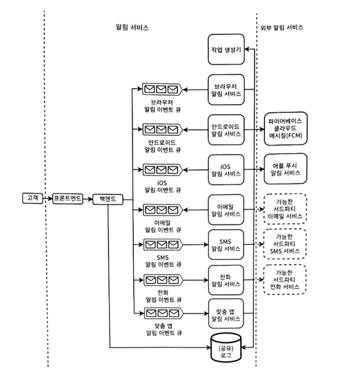
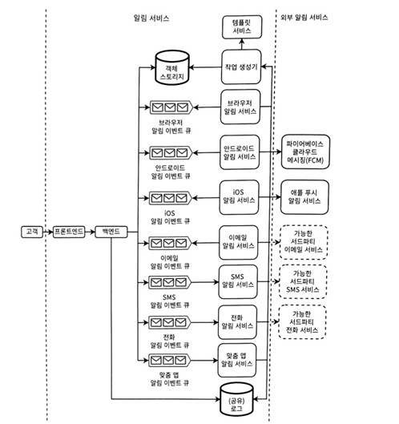
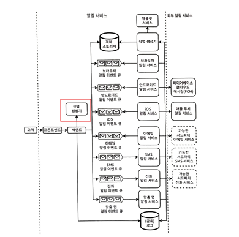
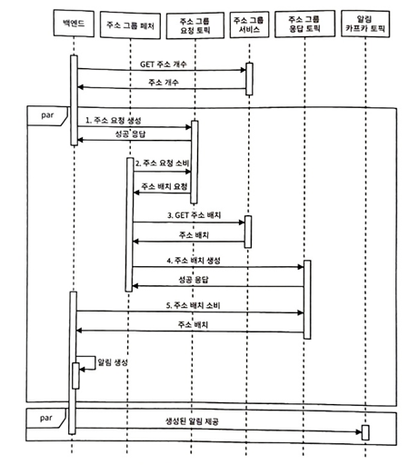

# 9 알림/경보 서비스 설계
- 여러 서비스에서 사용하는 공통 기능을 일반화 필요
- 사용자에게 알림 전송기능은 대부분 시스템의 필수적인 요구사항
### 9.1 기능 요구사항
##### 9.1.1 가동 시간 모니터링용이 아님
- 다양한 채널 메시지를 보낼 수 있는 서비스 설계
  - 메시징 서비스를 사용하지만 그것을 설계 하진 않음
- 모니터링하는 다른 서비스와 동일한 공유 인프라나 서비스를 사용해 가동 시간 모니터링을 구현할 수 있는가? (무슨소리?)
  - 이 접근 방식에 따라 이 서비스를 가동 시간 모니터링, 즉 다른 서비스의 중단 경보 트리거에 사용해서는 안된다고 가정한다
```
가동 시간(availability)을 정확히 모니터링하려면, 모니터링 시스템은 모니터링 대상과 "분리된 인프라"에서 동작해야 한다는 원칙을 말하고 있습니다.
예를 들어, 같은 클러스터에서 돌고 있는 Prometheus를 써서 모니터링하면, 클러스터 전체가 다운될 경우 감지를 못 할 수도 있습니다. 그래서 PagerDuty, 외부 Ping 서비스, 독립된 헬스체커(예: AWS Route53 헬스 체크) 등이 필요하다고 보는 거죠.
```

##### 9.1.2 사용자와 데이터
- 주요 사용자 역할
  - 발신자
    - 알림 CRUD
    - 알림 보내는 사람이나 서비스
  - 수신자
    - 알림 받는 앱의 사용자
  - 관리자
    - 알림 서비스 관리자 접근 권한이 있는 사람
    - 알림 템플릿, 알림 전달 권한 부여 등
- 알림 크기는 1MB로 제한

##### 9.1.3 수신자 채널
- 다양한 채널을 통해 알림을 보낼 수 있는 기능을 지원해야함
  - 브라우저
  - 이메일
  - SMS
  - 자동 전화 통화
  - 안드로이드, IOS
  - 앱 내 맞춤형 알림

##### 9.1.4 템플릿
- 동일한 알림을 많은 수신자에게 전달 가능 -> 중복 데이터가 많음
- 템플릿을 활용하면 알림 서비스로의 트래픽이 줄여짐
- 템플릿 생성 관리 등을 위한 다양한 기능 제공 가능 
  - 초기 논의는 템플릿 CRUD로 제한

##### 9.1.5 트리거 조건
- 알림은 수동이나 프로그래밍 방식으로 트리거 가능
  - 바로 발송
  - 예약 발송

##### 9.1.6 구독자, 발신자 그룹, 수신자 그룹
- 수신자 그룹
  - 매선 수신자 목록 사용 대신 수신자 그룹을 통해 알림 발송
  - RBAC 고려
  
##### 9.1.7 사용자 기능
- 제공할 수 있는 다른 기능
  - 발신자 중복 알림 요청을 식별하고 수신자에게 중복 알림을 보내지 않아야함
  - 사용자가 과거 알림 요청을 볼 수 있게 해야함
  - 이름이나 설명과 같은 다양한 필드로 구성이나 템플릿을 찾을 수 있어야함
  - 알림의 상태를 조회할 수 있어야함
  - 시스템 우선순위가 높은 알림을 먼저 처리

##### 9.1.8 분석
- 알림 서비스를 설계하면서 논의

### 9.2 비기능적 요구사항
- 스케일
  - 매일 수십억 개의 알림 발송
- 성능
  - 몇 초내로 알림 전달
- 고가용성
  - 99.999% 가동 시간
- 내결함성
  - 수신자가 알림을 받을 수 없으면 다음 기회에 알림 수신
- 보안
  - 인증된 사용자만 알림 보낼 수 있어야함
- 프라이버시
  - 수신자는 알림 수신을 거부할 수 있어야함

### 9.3 초기 고수준 아키텍처
<br>
- 다음 사항 고려해 설계
  - 단일 인터페이스가 있는 단일 서비스를 통해 수행, 채녈과 매개 변수 지정
  - 각 채널은 별도의 서비스로 처리
  - 공통 채널 서비스 로직을 다른 서비스에서 중앙 집중화 -> 작업 생성기
  - 다양한 채널을 통한 알림은 타사 서비스에서 처리(FCM, 애플 푸시 등)
- 비동기 기반 알림 서비스를 통해 예측할 수 없는 트래픽 급증 처리
- 알림 채널은 채널 서비스라고 하는 별도의 서비스로 구현돼야 함 -> 특정 채널에서 특정 프로토콜 등 필요
- 알림 서비스는 채널 서비스와 다른 서비스 간에 연결이 없으므로 시스템 내결함성이 높아짐
  - 채널 서비스를 알림 서비스 외의 다른 서비스에서도 사용 가능
  - 채널 서비스를 다른 서비스와 독립적으로 확장 가능
- 프론트 인증은 OIDC 사용을 통해 인가된 사용자만 채널 서비스 알림 전송 요청 가능
- 프론트엔드는 다음과 같은 공통 작업을 제공
  - 속도 제한
    - 너무 많은 요청으로 5xx오류 방지
  - 프라이버시
    - 기기나 계정으로 보내는 알림을 규정하는 특정 프라이버시 정책을 가질 수 있음
  - 보안
    - 모든 알림에 인증과 권한 부여
  - 모니터링, 분석, 경보
    - 알림 이벤트 기록, 성공률 실패율 집계
  - 캐싱
    - 캐싱 전략 중 하나를 사용해 캐싱 서비스를 통해 요청

### 9.4 객체 스토리지: 알림 구성과 전송
- 알림에 큰파일이나 객체가 포함되면?
  - 객체 저장소에 보내고, 객체 ID 반환
  - 원본 객체 대신 객체 ID를 포함하여 알림 이벤트 생성
- 동일한 객체에 대해 스토리지에서 304 Modified 응답 반환

### 9.5 알림 템플릿
<br>
##### 9.5.1 알림 템플릿 서비스
- 템플릿은 알림 서비스의 확장성을 개선하는데 유효
- 이벤트의 크기를 최소화 가능
##### 9.5.2 추가 기능
- 템플릿에 추가 기능 필요
  - 저작, 접근 제어, 변경 관리
    - 사용자는 템플릿 작성/변경 가능
    - 템플릿 변경 이력 기록
  - 재사용 가능하고 확장 가능한 템플릿 클래스와 함수
    - 재사용 가능한 하위 템플릿 구성 가능-> 템플릿 클래스
    - 매개변수 및 간단한 규칙으로 알림 생성
  - 검색
    - 템플릿과 템플릿 클래스 검색 기능
  - 기타 사항
    - 무궁무진한 기능 가능

### 9.6 예약된 알림
<br>
- 공유 에어플로 서비스나 작업 스케줄러 서비스를 사용해 예약된 알림을 제공
- 주기적 알림은 임시 알림과 경쟁할 수 있음 -> 둘다 속도 제한기에 제한 가능
  - 클러스터 크기 확장
  - 외부 알림 서비스에 더 많은 예상 할당
  - 특정 사용자의 과도한 알림 제한

### 9.7 알림 수신자 그룹
<br>
- 수백만 개의 목적지/주소를 알림 서비스에 전달하는 건 네트워크 트래픽 큰 부하 -> ID 사용
- 주소 그룹 서비스를 통해 알림 주소그룹 지정 -> 처리

### 9.8 구독 취소 요청
- 구독 취소를 구현은 어디서? 클라이언트? 서버?
  - 서버 사이드나, 양쪽 구현
    - 클라이언트만 하면 SMS, 이메일 등은 구독 취소 불가
    - 서버사이드만 하면 버그가 있어 보내질수도 있음

### 9.9 실패한 전달 처리
- 알림서비스와 무관하게 실패 가능
  - 수신자의 기기 연락 불가
    - 네트워크 이슈
    - 수신자 기기 전원 off
  - 수신자가 알림 카테고리 차단
- 2가지 케이스에 대해 다르게 처리 필요
  - '수신자의 기기 연락 불가' 면접 논의 가능성 낮음
    - 재시도를 통해 알림 발송
    - 수신자 앱에서 놓친 알림을 요청할 수 있는 API 제공

### 9.10 중복 알림에 관한 클라이언트 사이드 고려사항
- 채널 서비스는 푸쉬와 풀 요청을 모두 허용해야함
  - 알림 푸시를 통해 수신자에게 전달
  - 기기가 오프라인 -> 온라인 상태면 풀을 통해 수신
- 중복 알림 해결책
  - 푸시는 서버에서 구현 필요
  - 풀은 클라이언트 사이드에서 구현 필요 -> SQL Lite 같은 저장소 활용 등을 통해 해결

### 9.11 우선순위
- 알림은 다른 우선 순위 수준을 가질수 있음
- 높은 우선 순위 알림이 먼저 처리하기 위해 호스트가 높은 우선순위 카프카 토픽이 비워 질때까지 소비한 다음 낮은 우선 순위 처리

### 9.12 검색
- 기존 알림/경보 설정을 검색하고 볼수 있게 검색 기능 제공

### 9.13 모니터링과 경보
- 사용자는 알림 상태를 추적 가능해야함
- 다양한 통계 모니터링 대시보드를 만들 수 있어야함
  - 성공과 실패율, 큐의 이벤트 수 등 필요
- 주기적인 감사를 통해 감지되지 않는 오류 탐지 필요
  - 외부 알림 서비스에 요청을 보내는 알림 서비스가 받은 200 응답의 수
  - 외부 알림 서비스가 받은 유효한 알림의 수

### 9.14 알림/경보 서비스의 가용성 모니터링과 경보
- 외부 기기 클라이언트 데몬을 통해 하트비트로 서비스 체크

### 9.15 기타 논의 가능한 주제
- 큐의 이벤트 수가 단조롭게 증가하고 알림이 전달되지 않으면? 
  - 클러스터 메모리 양 증가 및 확장
  - 속도 제한 구현
- 공유 서비스의 자동 확장 고려 -> 자동 확장 솔루션은 실질적으로 까다로움

### 9.16 기타 논의 가능한 주제
- 단일 장애 지점이 없으며, 시스템 가용성과 상태에 모니터링 및 경보는 독립적인 기기들을 통해 이뤄짐