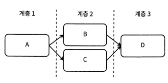

# 10장 : 데이터베이스 배치 감사 서비스 설계
- 데이터 품질에는 여러 차원 존재
  - 정확성: 실제 값이랑 얼마나 가까운지
  - 완전성: 필요한 모든 값이 있는지
  - 일관성: 다른 위치의 데이터와 동일한 값을 가졌는지
  - 유효성: 올바르게 형식화 되어 있는지
  - 고유성: 중복되거나 겹치는 데이터가 없는지
  - 적시성: 필요할 때 데이터를 사용할 수 있는지
- 데이터 품질 검증은 2가지 접근 방식
  - 이상 감지
  - 수동으로 정의된 유효성 검사 -> 해당 장 주제
## 10.1 감사는 왜 필요한가?
- 배치 감사가 나쁜 관행을 조장할 수 있다고 주장
  - 백업되지 않은 DB에서 데이터 손실로 인해 데이터가 유효하지 않은 상황 -> 데이터를 잃는 대신 복제나 백업을 구현해야함
- 서비스가 데이터를 받을때 유효성 검사를 하면, 저장된 후 검증해서는 안된다는 주장
- 유효성 검사를 외부 감사 프로세스가 아닌 데이터베이스와 애플리케이션에서 수행해야한다는 주장
- 배치 감사만으로 찾을수 있는 문제가 존재
  - 감사를 하지 않아 찾지 못했던 과거 데이터 존재 이슈
## 10.2 SQL 쿼리 결과에 대한 조건문으로 유효성 검사 정의
- 쿼리로 다양한 유효성 검사 코드
  - 열의 개별 데이터 포인
  - 단일 행의 여러 열
  - 여러 테이블
  - 여러 쿼리에 대한 조건문
- 제약조건중 일부는 ORM 라이브러리로 구현 가능
  - @NotNull
  - @Length(min = 0, max= 255)
## 10.3 간단한 SQL 배치 감사 서비스
##### 10.3.1 감사 스크립트
- 가장 간단한 형태의 배치 감사 작업은 다음 단계를 수행하는 스크립트
  - 데이터베이스 쿼리 실행
  - 결과를 변수로 읽음
  - 이 변수의 값을 특정 조건과 비교
##### 10.3.2 감사 서비스
- 스크립트를 배치 감사 서비스로 확장
- 배치 감사 작업은 두단계로 나뉨
  - 쿼리를 실행하고 그 결과를 사용해 감사 통과 여부 결정
  - 감사가 실패하면 경보를 트리거
## 10.4 요구사항
- 데이터베이스 테이블의 배치 감사를 수행할 수 있는 시스템 설계
  - 감사작업의 CRUD, 감사 작업은 다음 필드를 포함
    - 사용자 지정 시간 등의 간격
    - 소유자
    - 유효성 검사 데이터베이스 쿼리
    - SQL 쿼리 결과 조건문
  - 실패한 작업은 경보를 발생
  - 과거와 현재 실행중인 작업의 로그 확인 가능
  - 감사 작업은 최대 6시간 이내 완료
  - 데이터베이스 쿼리는 15분 이내 완료
  - 비기능적 요구사항
    - 스케일: 10,000개 미만의 작업이나 10,000개 미만의 문(Statement)이 있을것으로 예상
    - 가용성: 고가용성은 필요하지 않음
    - 보안: 작업에는 접근 제어 존재
    - 정확성: 감사 작업 결과는 정확해야 함

## 10.5 고수준 아키텍처
 
- 사용자는 공유 배치 ETL 서비스에 요청 -> 작업의 상태 및 이력 확인을 포함하여 배치 감사 작업을 CRUD 
- 공유 배치 ETL 서비스는 경보 서비스가 미존재, 경보 서비스에 직접 요청
##### 10.5.1 배치 감사 작업 실행
- 감사 작업은 구성된 시간 간격으로 주기적으로 실행되며, 두가지 주요 단계 존재
  - 데이터베이스 쿼리 실행
  - 데이터베이스 쿼리 결과로 조건문 실행
##### 10.5.2 경보 처리
- 경보 기능은 두가지 구성요소 나뉨
  - 경보 트리거 요청은 배치 ETL 서비스에서 이뤄짐
  - 경보 상태 및 기록 조회 요청은 백엔드 서비스에서 이뤄짐
- 백엔드에서 경보 서비스에서 경보를 트리거
  - 잠재적인 버그를 유발 가능 -> 백엔드 서비스에 문제가 있을때 안보내짐
    - 백엔드에서 경보 요청을 성공적으로 보낸 후에만 200 반환
      - 배치 ETL 서비스는 분할된 카프카 토픽으로 생성 -> 백엔드 서비스 호스트는 이러한 파티션에서 소비하고 각 파티션에서 체크포인트 수행

## 10.6 데이터베이스 쿼리 제약
- 배치 ETL 서비스는 실행할 수 있는 쿼리의 속도와 기간에 제약을 받아야 함
  - 킬고 비용이 많이 드는 쿼리는 전반적인 지연 시간을 증가 시킴
  - 비싸고 오래 실행되는 쿼리는 비용기 많이 듬
  - 모든 쿼리가 해당 기간 내에 실행 가능해야 함
##### 10.6.1 쿼리 실행 시간 제한
- 소유자가 작업 구성을 생성하거나 편집할때는 쿼리 실행 시간을 10분으로 제한
- 작업이 실행 중일때는 15분으로 제한
##### 10.6.2 제출 전 쿼리 문자열 확인
- 10분 뒤에 거부되었다고 알리는 대신 UI가 사용자에게 즉각적인 피드백 제공
  - 전체 테이블 스캔 불허
  - 파티션 키가 포함된 테이블에서만 쿼리 실행하게 하기
  - 쿼리 실행 계획을 표시해 실행시간 최소화하게 쿼리를 조정 가능
##### 10.6.3 초기 사용자 훈련
- 서비스 사용자들이 제약 사항에 적응하는 법을 배울 수 있음
- 제약 조건을 안내하는 좋은 UX와 유익한 문서를 제공해야함
## 10.7 과도한 동시 쿼리 방지
- 배치 ETL 서비스가 실행할 수 있는 동시 쿼리 수에 제한 설정해야함
- 배치 ETL 서비스가 데이터베이스 쿼리를 실행하기 전에 경보 서비스에 쿼리해 해결되지 않은 경보가 있는지 확인
## 10.8 데이터베이스 스키마 메타데이터의 사용자
- 사용자의 쿼리 작성을 돕기 위해 서비스는 스키마 메타데이터에서 작업 구성을 자동으로 도출 가능
  - where 필터에서 UI로 사용자에게 열 제안
- 메타데이터 플랫폼을 통해 테이블과 관련된 사건을 기록
  - 사용자가 테이블의 메타데이터 변경 사항을 구독하거나 테이블에 영향을 미치는 문제를 경보를 받을 수 있음
## 10.9 데이터 파이프라인 감사
 
- 특정 감사 작업이 실패하면 서비스는 다음 수행
  - 상위 작업이 실패하면 하위 감사 비활성화 -> 리소스 절약
  - 테이블 쿼리를 포함하는 다른 작업과 그 하위 작업 비활성화
  - 소유자에게 높은 긴급도의 경보 트리거
- 테이블에 문제가 있음을 메타데이터 플랫폼에 업데이트 -> 테이블 하위 작업 비활성화를 통한 잘못된 데이터 전파 방지 
## 10.10 로깅, 모니터링, 경보
- 다음 항목을 모니터링하고 경보를 보내야 함
  - 시작, 진행중, 성공, 실패 등 상태가 기록된 시간
  - 쿼리 시간 초과나 쿼리 실행 오류같은 실패 이유
  - 쿼리 실행시간 오버
  - 상위 작업 실패
  - 높은 CPU, 메모리나 사용율
  - 백엔드 4xx, 5xx 응답
## 10.11 기타 감사 가능 유형
##### 10.11.1 데이터 센터 간 일관성 검사
- 동일한 데이터를 여러 데이터 센터에 저장 -> 센터 간 데이터 일관성 보장을 위해 샘플링 테스트 실행
##### 10.11.2 업스트림과 다운스트림 데이터 비교
- 사용자가 한 테이블에서 다른 테이블로 데이터 복사해야 할 수 있음 -> 업스트림과 다운스트림 간 데이터 일관성 보장