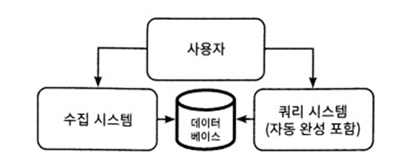
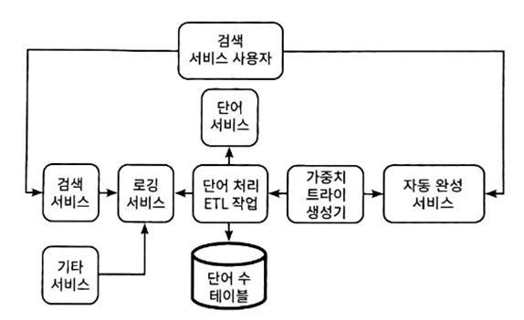
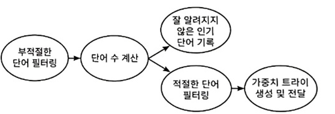

# 11장 자동 완성 / 타입 어헤드
## 11.1 자동 완성의 가능한 사례
- 자동 완성의 가능한 사용 사례
  - 검색 서비스 보완
  - 워드 프로세서 내 자동 완성 제안 제공
  - 코딩용 통합 개발 환경(IDE)에 자동 완성 기능
- 각 사용 사례에 따라 서로 다른 데이터 소스와 아키텍처 사용

## 11.2 검색 vs 자동 완성
- 검색과 자동완성은 요구사항이 다름

| 검색                                | 자동완성                  |
|-----------------------------------|-----------------------|
| 결과는 일반적인 웹페이지                     | 문자열 목록                |
| 몇초의 p99 허용                        | p99 기준이 낮아야함          |
| 다양한 결과 데이터 유형 가능                  | 문자열                   |
| 결과에 관련된 점수 부여                     | 항상 관련성 점수가 아님         |
| 정확도인 관련성에 민감                      | 관련성에 덜민감              |
| 모든 문서 처리, 색인화 등 필요                | 샘플링 및 근사알고리즘 활용       |
| 수백 개의 결과 반환                       | 5~10개 결과 반환           |
| 다양한 추론을 도출할 수 있는 피드백 매커니즘(앞,뒤 이동) | 자동 완성에서 일치하는거 없으면 미사용 |

## 11.3 기능 요구사항
##### 11.3.1 자동 완성 서비스의 범위
- 일반 검색 서비스용
- 영어만 지원
- 지원해야할 단어의 수는 약 47만개
##### 11.3.2 UX 세부사항
- 자동 완성은 일단 단어만, 추후 문장으로 확장 가능
- 제안하기 위한 입력해야하는 최소 문자 수는 3
- 제안의 최소 길이는 6글자 이상 단어
- 문자만 고려하고, 숫자와 특수 문자는 무시
- 한번에 10개 제안
##### 11.3.3 검색 기록 고려
- 자동 완성 제안이 사용자 입력만 고려? 검색 기록과 다른 데이터 소스 기반 고려?
  - 제출된 쿼리만 활용하고, 추후 다른 데이터 소스 고려 확장
  - 모든 사용자 데이터로 시작한 다음 개인화 고려
  - 1년 이상된 데이터는 제거
##### 11.3.4 콘텐츠 조정과 공정성
- 부적절한 제안 신고 기능은 현재는 무시
- 검색 문자열만 고려, 어떤 사용자가 검색했는지는 미고려

## 11.4 비기능적 요구사항
- 글로벌 사용자 기반이 사용할 수 있게 확장 가능
- 높은 가용성 필요하지 않음 -> 중요한 기능이 아니므로 내결함성은 양보 가능
- 높은 성능과 처리량 필요 -> 0.5초 내 제안
- 일관성은 필요하지 않음
- 프라이버시와 보안 고려
- 정확도 추론
  - 검색 빈도에 따라 검색 문자열의 빈도 계산 가능
  - 맞춤법 오류나 혼합 언어 쿼리는 미고려
  - 부적절한 단어는 방지 가능하지만 구문은 방지 불가능 -> 관리자가 수동 추가/삭제 기능 포함
  - 제안이 얼마나 최신이어야 하는지 1일 느슨한 요건 적용

## 11.5 상위 수준 아키텍처 계획
 
- 시스템 구성 요소
  - 데이터 수집
  - 데이터 처리
  - 처리된 데이터 쿼리해 자동 완성 추천 얻음

## 11.6 가중치 트라이 접근법과 초기 고수준 아키텍처
 
- 공유 로깅 서비스
  - 사용자에게 제공하는 자동 완성 추천을 도출하는 원시 데이터 소스
  - 검색 서비스를 통해 쿼리 전송하면 로깅 서비스 기록
  - DB로 MySQL, HDFS, Kafak 등 활용 가능 -> 구현 세부 사항이므로 논의 무관
- 자동 완성 서비스
  - 자동 완성 추천 제공

## 11.7 상세 구현
 
- 가중치 트라이 생성기는 일일 배치 ETL 파이프라인이 될 수 있음
- 단어 처리 ETL 작업과 가중치 트라이 생성기가 별도의 파이프라인 단계로 되어 있는 이유
  - 단어 처리 ETL 작업이 다른 여러 목적과 서비스에 유용할 수 있고, 각각을 독립적으로 구현, 테스트, 유지보수 및 확장할 수 있기 때문
- 전형적인 ETL 작업
  - 데이터 베이스 저장소에 읽고, 처리한 후 다음 단계에서 사용할 데이터베이스 저장소에 기록

##### 11.7.1 각 단계는 독립적인 작업이어야 한다
- 가중치 트라이 생성을 단일 작업으로 구현하고 모든 함수를 연결할 수 있음 -> 접근 방식은 간단하지만 유지보수가 어려움
- 가중치 트라이 생성에서 오류가 발생해 프로세스가 중단되면 전체 프로세스를 처음부터 다시 시작 -> 성능이 낮은 접근 방식
  - 단계를 별도의 작업으로 구현하고 에어플로와 같은 작업 스케줄러 시스템을 사용해 이전 작업이 성공적으로 완료된 후에만 각 작업이 실행되게 해야 함

##### 11.7.2 일래스틱서치에서 HDFS로 관련 로그 가져오기
- 한 플랫폼에서 읽고 다른 플랫폼에 쓰는 스크립트를 활용 -> 각 플롯폼의 병렬 처리 기능을 활용
- 분할 전략을 설명할 수 있어야함
  - 입력/로그는 서비스별로 분할될 수 있지만 출력은 날짜별로 분할

##### 11.7.3 검색 문자열을 단어 및 다른 간단한 연산으로 분할하기
- split 함수를 사용해 검색 문자열을 공백으로 분할 -> 분할된 문자열을 '검색어'라 부름
  - 마침표, 대시, 쉼표와 같은 다른 구분자를 사용하는 등의 일반적인 문제도 고려해야할 수 있음
- 해당 단계에서 6자 이상이고 숫자나 특수 문자가 없는 문자만 포함된 문자열 필터링
  - 시스템 수명 동안 변경될 가능성이 낮은 다양한 간단한 작업 수행

##### 11.7.4 부적절한 단어 필터링하기
- 필터링 할때 두 부분 고려
  - 적절한 단어와 부적절한 단어 목록 관리하기
  - 검색어 목록을 적절한 단어와 부적절한 단어 목록과 대조해 필터링하기
- 단어 서비스
  - 정렬된 적절한 단어나 부적절한 단어 목록을 반환하는 API 엔드포인트를 지님
    - 목록은 최대 몇 MB 크기이며 이진 검색을 허용하게 정렬돼 있음
  - 적절한 단어와 부적절한 단어 목록을 볼수 있으며, 수동으로 추가/삭제 가능
- 부적절한 단어 필터링하기
  - 단어 수 계산 ETL 파이프라인은 단어 서비스에 부적절한 단어를 요청한 다음 이 목록을 HDFS 파일에 기록 
  - 스파크와 같은 분산 분석 엔진을 사용해 어떤 검색 문자열이 부적절한 단어인지 판단
  - 
##### 11.7.5 퍼지 매칭과 철자 교정
- 단어를 세기 전 마지막 처리 단계는 철자 오류 수정 -> 퍼지 매칭 알고리즘을 통해 철자 오규 수정
- 맞춤법 수정 단계는 여러 퍼지 매칭 알고리즘과 라이브러리 또는 서비스 중 선택할 수 있음 -> 요구사항에 맞게 최적화 가능
##### 11.7.6 단어 수 세기
- 간단한 맵리듀스 작업 or 카운트-민 스케치와 같은 알고리즘 사용
##### 11.7.7 적절한 단어 필터링 하기
- 단어 수 세기 단계에서는 필터링할 단어 수를 크게 줄여야 함
##### 11.7.8 잘 알려지지 않은 인기 신조어 관리하기
- 잘 알려지지 않은 인기 신조어 발견 가능 -> SQL unknown_words 테이블에 기록
##### 11.7.9 가중치 트라이 생성 및 전달하기
- 적절한 상위 목록 갖춤 -> 단 몇 MB에 불과해 가중치 트라이를 단일 호스트에서 생성할 수 있음
- 트라이를 AWS S3와 같은 공유 객체 저장소나 MongoDB나 아마존 도큐먼트DB와 같은 문서 데이터베이스 기록 가능
- 호스트는 무작위 시간에 쿼리하거나 동시에 많은 요청이 객체 저장소에 부담을 주는 것을 방지하기 위해 지터를 사용해 동시에 쿼리하게 구성
- 공유 객체가 GB단위로 크다면 CDN에 배치하는 것을 고려
- 작은 트라이의 또 다른 장점은 사용자가 검색 앱을 로드할 때 전체 트라이를 다운로드할 수 있어 트라이 조회가 서버 사이드가 아닌 클라이언트 사이드에서 이뤄진다는 점
  - 네트워크가 불안정하거나 느리면 사용자가 검색 문자열을 입력할 때 간헐적으로 제안을 받지 못할 수 있어 사용자 경험이 좋지 않음

## 11.8 샘플링 접근 방식
- 자동 완성은 높은 정확도가 필요하지 않기에 샘플링 필요
- 샘플링은 대부분의 단계에서 수행 가능
  - 로깅 서비스에서 검색 문자열 샘플링 -> 정확도가 가장 낮지만 복작도도 가장 낮음
  - 검색 문자열을 개별 단어로 분할하고 6자 이상 길이의 단어 필터링 후 샘플링
  - 적절한 단어 필터링 후 샘플링 -> 정확도 높지만 구현이 복잡함

## 11.9 저장소 요구사항 처리하기
- 저장소에 필요한 공간양 추정
  - 10 억(사용자 수) * 10(하루 검색 횟수) * 20(평균 검색어 길이) = 200GB(검색 문자열)
  - 최대 12개월 데이터를 보유하게 되어 검색 문자열만으로도 200GB * 365(1년) = 73TB 필요
  - 저장 비용을 줄이고 싶다면 다양한 방법을 고려 가능
    - 근사화와 샘플링으로 정확도 트레이드오프
    - 다양한 기간으로 데이터를 집계하고 롤업 배치 처리, 롤업된 데이터로 덮어 쓰기

## 11.10 단일 단어 대신 구문 처리하기
##### 11.10.1 자동 완성 추천의 최대 길이
- 최대 길이가 길수록 사용자에게 가장 유용하지만 비용과 성능 간의 트레이드 오프 필요 -> 트라이가 너무 커질 수 있음
  - 최대 길이 결정 필요
- 해결책으로 사용자 검색 문자열 길이의 90번째 백분위수를 찾아 이를 최대 길이로 사용하는 것
##### 11.10.2 부적절한 단어 방지하기
- 부적절한 단어 필터링
  - 구문에 부적절한 단어 포함되어 있으면, 전체 구문 필터링
  - 적절한 단어 필터링 하지 않고 모든 단어나 구문을 자동 완성으로 제안
  - 구문에서 맞춤법이나 틀린 단어 수정하지 않음
- 부적절한 단어뿐만 구문 필터링은 매우 어려움

## 11.11 로깅, 모니터링과 경보
- 자동 완성 결과를 반환하지 않는 검색 로깅 필요 -> 트라이 생성기의 버그 지표

## 11.12 기타 논의 가능한 주제
- 다양한 목적 사용 -> 인기 검색어 서비스
- 분산 로깅 서비스 설계
- 부적절한 단어 필터링
- 개인화된 자동 완성 기능 만들기
- 업스트림 다운 되었을 때, 오래된 추천 반환하는 단계적 기능 저하 방식
- Dos 공격 방지
- 철자 추천 서비스