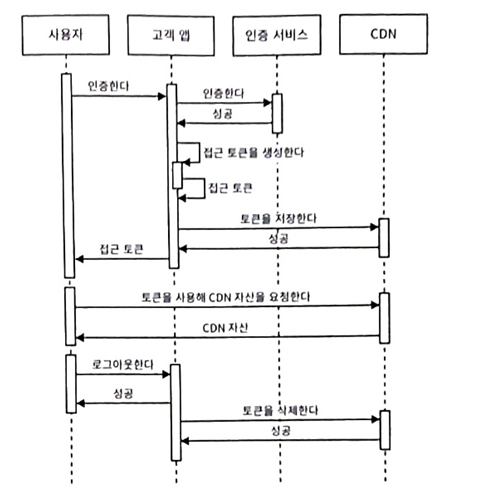
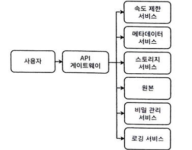

# 13장 콘텐츠 배포 네트워크 설계하기
- 분산된 많은 사용자에게 정적 콘텐츠를 빠르게 제공하기 위해 설계됨
- 내결함성과 같은 부가적인 이점도 존재
## 13.1 CDN의 장단점
##### 13.1.1 CDN 사용의 장점
- 낮은 지연시간
    - 가까운 데이터 센터에서 서비스를 받으므로 지연 시간이 낮음
- 확장성
    - 서드파티 제공업체를 사용하면 자사 시스템을 확장할 필요가 없음
- 낮은 단위 비용
    - 서드파티에서 대량 할인을 제공하므로 높은 부하를 처리할수록 단위 비용이 낮음
- 높은 처리량
    - 자사 서비스에 추가 호스트를 제공해 더 많은 동시 사용자와 더 높은 트래픽 처리 가능
- 높은 가용성
    - CDN이 SLA를 유지할 수 있으면 자사 서비스의 호스트가 실패할 때 대체 수단으로 작용 가능
##### 13.1.2 CDN 사용의 단점
- 추가적인 복잡성
    - 추가적인 DNS 조회
    - 추가적인 실패 지점
- CDN은 트래픽이 적을 경우 높은 단위 비용을 가질 수 있음 -> 서드파티 네트워크 사용 시, 데이터 전송당 숨겨진 비용 존재 가능
- 다른 CDN으로 마이그레이션 시, 몇 달이 걸리고 비용이 많이듬
- 일부 국가나 조직이 특정 CDN의 IP주소를 차단 가능
- 서드파티에 데이터를 저장하는 것에 보안과 프라이버시 우려
- 자바스크립트 라이브러리에 악성 코드를 삽입 가능
- CDN에 기술적인 문제 발생 시, 해결을 위해 CDN 회사에서 얼마나 걸릴지 모름
- 특정 사용 사례를 충분히 사용자 정의할 수 없어 예상치 못한 문제 발생
##### 13.1.3 이미지 제공 CDN을 사용할 때 발생할 수 있는 예상치 못한 문제의 예
- User-Agent를 통해 웹 브라우저인 것을 인식해서, 이미지를 png나 JPEG가 아닌 WebP 형식으로 제공 -> 원본 이미지 제공 필요 시, 이슈 발생
    - 웹 애플리케이션에서 User-Agent 헤더를 재정의
        - 사용자를 특정 웹 브라우저를 제한하는 것이므로 해결 불가능
    - 특정 서비스에는 WebP 이미지를 제공하고 다른 서비스는 원본 이미지 제공
        - 개별화된 구성을 제공하더라도 CDN 구성을 관리하는 인프라 팀이 개별 서비스를 위해 구성을 설정 등 이슈 발생
    - 요청을 백엔드 서비스를 통해 라우팅
        - CDN의 대부분의 이점을 무효화함 -> 추가적인 지연 시간과 문서화와 유지보수 부담에 대한 복잡성 발생
## 13.2 요구사항
- 기능적 요구사항
    - 권한 있는 사용자는 디렉토리를 만들기 가능
    - 10GB 크기 제한으로 파일 업로드 및 다운로드 가능
- 비 기능적 요구사항
    - 확장성
        - 페타바이트 규모의 저장 용량과 하루 테라바이트 수준의 다운로드 용량 지원
    - 고가용성
        - 99.99 or 99.999% 가동 시간 필요
    - 고성능
        - 요청자에게 빠르게 제공할 수 있는 데이터 센터에서 다운로드 돼야함
    - 내구성
        - 파일이 손상되어선 안됨
    - 보안과 프라이버시
        - 권한 있는 사용자만 파일을 다운로드 및 업로드 가능
## 13.3 CDN 인증과 권한 부여
- CDN 인증과 권한 부여는 쿠키 기반 인증이나 토큰 기반 인증으로 할 수 있음
    - 토큰 기반 인증으 메모리를 덜 사용하고, 부안 전문성이 더 높은 서드파티 서비스 사용 가능
##### 13.3.1 CDN 인증과 권한 부여 단계
 
- CDN이 각 사용 업체에게 비밀 키를 발급 -> 해당 정보를 통해 접근 토큰을 생성하는 SDK나 라이브러리 제공
    - CDN 사용 업체 앱이 접근 토큰을 생성
        - 비밀키
        - CDN URL
        - 만료: 접근 토큰의 만료 타임스탬프
        - 리퍼러(Referrer)
        - 허용된 IP: CDN 자산 다운로드 가능한 IP 목록
        - 허용된 국가나 지역
    - 고객 앱이 토큰 저장 후 사용자에게 반환
    - 고객 앱이 사용자에게 CDN URL을 제공할때마다 접근 토큰 서명
        - /photo.jpeg?secure=DMF1ucDxIHCxwYQ 같은 토큰 활용
    - 사용자가 로그아웃하면 노큰 파기 -> 로그인 시, 토큰 생성
- 리퍼러 헤더와 보안
    - CDN 사용 업체의 URL을 리퍼러로 포함 -> 승인되지 않은 리퍼러가 CDN 사용을 막는 것
        - 적절한 보안 체계가 아님 -> 위조 가능
- 토큰 삭제는 비동기 가능 -> 갑자기 실패 할때, 토큰 미파기 이슈 발생에 대한 해결책
    - 해당 문제를 무시하기 -> 파기되지 않은 토큰 허용
    - 이벤트 기반 접근법 -> 카프카 이벤트를 통해 파기
    - 동기식/차단방식 -> 예기치 않게 종류되거나 할때 500에러를 통해 재시도 처리
##### 13.3.2 키 교체
- 해커가 키를 훔치더라도 키가 변경될때까지만 피해 제한 -> 키를 주기적으로 변경
    - 키교체는 모든 시스템 전파하는 데 시간이 다소 걸림 -> 교체 시기에 과거 키와 새로운 키 중복 사용
## 13.4 상위 수준 아키텍처
 
- 일반적인 `API 게이트웨이 - 메타데이터 - 저장소/데이터베이스` 아키텍처를 택함
- API 게이트웨이를 구성해 메타데이터 서비스 조회를 통해 사용자가 어떤 저장소 서비스 호스트를 읽을 껀지 결정
- 초기 단계에서는 모든 파일을 모든 데이터 센터에 복제 -> 그렇지 않으면 다음과 같은 복잡성 처리 필요
    - 메타데이터 서비스가 어떤 데이터 센터에 어떤 파일이 있는지 추적 필요
    - 주기적으로 센터 간 최적의 파일 분배를 결정(복제본의 수와 위치 포함)
## 13.5 저장소 서비스
- 파일을 포함하는 호스트/노드 클러스터
    - 가용성과 내구성을 위해 파일 복제 필요
    - 가용성 모니터링과 메타데이터 서비스를 업데이트 및 장애 조치 프로세스 필요
- 호스트 관리자는 클러스터 내부나 외부에 있을 수 있음
    - 클러스터 내부 관리자: 노드 직접 관리
    - 클러스터 외부 관리자: 작은 독립 노드 클러스터 관리
##### 13.5.1 클러스터 내부
- 주키퍼를 클러스터 내부 관리자로 활용
  - 리더 선출 관리, 파일, 리더, 팔로워 간 매핑 유지
- 내부 관리자는 신뢰성, 확장성, 고성능이 필요한 정교한 구성 요소
##### 13.5.2 클러스터 외부
- 파일을 읽거나 쓰려면 메타데이터 서비스를 통해 무선택한 노드에서 파일을 읽거나 씀
- 리더 선출은 필요하지 않지만 클러스터 매핑이 필요
- 외부 관리자는 파일과 클러스터 매핑 유지
##### 13.5.3 평가

| 클러스터 내부 관리자            | 클러스터 이부 관리자                     |
|------------------------|---------------------------------|
| 메타데이터 서비스가 내부 관리자 요청 X | 메타 서비스가 외부 관리자에게 요청             |
| 개별 역할을 파일 할당 관리        | 파일 할당을 관리하지만 개별 노드 관리 X         |
| 모든 노드를 알아야 함           | 노드에 대해서 알지 못하고 클러스터에 대해 알아야함    |
| 노드의 하트비트를 모니터링         | 독립 클러스터의 상태를 모니터링               |
| 호스트 실패를 처리             | 각 클러스터의 사용률을 추적하고 과부화된 클러스터를 처리 |

## 13.6 일반적인 작업
##### 13.6.1 읽기:다운로드
- 다운로드에서 다음 단계는 이 요청을 처리할 저장소 호스트를 선택하는것
- 메타데이터 서비스는 호스트 선택 과정에서의 메타데이터를 유지 및 제공 -> 레디스나 SQL 둘다 사용
  - 파일을 포함하는 저장소 서비스 호스트
  - 파일 소유권과 접근 제어
  - 호스트 상태
##### 다운로드 과정
- 속도 제한 서비스에서 요청량 검증 
- 메타데이터 서비스 조회 → 자산 위치 확인
- 저장소 호스트에서 파일 스트리밍
- 부하 정보 메타데이터에 업데이트
##### 저장시 암호화가 적용된 다운로드 과정
- 비밀 관리 서비스에서 키 획득 → 자산 복호화 후 사용자에게 반환
##### 13.6.2 쓰기:디렉터리 생성, 파일 업로드, 파일 삭제
- 파일 식별: 파일은 ID 기반 식별 (내용 같아도 ID 다르면 별도 파일)
- 중복 저장 문제: Deduplication 고려 가능하나, 복잡성 증가 → 트레이드오프
- 대용량 파일 처리
  - 업로드/다운로드 실패 대비 → 멀티파트 업로드로 청크 단위 전송
  - 불완전 업로드 시 공간 낭비 발생 → ETL 작업으로 정리 필요
##### 모든 데이터 센터에 파일 사본을 유지하지 않기
- 모든 데이터 센터에 사본 유지 불필요 → 지역별 수요 기반 복제
##### 배치 ETL 작업의 재조정
- 다운로드 로그 분석 → 요청 빈도 기반으로 복제본 수와 위치 재조정
- 파일 이동 시, 성공 기록 확인 후 메타데이터 업데이트
- **사가 패턴(코레오그래피/오케스트레이션)**을 활용해 분산 복제 워크플로우 관리

## 13.7 캐시 무효화
- 주로 정적 파일 제공을 목적 -> 캐시 무효화는 덜 중요 이슈
- 파일에 대한 핑거프린트를 남길 수 있음

## 13.8 로깅, 모니터링, 경보
- 다음 상항을 모니터링 하고 경보를 보내야 함
    - 업로더가 파일 의 업로드 진행 중 완료 또는 실패 상태 추적
    - CDN 미스를 기록하고 모니터링 -> 낮은 긴급도의 경보 트리거
    - 프론트엔드 서비스가 파일의 요청 속도를 기록
    - 비정상적이거나 악의적인 활동 모니터링

## 13.9 미디어 파일 다운로드에 대한 기타 가능한 논의 요약
- 미디어 파일 완전 다운로드 전 재생 논의
    - 미디어 파일을 더 작은 파일로 나누는 것
    - 순서가 중요하기에 파일 시퀀스 번호 할당 -> 파일 순서와 총 개수 정보 포함된 메타데이터 파일도 생성
