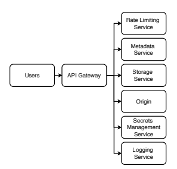

# Chapter 13. Design a Content Distribution Network
* CDN : Content Distribution Network

## 13.1 CDN의 장단점
### 13.1.1 CDN 사용의 장점
* 데이터의 redundancy와 availability를 위해 여러 지리적으로 분리된 데이터 센터에 데이터를 복제하여 저장한다. CDN은 이것을 이용해 서비스하게 된다
* 지연 시간이 낮음 : 가까운 데이터 센터에서 받으므로
* 확장성 : 스케일을 CDN 서비스에 맡길 수 있다
* 낮은 단위 비용 : CDN 서비스 업체에서 많은 사용량을 통해 할인
* 높은 처리량 : 스케일과 동일
* 높은 가용성 : redundancy를 이용해 가용성 처리

### 13.1.2 CDN 사용의 단점
* DNS 조회 추가
* 외부 서비스가 point of failure가 될 수 있음
* 트래픽이 적은 경우 CDN이 오히려 비쌀 수 있음
* 외부 업체 사용으로 인한 문제들
  * 업체 자체의 가용성
  * 업체에 대한 신뢰성
  * 보안과 프라이버시

## 13.2 요구사항
* Functional Requirements
  * Directory를 생성할 수 있다.
  * 파일을 업로드/다운로드 할 수 있다
  * 10GB 파일 크기 제한
* Non-Functional Requirements
  * 확장성 : 하루 테라이상의 업/다운로드 지원
  * 고가용성 : 99.9999% 가동시간
  * 고성능
  * 내구성
  * 보안과 프라이버시

## 13.3 CDN 인증과 권한 부여
* 리소스에 접근할 수 있는지 확인
* 쿠키 또는 토큰 기반으로 인증, 토큰은 메모리 사용이 적고 세밀한 제어 가능
  * IP나 사용자 계정으로 제한할 수도 있다

### 13.3.1 CDN 인증과 권한 부여 단계
1. CDN 서비스에 인증 요청을 보낸다.
2. CDN에서 secret key, CDN url, expiry at, referrer, allowed IP, allowed country/region 으로 토큰을 만든다
3. 토큰을 고객에게 제공
4. 토큰을 이용해 고객이 접근한다

- 일반적인 S3 signed url과 동일
- 토큰 삭제에 대한 이야기가 있는데, aws에서는 signed url은 expiry로만 관리되고 삭제는 명시적으로 진행됨
- 설명에 있는 내용은 여러 핸들링 방식을 설명하기 위해 만든것으로 보이며 실현 가능한 솔루션은 아닌듯

### 13.3.2 키 교체
- 키를 도난당한 경우를 대비해 키가 교체될 수 있어야 한다

## 13.4 상위 수준 아키텍처

## 13.5 저장소 서비스
* Storage Service: 대용량 파일을 DB가 아니라 여러 노드(호스트)의 파일시스템에 저장하고, 가용성·내구성을 위해 파일을 여러 노드(예: 3개)에 복제함.
* 문제는 이 클러스터를 누가 어떻게 관리할 것인가인데, 두 가지 접근이 있음:
### In-cluster manager
* 클러스터 내부에 있는 매니저가 모든 노드와 역할을 직접 관리.
* HDFS + ZooKeeper
### Out-cluster manager
* 여러 개의 작은 독립 클러스터를 두고, 각 클러스터는 스스로 관리. 외부 매니저는 클러스터 단위로만 관리.
* 파일 - 클러스터 매핑이 필요함

### 13.5.3 Evaluation - 비교/분석
| 항목          | In-cluster Manager | Out-cluster Manager    |
| ----------- | ------------------ | ---------------------- |
| 메타데이터 요청 방식 | 매니저에 직접 요청 안 함     | 매니저에 직접 요청해야 함         |
| 파일 할당 관리 범위 | 노드 단위까지 세밀히 관리     | 클러스터 단위까지만 관리          |
| 노드 인식 필요성   | 모든 노드 정보 필요        | 클러스터 단위 정보만 필요         |
| 모니터링        | 노드의 heartbeat 모니터링 | 클러스터 단위 health 모니터링    |
| 장애 처리       | 노드 장애 대응           | 클러스터 과부하 시 신규 파일 할당 중단 |

* Out-cluster 방식이 단순해 보이지만, 실제로는 클러스터 단위 관리라는 추가 계층이 생겨서 관리 복잡도가 줄지 않는다.

## 13.6 일반적인 작업
### 13.6.1 읽기: 다운로드
* Rate Limiting: 클라이언트 요청이 속도 제한을 초과했는지 확인.
* 메타데이터 조회: 파일을 가진 스토리지 호스트 목록과 상태 정보(부하, 헬스체크, 복제 위치 등)를 조회.
* 스토리지 호스트 선택: 부하 상태를 고려해 최적의 호스트 선택.
* 파일 전송: 클라이언트로 스트리밍, 동시에 메타데이터 서비스에 부하 증가 기록.
* 암호화 처리: 저장 시 암호화된 파일은 비밀 관리 서비스에서 키를 가져와 복호화 후 전송.
* CDN에 없으면 원본 서버에서 가져와 캐싱 후 전송.

### 13.6.2 쓰기: 업로드
* 파일 ID로 식별: 이름 중복 문제를 피하기 위해 ID 사용.
* 중복 제거(Deduplication): 동일한 내용의 파일을 여러 소유자가 업로드할 경우 저장 공간 절약을 위해 중복 제거 가능. 초기 설계는 단순성을 위해 별도 저장을 권장하지만, 저장소가 커지면 비용 절감 차원에서 중복 제거 고려.
  * hashing을 통해 쉽게 중복 업로드를 방지할 수 있음, 사용자에겐 과금됨(Business model!)
* 대용량 파일 처리: GB~TB 크기 파일은 Multipart Upload로 분할 전송. 실패 시 완료되지 않은 청크만 재전송.
* 삭제 요청 시 메타데이터와 스토리지 모두에서 참조 제거.
  * 실제 삭제는 오래 걸리므로 metadata에서만 우선 제거하고, 백그라운드 작업으로 실제 파일 삭제.
* 파일의 사본은 모든 데이터 센터에 즉시 복제하지 않고 일정 시간을 두고 복제하여 네트워크 부하를 줄임.
* 파일 업로드 후 메타데이터 서비스에 새 파일 정보 등록.
 