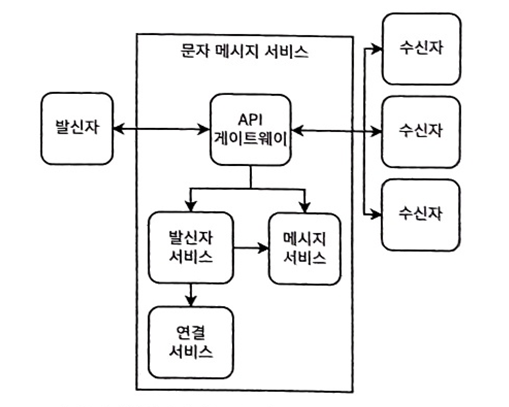
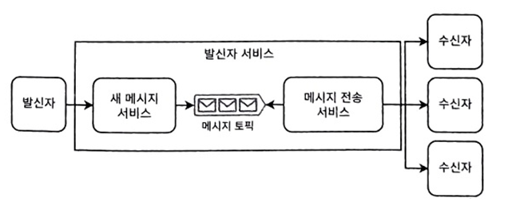
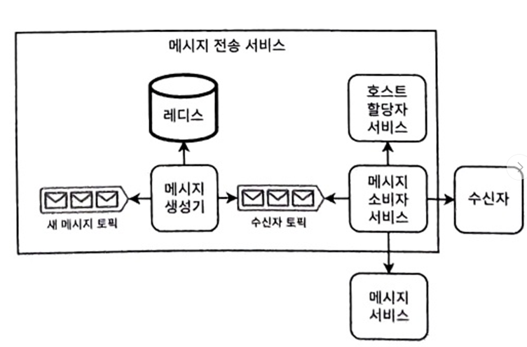
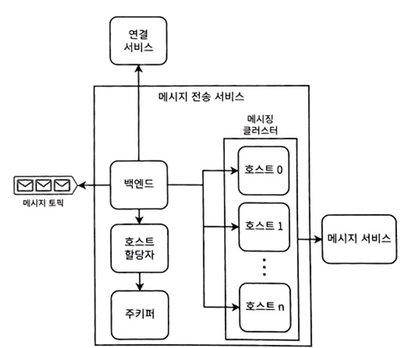

# 14장 문자 메시징 앱 설계
- 사용자가 예측 불가능한 속도로 메시지를 보냄 -> 시스템 트래픽 급증 처리
- 정확히 한 번 전달을 고려하는 첫 번째 예시 시스템
## 14.1 요구사항
- 기능적 요구사항
  - 실시간 또는 결과적 일관성, 두 경우를 모두 고려
  - 채팅방은 2명에서 1,000명의 사용자를 포함
  - 1000 UTF-8 문자로 제한, 문자당 최대 32비트, 메시지 크기는 최대 4KB
  - 플랫폼별 세부사항 미고려
  - 전송 및 읽음 확인
  - 메시지 기록 -> 과거 메시지 조회 가능
  - 메시지 본문 비공개 -> 종단 간 암호화
  - 사용자 온보딩(가입 등) 미고려
  - 가능 사용자 그룹에 여러 채팅방/채널 미고려
  - 일부 채팅 앱은 '나중에 답장할게요' 등 템플릿 메시지 기능 존재 -> 클라이언트 사이드 기능일 수 있음
  - 텍스트 전송만 고려
- 비 기능적 요구사항
  - 확장성: 동시 사용자 10만명
  - 고가용성: 99.99%
  - 고성능: P99 메시지 전송 시간 10초
  - 보안과 프라이버시: 사용자 인증 필요, 메시지는 비공개
  - 일관성: 엄격한 순서 불필요

## 14.2 초기 구상
- 알림/경보 서비스와 유사 -> 시작점으로 활용 가능

| 메시징 앱             | 알림/경보 서비스               |
|-------------------|-------------------------|
| 모든 순위 동일, P99 10초 | 이벤트에 따른 다른 우선 순위        |
| 다른 채널이나 서비스 미고려   | 이메일, SMS 등 여러 채널        |
| 수동 트리거 조건         | 이벤트, 프로그래밍 및 주기적 트리거 가능 |
| 메시지 템플릿 미존재       | 메시지 템플릿 존재              |
| 종단 간 암호화 존재       | 암호화 미존재                 |
| 이전 메시지 요청 가능      | 이전 메시지 미고려              |
| 전송 및 읽음 확인        | 전송과 읽음 확인 불가능           |

## 14.3 초기 고수준 설계
 
- 다음과 같은 설계의 의미 내포
  - 앱은 이름과 공개 키를 포함한 각 수신자의 메타데이터를 저장
  - 메시징 서비스는 각 수신자와 열린 웹소켓 연결을 유지
  - 수신자가 둘 이상에서는 발신자는 각 수신자의 공개 키로 메시지를 암호화 해야함
  - 메시징 서비스는 예측 불가능한 트래픽 급증 처리 필요
- 서비스 구성
  - 발신자 서비스
    - 발신자로부터 메시지를 받아 즉시 수신자에게 전달
    - 메시지를 메시지 서비스에 기록
  - 메시지 서비스
    - 발신자는 보낸 메시지를 요청 가능
    - 수신자는 받은 메시지와 받지 않은 메시지를 모두 요청 가능
  - 연결 서비스
    - 사용자의 활성과 차단된 연결을 저장하고 검색 가능
    - 이름, 아바타, 공개 키와 같은 연결 메타데이터도 저장

## 14.4 연결 서비스
- 다음과 같은 엔드포인트 제공
  - `GET /connection/user/{userId}`: 사용자의 모든 연결과 메타데이터 가져옴
  - `POST /connection/user/{userId}/recipient/{recipientId}`: userId를 가진 사용자가 recipientId를 가진 다른 사용자에게 새 연결 요청
  - `PUT /connection/user/{userId}/recipient/{recipientId}/request/{accept}`: Accept는 연결 요청을 수락하거나 거부하는 불리언 변수
  - `PUT /connection/user/{userId}/recipient/{recipientId}/block/{block}`: Block은 연결을 차단하거나 해제하는 불리언
  - `DELETE /connection/user/{userId}/recipient/{recipientId}`: 연결 삭제
##### 14.4.1 연결 만들기
- 사용자의 기기 또는 브라우저 쿠키나 로컬스토리지에 저장
  - 연결 서비스는 기기 변경에 대비한 데이터 백업이나 데이터 동기화에 활용
  - 간단한 상태 비저장 백엔드 서비스로 구현
##### 14.4.2 발신자 차단
- 모든 계층에서 구현(클라이언트와 서버)
- 트래픽 줄이기
  - 서버로의 트래픽을 줄이기 위해 차단된 수신자 연결을 사용자의 기기에 저장
- 즉시 차단/차단 해제 허용
  - 발신자 차단을 위해 PUT 요청
    - 특정 엔드포인트를 사용할 수 없을 경우를 대비해 클라이언트는 발신자 차단 사실 기록
    - 차단 사실은 데드 레터 큐로 보내고 해당 엔드포인트를 다시 사용할 수 있을때 서버로 보냄
- 앱 해킹
  - 자신을 차단한 수신자 데이터를 삭제하려는 시도를 막을 실용적인 방법은 없음
    - 서버로 데이터를 모두 가져오면 발신자의 기기에 저장하는 목적을 상실
    - 보안 문제는 모든 계층에서 차단을 구현해야 하는 또다른 이유
- 가능한 일관성 문제
  - 차단 일관성 이슈 -> 여러 기기에서 차단과 해제를 동시 누를 시, 최종 상태 일관성 해결방법은?
    - 기기의 타임 스탬프는 해결책 불가능 -> 기기의 시계를 완벽하게 동기화 할수 없음
    - 한번에 하나의 기기만 연결 허용도 불가능 -> 서버요청이 불가능할 시, 사용자의 기기 내 큐에 존재
  - 일반적인 일관성 문제는 오프라인 기능이 쓰기 작업을 포함할 때 발생
    - 각 기기의 최정 상태를 확인하게 요청하는 것
    - 불일치 방지하는 방식으로 쓰기 작업과 오프라인 기능에 제한을 두는 것
- 공개 키
  - 기기가 앱을 설치하고 처음 시작할 때 공개-비공개 키 쌍으로 생성 -> 공개 키를 연결 서비스에 저장
    - 키 변경은 드문 이벤트일 것이므로 예측하지 못한 트래픽 급증을 일으키지 않을 것
  - 발신자가 오래된 공개 키를 사용해 메시지를 암호화하면 수신자가 복호화한 후 이상한 문자 출력 이슈 
    - 발신자는 SHA-2와 같은 암호화 해시 함수로 메시지를 해싱하고 이 해시를 메시지의 일부로 포함 -> 해시가 일치할 때만 복호화된 메시지를 수신 사용자에게 표시
  - 유효 기간을 주어 그 사이에 공개 키 변경
## 14.5 발신자 서비스
 
- 발신자로부터 메시지를 받아 거의 실시간으로 수신자에게 전달하는 단일 기능
  - 디버깅 가능성과 유지보수성을 최적화하기 위해 가능한 한 간단하게 만들어야 함

##### 14.5.1 메시지 보내기
 
- 메시지 서비스는 메시지 요청을 받아 새 메시지 카프카 토픽에 생성 -> 발신자에게 200 성공 반환
- 메시지 생성기는 새 메시지 카프카 토픽에서 소비하고 각 수신자에 별도의 메시지 생성
- 호스트 메시지를 수신자 토픽이라고 부르는 카프카 토픽에 생성
  - 레디스 같은 분산 인메모리 데이터베이스에 체크포인트로 활용 가능
- 메시지 서비스가 사용자의 어떤 기기가 해당 메시지를 받지 않았는지 기록 -> 각 기기가 받지 않은 메시지만 검색할 수 있는 엔드포인트를 제공

##### 14.5.2 기타 논의사항
- 백엔드 호스트가 다운되면 클라이언트는 500 반환 -> 지수 재시도와 백오프, 데드 레터 큐와 같은 실패한 요청에 대한 일반적인 기술을 구현
- 컨슈머 호스트가 다운되면 다른 컨슈머 호스트가 메시지 소비하여 자동이나 수동 장애 조치 프로세스 구현
- 현재 아키텍처는 확장 가능하지만 지연시간이라는 트레이드 오프가 존재
  - 큐와 같은 풀 메커니즘을 사용하면 결과적 일관성을 허용하지만 실시간 메시징에는 적합하지 않음
    - 실시간 메시징을 위해서는 호스트와 기기 비율을 줄이는 트레이드 오프 존재

## 14.6 메시지 서비스
- 메시지 로그 역할을 함
  - 과거에 보낸 메시지와 받은 메시지 다운로드
  - 메시지가 전달할 수 없을 때(클라이언트가 오프라인일 때), 클라이언트가 켜졌을때 메시지 요청
- 종단 간 암호화
  - 수신자가 공개-비공개 키 쌍을 생성
  - 발신자가 수신자의 공개 키로 메시지를 암호화한 다음 수신자에게 메시지를 보냄
  - 수신자가 자신의 비공개 키로 메시지를 복호화
- 메시지 서비스는 높은 쓰기 트래픽과 낮은 읽기 트래픽을 예상 -> 카산드라의 이상적

## 14.7 메시지 전송 서비스
- 유효하지 않은 메시지를 걸러내고 메시지를 전달

##### 14.7.1 소개
- 사용자의 기기가 서버가 되는 것은 일반적으로 다음과 같은 이유로 불가능
  - 보안: DDos, 하이재킹 등 악성 프로그램을 기기에 보낼 수 있음
  - 기기로의 네트워크 트래픽 증가: 소유자에게 증가된 트래픽에 대한 과도한 요금이 부과
  - 전력 소비
- 기기 연결 시작은 메시징 서비스가 각 클라이언트에 대해 많은 수의 연결 속을 의미함 -> 대규모 클러스터 필요
  - 주키퍼같은 분산 조정 서비스를 통해 호스트 다운을 감지하고, 대체호스트를 프로비저닝 해야함
    - 기기에 호스트가 하트비트를 보내고, 다운 시 대체 호스트 연결
- 이전 호스트가 멈추기 전에 일부 수신자에게는 메시지를 성공적으로 전달했지만 모든 수신자에게는 전달하지 못했을 수도 있음
  - 중복을 피하기 위해서는 각 메시지를 보낼 때 마다 체크포인트를 기록하는 방식 -> 레디스 같은 인메모리 활용, 일관성을 위해 클러스터 분할
  - 다른 방법은 모든 수신자에게 메시지를 다시 보내고 수신자의 기기에 의존하여 메시지를 중복 제거하게 하는 것
  - 세번째 방법 발신자가 몇 분 후 확인을 받지 못하면 메시지를 다시 보내는 것

##### 14.7.2 고수준 아키텍처
 
- 모든 클라이언트는 웹소켓을 통해 발신자 서비스에 연결, 호스트는 거의 실시간 지연으로 클라이어트에 메시지를 보낼수 있음
  - 메시징 클러스터에 상당한 수의 호스트가 필요 
- 단일 호스트가 수백만 클라이언트와 동시에 메시지를 주고 받으려면 메시지는 작아야함 
  - 사진이나 동영상 같은 파일을 처리하기 위한 자체 호스트 클러스터가 있는 별도의 메시징 서비스를 만들고 이 서비스를 텍스트를 처리하는 메시징 서비스와 독릭접으로 확장
- 각 호스트 최대 며칠 전 메시지를 저장하고 주기적으로 오래된 메시지를 메모리에 삭제할 수 있음  
  - 메시지를 받으면 메모리에 메시지를 저장하는 동시에 스레드를 분기해 카프카 큐에 메시지를 생성할 수 있음 -> 레디스 서비스에 메시지 저장
    - 레디스는 빠른 쓰기가 가능하지만 더 높은 내결함성을 위해 여전히 카프카를 사용해 쓰기를 버퍼링
- 호스트 할당자 서비스는 클라이언트/채팅방 ID와 호스트의 매핑을 포함 -> 레디스 캐시에 유지
  - 일관된 해싱, 라운도 로빈이나 가중 라운드 로빈을 사용해 ID를 호스트에 할당할 수 있지만, 이는 빠르게 특정 호스트가 불균형한 부하를 처리하는 핫 샤드 문제로 이어질 수 있음

##### 14.7.3 메시지 전송 단계
- 백엔드 서비스가 다른 개별 기기나 채팅방에 메시지를 보낼때 텍스트 및 파일 콘텐츠에 대해 다음 별도 단계 발생 가능
  - 백엔드 호스트가 호스트 할당자 서비스에 요청하면 이 서비스는 주키퍼를 조회해 어떤 호스트가 수신자 개별 클라이언트나 채팅방을 처리하는지 결정
  - 백엔드 호스트가 수신자 호스트에 메시지 전송

##### 14.7.4 몇 가지 질문
- 수신자에게 메시지를 전달하거나 발신자에게 '전송됨' 알림을 전달하기 전에 서버가 멈추면 어떻게 되는가?
  - 클라이언트와 수신자 호스트가 최근의 '메시지 전송' 이벤트를 저장
  - 발신자가 일정 시간 후 응답을 받지 못하면 메시징 서비스에 메시지가 전송됐는지 쿼리
- 메시지 순서를 해결하려면 어떤 접근 방식을 취해야 하는가?
  - 각 메시지에는 발신자 클라이언트의 타임스탬프가 존재 -> 나중 메시지가 이미 수신자의 기기에 전달됐다면 이전 메시지를 버리는 것
- 메시지가 1:1이 아닌 N:N이라면 어떻게 되는가?
  - 채팅방 인원 수를 제한

##### 14.7.5 가용성 개선
- 단일 호스트 할당 시, 호스트 실패로부터 복구하는데 오래 걸림 -> 대기 호스트 풀을 두어 실패시 바로 할당
- 다운타임을 최소화하는 설계는 미니 클러스터를 만드는 것
  - 각 호스트에 하나나 두 개의 보조 호스트를 할당 
  - 주 호스트는 모든 요청을 지속적으로 보조 호스트로 전달해 보조 호스트가 주 호스트와 최신 상태를 유지하고 항상 주 호스트 역할을 수행할 준비가 되어 있게함

## 14.8 검색
- 각 사용자는 자신의 메시지만 검색 가능
  - 직접 검색하게 검색 구현
  - 메시지를 메모리에 로드하고 검색하는 것은 간단
- 미디어 파일 이름은 검색할 수 있지만 파일 자체의 내용은 검색하지 않음

## 14.9 로깅, 모니터링, 경보
- 로깅
  - API 게이트웨이에서 서비스간 요청 로깅
  - 메시지 전송 이벤트 로깅
  - 사용자 프라이버시를 위해 모든 필드 메시지 내용을 절대 로깅하면 안됨
  - 메시지가 데이터 센터 내 전송 or 하나의 데이터센터에서 다른 데이터 센터 전송 됐는지 로깅
  - 메시지 전송, 전송 확인 이벤트 등 오류 이벤트 로깅
- 모니터링 및 경보
  - 오류와 타임아웃을 모니터링
  - 백엔드 서비스에 오류가 없고 전달되지 않은 메시지 서비스의 사용률이 지속적으로 작다는건 클러스터 크기를 줄이는 것 고려
  - 높은 속도로 메시지를 보내는 클라이언트와 같은 사기와 비정상적인 상황 모니터링

## 14.10 기타 논의 가능한 주제
- 다양한 주제로 논의
  - 보안
  - 사용자 기능
  - 아키텍처