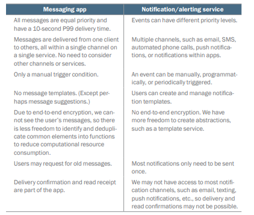
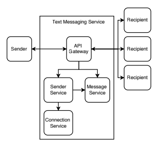
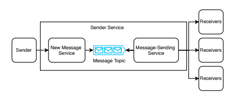
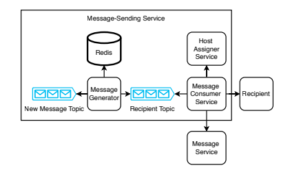
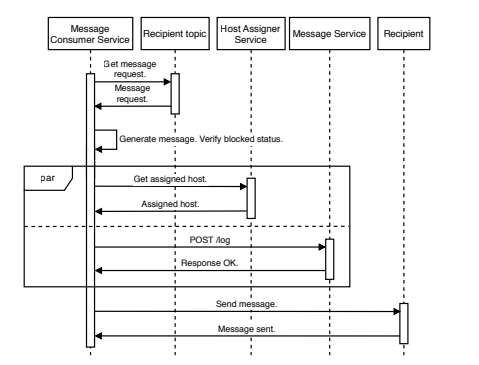
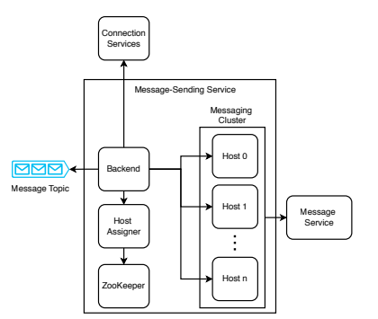

# 14. 문자 메시징 앱 설계
* 10만명의 사용자가 몇 초 내에 메시지를 주고 받을 수 있는 시스템을 설계한다
* 비디오나 오디오 채팅은 고려하지 않는다
* 갑작스런 트래픽 급증을 처리할 수 있어야 한다
* exactly once를 고려한다

## 14.1 Requirement
- real-time 또는 eventual consistency 모두 고려
- 채팅방은 2 ~ 1,000 명의 사용자
- 문자 제한은 1,000 UTF-8, 문자당 32bit, 최대 4KB
- 알림은 고려하지 않음
- 전송 확인 및 읽음 확인
- 메시지 기록, 사용자는 최대 10MZB의 과거 메시지를 조회 및 검색 가능
  - 사용자가 10억이면 저장 용량은 약 10PB
- 메시지 본문은 비공개 e2e 암호화를 고려한다

### non functional requirement
- Scalability : 10만명의 동시 사용자, 1분마다 4KB 전송 가정시 write 400MB/min. 사용자는 최대 1,000개의 연결, 메시지는 최대 1,000 명에게 전송, 각 수신자는 최대 5개의 기기
- 99.99% availability
- P99 message 전송 시간 10s
- Security and privacy
- Consistency : 메시지의 엄격한 순서는 필요 없음

## 14.2 초기 구상
- 알림/경보 서비스와 유사하지만 약간 차이가 있다

- 메시지의 우선순위가 없음
- 단일 채널로만 메시지가 전달 됨
- 수동으로만 트리거
- 메시지 템플릿 없음
- 중복 제거의 여지가 적음
- 이전 메시지를 요청할 수 있음

## 14.3 초기 고수준 설계

- api gateway를 통해 메시지를 주고 받는다
- 발신자 서비스 : 메시지를 받아 수신자에게 전달한다
- 메시지 서비스 : 메시지를 저장하고 조회하는 서비스
- 연결 서비스 : 사용자 정보 저장 서비스

### 14.4 연결 서비스
- GET /connection/user/{userId} : 사용자의 정보를 가지고 온다
- POST /connection/user/{userId}/recipient/{recipientId}: 다른 사용자에게 연결 요청 보냄
- PUT /connection/user/{userId}/recipient/{recipientId}/request/{accept}: 연결 요청 수락/거부
- PUT /connection/user/{userId}/recipient/{recipientId}/block/{block}: 차단
- DELETE /connection/user/{userId}/recipient/{recipientId}: 연결 제거
### 14.4.1 연결 만들기
- 사용자의 연결은 기기 또는 브라우저 쿠키나 로컬 스토리지에 저장된다
- 사용자가 기기를 변경하는 경우를 대비해 동기화하는 역할을 한다
- 공유  SQL 데이터베이스에 저장하는 stateless 서비스로 간단히 구현할 수 있다

### 14.4.2 발신자 차단
- 차단은 모든 레벨에서 고려되어야 한다
  - 앱에서도 안 보여야 하고
  - 메시지를 받지도 않아야 한다
#### 트래픽 줄이기
- 서버로의 트래픽을 줄이기 위해 차단된 경우 메시지 발신 자체를 차단할 수 있다
- 그렇게 하기 위해서는 사용자의 기기에 차단된 사용자가 저장돼야 한다 

### 즉시 차단/차단 해제
- 클라이언트 단에서는 즉시 차단/차단 해제를 수행하고
- 서버에는 event를 발행해 eventual consistency를 보장하면
- 시스템의 일부가 실패해도 기능이 유지된다

### 앱 해킹
- 차단된 사용자가 앱을 해킹해 자신을 차단한 수신자를 삭제 시도할 수 있다
- 이를 막기 위해서는 서버에 저장해야 한다
- 이 보안 문제는 차단을 여러 계층에서 구현해야 하는 이유중 하나이다

### Consistency 문제
- 서버의 데이터가 불일치할 수 있다
- 예를 들어 여러 기기가 동시에 차단 및 차단 해제를 한 경우
- 사용자의 요청을 한줄로 세워서 해결할 수 있다
- 또는 차단/차단 해제를 기기가 동기화 되기 전까지 재수행 허용하지 않는 것이다

### 공개 키
- 공개 - 비공개 키 쌍을 생성하고 연결 서비스에 업데이트 한다
- 사용자가 최대 1,000개의 연결과 5개의 기기를 가질 수 있으므로 키 변경에는 최대 5,000개의 요청이 필요할 수 있다
- 키가 만료된 경우를 대비해 해싱하여 해시가 일치할 때만 메시지를 수신하도록 할 수 있다
- 또한 키 변경을 유예기간을 두고 즉시 적용되지 않도록 하는 방법도 있다

## 14.5 발신자 서비스

- 발신자로부터 메시지를 받아 near real time으로 수신자에게 전달하는 단일 기능을 갖고 있다
- 가용성, 확장성, 성능에 집중한다
- 두 개의 서비스와 카프카 토픽을 이용해 구성한다

### 14.5.1 메시지 보내기
- 메시지 보내기는 클라이언트에서 발신자, 수신자, 본문을 포함한 메시지를 작성하고 암호화 한 후 발신자 서비스에 보낸다
- 새 메시지 서비스는 메시지 요청을 받아 카프카 토픽에 만들고 성공을 반환한다
- 최대 5,000개의 수신자가 포함될 수 있으므로 비동기로 처리해야 한다

1. 발신자가 차단됐는지 확인
2. 메시지 전송 서비스는 여러 수신자와 웹소켓으로 견결되어 있다
3. 발신자 서비스가 수신자 클라이언트에 메시지를 보낸다
4. 수신자는 메시지가 중복되지 않았는지 확인한 후 사용자에게 표시한다
5. 사용자가 메시지를 읽으면 앱이 발신자에게 읽음 확인 메시지를 보낸다

### 14.5.2 기타 논의사항
* 사용자가 메시지를 보냈지만 호스트의 응답전에 다운되면 어떻게 되는가?
  * 5xx 이후 재시도 한다
* 메시지 순서를 해결하려면?
  * kafka로 인해 순서가 유실되지만 해싱(ring)을 이용해 특정 사용자를 특정 파티션에 몰아넣을 수 있다
* 메시지가 1:1이 아닌 N:N이라면?
  * 인원수를 제한하여 ... ??

## 14.6 메시지 서비스
- 메시지 서비스는 메시지 로그 역할을 한다
- 사용자가 새 기기에 로그인하거나, 메시지를 전달 못 받았을대 가지고 올 수 있다
- 저자는 E2E를 설명하고 싶다
- 메시지 서비스에서 E2E는 
  - 수신자가 공개 / 비공개 키를 생성한다
  - 발신자가 수신자의 공개 키로 메시지를 암호화하고 수신자에게 메시지를 보낸다
  - 수신자가 자신의 비공개 키로 메시지를 복호화한다
- 메시지 서비스는 write가 높은 서비스로 예상되며 이는 카산드라의 이상적인 사용 사례이다

## 14.7 메시지 전송 서비스
### 14.7.1 소개
- 수신자 기기가 서버가 아니므로 발신자 서비스가 능동적으로 메시지를 보낼 수 없다
- 사용자 기기가 서버가 되는 것은 아래 이유로 안된다
  - 보안 - DDoS와 같은 공격
  - 기기로의 네트워크 트래픽 증가 - 비용
  - 전력 소비 - 모바일 환경의 경우 배터리가 빠르게 소모될 것이다
- 이를 위해 서버는 매우 많은 웹소켓을 유지해야 하는데
- 이 과정에서 서버가 다운되면 대체 호스트를 프로비저닝 해줘야 한다
- 어떤 메시지는 전달되고 어떤 메시지는 전달되지 않았다면 중복을 어떻게 막을 수 있을까?
  - 레디스와 같은 시스템에 체크포인트를 기록하고 전달된 메시지는 체크한다
  - 또는 수신자 기기가 중복된 메시지를 제거하는 방법이 있다
  - 마지막으로 확인이 오지 않으면 다시 메시지를 보내는 방법이 있다

### 14.7.2 고수준 아키텍처

1. 메시징 클러스터, 개별 기기에 id를 할당 받는다
2. 호스트 할당자 서비스 - id와 호스트의 매핑을 유지
3. 연결 서비스
4. 메시지 서비스

- WebSocket 기반 실시간 메시징: 모든 클라이언트는 WebSocket으로 호스트에 연결되어 실시간 메시지 송수신이 가능함.
- 대규모 연결 처리: 일부 팀은 단일 호스트에서 수백만 개의 연결을 처리한 사례가 있음 (예: MigratoryData).
- 공개키 관리: 각 호스트는 연결된 클라이언트의 공개키를 저장하며, 클라이언트는 공개키 변경 시 이를 호스트에 전달할 수 있는 엔드포인트 필요.
- 텍스트 vs 파일 분리: 텍스트 메시지는 빠른 처리, 파일(사진/영상)은 별도 클러스터에서 처리하여 독립적으로 확장 가능.
- 메시지 크기 제한: 실시간 처리를 위해 메시지는 수백 자 이내로 제한.
- 트래픽 급증 시 대응: 텍스트는 몇 초 내 전달 가능, 파일은 수 분 지연 가능.
- 단기 저장: 호스트는 최근 며칠간의 메시지를 메모리에 저장하고 주기적으로 삭제.
- Kafka + Redis 구조:
  - 메시지 수신 시 Kafka 큐에 쓰기 → Consumer 클러스터가 Redis에 저장.
  - 클라이언트가 과거 메시지 요청 시 Redis에서 읽어옴.
  - Kafka는 Redis의 쓰기 부하를 완화하고 장애 허용성을 높임.
  - 설계는 쓰기보다 읽기 성능을 우선시함.
- 호스트 할당 서비스:
  - 클라이언트/채팅방 ID를 Redis 캐시에 저장.
  - Consistent hashing, round robin 등으로 할당 가능하지만 hot shard 문제 발생 가능. 
- 메타데이터 서비스:
  - 각 호스트의 트래픽 정보 기반으로 클라이언트/채팅방을 적절히 분산.
  - 사용자 디바이스 정보도 포함 가능.
- 활동 로그 저장: 호스트의 메시지 처리 활동을 HDFS에 저장.
- 주기적 리밸런싱: 배치 작업으로 클라이언트와 호스트 재할당, 메타데이터 업데이트.

### 14.7.3 메시지 전송 단계
### 14.7.4 몇 가지 질문
- 수신자에게 메시지를 전달하거나 발신자에게 '전송됨' 알림을 전달하기 전에 서버가 다운되면?
  - 해결 방안:
  - Cassandra에 최근 메시지 전송 이벤트 저장: 빠른 쓰기 성능 활용.
  - 클라이언트가 메시징 서비스에 질의: 일정 시간 응답이 없으면 메시지 전송 여부 확인.
  - "전송됨" 알림을 별도 메시지로 처리: 수신자 호스트가 발신자에게 알림 메시지를 전송.
- 메시지 순서를 해결하려면?
  - 해결 방안:
  - 수신 클라이언트가 이미 더 늦은 메시지를 받은 경우, 이전 메시지를 422 오류로 거부.
  - 오류는 발신자에게 전달되며, 사용자가 메시지를 다시 보낼지 결정 가능.
- 메시지가 1:1이 아닌 N:N이라면?
  - 인원 수 제한

### 14.7.5 가용성 개선
- 기본 구조: 각 클라이언트는 하나의 호스트에 연결됨. 
- 문제점: 호스트 장애 시 복구까지 수십 초 소요. 
- 개선 방안:
  - 스탠바이 호스트 풀 운영: 평소에는 heartbeat만 전송, 장애 발생 시 즉시 클라이언트 재할당.
  - 미니 클러스터 구성:
    - 각 호스트에 1~2개의 세컨더리 호스트를 할당.
    - 프라이머리 호스트가 모든 요청을 세컨더리로 포워딩 → 실시간 동기화 유지.
    - 장애 발생 시 즉시 세컨더리로 failover 가능.
  - Terraform + Kubernetes 활용: 3개의 pod로 구성된 클러스터 정의.
  - 주의점: 비용 및 복잡도 증가 가능성 있음.

## 14.8 검색
- 자기 메시지만 검색 가능: 사용자는 자신의 메시지만 검색할 수 있음. 
- 역색인 없이 직접 검색: 클라이언트에 역색인을 구축하지 않고, 메시지를 메모리에 로드하여 직접 검색.
- 저장 용량: 평균 사용자 메시지는 1GB 미만이므로 메모리 기반 검색이 현실적.
- 미디어 파일 검색: 파일 이름은 검색 가능하지만, 파일 내용은 검색 대상이 아님.

## 14.9 로깅, 모니터링, 경보
...

## 14.10 기타 논의 가능한 주제
- 메시지 권한 요청: 상대방의 허락을 받아야 메시지 전송 가능. 차단/허용 변경 가능. 
- 차단 기능: 차단 시 채팅방에서 자동 제거, 메시지 전송 불가.
- 다중 디바이스 로그인 제한: 한 번에 하나의 디바이스만 로그인 허용.
- 메시지 순서 문제: 여러 참가자가 동시에 메시지 전송 시 순서가 뒤섞일 수 있음 → 순서 보장 설계 필요.
- 파일 첨부 및 음성/영상 채팅 확장: 별도 컴포넌트 및 서비스 필요.
- 메시지 삭제 기능: 오프라인 상태에서도 삭제 가능, 서버와 동기화 필요.
- 차단/차단 해제 메커니즘: 세부 설계 논의 가능.
- 보안 및 개인정보 위험: 현재 설계의 취약점과 해결책 논의.
- 다중 디바이스 동기화: 사용자 디바이스 간 메시지 상태 동기화 설계 필요.
- 경합 조건 처리: 사용자 추가/삭제 시 발생할 수 있는 오류 및 불일치 해결 방안.
- P2P 메시징 고려: IP 변경 시 데몬으로 업데이트, 복잡성 논의.
- 메시지 압축 전송: 암호화 전 압축 → 수신 후 복호화 및 압축 해제.
- 사용자 온보딩: QR, Bluetooth, 연락처 접근 등 다양한 방식으로 친구 추가 및 초대 가능.
- 중앙 집중형 vs 분산형 아키텍처: 현재는 중앙 집중형 → P2P 방식도 논의 가능.