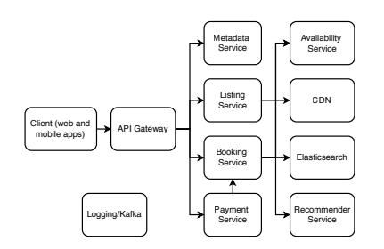

# Chapter 15. 에어비앤비 설계
* 유사한 서비스로는 영화 티켓, 항공권, 주차장 예매등이 있다
* 택시나 차량 공유는 유사하지만 다른 비기능적 요구사항이 있으므로 적용할 수 없다

## 15.1 요구사항
1. 예약하는 게스트, 예약 목록을 만드는 호스트가 있다
2. 마켓플레이스 앱으로, 제품과 서비스를 판매하는 사람(호스트)와 구매하는 사람(게스트)를 연결한다
3. 결제를 처리하고 수수료를 받는다. 분쟁을 조정하고 사기를 모니터링하는 운영 담당 내부 사용자가 있다.

### 호스트 사용 사례
* 목록을 추가, 업데이트, 삭제할 수 있다
* 예약 요청을 수락하거나 거절할 수 있다
* 앱 내 메시징 기능
* 게스트 평점과 리뷰를 게시하고 볼 수 있다
* 게스트로부터 에어비앤비 수수료를 제외한 숙박비를 받는다
* 세금 신고 문서를 받는다
* 시간에 따른 수입, 평점, 리뷰 내용 등의 분석을 한다
* 조정요청이나 사기 신고등을 포함해 운영팀과 소통한다

### 게스트 사용 사례
* 목록을 검색하고 볼 수 있다
* 예약 요청과 결제를 제출하고 예약 요청 상태를 확인한다
* 호스트와 소통하나
* 목록 평점과 리뷰를 게시하고 호스트의 평점과 리뷰를 본다
* 호스트와 유사하게 운영팀과 소통한다

### `운영팀` 사용 사례
* 목록 요청을 검토하고 부적절한 목록을 제거한다
* 분쟁 조정, 대체 목록 제안, 환불 전송 등의 목적으로 고객과 소통한다

### 요구사항 명확하게
* 호스트는 방을 등록할 수 있다. 방은 한 사람용, 속성은 도시와 가격이다.
* 호스트는 방 하나에 대해 최대 10장의 사진과 25MB의 동영상을 제공할 수 있다
* 게스트는 도시, 체크인, 체크아웃 날짜로 방을 필터링 할 수 있다
* 게스트는 체크인과 체크아웃 날짜로 방을 예약할 수 있다
* 호스트나 게스트는 예약이 시작되기 전 예약을 취소할 수 있다 
* 호스트나 게스트는 자신의 예약 목록을 볼 수 있다
* 게스트는 특정 날짜에 하나의 방만 예약할 수 있다
* 방은 중복 예약될 수 없다

### Non functional requirement
* 10억 개의 방이나 1억/day의 예약으로 확장 가능
* 목록 가용성에 강한 일관성을 적용, 이중 예약이나 잘못된 예약이 없어야 한다
  * 설명이나 사진은 eventual consistency 적용 가능
* P99는 몇초 수준이면 된다

### API endpoint
* findRooms(cityId, checkInDate, checkOutDate)
* bookRoom(userId, roomId, checkInDate, checkOutDate)
* cancelBooking(bookingId)
* viewBookings(hostId)
* viewBookings(guestId)

## 15.2 설계 결정
* 방 목록의 정보를 여러 데이터 센터에 복제해야 하는가?
* 데이터 모델은 방의 가용성을 어떻게 표현해야 하는가?
### 15.2.1 복제
* 특징
  * 검색은 한번에 한 도시
  * 쓰기 성능이 중요하지 않다
  * 읽기 지연을 최소화하기 위해 지리적으로 데이터 센터에 분산 가능
  * CDN을 사용해 방 사진과 동영상을 분리하여 저장할 수 있다
  * 캐시는 필요 없을 수 있다

### 15.2.2 방 가용성 데이터 모델
* (rood id, date, guest_id) - 단순하지만 날짜만 다른 여러 행을 포함해야 한다
* (roo_id, guest_id, chjeck_in, check_out) - 더 간결하지만 날짜가 겹치는지 확인하는 알고리즘이 필요하다

### 15.2.3 겹치는 예약 처리
* 여러 사용자가 동시에 예약하려고 할때 어떻게 처리할 것인가

### 15.2.4 검색 결과 무작위
* 개인화에 방해될 수 있음

### 15.2.5 예약 과정 중 방 잠금
* 락을 이용해 방이 보이지 않게 할 수 있다. 이중 예약을 막을 수 있지만, 예약 손실의 트레이드 오프가 있다
* 호텔은 capability가 더 크기 때문에 가능한것을 에어비앤비에서는 쓸 수 없다

## 15.3 고수준 아키텍처
* 주요 서비스 구성
* Booking Service (예약 서비스)
  * 게스트가 예약을 진행하는 핵심 서비스
  * 수익과 직결 → 높은 가용성, 낮은 지연시간 필수
  * 강한 일관성보다는 가용성과 성능을 우선시

* Listing Service (숙소 등록 서비스)
  * 호스트가 숙소를 등록·관리
  * 예약/가용성과는 다른 특성을 가지므로 별도 서비스
  * 중요하지만 예약 서비스보다는 덜 중요
* Availability Service (가용성 서비스)
  * 숙소 예약 가능 여부 관리
  * 예약/리스트 서비스 모두에서 사용
  * 읽기 요청은 매우 빈번 → 고확장성 필요
  * 쓰기 요청은 드물어 확장성 요구가 낮음
* Approval Service (승인 서비스)
  * 새 숙소 등록이나 민감한 수정 시 운영팀 승인 필요
  * 명확성을 위해 “승인(Approval)”이라는 이름 사용
* Recommender Service (추천 서비스)
  * 개인화된 숙소 추천 제공
  * 광고/추천 시스템과 유사
  * 면접에서 깊게 다루지 않아도 되지만 다이어그램에 포함 가능
* Regulations Service (규제 서비스)
  * 지역별 법규 준수 확인
  * Listing/Booking 서비스와 연동해 적절한 UX 제공
  * 별도 팀이 관리하여 도메인 전문성 확보 가능
* 기타 내부 서비스
  * 분석 등 내부용 서비스
  * 면접 범위에서 벗어나므로 간단히 언급만

## 15.4 기능적 분할
* 지리적 지역별로 기능적 분할을 적용할 수 있다
## 15.5 목록 생성 또는 업데이트
1. Listing 생성/수정 흐름

1. 규제 확인:
   2. 호스트가 새 listing 생성 버튼 클릭 → 클라이언트가 위치 정보 포함 요청을 Listing Service로 전송.
   3. Listing Service → Regulation Service로 위치 전달, 적절한 규제 규칙 반환.
   4. Listing Service → 클라이언트에 규칙 제공.
   5. 규칙에 맞춰 UI/UX 동적으로 조정 (예: 최소 숙박 14일 규칙 자동 적용). 
6. Listing 요청 제출:
   7. 호스트가 숙소 정보 입력 후 제출 → Listing Service에 POST 요청.
   1. Listing Service 처리 단계:
      1. 요청 검증
      1. SQL Listing 테이블에 기록 (approved 컬럼으로 승인 여부 관리)
      1. 승인 필요 시 Approval Service에 알림 요청
      1. 클라이언트에 200 응답 반환
   1. CDC(Change Data Capture)를 이용해 SQL 기록과 Approval 서비스 알림을 동시에/비동기적으로 처리 가능.
   1. INSERT IGNORE, transaction log tailing 등으로 중복/일관성 보장.

* 실제 구현 고려사항
1. Listing 생성은 여러 단계로 나눠질 수 있음 (예: 제목/설명 → 가격 → 사진 등). 각 단계는 별도 요청.
1. Pending 상태에서도 수정 가능 → DB UPDATE 처리.
1. 알림(Notifications):
   1. Batch ETL로 미완성 listing 조회 → 호스트/운영팀에 알림.

## 15.6 승인 서비스
* 내부용 애플리케이션, 트래픽 낮음, 단순 구조 가능.
* 모든 요청은 운영팀 수동 승인 필요.
* 주요 DB 테이블: listing_request
  * id, listing_id, created_at, listing_hash(무결성 확인), status(enum), reviewer_id, review_code(enum: APPROVED/REJECTED 사유), review_notes 등.
  * 대규모 데이터 발생 → 매월 수 TB → 최근 1~2개월만 보관 후 나머지는 Object Storage로 아카이빙.
* Ops 워크플로우
  * Ops staff가 GET 요청으로 할당된 리뷰 fetch.
  * SQL 트랜잭션:
    * 이미 할당된 요청 있으면 반환.
    * 없으면 status=none 중 가장 오래된 요청 할당.
    * status=assigned, reviewer_id 업데이트.
  * POST 요청으로 승인/거절 처리.
  * Race Condition 처리: listing hash 비교를 통해 최신 여부 확인 (Lamport clock, vector clock 개념 활용).
* 승인 처리 방식
* Synchronous (Saga Orchestrator 역할)
  * Approval Service → Listing Service 업데이트
  * Approval Service → Booking Service에 listing 공개
  * Approval Service → Notification Service 호출
  * 응답 반환 (idempotent 보장 필요: 중복 알림 방지, SQL insert 조건부 실행 등)
  * 단점: 지연 증가, 실패 시 불일치 발생 가능.
* Asynchronous (CDC 활용)
  * Approval Service → Kafka 큐에 승인 이벤트 발행 후 200 반환.
  * Consumer들이 Listing/Booking/Notification 서비스에 업데이트 처리.
  * Notification은 두 서비스 이벤트 모두 수신 후 발송.
  * Batch ETL로 서비스 간 데이터 불일치 감지 및 경고.
  * 장점: 낮은 트래픽에도 안정적, 리트라이 및 백오프 가능, Saga 보상 트랜잭션 불필요.
* 확장 고려사항
  * 특수화된 리뷰: 특정 지역 규제 전문 Ops staff 배정 필요 → 서비스 합치기, 애플리케이션 레벨 Join, 데이터 중복/denormalization, ID 기반 지역 식별 등 다양한 접근 가능.
  * Booking Service로의 전송: 트래픽이 크므로 장애 가능성 ↑ → 백오프, DLQ로 보완.
  * 자동화: SQL Rules 테이블 + ML 모델 활용 → 일부 승인/거절 자동 처리 가능. → reviewer_id = AUTOMATED, review_code = INCONCLUSIVE 등으로 관리.

## 15.7 예약(Booking) 서비스
### 사용자 흐름
1. 게스트가 도시 / 체크인 / 체크아웃 날짜로 검색 → 가용한 숙소 목록 반환.
2. 가격이나 세부 조건으로 필터링.
3. 특정 숙소 상세 조회(사진, 동영상 포함).
4. 예약 요청 제출 → 성공/실패 응답.
5. 성공 시 결제 단계로 이동.
6. 게스트는 예약 취소도 가능.

> 추가 알림: 예약 완료/취소 알림, 미완료 예약 리마인드, 추천 숙소 제안, 결제 관련 알림.

### 트래픽 & 확장성
- 도시당 최대 100만 개 숙소.
- 하루 1천만 요청 가정 → 시간당 몰려도 초당 약 3천 QPS → 소규모 서버로 처리 가능.
- 하지만 더 큰 트래픽도 처리 가능하도록 확장성 고려 필요.

### 아키텍처 개요
- 클라이언트 → 백엔드
  - Elasticsearch: 검색/필터, 페이지네이션, 오타 보정 검색.
  - SQL 서비스: 예약 및 상세 CRUD (ORM 사용).
  - CDN: 이미지/동영상 제공.
  - 가용성 서비스: 예약 가능 여부 확인 및 잠금.
  - 로깅 서비스.

### 주요 쓰기 연산
1. 예약 요청.
2. 승인(Approval) 서비스로부터의 listing 업데이트.
3. 취소 요청(결제 실패 시 가용성 복구).

### 예약 SQL (리더-팔로워 구조)
- 쓰기는 리더 노드, 읽기는 팔로워.
- Booking 테이블 예시:
  - id, listing_id, guest_id, check_in, check_out, timestamp.

### 가용성 처리
- 예약/취소 시 날짜별 가용성을 수정.
- 상세 조회 시 5분간 임시 잠금 가능 → 다른 게스트에게 노출 차단.
- 단, 검색 재실행 시 관심 없음으로 간주하고 잠금 해제 가능.

### 일관성 유지
- 예약 시 SQL과 Elasticsearch를 함께 업데이트.
- 분산 트랜잭션 또는 CDC 활용 필요.
- 예약으로 더 이상 예약 불가한 경우, DB와 검색 인덱스 모두 갱신 필요.

### 확장 고려
- 검색/조회 트래픽이 예약 트래픽보다 많음 → 검색/조회 서비스와 예약 서비스 분리 권장.

---

## 15.8 가용성(Availability) 서비스

### 목표
- 이중 예약 방지.
- 예약이 호스트에게 반영되지 않는 문제 방지.
- 호스트가 막아둔 날짜에 예약되는 문제 방지.
- CS팀 민원 최소화.

### 엔드포인트
- 특정 지역/타입/날짜 범위로 예약 가능 여부 조회.
- 특정 날짜 범위로 숙소 잠금(lock).
- 예약 CRUD.

### 아키텍처
- 백엔드 서비스 → 리더-팔로워 구조 SQL.

### 테이블 설계 (일자별 행 저장)
- listing_id
- date
- booking_id
- available (enum: available, locked, booked)
- timestamp

> 공간 최적화를 위해 비예약/비잠금 상태는 저장하지 않을 수도 있으나, 전체 행 수 예측 및 스토리지 확보 필요.

### 동시성 제어
- SQL 트랜잭션 + 행 잠금(row lock)으로 중복 예약 방지.
- 리더-팔로워 지연으로 인해 검색 시 예약 불가 숙소가 노출될 수 있음 → 409 에러 반환 처리.
- 모니터링 지표로 추적 필요.

---

## 15.9 로깅, 모니터링, 알림
- Redis, Elasticsearch, CPU/메모리/디스크 사용량 모니터링.
- 비정상적 예약/취소율 탐지.
- 엔드투엔드 유저 플로우 모니터링 (예: 예약 완료율, 미완료율).
- 저조한 전환율, 의도치 않은 흐름(취소 급증 등)에 대한 알림.

---

## 15.10 추가 논의 가능 주제

- 검색 기능 확장: 인접 도시, 날짜 유연 검색, 키워드 검색.
- 호스트/게스트 기능: 신고 시스템, 부적절 행동 감지 후 제재.
- 신규 서비스: 비즈니스 여행 전용 숙소, 더블부킹 허용, 업그레이드 전략.
- 개인화: 추천 시스템, 신규 호스트 숙소 노출 강화.
- 프론트엔드/UX: UX 플로우 개선.
- 보안: 사기 방지, 계정 보호.

---

## 15.10.1 규제 처리 (Regulations)
- 별도 규제 서비스(Regulation Service) 설계 필요.
- 모든 서비스는 이 API와 연동해 규제 변화에 유연하게 대응.
- 실제 기업에서는 규제 변화에 따른 재설계/마이그레이션 비용이 매우 큼.

### 예시 규제
- 1년 최대 숙박 일수 제한.
- 특정 연도 이후 건물만 등록 가능.
- 특정 공휴일 예약 금지.
- 도시별 최소/최대 숙박 기간 제한.
- 특정 지역 전체 숙소 금지.
- 화재경보기, 비상구 등 안전장치 의무.

### 지역별 차이
- 국가/도시/주소 단위로 규제가 다를 수 있음.
- 일부 아파트 단지는 자체 규칙을 가짐.

### 관련 법규
- COPPA, GDPR, CCPA 등 데이터 프라이버시 법.
- 일부 국가는 시민 데이터의 해외 반출 금지.
