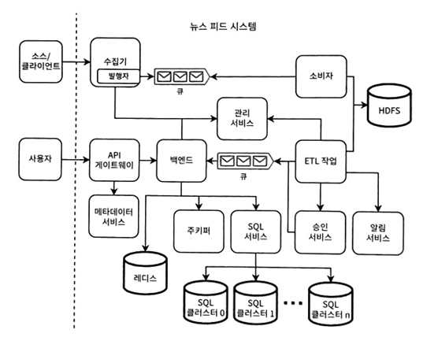

# 16장 뉴스 피드 설계
- SNS와 달리 사용자는 연결된 일반적으로 다른 사용자가 작성한 게시물을 받음
## 16.1 요구사항
- 기능적 요구사항
  - 사용자는 관심 주체를 선택 가능, 최대 100개 태그
  - 한번에 10개씩, 최대 1,000개까지 영어 뉴스 항목 수신 가능
  - 시스템은 모든 항목 보관
  - 지리적 위치와 관계 없이 동일한 항목 수신 뒤, 위치와 언어 요소를 기반으로 개인화 고려
  - 뉴스 항목 구성 요소
    - 여러 텍스트 필드 포함
      - 150자 제목 및 10,000자 본문 제한
      - 단순화를 위해 10,000자 제한 필드 하나
    - 항목이 생성된 시간을 나타내는 유닉스 타임스탬프
    - 오디오, 비디오 등 미고려, 추후 고려
- 비 기능적 요구사항
  - 일일 활성 사용자 10만명, 하루 평균 10 요청, 100만 개의 뉴스 항목/일 처리로 확장 가능
  - 읽기 작업은 P99 지연 시간 1초 이내
  - 최대 몇 시간의 최종 일관성 허용
  - 쓰기 작업에 고가용성 필요
    - 읽기 작업은 고가용성이 필수는 아님 -> 사용자 기기에서의 캐시
## 16.2 상위 수준 아키텍처
 
- 해당 아키텍처에서 관찰할 수 있는 점
  - 수집 서비스는 고가용성 필요 -> 예측 불가능한 트래픽 처리(카프카 같은 이벤트 스트리밍 플랫폼 필요)
  - DB는 모든 항목 보관, 사용자에게 최대 1,000개 항목만 제공
  - 1000개의 항목과 100개 태그에 해당 하는 뉴스 컨텐츠 1GB -> 레디스 활용
  - 보관용으로 HDFS와 같은 분산 샤딩 파일 시스템 활용

 
- 수집기에서는 뉴스 항목만 수집할 수 있는 유효성 검사 작업을 수행
  - SQL 인젝션 방지
  - 부적절한 언어 감지 필터링 및 검열
  - 게시물이 차단된 출저/사용자로부터 오지 않는지 확인
  - 필드 검수(길이, 특정 문자 포함 등)
- 예측할 수 없는 트래픽 처리를 위해 카프카 큐 사용
  - 유효성 통과 200 반환, 유효성 실패 시 400
- 큐 소비자는 HFDS에 기록 -> 원시 뉴스 항목과 사용자에게 제공할 뉴스 항목용 테이블 필요
- 사용자 요청 시, 사용자의 태그 조회(메타데이터 서비스)  -> 레디스 캐시에서 적절한 뉴스 조회(백엔드 서비스)
  - 레디스 캐시 데이터 {(tag, hour), [post]}
- 최종일관성 요구사항이 높지 않음 -> 한시간에 한번 이상 뉴스항목 업데이트 불필요
  - 만약 요청이 들어오면? 기기 요첯 무시 or 504 시간 초과이면 기기에서 재요청하지 않음
- ETL 작업은 다른 카프카 큐에 기록 -> 백엔드 호스트가 소비하여 레디스 캐시에 적재
  - 원시 뉴스 데이터에 다른 뉴스 항목이나 외부 데이터 연계된 유효성 검사도 ETL 병렬 작업에 들어감
    - 중복 찾기
    - 지난 1시간 이내 제출할 수 있는 특정 태그/주제에 대한 뉴스 항목 수 제한
- 알림 서비스는 알림 트리거하는 ETL 작업
- 뉴스 서비스에서는 조정 기능이 핵심 역할(추후 자세히 다룸)
## 16.3 사전에 피드 준비하기
- 사용자는 원하는 항목을 얻기 위해 많은 쿼리 발생((tag, hour) 쌍마다 하나의 레디스 쿼리) -> 많은 트래픽 발생
- 사용자의 피드를 사전에 준비함으로써 낮은 지연 시간과 트래픽 갖음 -> 더 많은 저장 공간을 사용하는 트레이드 오프 존재
  - 레디스 한계(총 800TB가 필요)가 있기에 해결 방안 필요
    - 사용자를 지역별로 분할하고 데이터 센터당 두세 개의 지역만 저장
    - 몇 십개의 게시물 ID로 제한해 저장 공간 요구사항을 1TB로 제한 (비추천)
    - {userID,postID} 쌍으로 샤딩된 SQL 구현 -> 무작위 분산으로 핫 샤드 문제 방지
      - 해싱된 사용자 ID를 클러스 이름에 매핑
      - 핫 샤드를 감지하고 클러스터 크기를 적절히 조정해 트래픽의 균형을 맞춤 -> 트래픽 모니터링
    - 사용자 요청이 오면 사용자 ID를 해싱하고 주키퍼에서 적절한 클러스터를 조회하고 SQL 쿼리를 클러스터에게 전달
- 샤딩된 SQL 저장 공간 절약
  - 클라이언트가 모바일이면 게시물을 저장하고 저장소는 삭제하여 저장 공간 절약 가능
    - 다른 기기에 로그인하면 이전 삭제된 게시물 확인 불가능
  - 타임스탬프 열을 추가하여 24시간 보다 오래된 행을 ETL에서 주기적으로 삭제
  - 위의 2가지 방식을 결합하여 활용 가능
    - 게시물에 첫 번째 요청만 처리하고 단일 노드에 맞는 수의 게시물 ID만 저장 가능
    - 클라이언트가 레디스에 동일한 게시물 조회를 피할 수 있는 몇 가지 방법
      - 클라이언트에서 GET 요청 시, 게시물 ID를 포함하여 클라이언트가 아직 가져오지 않은 게시물 반환
      - 레디스 테이블은 게시물 시간 별로 레이블링 -> 특정 시간 게시물 요청
## 16.4 검증과 콘텐츠 조정
 
- 검증으로 모든 문제를 잡아 낼수 없고, 게시물이 사용자에게 잘못 전달될 수 있다는 것을 고려 -> 승인 서비스 고려
  - 승인된 게시물만 카프카 큐를 통해 전달되고 백엔드 서비스에서 소비
##### 16.4.1 사용자 기기의 게시물 변경
- 특정 유효성 검사는 자동화 하기 어려움
  - 오타가 없더라도 이상한 게시물 존재
    - 예로 "이것은 게시물 입니다"는 오타는 없지만 내용이 유효하지 않은 게시물
  - 연령에 부적합한 내용 등을 고려하기 힘듬
- 모든 시스템 설계에서 모든 오류와 실패를 방지하려고 하면 안됨 -> 실수와 실패는 불가피하며, 쉽게 감지하고 문제 해결을 위한 수정 필요
  - 잘못된 게시물을 삭제하거나 수정된 게시물을 덮어씌우는 등의 메커니즘 필요
- GET 호출 시, 수정/삭제될 목록 제공 필요
  - 이벤트 열거형 추가 -> REPLACE, DELETED 추가
  - 호출 시, 현재 게시물 ID 포함시키는 것  -> 백엔드에서 클라이언트에서 CUD할 게시물 제공
##### 16.4.2 게시물 태깅
- 검증이 실패된 처리물은 어떻게 처리해야할까? 출저에 알림
  - 교차 작업을 확장하면 검증 실패할 경우 담당 출저/사용자에게 메시지 전달 -> 검증 ID와 함께 실패 사유 전달
- 전 세계적으로 적용되는 규칙과 지역별 규칙을 구분해야하는 여부 논의 필요 -> 필터를 통해 처리
  - {post ID, [filter]} 필터로 게시물 필터링
  - 단계
    - 클라이언트 뉴스 피드 서비스에 GET 요청
    - API 게이트웨이가 메타데이터 서비스에 클라이언트 태그와 필터를 쿼리
    - API 게이트웨이가 레디스에 쿼리를 보내 태그와 필터가 있는 게시물 ID 얻기
    - 각 게시물 ID의 필터를 레디스에 쿼리하고 사용자의 필터중 하나라도 포함되면 이 게시물 ID를 사용자에서 제외
    - 각 게시물 ID의 게시물을 레디스에 쿼리한 다음 이러한 게시물을 클라이언트에 반환
- 태그별로 게시물 ID를 필터링하는 로직은 애플리케이션 수준에서 수행
##### 16.4.3 조정 서비스
- 서비스 4곳(클라이언트, 수집기, ETL 작업, GET 백엔드 서버)에서 검증을 거침 -> 중복과 버그 유발 및 cpu 처리 오버헤드 <-> 서비스로의 트래픽이 줄여 비용 감소
- 조정 서비스: 수집기, ETL, 백엔드 등에서의 검증을 단일 서비스로 통합하고 추상화
  - 회사가 사용자가 제출한 게시물을 볼 수 있는지 제어하는 것이 목적
  - 다음과 같은 기능 제공
    - 검증 작업과 필터를 구성
    - 게시물을 변경하거나 삭제하는 조정 결정 실행
## 16.5 로깅, 모니터링, 경보
- 다음 사항을 모니터링하고 경보를 보내야함
  - 특정 소스로부터의 비정상적으로 많거나 적은 트래픽 비율
  - 모든 항목과 각 개별 소스 내에서 검증에 실패한 항목의 비정상적으로 높은 비율
  - 사용자가 기사를 악용이나 오류로 신고하는 등의 부정적인 사용자 반응
- 비 정상적으로 긴 처리 시간은 특정 파이프라인 구성 요소의 규모 확장이나 재검토 필요
##### 16.5.1 텍스트와 이미지 함께 제공
- 뉴스항목에 최대 1MB 크기의 이미지 최대 10개까지 허용
- 이미지 파일은 게시물 본문 문자열과 상당히 다름
  - 본문보다 훨씬 크기에 다른 저장 기술 고려
  - 이미지파일은 여러 게시물에서 재사용 가능
  - 이미지 파일 검증 알고리즘은 게시물 검증과 상당히 다른 라이브러리 활용 가능성 높음
##### 16.5.2 고수준 아키텍처
 
- 미디어 업로드는 동기 방식 -> 출처에서 성공여부 확인 필요
- 카프카 큐에 기사의 메타데이터와 텍스트 생성 전에 업로드 완료 필요
- 미디어 파일 해싱을 통해 중복 업로드 방지 -> 304 반환을 통해 동일한 이미지 업로드 불허
  - 미디어는 성공했지만 그 후 처리 실패하면 미디어 삭제 처리? 추후 재시도 후 중복 업로드를 고려하여 삭제하지 않음
    - 배치형태로 활용되지 않는 미디어는 삭제처리
- 사용자가 지리적으로 멀리 분산되어 있거나 트래픽으로 인해 미디어 서비스에 너무 많은 부하가 일어나면? CDN 활용
  - 일부 기사를 사용자에게 제공하지 않아 일부 이미지를 CDN에 저장할 필요 없을때 미디어 서비스와 CDN 동시 활용
- 텍스트와 미디어를 단일 서비스에서 처리/저장 or 별도 처리에 대해 트레이드 오프 논의
## 16.6 기타 논의 가능한 주제
- 기타 가능한 논의 주제
  - 동적 해시태그 생성
  - 다른 사용자나 그룹과 뉴스 항목 공유
  - 제작자와 독자에게 알림
  - 실시간 배포 ETL 작업이 배치가 아닌 스트리밍 작업
  - 특정 기사를 다른 기사보다 우선시하는 부스팅
- 기능 요구사항에서 벗어난 항목 고려
  - 분석
  - 개인화
  - 영어 외의 언어로 기사 제공
  - 뉴스 피드의 수익화
    - 구독 시스템 설계
    - 특정 게시물을 구독자용으로 예약
    - 비구독자를 위한 기사 제한
    - 광고와 프로모션 게시물