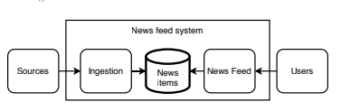
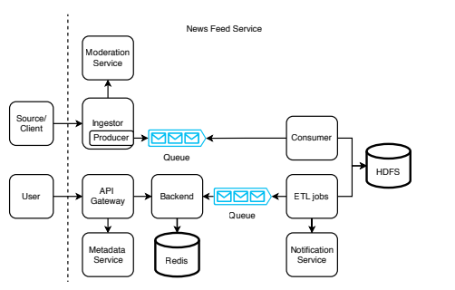
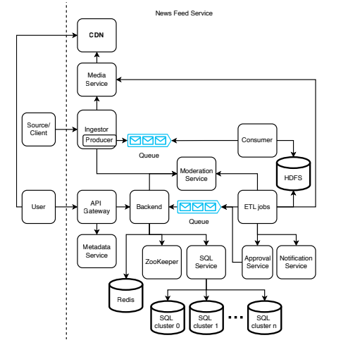

# Chapter 16. 뉴스 피드 설계
## 16.1 Requirement
* 사용자는 관심 주제를 선택할 수 있다
  * Article에는 Category라는 개념이 있다
* 사용자는 한 번에 *개 최대 *의 기사를 볼 수 있다
* 사용자는 기본적으로 동일한 항목을 받지만, 위치와 언어등으르로 개인화를 할 수 있게 고려한다
* 최신 뉴스를 먼저 보여준다
* 뉴스 항목은 여러 텍스트와 이미지 / 생성 시간을 가진다

### 고려하지 않아도 될 것들
* 버전 관리 - 기사는 여러 버전을 가질 수 있다
* 정교한 분석이나 추천 시스템
* 소셜 미디어 기능
* 뉴스의 출처
* 검색
* 사용자의 로그인, 결제, 구독

### Non functional requirement
* 일일 활성 사용자 *만, 평균 *회, 개의 뉴스 항목/Day로 확장 가능하다
* 읽기 작업의 P*는 * 이내
* 사용자 데이터는 비공개
* 최대 몇 시간의 최종 일관성을 허용
* 쓰기 작업에 고가용성이 필요, 읽기는 고가용성은 필요하지 않다

## 16.2 High level design

* Sketch design
* 뉴스 Database 를 중심으로 insert와 read가 각각의 사용자로부터 발생한다
* 수집은 고가용성을 갖추고 무겁고 예측 불가능한 트래픽을 처리해야 한다.
  * Kafka와 같은 이벤트 스트리밍 플랫폼이 적합
* 데이터베이스는 모든 항목을 보관해야 하지만 사용자는 * 개만 볼 수 있으면 된다
  * 모든 항목을 저장하는 것과 read database를 분리해야 할 수 있다
  * 보관은 HDFS, 읽기는 redis 캐쉬에 저장할 수 있을 것이다
* eventual consistency가 시간 단위라면 사용자의 기기는 동기화를 한시간에 한번만 할 수도 있다

* HighLevel design
* 소스는 수집기를 통해 큐에 저장되고, consumer로 읽어서 HDFS에 저장한다
* 사용자는 백엔드 서버를 통해 redis에서 읽고, 레디스의 데이터는 ETL을 통해 큐로 전달되어 동기화 된다
* 수집기는 뉴스에 대한 유효성 검사를 진행한다
  * SQL 인젝션
  * 부적절한 언어
  * 게시물의 출처 - 뉴스 출처가 없어도 된다고 하지 않았나?
  * 필수 필드의 길이
  * 최대 길이
  * 특수 문자

* Ingestor와 검증 
   * 클라이언트 앱에서 기본 검증을 수행하지만, 버그나 악의적인 활동이 있을 수 있어 Ingestor에서 재검증을 수행. 
   * Ingestor 검증 실패 시:
      * 개발자에게 알림 발생.
      * 클라이언트에는 Bad Request와 실패 이유 반환.
   * 검증 통과 시:
      * Kafka 큐에 메시지 전달.
      * 클라이언트에는 Success 반환.
      * 일부 소스 요청은 인증/인가 서비스(OAuth, OpenID)를 거쳐야 함.
* 데이터 파이프라인 
   * Kafka Queue → Consumer → HDFS 저장. 
   * HDFS 테이블:
      * 원본 뉴스 아이템(raw). 
      * 사용자에게 제공 가능한 뉴스 아이템(processed). 
      * 필요시 수동 검토(manual review)용 테이블. 
   * 테이블은 (tag, hour) 단위로 파티셔닝.
* 사용자 요청 처리 
   * 사용자 GET /post 요청 흐름:
          * API Gateway → 사용자 태그 조회 (Metadata Service). 
          * Redis 캐시에서 해당 (tag, hour) 키 기반 뉴스 아이템 조회. 
          * 구조: {(tag, hour), [post]} 
* API Gateway 역할:
        * 인증/인가, 레이트 리미팅. 
    * 규모 확장 시, 메타데이터 조회와 Redis 조회 기능을 별도 백엔드 서비스로 분리 가능.
* 일관성과 부하 감소 전략 
   * 사용자 기기가 *간 내 재요청 시:
       * 요청 자체를 무시하거나, 
       * 요청은 허용하되 응답 시 재시도하지 않도록 함. 
   * 이를 통해 서비스 부하 감소.
* ETL 작업과 검증 태스크 
   * ETL Job은 Kafka 큐를 통해 실행되며 Redis를 갱신. 
   * 검증(Validation) 태스크 종류 예시:
       * 중복 아이템 탐지. 
       * 특정 태그/주제에 시간당 아이템 수 제한 확인. 
   * 병렬 ETL 태스크 → 각각 유효한 Post ID 집합 출력 → 교집합 연산 → 최종 유효 ID 추출 → Redis 갱신. 
   * 추가적으로 알림(Notification) 서비스와 연계 가능 (앱, 이메일, 문자, 소셜 미디어 등).
* 콘텐츠 검열과 모더레이션 
   * 차단된 사용자나 규제된 콘텐츠는 제공하지 않도록 모더레이션 서비스에 통합. 
   * 개발자는 모더레이션 로직을 단일 서비스에 정의해 중앙 집중식 관리 가능.

## 16.4 Validation and Content Moderation

### 1. 검증과 수동 승인(Approval Service)
- 자동 검증으로 모든 문제를 잡을 수 없음 → 일부 게시물은 잘못 전달될 수 있음.
- 특정 ETL 작업이 문제 있는 게시물을 수동 검토(Approval Service) 로 전달.
    - 승인 시: Kafka 큐로 다시 전달되어 백엔드에서 소비 후 사용자에게 제공.
    - 거절 시: 소스/클라이언트에 알림 전송.
- 승인 서비스는 게시물 검토를 중앙화하며, 검토량이 많으면 자체 Kafka 큐 필요 가능.

### 2. 사용자 기기에서 게시물 수정
- 자동화하기 어려운 문제 예시:
    - 문장이 잘린(truncated) 글.
    - 부적절한 콘텐츠(연령 부적합, 허위 뉴스 등).
- 완벽한 예방은 불가능 → 탐지·수정·삭제 메커니즘 필요.
- 해결 방법:
    - `GET /posts` 응답에 수정(REPLACE) 및 삭제(DELETE) 이벤트 포함.
    - 클라이언트는 이를 반영해 게시물 갱신/삭제.
- 구현 방법:
    - `event` 필드(값: REPLACE, DELETE)를 추가해 기존 post ID를 갱신.
    - 클라이언트가 현재 보유한 post ID를 요청 시 포함해 백엔드가 비교 후 갱신/삭제 결정.

### 3. 게시물 태깅(Tagging)과 필터(Filter)
- 게시물 단위로 승인/거절 처리. 부분 승인 불가.
- 검증 실패 시 선택지:
    - 단순 폐기(UX 저하).
    - 소스에 알림(적절).
    - 수동 검토(비용 큼).
- 교차(Intersection) 태스크 확장:
    - 검증 실패 내역을 집계해 소스/사용자에게 메시지 전송.
    - 메시지: 실패한 검증 ID + 설명 포함.
- 글로벌 규칙 vs 지역별 규칙 구분 필요:
    - 문화/법적 차이에 따라 특정 사용자 그룹만 필터링 필요.
- 태그(tags): 사용자가 설정.
- 필터(filters): 서비스가 강제 적용.
- Redis 구조:
    - `{post ID, post}`
    - `{tag, [post ID]}`
    - `{post ID, [filter]}`
- 처리 절차:
    1. 클라이언트 `GET /post` 요청.
    2. API Gateway가 사용자 태그와 필터 조회.
    3. Redis에서 태그 기반 post ID 조회.
    4. Redis에서 필터 확인 후 제외.
    5. Redis에서 최종 post 조회 후 반환.
- SQL 대안: JOIN 쿼리로 한 번에 필터링 가능.
- 지역별 피드 지원: Redis 파티셔닝 또는 region 컬럼 추가.

### 4. 모더레이션 서비스
- 검증 위치: 클라이언트, Ingestor, ETL, 백엔드.
- 중복 구현 문제와 보안 문제 → 단일 모더레이션 서비스로 통합.
- 주요 기능:
    1. 검증 태스크와 필터 설정.
    2. 관리자에 의한 게시물 변경/삭제 결정 수행.
- 장점:
    - 중복 개발 방지.
    - 콘텐츠 검열 팀이 비기술적으로 작업 가능.
    - 결정 내역을 로그로 저장 → 리뷰, 감사, 롤백 가능.
- 구현 방식:
    - 모더레이션 서비스도 Kafka에 이벤트를 발행.
    - 뉴스 피드 서비스가 이를 소비해 Redis 업데이트.

## 16.5 Logging, Monitoring, and Alerting

### 1. 모니터링 및 알림 대상
일반적인 로깅/모니터링 외에 추가적으로 다음을 감지하고 알림 필요:
- 특정 소스에서 발생하는 비정상적으로 큰/작은 트래픽.
- 검증 실패율이 비정상적으로 높은 경우(전체 및 특정 소스별).
- 사용자 신고(남용, 오류 등).
- 파이프라인에서의 처리 지연:
    - 업로드 시각과 Redis 반영 시각을 비교.
    - 지연이 크면 파이프라인 확장 또는 비효율적 처리 확인 필요.

### 2. 이미지 처리 (텍스트 외 미디어)
- 뉴스 아이템은 0~10개 이미지(최대 1MB) 포함 가능.
- 태그/필터는 게시물 전체에 적용.
- 이미지와 텍스트의 차이:
    - 크기가 훨씬 크고, 다른 저장소 및 처리 방식 필요.
    - 이미지가 여러 게시물에서 재사용 가능.
    - 검증 방식도 텍스트와 다름(이미지 처리 라이브러리 활용).

### 3. 고수준 아키텍처 (Media Service 추가)
- 텍스트는 40KB, 이미지 최대 10MB → 이미지가 자원 소모의 핵심.
- Media Service:
    - Ingestor에서 업로드 동기 처리.
    - 성공/실패 여부 즉시 응답 필요.
    - 공유 오브젝트 스토리지 사용, 여러 데이터센터에 복제 → 가까운 위치에서 접근.
- Ingestor는 업로드 전 파일 해시를 전송 → 중복 파일이면 `304 Not Modified` 응답 → 네트워크 비용 절약.

### 4. 업로드 실패 처리
- 미디어 업로드 후 Kafka 전송 실패 시:
    - 업로드는 유지(비용이 크기 때문).
    - 소스가 재시도 → 중복 업로드 시 `304` 반환.
    - 재시도 없을 경우 → 주기적 감사(audit) 작업으로 메타데이터 없는 미디어 정리.

### 5. CDN 활용
- 전세계 사용자/과부하 대응 시 CDN 도입.
- 아키텍처 변화:
    - Media Service가 CDN에 미디어 업로드.
    - 클라이언트는 텍스트/메타데이터는 Redis에서, 이미지는 CDN에서 다운로드.
- Media Service와 CDN을 함께 사용하는 이유:
    - 모든 게시물이 사용자에게 전달되는 것은 아니므로, 불필요한 이미지의 CDN 업로드 비용 절감.
- 승인(Approval) 및 ETL 작업:
    - 게시물이 승인되면 Media Service가 해당 이미지를 CDN으로 업로드.

### 6. 추가 고려사항
- 텍스트와 미디어를 분리 서비스로 관리할지, 통합 서비스로 관리할지 선택 필요.
- CDN에 텍스트까지 포함한 전체 기사 저장 가능:
    - Redis에는 article ID만 저장.
    - 인기 기사에 대해 성능 향상 가능.
- 검토 효율화:
    - 텍스트와 이미지를 함께 검토(단일 게시물 단위).
    - 오디오 → 자동 전사로 텍스트 리뷰 가능 (청각장애인 채용 등 포용성 확대).
    - 동영상은 2~3배속 재생 + 전사 텍스트 병행.
    - ML 기반 자동 검토 고려 가능.
