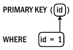
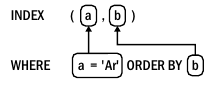
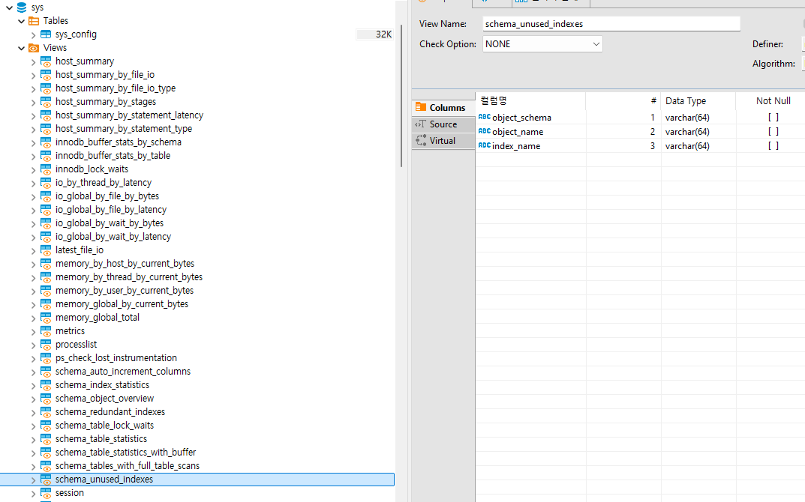

# 2. 인덱스와 인덱싱
### 2.1 성능 향상과 관련 없는 딴짓
- MySql 성능 향상을 위해 '고사양의 하드웨어를 구매하는 것'과 'MysSQL 튜닝'이라는 레드헤어링 등장
##### 더 좋고 빠른 하드웨어!
- 스케일업은 최후의 보루
- 스케일업부터하면 아무것도 배우지 못하고 문제 대강 넘기는데 익숙해짐
##### MySQL 튜닝
- 아래 용어
  - 튜닝: 연구개발 목적으로 MySQL 시스템 변수를 조정
  - 구성: 시스템 변수를 하드웨어와 환경에 적합한 값으로 설정하는 행위
  - 최적화: 워크로드를 줄이거나 효율성을 높여 MySQL 성능을 향상시키는 행위
- MySQL 튜닝은 두가지 이유로 레드헤어링 
  - 실험 했을 때처럼 수행되지 않을때가 많아 결과가 의심
  - MySQL은 이미 고도로 최적화 됨
- 독창적 MySQL 재구성도 무 의미하게 MySQL에서 자동으로 해줌
- 튜닝은 레드헤링이고 구성은 MySQL에서 자동으로 이루어지므로 최적화만 신경쓰면 됨

### 2.2 MySQL 인덱스: 시각적 소개
- 쿼리와 인덱스를 변경하는 방법으로 다양한 성능 문제가 해결
##### InnoDB 테이블은 인덱스다
- 프라이머리 키(이하 PK) 조회는 매우 빠르고 효율적
- InnoDB는 B-트리 인덱스 활용 -> 탐색 시간 복잡도 O(logN)<br>

- 세컨더리 인덱스도 결국 PK를 찾아 조회<br>


##### 테이블 접근 방법
- 인덱스를 사용하여 행 조회 방법은 세가지 테이블 접근 방법 중 하나 -> 인덱스 조회가 가장 적합하면서 일반적임
- 인덱스 조회가 불가능 할때는 '인덱스 스캔' 또는 '테이블 스캔' 접근 방법 유일
- 인덱스 조회
  - 대량의 데이터를 대상으로 한 빠르고 효율적인 접근 -> 인덱스 도입 목적
  - 직접 쿼리 최적화의 본질
- 인덱스 스캔
  - 모든 행을 읽고 필터링, 프라이머리 키로 모든 행을 읽기 전 세컨더리 인덱스로 행을 읽음
  - 인덱스 스캔에는 두가지 유형 존재
    - 풀 인덱스 풀 스캔
      - 인덱스 순서가 ORDER BY 쿼리와 일치할 때 행정렬 피할 수 있음(SELECT * FROM elem FORCE INDEX(a) ORDER BY a,b)
      - 세컨더리 인덱스를 읽고 프라이머리 키로 해당 행 조회
    - 인덱스 전용 스캔
      - 인덱스에서 열값(행 x)을 읽기 때문에 인덱스 커버링 필요
- 테이블 스캔
  - 프라이머리 키 순서로 모든 행을 읽음
  - 일반적으로 테이블 스캔을 피하는게 좋지만 허용 또는 나은 경우 존재
    - 테이블이 작고 접근 빈도가 낮을 때
    - 테이블 선택도가 매우 낮을 때
##### 맨 왼쪽 접두사(leftmost prefix) 요구사항
- 인덱스 정의에서 지정한 맨 왼쪽 인덱스 열로 시작하는 하나 이상의 인덱스 열을 반드시 사용
- 맨 왼쪽 접두사에 대한 요구사항은 두가지 논리적인 결과를 가져옴
  - 인덱스 (a,b)와 (b,a)는 서로 다름 -> 인덱스가 (a,b) 형식으로 설정되어 있다면, where b='Be' and a='Au'로 검색시 인덱스 사용 불가
  - 인덱스 (a)와 (a,b) 대신 (a,b,c) 사용 가능성 큼 -> (a)와 (a,b)는 (a,b,c)의 맨 왼쪽 접두사이기 때문(둘은 중복되기에 삭제될 수 있음)
- 모든 세컨더리 인덱스 끝에는 PK가 존재 -> 자동 설정때문에 (a,b,id) 같이 임의로 PK 굳이 포함할 필요는 없음
- 인덱스가 클수록 많은 메모리 필요 -> 프라이머리 키의 크기를 작게 유지, 세컨더리 인덱스 수를 적절히 유지

##### EXPLAIN: 쿼리 실행 계획
- 쿼리 실행 계획에는 테이블 조인순서, 테이블 접근 방법, 인덱스 사용 등 중요 정보 포함
- 쿼리에서 단일 문자를 변경하면 실행계획이 크게 변경됨
  - where id = 1과 where id > 1은 다름
- 전문가도 실행 계획 출력 형식을 읽어야 추세와 진보에 보조를 맞출 수 있음 -> 기본 형식으로 그대로 유지되고 있음
````
  EXPLAIN SELECT * FROM elem WHERE id=1
*************************************************************  
  id:1
  select_type: SIMPLE
  table: elem
  partitions: NULL
  type: const
  possible_keys: PRIMARY
  key: PRIMARY
  key_len: 4
  ref: const
  rows: 1
  filtered: 100.00
  Extra: NULL
````
- 7개 필드
  - table: 테이블 이름이나 참조된 서브 쿼리, 조인 순서대로 출력
  - type: 테이블 접근이나 인덱스 조회의 접근 유형, ALL 풀 테이블 스캔 의미
  - possible_keys: 쿼리가 맨 왼쪽 접두사를 사용하므로 MySQL 사용할 수 있는 인덱스 나열
  - key: MySQL이 사용할 인덱스의 이름이거나 인덱스를 사용할 수 없을때는 NULL
  - ref: 인덱스(key 필드)에서 행을 조회하는 데 사용되는 값의 소스를 나열
  - rows: 행을 찾기 위해 조회할 예상 행의 수, 실제 값과 근사하지만 같지는 않음
  - Extra: 쿼리 실행 계획에 대한 부가 정보, 적용할 수 있는 쿼리 최적화를 나타냄
##### WHERE 
- 인덱스를 사용하여 WHERE 절의 테이블 조건과 일치하는 행을 찾을 수 있음<br>

  - 굵은 선의 사각형은 테이블 조건과 인덱스 열을 사용할 수 있음을 나타냄
  - 화살표는 테이블 조건에서 출발해 사용하는 인덱스 열을 가리킴
````
  EXPLAIN SELECT * FROM elem WHERE id=1
*************************************************************  
  id:1
  select_type: SIMPLE
  table: elem
  partitions: NULL
  type: const
  possible_keys: PRIMARY
  key: PRIMARY
  key_len: 4
  ref: const
  rows: 1
  filtered: 100.00
  Extra: NULL
````
- 설명
  - key: Primary는 인덱스 조회로 프라이머리 키를 사용할 것임을 확인
  - 접근 유형(type)은 ALL 또는 index가 아니라 간단한 프라이머리 키 조회로 예상
  - const 접근 유형은 프라이머리 키나 유니크 세컨더리 인덱스의 모든 인덱스 열에 상수 조건(ref: const) 있을때만 발생
````
  EXPLAIN SELECT * FROM elem WHERE id > 3 AND id < 6 AND c = 'Cd'
*************************************************************  
  id:1
  select_type: SIMPLE
  table: elem
  partitions: NULL
>  type: range
  possible_keys: PRIMARY
  key: PRIMARY
  key_len: 4
>  ref: NULL
>  rows: 2
  filtered: 100.00
>  Extra: Using where
````
- 설명
  - 여전히 PK를 사용하지만 접근 유형이 범위 스캔(type: range)로 변경
  - id 값이 상수가 아니기 때문에 ref는 NULL(c='Cd'는 상수지만 인덱스 조회에 사용되지 않음)
  - 2개의 행을 조회할 것으로 추정됨
  - Extra가 'using where'인건 해당 인덱스 범위에서 행을 일치시키는 c열 조건
##### GROUP BY
- MySQL은 값이 인덱스 순서에 따라 암묵적으로 그룹하되므로 GROUP BY를 최적화하기 위해 인덱스를 사용
````
  EXPLAIN SELECT a,count(*) FROM elem GROUP BY a
*************************************************************  
  id:1
  select_type: SIMPLE
  table: elem
  partitions: NULL
>  type: index
  possible_keys: idx_a_b
  key: idx_a_b
  key_len: 4
  ref: NULL
  rows: 10
  filtered: 100.00
>  Extra: Using index
````
- 'Key: idx_a_b'를 보면 인덱스를 활용하여 GROUP BY를 최적화하는지 확인 
- 이 쿼리는 인덱스를 사용하지만 인덱스 조회에는 사용하지 않음 -> type: index 인덱스 스캔을 나타냄
- 행을 필터링하는 WHERE 절이 없으므로 모든 행을 읽음
##### ORDER BY
- ORDER BY를 최적화하기 위해 정렬된 인덱스를 사용 가능 -> 그렇지 않으면 모든 행을 읽고, 정렬을 따로 해야함
- 행 정렬할 때, EXPLAIN 계획의 EXTRA 필드에 'Using filesort'를 출력 -> 파일 정렬이란 행정렬을 나타냄
- 인덱스를 사용하여 ORDER BY를 최적화하는 방법은 세가지 존재
  - ORDER BY 절에 인덱스의 맨 왼쪽 접두사 사용
    - ORDER BY id
  - 인덱스 상수로 맨 왼쪽 부분을 유지하고 다음에 인덱스 열을 기준으로 정렬하는 것<br>
    
  - 인덱스 컨디션 푸시다운(Using index condition)
    - 스토리지 엔진이 인덱스를 사용하여 WHERE 조건과 일치하는 행을 찾는다는 의미 
    - 스토리지 엔진이 a = 'Al'조건과 일치하는 행을 찾기 위해 idx_a_b 인덱스 사용
- 인덱스 정렬은 기본적으로 오름 차순(ORDER BY col == ORDER BY col ASC)
- 'EXPLAIN ANALYZE' 활용하면 더 자세히 측정 가능<br>

##### 커버링 인덱스

- 일반적으로 MySQL은 프라이머리 키에서 전체 행을 읽음
- 커버링 인덱스를 사용하면 인덱스에서 열값만 읽을 수 있음 -> 프라이머리 키 조회를 피할 수 있어서 세컨더리 인덱스에서 유용
- MySQL에서 자동으로 커버링 인덱스 사용하며 EXPLAIN 내 EXTRA 필드에서 'Using index'로 보고 
- 실제 쿼리에서 인덱스 하나가 맡기에는 너무 많은 열과 조건이 존재하기에 실용적이지 않음
##### 테이블 조인
- 사용법은 다른 것에 인덱스를 사용하는 것은 같지만 조인 조건에 사용되는 소스값이 차이
- 조인 시, type: eq_ref 유형이 가장 좋고 빠름 -> 한 행만 일치하기 떄문
- MySQL은 쿼리에 작성되는 테이블 순서가 아니라 가능한 한 최상의 순서로 테이블을 조인하려고 하기에 조인 순서가 중요 -> 추측하거나 추정 안됨
- 아래와 같이 단순 조건 내 값 하나만 바껴도 실행 계획이 다르게 나타남
````
  EXPLAIN SELECT name FROM elem JOIN elem_names ON (elem.a=elem_names.symbol) WHERE a IN ('Ag','Au','At')
*************************************************************  
  EXPLAIN SELECT name FROM elem JOIN elem_names ON (elem.a=elem_names.symbol) WHERE a IN ('Ag','Au')
````
- type: ALL이면 테이블 풀 스캔이기 때문에 최우선으로 수정되어야 함
### 2.3 인덱싱: MySQL처럼 생각하는 방법
- 모든 열을 인덱싱해서는 탁월한 성능을 발휘할 수 없음 -> 가장 적은 수의 행에 접근할 수 있도록 열을 인덱싱하는게 최선
- MySQL이 인덱스와 테이블 조건이라는 쿼리를 생각하는걸 알수 있는 방법은? EXPLAIN
##### 쿼리 알기
- MySQL처럼 생각하는 첫 번째 단계는 최적화하려는 쿼리의 기본 정보를 파악 -> 메타데이터를 수집
  - SHOW CREATE TABLE(테이블 생성 정보)
  - SHOW TABLE STATUS(테이블 상태 정보)
  - SHOW INDEXES(인덱스 정보)
- 쿼리 정보를 보고 메트릭과 현재 값에 익숙해져야함
- 아래와 같은 질문에 답변을 통해 MySQL 쿼리 구문 분석하는데 도움을 받을 수 있음
  - 쿼리
    - 쿼리 몇 개의 행 접근
    - 쿼리 몇 개의 행 반환
    - 어떤 열이 선택(반환)
    - GROUP BY, ORDER BY, LIMIT 절
    - 하위 쿼리
  - 테이블 접근
    - 테이블 조건
    - 쿼리 내 어떤 인덱스
    - 쿼리가 사용할 수 있는 다른 인덱스
    - 각 인덱스의 카디널리티
    - 테이블의 크기(데이터 크기와 행 수)
##### EXPLAIN으로 이해하기
- EXPLAIN에서 보고한 현재 쿼리 실행 계획 이해 필요
  - key필드부터 시작하여 인덱스 관련 조건 고려 -> 인덱스의 맨 왼쪽 접두사 요구 사항 충족 확인
  - possible_keys 필드 다른 인덱스 나열 -> 인덱스의 맨 왼쪽 접두사 요구 사항 충족 확인
- 항상 EXPLAIN을 하라. EXPLAIN없이 최적화 불가능
##### 쿼리 최적화
- 직접 쿼리 최적화로 쿼리, 인덱스 또는 둘 모두 변경 -> 프로덕션이 아닌 개발이나 준비(stage) 단계 이뤄짐
- 인덱스 추가나 수정은 접근 방법과 쿼리별 최적화 사이의 절충점 -> 쿼리를 작성하고 인덱스 작업 후 실행하면서 가장 최적화된 방법에 도달할 때까지 반복
##### 배포와 검증
- 변경사항을 배포하고 응답 시간이 개선되는지 검증
- 배포 후 프로덕션에서 문제가 생길수 있기 때문에 롤백 준비는 항상 준비
- 배포 후 쿼리 메트릭과 MySQL 서버 메트릭으로 변경 사항을 검증해야함
  - 쿼리 최적화가 상당한 영향을 미치면 MySQL 서버 메트릭이 이를 반영
  - 아니면 주요 변경사항은 쿼리 응답 시간
- 쿼리를 더이상 최적화할 수 없다면 간접 쿼리 최적화를 해야함
### 2.4 좋은 인덱스였는데....
- 유감스러운 성능 저하의 일반적인 원인 알아보기
##### 쿼리 변경
- 쿼리가 변경될 때 맨 왼쪽 접두사에 대한 요구사항이 손실 -> 풀 테이블 스캔 발생
- 다른 인덱스가 원래 인덱스만큼 좋지 않아서 쿼리 응답 시간 현저하게 느려지는 상황이 더 흔함
- 쿼리 분석과 EXPLAIN 계획을 통해 신속하게 확인 -> 새로운 인덱스 생성
##### 과도하고 중복되며 사용되지 않음
- 엔지니어가 오버엔지니어링을 하여 사용되지 않는 중복인덱스 생성
- 필요 이상으로 하나 더 있으면 그건 과도한 거
- 인덱스가 과도하면 2가지 문제 발생
  - 인덱스 크기의 증가 -> 더 많은 메모리 사용
  - MySQL이 데이터를 작성할 때, 모든 인덱스를 확인하고 갱신하는 트리 재구성으로 쓰기 성능이 떨어짐
- 기존 중복 인덱스를 찾으려면 pt-duplicate-key-checker 사용
- 사용하지 않은 인덱스는 아래와 같은 쿼리를 통해 확인 가능
````
SELECT * FROM sys.schema_unused_indexes
WHERE object_schema NOT IN ('performance_schema');
````

- 인덱스 삭제할 때, 인덱스가 사용되지 않거나 필요하지 않은지 확인 필요 -> 성능 영향 고려(풀스캔)
##### 최고의 선택도
- 선택도(selectivity)는 카디널리티를 테이블의 행 수로 나눈 값
  - 카디널리티는 인덱스의 고윳값 수 -> a,a,b,b에 대한 인덱스의 경우 카디널리티는 2(고유 값이 a,b)
- MySQL은 인덱스 선택도를 표시하지 않음 -> 직접 구해야함
  - 카디널리티는 SHOW INDEX, 행 수는 SHOW TABLE STATUS
- 선택도가 매우 낮은 인덱스는 각 고윳값이 많은 수의 행과 일치 -> 같은 인덱스에 중복된 데이터가 많기에 좋지 않음
- 선택도가 매우 낮은 인덱스를 사용하면 더 나은 선택도를 가질수 있는 인덱스를 재설정하는게 좋음
- 선택도가 매우 높으면 과도하게 활용되는 걸 의심 -> 1에 가까울수록 PK키를 사용할 수 있는지 고민
- 선택도가 매우 높은 세컨더리 인덱스가 많을 경우, 다른 기준이나 차원으로 전체 테이블을 보거나 검색해야할 경우 존재
  - 제품 테이블 검색과 같이 많은 맨 왼쪽 접두사에 대해 많은 요구사항이 있으면 엘라스틱 서치로 접근하는게 좋음 
##### 이것은 함정이다!-MySQL이 다른 인덱스를 선택할 때
- 매우 드물지만 MySQL이 인덱스를 잘못 선택하기도 함
- 많은 수의 행을 갱신할 때, 갱신된 행 수가 인덱스 '통계'의 자동 갱신을 유발 -> 인덱스 자체는 정확하며 단지 인덱스 통계가 부정확할 경우
- 다음과 같은 경우 테이블에 대한 인덱스 통계를 갱신함
  - 테이블이 처음으로 열릴 때
  - ANALYZE TABLE 명령이 실행될 때
  - 마지막 업데이트 후 테이블의 1/16이 수정되었을 때
  - innodb_stats_on_metadata가 활성화되고 다음 중 한 경우일때
    - SHOW INDEX나 SHOW TABLE STATUS 명령어가 실행될때
    - INFORMATION_SCHEMA.TABLES나 INFORMATION_SCHEMA.STATISTICS가 조회되었을 때
### 2.5 테이블 조인 알고리즘
- JOIN에 대해 분석하고 최적화하면서 MySQL 테이블 조인 알고리즘을 간략하게나마 알게되면 인덱스와 인덱싱을 어떻게 할지 도움이 됨
- 기본 테이블 조인 알고리즘은 중첩 foreach 반복문처럼 작동함
````
FROM 
  t1 JOIN t2 ON t1.A = t2.B
     JOIN t3 ON t2.B = t3.C
     
````
- 아래와 같은 의사코드처럼 수행됨
````
func find_rows(table, index, condition) []rows{
  // 조건이 일치하는 테이블의 행 배열을 반환합니다.
  // NULL이면 조회나 테이블 스캔에 인덱스를 사용합니다.  
}
foreach find_rows(t1, some_index, "WHERE ..."){
  foreach find_rows(t2, index_on_B, "WHERE B = <t1.A>"){
    return foreach find_rows(t3, NULL, "WHERE C = <t2.B>")
  }
}
````
- t1에서 일치하는 행을 찾기 위해 some_index 활용
- t1 일치하는 행에서 index_on_B의 인덱스로 t1.A 일치하는 행을 조회하여 t2를 조인
- t2도 t3조인하는데 t3.c에 인덱스가 없다면 풀 조인
- 중첩 반복 조인은 간단하고 효과적이지만 가장 안쪽 테이블에 상당히 자주 접근하고 풀 조인을 사용하면 접근 속도가 매우 느려짐
- 블록 중첩 반복 조인은 중첩 반복 조인의 문제를 해결 -> 조인 버퍼를 활용
- MySQL 8.0.20부터 해시 조인 알고리즘이 블록 중첩 반복 조인 알고리즘 대체 -> 해시 테이블을 사용하여 조인 테이블의 행을 조회