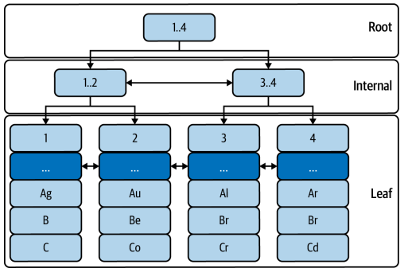
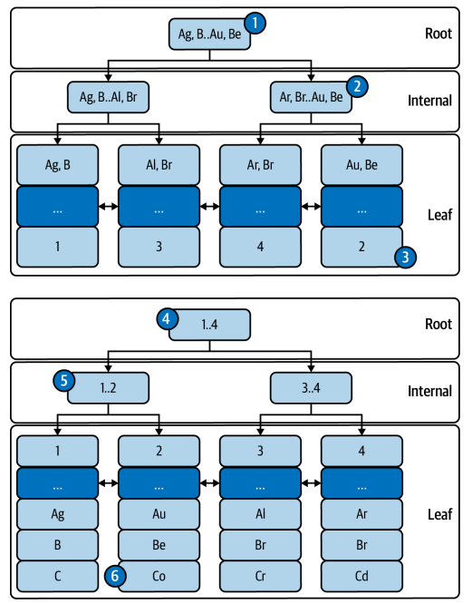

# Chapter 2. Indexes and Indexing
* MySQL의 성능 핵심은 인덱스다
* Optimization은 MySQL의 하드웨어를 효율적으로 만드는 여러 기술들이다.
* 그러나 결국 Index 없이는 상수로 밖에 증가할 수 없다.
* 여기서 Index가 지수 증가를 이끌어내는 핵심이 된다.

## 2-1 Red Herrings of Performance
### Better, Faster Hardware!
* Scale up은 당장에는 도움이 되겠지만, 실제 원인과 그에 대한 해결책이 될 수는 없다
* 그렇지만 예를 들어 리소스의 크기가 비대칭이거나 실제로 사용량이 급증하여 당장 크기를 늘려야 한다면 예외가 될 수 있다
* 그러나 이것은 지속 가능한 접근 방식이 아니다

### MySQL Tuning
* Tuning은 MySQL 시스템 변수를 조정하여 성능을 개선하는 등의 행위다. 이것은 MySQL에 대한 Research에 가까운 행위이지 사용자인 우리가 해야할 일이 아니다
* Configuring은 시스템 변수를 하드웨어에 적합하게 구성하는 것
* Optimizing은워크로드를 줄이거나 효율성을 높여 MySQL의 성능을 향상시키는 것
* 그러나 Tuning은 실제 환경에서 적합하지 않은 극한의 상황을 가정하고 테스트 하는것ㅇ며 Configuration과 optimizing은 일반적으로 자동 최적화 되어있다 

## 2-2 MySQL Indexes: A Visual Introduction

### InnoDB Tables Are Indexes
```roomsql
CREATE TABLE `elem` (
 `id` int unsigned NOT NULL,
 `a` char(2) NOT NULL,
 `b` char(2) NOT NULL,
 `c` char(2) NOT NULL,
 PRIMARY KEY (`id`),
 KEY `idx_a_b` (`a`,`b`)
) ENGINE=InnoDB;

+----+------+------+------+
| id | a | b | c |
+----+------+------+------+
| 1 | Ag | B | C |
| 2 | Au | Be | Co |
| 3 | Al | Br | Cr |
| 4 | Ar | Br | Cd |
| 5 | Ar | Br | C |
| 6 | Ag | B | Co |
| 7 | At | Bi | Ce |
| 8 | Al | B | C |
| 9 | Al | B | Cd |
| 10 | Ar | B | Cd |
+----+------+------+------+
```
> elem table

> elem 테이블의 InnoDB B-트리 인덱스

* 1,2,3,4 가 primary 키로 값을 달고 있다
* Primary key lookup은 매우 빠르고(extremely fast) 효율적이다
* Primary eky는 MySL 성능에서 핵심(pivotal) 역할을 한다


```roomsql
SELECT * FROM elem WHERE a='Au' AND b='Be';
```
* 이 쿼리를 실행한다고 가정해보면

> "Au, Be" 값에 대한 secondary index 조회

1. secondary index의 root에서 부터 B-Tree를 검색하여 primary key 값을 찾는다. O(log n)
2. 찾은 primary key 값 2를 가지고 다시 primary index에서 B-Tree를 검색한다. O(log n)
3. 찾은 값을 반환한다.
> 따라서 시간 복잡도는 O(2 log n) 으로 -> O(log n)으로 수렴한다.


### Table Access Methods
* Index lookup : MySQL의 행식임 정렬된 구조와 접근 알고리즘을 통해 빠르고 효율적인 접근
* Index scan
  * Index 조회가 불가능 할때 모든 행을 순차적으로 읽어 나간다
  * 그러나 primary key의 행이 sequential read라고 해서 disk에서도 sequential인 것은 아니며 대부분 random access가 발생한다 
  * 단순히 정렬된 파일보다도 더 느린 접근이 된다는 의미
* Table scan
  * Primary key 순서로 모든 행을 읽는다

### Leftmost Prefix Requirement
* Index를 사용하려면 가장 왼쪽 Index 열로 시작하는 하나 이상의 Index열을 반드시 사용해야 한다
* Index(a,b,c) 라면 Where절에 a를 포함하지 않은 경우 index가 사용되지 않는다
* Index(a,b)와 Index(b,a)는 다르다.
* Index(a) secondaryIndex(b,c)인 경우 사실 secondaryIndex(는 b,c,a)이다
* 그렇다고 해서 secondaryIndex(b,c,a)로 선언하면 a field가 중복되어 index가 커진다

### EXPLAIN: Query Execution Plan
* MySQL이 쿼리를 실행하는 방법을 설명하는 query execution plan을 보여준다
```roomsql
EXPLAIN SELECT * FROM elem WHERE id = 1\G;

*************************** 1. row ***************************
 id: 1
 select_type: SIMPLE
 table: elem
 partitions: NULL
 type: const
possible_keys: PRIMARY
 key: PRIMARY
 key_len: 4
 ref: const
 rows: 1
 filtered: 100.00
 Extra: NULL
```
* table : 테이블 이름 또는 참조된 서브 쿼리, MySQL이 결정한 조인 순서로 나열됨
* type : 테이블 접근 방법이나 인덱스 조회의 접근 유형, ALL : full sacn, index : index scan, const, ref, range등도 있다(index 조회의 접근 유형)
* possible_keys : 사용할 수 있는 index를 나열한다
* key : 사용할 인덱스의 이름, 없으면 NULL
* ref : Index에서 행을 조회하는 데 사용되는 값의 소스
* rows : 일치하는 행을 찾기 위해 조회할 예상 행의 수, 근사값
* Extra : 쿼리 실행 계획에 대한 부가 정보
### WHERE
* table condition은 row와 value로 이루어지며, 일치하거나 조건에 따라 row를 그룹화하고 집계 정렬하기 위해 사용
```roomsql
EXPLAIN SELECT * FROM elem WHERE id = 1\G
- 고유한 기본 키를 사용하기 때문에, 조회 조건이 상수화된 접근으로 처리된다. 행을 즉시 찾을 수 있게 해준다.

EXPLAIN SELECT * FROM elem WHERE id > 3 AND id < 6 AND c = 'Cd'\G
- 기본 키를 이용한 범위 접근이 사용되고 있으며, c 컬럼은 인덱스가 아니므로 이 조건은 상수화된 접근이 아님
- 여기서는 기본 키 범위에 해당하는 행들을 검색한 후, c 컬럼을 확인해 추가 필터링을 하게된다
EXPLAIN SELECT * FROM elem WHERE a = 'Au'\G
- a 컬럼에 대한 WHERE 절은 secondary index를 사용
- 인덱스를 통해 a = 'Au'에 해당하는 행들을 빠르게 찾을 수 있음

EXPLAIN SELECT * FROM elem WHERE a = 'Au' AND b = 'Be'\G
- secondary index가 a와 b 컬럼 모두를 포함하므로, a = 'Au' AND b = 'Be' 조건을 만족하는 행들에 대해 인덱스를 사용하여 접근

EXPLAIN SELECT * FROM elem WHERE a = 'Al' AND c = 'Co'\G
- 이 쿼리는 조건에 일치하는 값이 없으나 인덱스에서 a = 'Al'을 가진 3행을 찾았기 때문에 EXPLAIN 결과에서 rows: 3을 반환

EXPLAIN SELECT * FROM elem WHERE b = 'Be'\G
- b 컬럼은 인덱스의 맨 왼쪽 접두사가 아니기 때문에 이 쿼리는 인덱스를 사용하지 않는다
- 따라서 전체 테이블 스캔을 통해 해당 조건을 만족하는 행을 찾아야 함
```
* type : ALL, possible_keys: Null or Key : Null 이면 쿼리를 멈추고 분석해야 한다
### GROUP BY
* MySQL은 인덱스 순서에 따라 암묵적으로 그룹화된다
```roomsql
EXPLAIN SELECT a, COUNT(*) FROM elem GROUP BY a\G;
- Where 절이 없으므로 type: index는 index scan을 의미한다.
EXPLAIN SELECT a, COUNT(a) FROM elem WHERE a != 'Ar' GROUP BY a\G;
- where 절을 !=로 추가하면 type: range로 변경된다
EXPLAIN SELECT a, b FROM elem WHERE b = 'B' GROUP BY a\G;
- where 절을 b != 'B'로 변경하면 query 최적화가 손실된다. (이유 모르겠음)
EXPLAIN SELECT b, COUNT(*) FROM elem GROUP BY b\G;
- index의 제일 왼쪽값인 a를 포함하지 않으므로 index를 부분적으로만 사용하게 된다.(using temporary)
```
### ORDER BY
```roomsql
EXPLAIN SELECT a, b FROM elem WHERE a = 'Ar' ORDER BY b\G
- 'Using index' 표시는 인덱스가 쿼리의 WHERE 절과 ORDER BY 절을 모두 최적화하는 데 사용되었음을 의미
- 인덱스 idx_a_b는 먼저 a 값으로 필터링하고, b 값에 따라 순서대로 접근하여 추가 정렬 작업 없이 결과를 반환
EXPLAIN SELECT * FROM elem WHERE a = 'Al' AND b = 'B' ORDER BY id\G
- 'Using index condition' 표시는 쿼리가 인덱스를 사용하여 WHERE 조건을 만족하는 행을 찾고, 이후 id에 따라 정렬하지 않고도 순서대로 행을 접근할 수 있음

EXPLAIN SELECT * FROM elem WHERE a = 'Al' ORDER BY id\G
-  'Using index condition; Using filesort' 표시는 인덱스를 사용하여 WHERE 조건을 만족하는 행을 찾은 후, 결과를 정렬하기 위해 파일소트가 사용됨
- b 조건이 제거되어 인덱스를 사용한 ORDER BY 최적화가 무효화
- 
```
### Covering Indexes
* Query가 참조하는 모든 열이 포함된다
* MySQL은 일반적으로 Primary key에서 전체 행을 읽는데, 커버링 인덱스를 사용하면 Index에서 열값만 읽을 수 있다
* 그러나 실제 Query에서 index 하나가 맡기는 너무 많은 열과 조건, 절이 있어 실용적이지 않다
### Join Tables
* 기본 사용법은 index를 사용하는 것과 같다
```roomsql
CREATE TABLE `elem_names` (
 `symbol` char(2) NOT NULL,
 `name` varchar(16) DEFAULT NULL,
 PRIMARY KEY (`symbol`)
) ENGINE=InnoDB;
+--------+-----------+
| symbol | name |
+--------+-----------+
| Ag | Silver |
| Al | Aluminum |
| Ar | Argon |
| At | Astatine |
| Au | Gold |
| B | Boron |
| Be | Beryllium |
| Bi | Bismuth |
| Br | Bromine |
| C | Carbon |
| Cd | Cadmium |
| Ce | Cerium |
| Co | Cobalt |
| Cr | Chromium |
+--------+-----------+
```
* 위와 같은 join을 위한 table이 있다고 가정해보자
```roomsql
EXPLAIN SELECT name
 FROM elem JOIN elem_names ON (elem.a = elem_names.symbol)
 WHERE a IN ('Ag', 'Au')\G
```
* join을 사용하면 두개 table이 사용되었으므로 2개의 결과가 반환된다
* elem_names의 결과만 보면 
  * type: eq_ref는 join에서 사용된 인덱스가 고유 인덱스이며 possible_keys: PRIMARY는 기본키로 한번에 일치하는 값을 찾았음을 의미한다
  * ref: test.elem.a는 elem_names에서 행을 찾을때 elem의 a column을 참조한다는 의미

```roomsql
EXPLAIN SELECT name
 FROM elem JOIN elem_names ON (elem.a = elem_names.symbol)
 WHERE a IN ('Ag', 'Au')\G
```
* 이 경우는 이전과 반대로 역순으로 처리된다
* 검색해야 하는 key값이 줄어듬에 따라 MySQL의 query optimization에 의해 변경된 것
* type: range로 elem_names에서 범위 검색을 수행하고 그 결과(2개)를 바탕으로 elem table에 O(log n)의 수행을 2번 해서 결과를 가지고 온것이다

* Join 조건에 사용된 값은 이전 테이블에서 나온 것 이 과정에서 내부적으로는 JOIN 절을 WHERE로 변경할 수 있다
* 쿼리의 작성 순서가 아닌 최적의 조인 순서를 결정하게 된다
* EXPLAIN, SHOW WARNINGS를 이용하여 MySQL이 실제 쿼리를 어떻게 해석했고 실행 계획을 수립하는지 알 수 있다
* Join에서 인덱스 사용은 필수적이며 아닌 경우 성능 저하의 주요 원인이 될 수 있다.

## 2-3 Indexing: How to Think Like MySQL
* MySQL의 index와 indexing은 다른 주제다.
* 엔지니어들은 애플리케이션 맥락에서 쿼리를 생각하기 때문에 MySQL이 사고하는것과는 다르다.
* 이런것을 어떻게 맥락을 이해할 수 있을까, EXPLAIN이다.

### Know the Query
* 첫 단계는 최적화하려는 쿼리의 기본 정보를 파악하는 것
* Table의 모양, table의 상태, index 등을 파악하자
* 쿼리가 몇 개의 행에 접근해야 하는지, 반환해야 하는지
* 어떤 열이 반환되는지
* GROUP BY, ORDER BY, LIMIT절이 무엇인지?
* subqueries가 있는지
* table은 어떻게 접근하는지
### Understand with EXPLAIN
* 다음은 EXPLAIN에서 보고한 쿼리의 실행 계획을 이해하는 것
* 쿼리와 응답 시간은 하나의 퍼즐이며, 이것을 이해할 수 있는 모든 조각을 가지고 있다
* 만약 막힌다면 다음을 통해 지원 수준을 높여보자
  * EXPLAIN FORMAT=TREE로 바꿔 이해를 쉽게 해보자
  * Optimizer Tracing을 사용해 상세한 쿼리 실행 계획을 받자
  * DBA나 전문가에게 물어보자
  * > 보통은 바로 여기로 
### Optimize the Query
* 마지막으로 직접 쿼리 최적화를 통해 쿼리, 인덱스를 변경한다
* 데이터 크기에 따라서 달라질 수 있으므로 프로덕션의 데이터와 유사하게 준비해야 한다
* > 이게 가능한가?
* 쿼리로 원하는 결과를 얻었다고 하더라도 그게 정답인 것은 아니다, 다른 방법으로도 같은 결과를 얻을 수 있다
* 쿼리가 의도하는 결과를 명확히하고 그것을 만드는 다른 쿼리들을 탐색하는 방법이 있다
### Deploy and Verify
* 이제 이것들을 배포하고 개선되는지 검증해본다
* 의도하지 않은 부작용이 발생할 경우를 대비해 배포를 되돌릴 방법을 준비하고
* 배포한 후 메트릭들을 확인해 개선됐는지 확인한다
* 메트릭에서 특별한 부분이 발견되지 않더라도 쿼리의 응답시간이 줄었다면 반가운 일이다

## 2-4 It Was a Good Index Until…
* 아무것도 바뀌지 않았다면 좋은 인덱스는 계속해서 좋은 인덱스로 남을 것이다.
* 그러나 현실적으로는 무엇인가 변하고 성능을 떨어뜨린다
### Queries Changed
* 쿼리가 변경되어 인덱스의 왼쪽 접두사 요구사항이 손실되는 경우 풀 스캔으로 넘어갈 수 있다.
* 또는 다른 성능이 떨어지는 인덱스에 접근하게 되는 경우가 있다
* 그래서 쿼리를 변경할 때는 쿼리 분석과 EXPLAIN을 통해 안전한지 확인하고 변경해야 한다
### Excessive, Duplicate, and Unused
* 인덱스가 중복되는 경우가 있다
* 이 경우 인덱스의 메모리가 증가하거나, 쓰기 성능이 떨어질 수 있다
* 또는 사용되지 않는 인덱스라면 아래 쿼리를 통해 확인해보자
 ```roomsql
SELECT * FROM sys.schema_unused_indexes
WHERE object_schema NOT IN ('performance_schema');
```
* 삭제하기 전에는 invisible index를 사용하여 삭제하기 전에 적용되지 않게 하여 성능을 확인해볼 수 있다
### Extreme Selectivity
* cardinality는 인덱스의 unique 값의 수이다
* SHOW INDEX를 통해 cardinality를 확인할 수 있다
* selectivity는 cardinality를 테이블의 행 수로 나눈 값이다
* selectivity가 낮으면 좋은 인덱스라고 할 수 없다
* 반대로 selectivity가 너무 높으면 MySQL로 접근하는것 보다 다른 database를 이용하는것이 좋을 수 있다
### It’s a Trap! (When MySQL Chooses Another Index)
* MySQL은 아주 가끔 잘못된 인덱스를 선택할 수 있다
* 행의 갱신이 너무 많은 경우 인덱스 '통계'의 갱신에는 영향을 미치지 못해 MySQL이 잘못된 인덱스를 선택할 수 있다
* MySQL은 아래 케이스에서 인덱스 통계를 갱신한다
  * 테이블 생성
  * ANALYZE TABLE 실행
  * 테이블의 1/16이 수정된 경우
  * innodb_stats_on_metadata 활성화에서
    * SHOW INDEX, SHOW TABLE STATUS
    * INFORMATION_SCHEMA.TABLES나 INFORMATION_SCHEMA.STATISTICS가 조회된 경우
* ANALYZE TABLE은 안전하면서 대체로 빠르지만, 매우 큰 서버에서는 주의해야 한다. 테이블에 접근하는 모든 쿼리를 차단할 수 있는 flush lock이 필요하기 때문이다

## 2-5 Table Join Algorithms
* JOIN의 알고리즘을 간략하게나마 안다면 인덱스와 인덱싱을 어떻게 할지 고민할 때 도움이 된다
* 기본적으로 nested-loop join 이라고 하며 foreach 반복문처럼 동작한다
```roomsql
FROM
 t1 JOIN t2 ON t1.A = t2.B
 JOIN t3 ON t2.B = t3.C
```
```java
func find_rows(table, index, conditions) []rows {
 // Return array of rows in table matching conditions,
 // using index for lookup or table scan if NULL
}
foreach find_rows(t1, some_index, "WHERE ...") {
 foreach find_rows(t2, index_on_B, "WHERE B = <t1.A>") {
 return find_rows(t3, NULL, "WHERE C = <t2.B>")
 }
}
```
* 가장 안쪽은 n^m 만큼 반복해서 접근하게 되기 때문에 매우 느리다
* Block nested loop join algorithm이 이문제를 해결하는데 사용된다
  * join buffer에 담아두고 반복해서 접근하도록 한다
  * t1,t2에 일치하는 값을 저장한다음, 가득차면 t3에서 일치하는 행을 조인한다
* 8.0.20부터는 Hash join algorithm으로 대체된다
  * t3를 hash table에 저장하고 t3를 O(n)으로 접근하여 속도를올린다

## Summary
* Indexes provide the most and the best leverage for MySQL performance.
* Do not scale up hardware to improve performance until exhausting other
options.
* Tuning MySQL is not necessary to improve performance with a reasonable
configuration.
* An InnoDB table is a B-tree index organized by the primary key.
* MySQL accesses a table by index lookup, index scan, or full table scan—index
lookup is the best access method.
* To use an index, a query must use a leftmost prefix of the index—the leftmost
prefix requirement.
* MySQL uses an index to find rows matching WHERE, group rows for GROUP BY,
sort rows for ORDER BY, avoid reading rows (covering index), and join tables.
* EXPLAIN prints a query execution plan (or EXPLAIN plan) that details how
MySQL executes a query.
* Indexing requires thinking like MySQL to understand the query execution plan.
* Good indexes can lose effectiveness for a variety of reasons.
* MySQL uses three algorithms to join tables: NLJ, block nested-loop, and hash
join


