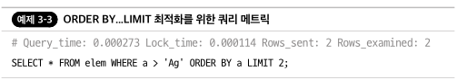
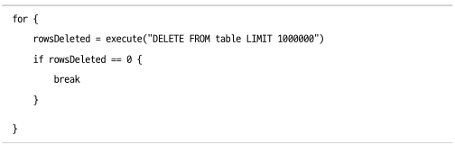

# 3. 데이터
- 방대한 데이터량 등으로는 직접 쿼리 최적화로도 성능 향상 한계가 있음 -> 간접 쿼리 최적화 필요
### 3.1 세 가지 비밀
##### 인덱스가 도움이 되지 않을수 있다
- 좋은 인덱스라도 쿼리가 느릴수 있음
- 인덱스 조회를 한다고 해도 무한한 데이터 크기에 무한한 영향력을 제공하지는 않음
- 인덱스에 대한 믿음을 잃지 말고 인덱스가 도움이 되지 않는 상황을 알아야 함 -> 간접 쿼리 최적화로 진행
###### 인덱스 스캔
- 테이블이 커질수록 인덱스도 같이 커져서 영향력이 점점 감소
- 테이블 행수가 늘어날 수록 인덱스 전용 스캔에서 사용하는 쿼리에 대한 응답 시간도 늘어나 지연 시간 발생
###### 행 찾기
- 인덱스 조회를 사용하는 느린 쿼리를 최적화할 때, 확인하는 첫 번째 메트릭(rows)
- 좋은 인덱스를 사용하더라도 쿼리가 너무 많은 행을 검사할 수도 있음
- 매우 낮은 인덱스 선택도 인덱스 조회를 느리게하는 공범일 수 있음
- 카디널리티는 일정하게 유지되지만 행의 수가 증가하면 선택도 감소 -> 느려짐
###### 테이블 조인
- 테이블 조인할 때 각 테이블의 몇 개 행이 성능을 빠르게 떨어뜨림 -> 중첩 반복 조인
- 조인된 각 테이블에 대한 인덱스 조회를 통해 하나의 행만 일치하는 것이 가장 좋음
###### 작업 세트 크기
- 인덱스는 메모리에 있을때만 유용 -> 쿼리가 조회하는 인덱스 값이 메모리에 없으면 디스크에서 읽어옴(16kb만 메모리 저장 -> 나머지는 디스크)
- 디스크에 인덱스 조회는 느린 성능과 함께 메모리 적재를 위해 경쟁 문제 발생 -> 자주 사용하는 인덱스 값을 메모리 유지하려는 시도
- 자주 사용하는 인덱스 값과 프라미어키 행을 '작업 세트'라고 함
- 작업 세트의 크기가 사용할 수 있는 메모리보다 훨씬 커지면 인덱스에 도움이 되지 않음
- 메모리 스케일 업에도 한계가 있기 때문에 샤딩으로 해결해야함 -> 그만큼 데이터가 이미 많다고 판단
##### 데이터가 적을수록 좋다
- 성능, 관리, 비용 등 모든 면에서 데이터 크키가 적을수록 좋음
- 적절하게 필요한 양의 데이터로 최적화하고 관리하는데 시간과 노력을 기울일 가치가 있음
##### QPS가 낮을수록 좋다
###### QPS는 숫자에 불과하며 원시 처리량을 측정한 값이다
- QPS는 쿼리나 성능에 대해 질적인 정보를 제공하지 않음 -> 똑같은 QPS도 수많은 질적인 차이 존재
- QPS가 높다는 것은 쿼리 응답 시간이 좋다는 의미
###### QPS 값은 객관적인 의미가 없다
- QPS값은 애플리케이션과 관련해서만 의미가 있음
  - 평소 2,000 QPS인데 갑자기 100QPS면 애플리케이션 이상을 나타냄
  - 평소 300 QPS인데 100QPS면 정산적일 수 있음
- QPS는 시간, 요일, 계절, 휴일등 외부 요인에도 영향을 받음
###### QPS를 높이기는 어렵다
- 애플리케이션과 관련된 최대 QPS는 스토리지, 램처럼 구입할 수 없기에 늘리기 어려움
- QPS는 낮을수록 좋음
### 3.2 최소 데이터 원칙
##### 데이터 접근
- 필요 이상으로 많은 데이터에 접근하지 말자 -> 접근은 쿼리를 실행하기 위해 수행하는 모든 작업 의미
````
효율적인 데이터 접근 점검표
1. 필요한 열만 반환
2. 쿼리 복잡성 감소
3. 행 접근 제한
4. 결과 세트 제한
5. 행 정렬 피하기
````
- 타당함이나 균형을 유지하는 측면에서 단일 점검 항목 무시 가능 -> 성능 영향을 미치지 않음
- 데이터 접근이 효율적일 때, MySQL은 거의 인메모리 캣시처럼 작동하며 놀라운 QPS와 부하로 쿼리를 실행
- 더는 쿼리를 최적화할 수 없고 데이터 크기를 줄일 수 없을 때는 접근 패턴을 변경해서 쿼리를 최적화
###### 필요한 열만 반환
- 필요한 열만 반환하는게 필요하기에 'SELECT *' 쿼리를 실행하지 말자
- 열에 BLOB,TEXT 열이 있을때는 특히 중요
###### 쿼리 복잡성 감소
- 쿼리는 될 수 있는 한 단순해야 함
- 쿼리 복잡도는 쿼리를 구성하는 모든 테이블, 조건, SQL 절을 나타냄
- 복잡한 쿼리는 MySQL이 아닌 엔지니어 문제
- 잘못된 단순화는 더 나쁜 EXPLAIN 계획을 초래함 -> EXPLAIN으로 항상 체크
###### 행 접근 제한
- 쿼리는 될 수 있는 한 적은 수의 행에 접근해야함 -> 그렇지 않으면 시간 경과에 따른 데이터 증가가 문제가 됨
- 데이터 증가와 단순한 실수가 교차하는 지점에서 가장 중요한 원인은 '범위와 목록을 제한하지 않는 것'임
  - col > 75는 수많은 행 접근 -> 비 고유 인덱스이면 행 접근이 사실상 제한되지 않는 다는 점
- LIMIT 절은 행을 일치시킨 후 결과 세트에 LIMIT가 적용되므로 행 접근을 제한하지 않음 -> ORDER BY LIMIT 최적화
  - 일치하는 행을 찾다가 LIMIT 수만큼 발견되면 행을 읽다가 중지
  - EXPLAIN에서는 이 최적화를 보고하지 않음 -> EXPLAIN이 보고하는 것과 보고 하지 않는 것은 추론해야함
  - 아래 그림처럼 슬로 쿼리 로그에 토막정보 내 'ROWS_examined:2'가 2개의 행만 접근했음을 알려줌<br>
  
- '애플리케이션이 쿼리에 사용되는 입력을 제한하는가?'는 범위 목록 제한에 중요한 요소
- Inno DB에서 쓰기는 일치하는 행을 갱신하기 전에 접근하는 모든 행을 잠그므로 행 접근 제한하는 것이 중요
- 테이블을 조인할 때 행 접근을 제한하는 것도 중요
- 각 쿼리에 대해 행 접근을 제한 하는 것은 무엇인지 접근 패턴에 대해 알아야 함 -> EXPLAIN 사용하여 예상되는 행 접근 확인하고 조회된 행 모니터링 필요
###### 결과 세트 제한
- 쿼리는 될 수 있는 한 적은 수의 행을 반환해야함 -> LIMIT 절 넣는 것보다 더 관련이 있음
- 결과 세트 제한을 제공하는 세가지 변형
  - 애플리케이션이 일부 행을 사용할 때 발생하지만 전부는 아님
    - Where 조건을 사용하는 대신 전체 행을 받아 애플리케이션에서 필터링 하는 방법 -> 해당 방법은 MySQL을 테이블 스캔하는게 좋을때와 같이 드문 경우만 효과 발생
  - 쿼리에 ORDER BY 절이 있고 애플리케이션이 정렬된 행의 일부분을 사용할 때 발생
    - LIMIT를 주어서 불필요한 행도 같이 반환되는 것을 방지
  - 애플리케이션 결과 세트를 집계하기만 할 때 발생 -> 행을 받아와 갯수만 활용
    - COUNT, SUM 등의 집계 함수를 활용<br>
      
###### 행 정렬 피하기
- 쿼리는 행 정렬을 피해야함
- MySQL 대신 애플리케이션에서 행정렬하면 'ORDER BY' 절을 제거하여 쿼리 복잡성을 줄이고 애플리케이션 작업을 분산시켜 좋은 확장성을 가질 수 있음
- LIMIT 절이 없는 ORDER BY 절은 삭제할 수 있고 애플리케이션이 행을 정렬할 수 있음
##### 데이터 스토리지
- 필요 이상으로 많은 데잍를 저장하지 말자 -> MySQL에게 큰 부담
- 데이터 스토리지를 감사하면 많은 것을 확인 가능
````
효율적인 데이터 스토리지 점검표
1. 필요한 행만 저장됨
2. 모든 열이 사용됨
3. 모든 열이 간결하고 실용적임
4. 모든 값이 간결하고 실용적임
5. 모든 세컨더리 인덱스가 사용되며 중복되지 않음
6. 필요한 행만 유지됨
````
- 규모에 맞게 설계하고 성공 계획을 수립하는게 중요
###### 필요한 행만 저장됨
- 평소 데이터 스토리지 문제가 아니라면 무엇을 저장하는 지 물어볼 이유가 없음
- 다른 누군가가 애플리케이션이 무엇을 저장하고 있는지 검토한 지 오래되었다면 저장되는 데이터를 살펴보아야함 -> 아무도 사용하지 않는 데이터가 계속 쌓이기만 할 수 있음
###### 모든 열이 사용됨
- 필요한 열만 저장하는 것 -> 필요한 행만 저장하는 것보다 중요함
- 애플리케이션 변경 사항이 늘어남에 따라 객체 관계형 매핑(ORM)을 사용할 때 열을 추적하지 못할 수 있음
- MySQL은 사용하지 않는 열 찾는 도구나 자동화된 방법은 존재하지 않음 -> 유일한 해결책은 수동 검토
- 애플리케이션 쿼리에서 사용하는 열을 테이블에 있는 열과 비교 필요
###### 모든 열이 간결하고 실용적임
- 모든 열을 간결하고 실용적으로 만드는 것 -> 필요한 행만 저장하는 것보다 더 심층적
  - '간결함'은 가장 작은 데이터 타입을 사용하여 값을 저장하는 것
  - '실용적'은 너무 작아서 사용자나 애플리케이션에 번거롭거나 오류가 발생하기 쉬운 데이터 타입을 사용하지 않는 것
  - 예) INT를 비트 필드로 사용하는 것은 간결하지만 실용적이지는 않음
- 고전적인 안티패턴은 'VARCHAR(255)'
  - 원자 기호 필드로 활용하면 원자 기호는 1~2개의 문자
  - 'atomic_symbol VARCHAR(255)'로 넣으면 의미 없는 데이터가 나오는걸 초래 -> 'C' 대신 'Carbon'
  - 더 나은 열 정의는 'atomic_symbol CHAR(2)'
- 열 문자 세트에 주의 -> 열 문자 세트 정의하지 않으면 테이블 문자 세트가 기본이며, 기본적으로 서버 문자 세트 활용
  - 'e'라는 문자열에 문자 세트에 따라 저장되는 바이트도 다름 -> latin1은 단일 바이트, utf8mb4는 2byte
- BLOB,TEXT,JSON 데이터 타입은 보수적으로 사용
  - 이미지 저장을 BLOB보단 S3 활용
- 정수 데이터 타입의 비효율 주의 -> 마이너스 값이 없는데 INT를 쓰는건 비효율이므로, INT UNSIGNED 활용
###### 모든 값이 간결하고 실용적임 (미완료)
- 필요한 행만 저장하는 것보다 모든 값을 간결하고 실용적으로 만드는 것 중요
  - '실용적'은 앞과 같지만 '간결함'은 값의 가장 작은 표현을 의미
  - 간결한 값은 애플리케이션에서 이를 사용하는 방법에 따라 크게 달라짐
- 값을 압축하는 방법에는 최소화, 인코딩, 중복 제거 존재
  - 최소화
  - 인코딩
  - 중복 제거
###### 모든 세컨더리 인덱스가 사용되며 중복되지 않음
- 인덱스는 데이터의 복사본이므로 데이터 크기에 특히 중요 -> 세컨더리 인덱스는 인덱스 열값과 해당 프라이머리 키만 포함이지만 테이블 크기 증가 민감
- 자주 사용되지 않은 인덱스 찾기는 어렵지만 중복된 인덱스는 찾을 수 있음
- 인덱스를 삭제하면 인덱스 크기와 같은 데이터 크기만 복구
- 인덱스 크기를 확인하는 방법
  - INFORMATION_SCHEMA.TABLES 쿼리 이용<br>
  ````
  SELECT
    TABLE_NAME, DATA_LENGTH, INDEX_LENGTH
  FROM
    INFORMATION_SCHEMA.TABLES
  WHERE
    TABLE_TYPE = 'BASE TABLE' AND TABLE_SCHEMA = 'employees';
  ````
  
    - DATA_LENGTH는 프라이머리 키의 크기, INDEX_LENGTH는 모든 세컨더리 인덱스의 크기
  - SHOW TABLES STATUS<br>
  
    - Data_length와 Index_length는 INFORMATION_SCHEMA.TABLES와 동일
  - mysql.innodb_index_stats 테이블 조회
  ````
  SELECT
    index_name, SUM(stat_value) * @@innodb_page_size size
  FROM
    mysql.innodb_index_stats
  WHERE
    stat_name = 'size'
  AND database_name = 'employees'
  AND table_name = 'dept_emp'
  GROUP BY index_name
  ````
  
###### 필요한 행만 유지됨
- 첫 번째 항목인 '필요한 행만 저장됨'을 시작으로 완전한 한 전체를 나타냄
- 저장할 때 행이 필요할 수 있지만, 시간이 지남에 따라 변경해야함 -> 더 이상 필요하지 않은 행은 삭제(또는 보관)해야함
### 3.3 데이터 삭제 또는 보관
- 데이터가 관리하기 어려울 정도로 쌓이고 있는데 관리 안하면 문제 발생 -> 데이터 삭제나 보관 필요
- 문제 해결 방법은 거의 데이터 삭제에 있음 -> 보관도 복사 후 삭제
- 복사 시, 비잠금 SELECT를 사용하더라도 애플리케이션이 처리할 수 있는 QPS 수준 이상으로 증가하지 않게 제어 필요
##### 도구
- 데이터를 삭제 및 보관하려면 자신만의 도구를 직접 작성해야 함
- 아래와 같이 LIMIT 크기가 너무 크고 for문 사이에 지연이 없으면 이슈 발생 -> 배치 크기를 안전하게 처리 필요<br>

##### 배치크기
- 행이 작고(BLOB,TEXT가 미존재) 큰 부하가 없을때, 단일 DELETE 문에서 1,000개 이하의 행을 수동으로 삭제하는 것인 안전
  - 수동이란 병렬이 아닌 직렬로(하나씩) 실행
- 행을 빠르고 안전하게 삭제할 수 있는 비율은 쿼리 응답 시간이나 복제 지연에 영향을 주지 않는 것
  - 배치 크기는 DELETE 문당 삭제되는 행 수로, LIMIT 절로 제어
- 배치 크기는 실행시간으로 조정되며 500ms는 좋은 시작점, 이유는 아래와 같음
###### 복제 지연
- 원본 인스턴스의 실행 시간은 복제 인스턴스의 복지 지연을 생성
  - 원본 500ms 걸리면 복제도 500ms 지연 발생
- 복제 지연은 피할 수 없지만 데이터 손실이므로 최소화 해야함
  (?) 복제 지연하면 복제본에 데이터 손실이 일어나나? 아니면 동기적 복제로 인해 DB 응답 늦어지는 이슈를 말하는 걸까?
###### 스로틀링
- 어떤 경우 쿼리 실행 시간이 제한되어, QPS가 제한되기에 스로틀링 없이 DELETE문 실행하는 것이 안전함
- 퀴리 보고를 통해 DELETE 문의 최대 실행 시간을 검사하거나 데이터 보관도구에서 측정
  - 최대 실행 시간이 목표(500ms)보다 훨씬 낮으면 배치 크기를 늘림 -> 최대 실행 시간이 일관되게 조정
- 배치 크기를 보정하고 스로틀을 설정하면 쿼리 응답 시간에 영향을 주지 않고 'batch size * DELETE QPS'를 계산 가능
##### 로우 락 경합
- 쓰기 작업이 많은 워크로드 경우, 대량 작업으로 로우 락 경합이 발생할 수 있음 -> 동일한 행에서 로우 락을 획득하기를 대기
- 삭제된 행이 기존의 행과 산재되어 있으면 영향을 받을수 있음
- 보정된 시간 내 실행해도 배치 크기가 클수 있음
  - 500ms 내에서 100,000개 행을 삭제 가능하지만 애플리케이션 행 잠금이 걸리면 로우 락 경합이 발생
- 해결책은 훨씬 짧은 실행 시간을 보정하여 배치 크기를 줄이는 것 -> 로우 락 경합이 줄어드는 대신 데이터 아카이빙 속도가 늦음(트레이드 오프 관계)
##### 공간과 시간
- 데이터 삭제해도 디스크 공간이 확보되지 않음 -> 행 삭제는 물리가 아닌 논리적
  - 500GB 데이터 삭제하면 500GB 디스크 공간이 아니라 500GB 여유 페이지가 생김
- 여유 페이지는 성능에 영향을 미치지 않으며, InnoDB는 새 행이 삽입될 때 여유 페이지를 재사용
- InnoDB에서 디스크 공간을 회수하는 가장 좋은 방법은 'ALTER TABLE...ENGINE=INNODB'를 사용하여 테이블 재구성
- 많은 양의 데이터를 삭제하려면 시간이 걸림 -> 애플리케이션에 영향을 미치지 않도록 상당한 제한을 두며 데이터 삭제
- 원칙에 맞게 진행하면 시간은 우리의 편 -> 잘 보정된 작업은 며칠 또는 몇 주가 걸릴수도 있음
- 행을 삭제하는 데 시간이 걸리고 디스크 공간을 회수하는데도 시간이 걸림
##### 바이너리 로그 역설
- 데이터를 삭제하면 데이터가 생성됨 -> 데이터 변경 사항이 바이너리 로그에 기록
- 테이블에 큰 BLOB, JSON 열이 포함된 경우, 시스템 변수 'binlog_row_image'는 full 설정이 기본이므로 바이너리 로그 크기가 급격히 증가할 수 있음
  - full: 모든 열(전체 행)의 값을 기록
  - minimal: 변경된 열의 값과 행을 식별하는 데 필요한 열을 기록
  - noblob: 필요하지 않은 BLOB과 TEXT 열은 제외하고 모든 열 기록
- 바이너리 로그의 전체 행 이미지에 의존하는 서비스가 없으면 'minimal' 또는 'noblob'이 적절
- 서버에 데이터를 삭제하고 테이블을 재구성하기에 충분한 디스크 여유 공간이 있는지 확인 필요