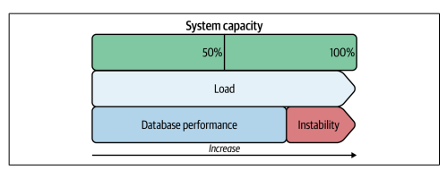

# Chapter 4. Access Patterns
* Access patterns는 애플리케이션이 MySQL을 사용하여 데이터에 접근하는 방법
* 접근 패턴을 변경하면 성능에 큰 영향을 미치지만 다른 최적화보다 더 많은 노력이 필요하다
* 먼저 쿼리, 인덱스, 데이터를 최적화한 다음 접근 패턴을 최적화하자
* MySQL은 충분히 빠르다, 성능은 애플리케이션이 제한하지 MySQL은 아니다
## MySQL Does Nothing
* MySQL은 애플리케이션이 사용자가 모르는 쿼리를 실행하지 않는 한 시스템에 고스트가 없다
* 그러니까 느린건 당신이 뭘 해서 그런것이다
## Performance Destabilizes at the Limit
* 
* 시스템은 한계에 다다를 수록 불안정해진다
* 현실적인 데이터베이스 성능의 한계는 시스템 용량의 80~95%
* Universal Scalability Law는 MySQL을 설명할때도 적용 가능하다
* 
* 시스템의 전체 처리량 즉 X(N)은 시스템의 동시성 수준(N)이 증가함에 따라 경합과 응집의 효과도 증가하여 
시스템의 처리량 증가율이 저하될 수 있다는 것이다.
* 
* 𝛼, 𝛽를 1이라고 가정했을때 N의 변화에 따른 X(N)의 변화
* 즉 역행성능, 시스템이 무너지고 있는 상태로 가고 있음을 볼 수 있다
* 
* The Rise(6 a.m to 9 a.m) -> The Limit(9 a.m to noon) -> The Fix(noon to 3 p.m) 으로 갈 수록 불안정해지다가,
처리량을 줄이고 나서야 안정적으로 변한것을 볼 수 있다
  
## Toyota and Ferrari
* 도요타는 고속 주행을 목표로 설계하지 않았다
* 고속을 위해서는 여러 세부 사항에 세심한 주의가 필요하다
* 고속과 마찬가지로 고성능 역시 억지 기법이나 무차별적으로 달성되는 것이 아닌 고성능을 목표로 한 치밀한 설계의 산물이다
## Data Access Patterns
* data access pattern은 애플리케이션이 MySQL을 사용하여 데이터에 접근하는 방법이다
* 접근 패턴은 묶어서 논의하면 서로 모호해지므로 개별적으로 수정해야 한다
* 궁극적으로 쿼리를 참조하며 접근 패턴 변경을 위해 쿼리와 애플리케이션을 변경하지만 쿼리가 초점이 아니다
  * 구현이 아닌 인터페이스에 집중하자, MySQL에 실행되는 특정 패턴은 kv storage에 더 적합하지만 쿼리에 집중하면 이를 파악하는것이 어려울 수 있다
* 접근 패턴은 이름과 기술적인 특성 목록으로 구성된다 이름은 패턴을 식별하고 다른 엔지니어와 소통하는 데 사용된다, 간결하고 의미 있는 이름을 사용하자
### Read/Write
* 읽기는 읽기를 오프로드 하여 확장할 수 있다
* 쓰기 확장은 더 어렵지만 대기열에 추가하는 것과 같은 방법을 사용하거나 샤딩을 할 수 있다
* 이것은 매우 간단하지만 애플리케이션이 어느쪽에 비중을 많이 두는지에 따라 집중해야 하는 방법이 다르기 때문에 중요하다
### Throughput
* 처리량은 성능이 아니다
* 1QPS에 불과한 낮은 처리량으로도 큰 피해를 줄 수 있다
* QPS는 일정 기간동안 증감한다, 시간대에 따라 달라질 수 있다는 의미
### Data Age
* 데이터의 수명은 시간이 아니라 접근 순서에 상대적이다
* 작업 세트는 자주 사용되는 인덱스값과 이 값이 참조하는 프라이머리 키 행이다
* MySQL은 될 수 있는 한 많은 데이터를 메모리에 보관하고, 데이터 수명은 메모리의 데이터가 작업 세트의 일부인지 아닌지에 영향을 미친다
* MySQL 용어로 데이터에 접근했을 때를 made young 이라고 한다
* 그리고 데이터에 접근하지 않으면 메모리에서 제거된다
> JAVA의 GC와 또는 cache eviction과 매우 유사한 형태
* 오래된 데이터에 자주 접근하는 것은 문제다
  * LRU에서 오래된 페이지를 제거해야 한다
  * 오래된 페이지가 더티인 경우 제거하기 전에 flush를 해야하는데 flush는 느리다 
  * ㅅ스토리지에서 데이터를 읽는 것은 느리다
* 데이터 수명은 측정이 거의 불가능하고, 이것은 데이터의 사용 패턴을 이해해야 한다
### Data Model
* 데이터 모델은 다른 특성과 같이 프로그래밍 방식으로 측정할 수 없다
* 접근방식이 제시하는 데이터 모델을 결정해야 한다
* 접근 방식에 이상적인 데이터 모델을 결정한 다음, 해당 데이터 모델로 구축된 데이터 스토리지를 사용하자
### Transaction Isolation
* 격리성은 ACID 중 하나이다
* 모든 쿼리는 기본적으로 트랜잭션에서 실행된다
* None : 데이터 접근에 격리가 필요 없는 경우
* Default : 기본 수준인 REPEATABLE READ로 동작할 수 있다
* Specific : 같은 데이터에 접근하는 다른 트랜잭션과 동시에 실행되는 트랜잭션이며 트랜잭션이 없으면 심각한 문제가 생기는 경우
* 대부분 Default라는 대답을 하겠지만, 사실은 좀 더 명확하게 None이거나 Specific 이어야 한다
* 격리를 한다면 이유를 더욱 명확하게 하거나 제거하자
### Read Consistency
* strong consistency는 읽기가 가장 최신 값을 반환함을 의미한다
* 기본적으로 MySQL은 strong consistency이다, eventual consistency가 허용되면 읽기 오프로드를 할 수 있다
### Concurrency
* 동시성이 제로라면 데이터에 접근할 때 동시에 같은 데이터를 읽거나 쓰지 않는다는 것을 의미한다
* 높은 동시성은 같은 데이터를 동시에 자주 읽거나 쓰는 것을 의미한다
* 같은 데이터에 대한 쓰기 동시성이 높을수록 로우 락 경합이 커진다
  * lock wait timeout이 발생하는 수준이라면 곤란하다
  * 이 경우 동시성을 낮추거나 쓰기 확장을 위한 샤드 구성이 필요하다
* 같은 데이터를 높은 동시성으로 읽지만 자주 변경되지 않을떄는 캐시를 사용하기 적합하다
* 동시성은 측정이 거의 불가능하지만 애플리케이션, 데이터, 접근 패턴에 대한 이해를 통해 추정하면 된다
### Row Access
* 행 접근에는, point/range/random access가 있다
* 범위와 임의 접근 쓰기는 gap locking으로 로우 락 경합을 악화시킨다
* 임의 접근 쓰기는 데드락에 대한 설정이며 MySQL은 데드락을 감지하고 해제하지만 성능이 떨어진다
### Result Set
* 데이터 접근이 결과 세트를 어떻게 하는지, 대답하기 쉽다. GROUP BY, ORDER BY, LIMIT을 사용하는지로 보면 된다
* 다른 데이터 스토리지에서 접근 방법이 어떻게 변경될지 어떻게 실행 될지에 대한 영향을 미친다
* 변경 가능성의 여부를 알 수 있다
## Application Changes
### Audit the Code
* "문제를 일으키지 않는다"는 코드시 효율적이거나 필수적이라는 것을 의미하지 않는다
* 모든 코드를 감사하면 좋지만, 데이터베이스에 접근하는 코드만 감사하면 된다
* 더 이상 필요하지 않거나, 너무 자주 실행되거나, 너무 자주 재실행 되거나, 복잡한 쿼리인지 확인하자
* 코드가 ORM을 사용하거나 데이터 베이스 추상화를 사용하는 경우 기본값과 구성을 다시 점검하자
  * > 전사 공통 DB client library가 이런것을 막는 역할을 할 수 있다
### Offload Reads
* 소스에서 읽기를 오프로드하여 성능을 향상 시킬 수 있다
* 소스의 부하를 줄이고 나머지 쿼리를 더 빠르게 실행시켜 여유 시간 및 시스템 리소스를 확보한다
* MySQL 복제와 캐시 쓰기에는 지연이 있다 그래서 eventual consistency 밖에 보장할 수 없다
* 따라서 애플리케이션이 허용해야 하며, 다중 트랜잭션에도 포함될 수 없다
* 또한 복제본이 오프라인 상태 일 때 애플리케이션이 죽지 않도록 성능이 저하된 상태로라도 동작할 수 있도록 설계, 구현, 테스트 하는 것이 필수이다
* 하나씩 오프로드 해가자
#### MySQL replica
* 캐시 서버보다 복제본을 선호하는 이유를 보기 이전에 , 애플리케이션이 복제본을 사용할 수 있는지 확인해야 한다
  * 대부분의 프로덕션에는 복제본이 존재하지만, 고가용성을 목적으로 사용하므로 읽기 제공을 의도하지 않을 수 있다
* 그럼 이제 선호하는 이유를 알아보자
* Availability : 복제본은 고가용성을 위해 존재하므로 고가용성을 걱정할 필요가 없다
* Flexibility : 고가용성을 위해 사용되는 복제본은 소스와 같은 하드웨어를 가져야 하므로 여유 리소스가 있다.
* Simplicity : 애플리케이션은 복제본을 소스와 동기화 상태로 유지하기 위해 아무것도 할 필요가 없다. 또한 변경을 위해 쿼리 변경이 필요하지 않다
#### Cache server
* MySQL보다 매우 빠르지만 제대로 사용하기 위해 애플리케이션에서 많은 작업이 필요하다
* 또한 애플리케이션에는 일반적으로 KV 모델인 캐시와 함꼐 동작하는 데이터 모델이 필요하다
* 캐시를 사용할 때 주의할 점은 캐시가 일시적인지 또는 지속 가능한지 결정하는 것이다
  * 다운되었을 때 어떻게 복구할 것인가 

### Enqueue Writes
* queue를 사용하여 쓰기 처리량을 안정화한다
* 쓰기 대기열과 안정적인 쓰기 처리량은 애플리케이션이 엄청난 양의 요청을 하더라도 우아하고(gracefully) 예측 가능하게 응답할 수 있다는 것이다
* 큰 이점 3가지를 알아보자
1. MySQL 가용성에서 애플리케이션을 분리한다는 것이다
2. 손실되거나 버려진 변경 사항을 복구하는 데 사용할 수 있다
3. 대기열이 이벤트 스트림인 경우 변경사항을 재실행할 수 있다는 것이다
### Partition Data
* 데이터는 적을 수록 성능 개선이 쉬워진다
* 데이터를 삭제하거나 보관할 수 없다면 최소한 데이터를 분할해야 한다 
* cold data를 다른 곳에 저장하면 더 많은 hot data가 memory에 적재가능하고, 쿼리가 cold data를 검사하는데 시간을 낭비하지 않고 스키마 변겨오가 같은 작업이 더 빠르다
### Don’t Use MySQL
* MySQL이 접근패턴에 가장 적합한 데이터 스토리지가 아닌 경우 MySQL을 사용하지 않는 것이다
* 그래프는 그래프 데이터베이스에 메트릭은 시계열 데이터베이스에 적합하다
* MySQL은 최선의 선택이 아닐 떄에도 매우 잘 동작하는 범용적 데이터베이스이지만 당연하게 여겨선 안된다
## Better, Faster Hardware?
* 하드웨어를 확장해야 하는 정확한 시점은 언제인가?
* 
* 응답 시간이 너무 길고 모든 느린 쿼리를 최적화했으며 데이터의 크기 그리고 접근 패턴도 최적화 되었다면
* 2.에 있는 항목 중 2개 이상이 적용되었을때는 하드웨어를 확장해야 할 시점임을 의미한다
### Read-heavy
* 읽기 집약적인 접근 패턴에서 IOPS가 부족한 것은 메모리 때문일 수 있다
* 메모리의 크기가 작업 세트보다 작고 읽기 처리량이 높은 경우 반복적으로 디스크에서 읽어오면서 IOPS가 높아지는 현상이 나타날 수 있다
### Write-heavy
* 쓰기에서는 없다, IOPS를 높이는 방법만이 해결책이다
## Summary
* MySQL does nothing but execute application queries.
* Database performance destabilizes at a limit that is less than 100% of hardware capacity.
* Some applications have far greater MySQL performance because every detail is engineered for high performance.
* Access patterns describe how an application uses MySQL to access data.
* You must change the application to change its data access patterns.
* Scale up hardware to improve performance after exhausting other solutions.
