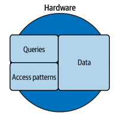

# Chapter 5. Sharding
* MySQL의 단일 인스턴스에서 성능은 쿼리,데이터, 접근 패턴, 하드웨어에 달렸다.
* 더 이상 방법이 없다면 단일 인스턴스의 MySQL 성능이 한계에 도달했다면..
* 여러 데이터베이스에 워크로드를 분사나여 성능을 향상시키는 샤딩을 고려해야 한다
## Why a Single Database Does Not Scale
* 애플리케이션 워크로드는 단일 서버의 속도와 용량을 크게 앞지를 수 있다
### Application Workload
* 아무런 부하가 없는 경우 하드웨어에 아무것도 없다고 가저하자
* 
* 그러나 실제로는 아래와 같이 query, 접근 패턴, 데이터 등으로 인해 하드웨어가 사용된다
* 
* 데이터를 저장하기에 충분한 워크로드가 있더라도 데이터만 있는것은 아니다
* 
* 데이터는 워크로드의 한 부분일 뿐이므로 쿼리와 접근 패턴을 고려하면 많은 데이터가 있는 단일 서버에서 현실적으로 수용 가능한 수준은 아래와 같다
* 
### Benchmarks Are Synthetic
* 벤치마킹은 실험적인 작업이며 실제 애플리케이션이 동작하는 특성과 완벽하게 매칭되지 않는다
### Writes
* 쓰기는 단일 MySQL에서 확장이 어렵다
#### Single writable (source) instance
* 프로덕션에서 MySQL은 고가용성을 위해 복제 topology에 연결된 여러 인스턴스를 사용하는데
* write conflict으로 인해 쓰기는 단일 쓰기로 제한된다
#### Transactions and locking
* 트랜잭션을 위해 low lock을 획득해야 하며 떄로는 예상보다 더 많은 행을 잠근다
* 같은 데이터에 대한 쓰기 작업이 많은 워크로드라면 어떤 하드웨어도 감당할 수 없다
#### Page flushing (durability)
* page flushing은 데이터를 persists 하기 위해 사용된다
* 성능의 병목이 되며 MySQL은 매우 효율적이지만 데이터가 디스크에 유지되도록 보장해야 하므로 본질적으로 프로세스가 느리다
#### Write amplification
* 필요 이상의 부가적인 쓰기가 있는 경우 (세컨더리 인덱스가 10개가 있다면, 쓰기를 10배 해야 할 수도 있다)
#### Replication
* MySQL은 asynchronous, semsynchronous, group replications을 지원한다.
* asynchronous는 트랜잭션을 커밋할 때 플러싱 되므로 쓰기 성능에 약간의 영향을 미치지만 그 후에는 영향이 없다
* semisynchronous는 모든 커밋을 하나 이상의 복제본에서 인지해야 하므로 네트워크 대기 시간에 대한 트랜잭션 처리량을 떨어뜨린다
* group은 더 심하다(7장에서 설명)
### Schema Changes
* 스키마 변경은 정기적인 작업 이상으로 필수 작업이다
* 단일 테이블을 엄청난 크기로 확장하는데 성공하더라도 테이블의 변경에 필요한 시간은 감당할 수 없을 것이다
* 엔지니어가 스키마를 변경하기 위해 며칠 또는 몇 주를 기다릴 수 없으므로 규모에 맞는 MySQL 샤딩이 필요하다
### Operations
* 백업과 복원, 실패한 인스턴스 재구축, MySQL 업르데이드, 종료, 시작, 충돌 복구
* 위 작업들은 지금까지 언급하지 않았지만 MySQL에 필요한 작업이며 클수록 더 오래 걸린다
* Database 관리자들이 능숙하지 않고 헌신적이지도 않다면, 많은 영향을 줄 것이다
## Pebbles, Not Boulders
* 바위보다 조약돌을 옮기는 것이 쉽다
* 하드웨어가 수용할 수 있는 성능으로 실행되거나, 표준 작업에 허용 범위의 시간이 소요된다면 작다고 할 수 있다
* 저자의 제안은 2TB/4TB로 제한하는 것이다
  * 2TB : 상용 하드웨어에서 평균적인 수준의 수용 가능한 성능과 operation이 합리적인 시간내에 완료된다
  * 4TB : 중고급 하드웨어에서 매우 높은 성능을 발휘하지만 operation은 약간 시간이 걸릴 수 있다
## Sharding: A Brief Introduction
* 샤딩 방법과 구현은 애플리케이션 워크로드와 결합된다
#### Designing a new application for sharding
* 처음부터 샤딩을 고려하여 설계된 경우
* 향후 4년의 데이터 크기와 증가율을 추정해보자
* 4년 안에 도달하지 않는다면 샤딩이 필요하지 않을 수 있다
  * RSU가 4년, 인력의 이동이 발생할 가능성이 높다
* 데이터 세트가 무제한인지 제한이 있는지
  * 무제한으로 커지도록 두지 말자, 무제한 데이터는 샤딩이 필요함을 강하게 시사한다
#### Migrating an existing application to sharding
* 마이그레이션은 샤딩 솔루션과 애플리케이션 워크로드에 따라 달라진다
* 원본에서 새 샤드로 여러번 복사가 이루어질 것이며, 초기 마이그레이션은 근본적으로 리샤딩이 된다
* 샤딩을 시작하려면 샤드 키와 전략을 세우고 문제를 이해해야 한다
### Shard Key
* MySQL 분할은 프로그래밍 방식으로 데이터를 샤드에 매핑해야 한다
* 가장 근본적인 결정은 데이터를 분할하는 데 사용할 샤드 키가 된다
* 이상적인 샤드 키는 3가지 속성이 있다
#### High cardinality
* 카디널리티가 높아 데이터가 샤드 전체에 고르게 분산된다
#### Reference application entities
* 접근 패턴이 샤드를 교차하지 않도록 애플리케이션 엔티티를 참조한다
  * 결제 저장소라면 고객별 데이터를 기준으로 샤딩을 하는것이 이상적이다
#### Samll
* 사용량이 많으므로 될 수 있는 한 작아야 한다
### Strategies
* 샤딩 전략은 샤드 키값을 기준으로 데이터를 샤드에 매핑한다
* 샤드 키와 전략이 구현되면 변경하기가 매우 어려우므로 신중하게 선택해야 한다
* 해쉬, 범위, 조회와 관련해 일반적인 3가지 전략이 있다
#### Hash
* 해시 키값을 샤드에 매핑하는 방식
* 
* 샤드 수를 변경하면 영향 받을 수 있다
  * consistent hashing algorithm을 통해 해소 가능
* 데이터의 재배치가 어렵다
* Point access : 🟢
* Range access : ✖
* Random access : ✖
#### Range
* 연속적인 키값의 범위를 정의하고 각 범위를 샤드에 매핑
* 
* 키값 범위는 미리 정의해야 하며 이를 위해 data distribution에 대한 지식이 필요하다
* Hash 샤딩과 달리 범위를 변경(재정의) 할 수 있어 데이터를 수동으로 재배치하는 데 도움이 된다
* 키의 범위가 제한적이고, 범위를 정할 수 있고, 값의 분포를 알고 있으며 균일하며 변경되지 않는다면  range hash가 적합하다고 할 수 있다
* Point access : 🟢
* Range access : 🔺
* Random access : ✖
#### Lookup
* Lookup 샤딩은 샤드에 샤드 키값을 정의한 테이블에 매핑하는 것
* 
* 가장 유연하지만 lookup table을 유지보수해야 한다
* 지역의 숫자와 같이 잘 변하지 않는 경우 매우 유연하게 사용할 수 있는 장점이 있다
  * > range shading과 약간 겹치는데
* Point access : 🟢
* Range access : 🟢
* Random access : 🟢
### Challenges
#### Transaction
* 트랜잭션은 여러 샤드에 걸쳐 작동하지 않는다. 반드시 피하자
#### Join
* SQL문은 여러 샤드에 걸쳐 테이블을 조인할 수 없다
#### corss-shard query
* 교차 샤드 쿼리를 사용하려면 두개 이상의 샤드에 접근해야 한다.
* 이는 지연이 발생하며 가능한 한 샤드에 접근하도록 해야 하지만 
* p2p와 같이 반드시 두개 샤드에 접근해야하는 접근 패턴이 있다면 최소화하되 제거하려고 애를 쓰진 말자
* 다만 분산 쿼리와 같은 경우는 반드시 피해야 한다. 이것은 샤딩에 반하는 행위이다.
* 접근 패턴을 변경하거나 다른 솔루션을 사용하자
#### Resharding
* 하나의 샤드를 둘 이상의 새 샤드로 나누는 것, 데이터 증가를 수용하는 데 필요하며, 샤드 간의 데이터 재분배에도 사용됨
* 샤딩은 더 많은 샤딩을 낳는다는 것이 샤딩의 어두운 면이다
* 데이터를 줄이기 위해 애쓰지 않았다면 반드시 더 많은 샤드가 필요할 것이다
#### Rebalancing
* 접근을 더 균등하게 하기 위해 데이터를 재배치 하는 것
* 핫 샤드와 같은 문제를 처리하기 위해 필요하다
* 샤딩 전략에 따라 리밸런싱 문제 해결 방법이 다른데
  * hash : 사실상 불가능
  * range : 범위를 재정의 함으로써 가능하지만 리샤딩과 같은 과정
  * lookup : 상대적으로 쉽다
#### Online schema changes
* OSC 의 결과를 자동적으로 취합하여 완결내는 오픈소스가 없다
## Alternatives
* 샤딩은 복잡하고 사용자나 고객에게 직접적인 가치가 있지 않다
* 확장성을 유지하는 것은 애플리케이션에 가치가 있지만 엔지니어에게는 까다로운 작업이다
### NewSQL
* 스케일아웃을 기본으로 지원하는 관계형 ACID 호환 데이터 스토리지
  * 아마도 NOSQL
* MySQl이 그럼에도 많이 사용되는 이유
#### Maturity
* MySQL 만큼오랜 시간 안정되어온 스토리지가 없다
#### SQL compatibility
* SQL의 호환성이 떨어지는 경우가 많음
#### Complex operations
* 분산 시스템의 복잡성
#### Distributed system performance
* 분산 시스템의 성능은 기본적으로 단일 머신에 비해 낮을 수 밖에 없다(특히 응답시간)
### Middleware
* ProxySQL, Vitess와 같은 미들웨어 솔루션도 존재하며, 검토할 가치가 있다
### Microservices
* 샤딩은 데이터 크기에 중점을 둔다, 그러나 떄로 실제 문제는 애플리케이션이다
* 모놀리식을 피하는 것은 표준적 엔지니어링 설꼐와 관행이지만, 항상 그렇지는 않다
* 마이크로 서비스는 샤딩보다 훨씬 쉽게 목표에 도달하게 만들 수 있다
### Don’t Use MySQL
* 다른 스토리지나 기술이 더 잘 작동할 때는 MySQL을 사용하지 말자
* 샤딩은 해결된 문제이지만 결코 빠르고 쉬운 해결책은 아니다
> MySQL을 샤딩해서 해결해야 하는 문제는 대부분 다른 스토리지로 해결되지 않을까?
>
> 쿼리가 복잡하다면 샤딩으로도 (교차 샤드 쿼리와 같은 문제) 해결이 어려운 경우가 많을 것이고
> 
> 그렇지 않고 샤딩으로 쉽게 풀수 있다면, 사실 복잡한 쿼리가 필요없는 애플리케이션에서 해결해야할 문제를 쿼리에 미룬것은 아닐까
## Summary
* MySQL scales out by sharding.
* Sharding divides one database into many databases.
* A single database does not scale primarily because the combination of queries, data, and access patterns—the application workload—significantly outpace thespeed and capacity of single-server hardware.
* It’s significantly easier to manage many small databases (shards) than one huge database—pebbles, not boulders.
* Data is sharded (divided) by a shard key, which you must choose carefully.
* The shard key is used with a sharding strategy to map data (by shard key) to shards.
* The most common sharding strategies are hash (a hashing algorithm), range, and lookup (directory).
* Sharding has several challenges that must be addressed.
* There are alternatives to sharding that you should evaluate.
