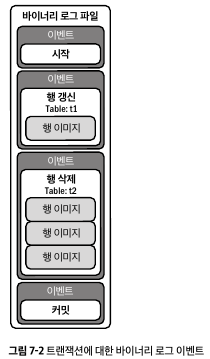
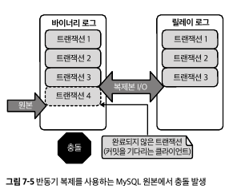

# 7. 복제 지연
- 원본 인스턴스에서 쓰기가 발생하는 시간과 해당 쓰기가 복제 인스턴스에 적용되는 시간 사이의 지연
- 모든 데이터베이스는 복제 지연은 당연한 현상
- 복제로 인해 성능이 떨어지고 지연이 위험할 수 있지만, 복제의 압도적 이점(비니지스 실패 방지)으로 상쇄
## 7.1 MySQL의 복제 유형
- 2가지 유형의 복제
  - 원본에서 복제본으로: 기본적인 복제 유형
  - 그룹 복제: 그룹 합의 프로토콜을 사용하여 데이터 변경 사항을 그룹 구성원이 관리 -> 해당 장에서는 다루지 않음
### 원본에서 복제본으로

- 원본 인스턴스는 클라이언트가 데이터를 쓰는 서버 -> 쓰기 지원 단일 원본
- 복제본 인스턴스는 데이터 변경 사항을 복제하는 서버 -> 읽기 전용
- 데이터 변경 흐름
  - 트랜잭션 커밋 중에 데이터 변경 사항은 원본의 바이너리 로그에 기록
  - 복제본 I/O 스레드는 원본 바이너리 로그에서 바이너리 로그 이벤트 덤프 읽기
  - 복제본 I/O 스레드는 복제본의 릴레이 로그에 바이너리 로그 이벤트 기록
  - SQL 스레드는 릴레이 로그에서 바이너리 로그 이벤트 읽기
  - SQL 스레드는 바이너리 로그 이벤트를 복제 데이터에 적용
  - 복제본은 데이터 변경 사항을 바이너리 로그에 적용
- 기본적으로 비동기식 기본
- 반동기 복제는 위에 3단계 후에 커밋되고 4단계나 5단계는 기다리지 않음
- 복제본은 원본이 될수 있음 -> 장애 조치 작동 방식이며, 가용성을 위한 표준 관행
### 바이너리 로그 이벤트
- 낮은 수준의 세부 사항이지만 트랜잭션의 직접적인 결과
- 복제는 높은 수준에서는 애플리케이션 트랜잭션에 초점, 낮은 수준에서는 바이너리 로그 이벤트에 초점
- 낮은 레벨에서는 SQL문은 없어지며, 복제는 이벤트와 행 이미지의 스트림 

### 복제 지연
- 복제본에 변경 사항을 적용하는 것(5단계)이 원본에 변경 사항을 커밋하는 것(1단계)보다 느릴때 발생
- 바이너리 로그, 네트워크 프로토콜 및 일반적인 네트워크는 매우 빠르고 효율적이라 거의 문제되지는 않음
- I/O 스레드가 SQL 스레드를 능가할 때 발생 

- SQL 스레드는 복제 지연을 유발하지 않으며 제한 요소일 뿐
  - 원본 트랜잭션 처리량이 높아서임
- 반동기식 복제는 복제 지연을 해결하거나 예방하지 않음
- 복제에는 지연이 따르기 마련이지만, MySQL 복제는 매우 빠르므로 이를 잘못 이해해서는 안됨
  - 단일 SQL 스레드는 초당 수천 건의 트랜잭션을 쉽게 처리할 수 있음
    - 복제본이 원본이 실행하는 전체 워크로드를 실행하지 않음
    - 행 기반 복제를 가정하기에 빠름
- 그럼에도 3가지 이유 때문에 복제 지연이 발생 가능함
## 7.2 복제 지연의 3가지 원인
### 트랜잭션 처리량
- 원본의 속도가 복제본의 SQL 스레드가 변경 사항을 적용할 수 있는 속도보다 빠를 때 복제 지연 유발 -> 원본이 바쁨
- 해결책으로는 더 많은 SQL 스레드를 실행하여 복제본의 속도를 높이는 것
- 과도 하게 많은 행을 수정하는 대규모 트랜잭션은 원본보다 복제본에 더 큰 영향을 미침
  - 단일 스레드 복제본에서 큰 트랜잭션은 다른 모든 트랜잭션을 2초 동안 차단
- 트랜잭션 처리량은 항상 애플리케이션에 결정되는 것은 아님
  - 데이터 백필링, 삭제, 보관 등 배치 크기를 제어하지 않으면 복제 지연 걸림
### 장애 후 재구축
- MySQL 하드웨어에 장애가 발생하면 인스턴스가 수리되어 다시 복제 토폴리지로 돌아감
  - 새 인스턴스가 기존 인스턴스에 복제되어 실패한 인스턴스를 대신함
- 엄밀히 말하면 복제지연이지만, 수리된 인스턴스가 따라 잡을 떄가지 무시할 수 있음
- 유일한 해결책은 복제 지연이 장애 후 재구축과 대기로 인한 것임을 인식하는 것
### 네트워크 문제
- 원본에서 복제본으로 바이너리 로그 이벤트 전송이 지연
- 엄밀히 말하면 네트워크 지연이지만, 결과는 같음
- 해결책은 네트워크 엔지니어를 불러 근본 원인인 네트워크를 고쳐야함
## 7.3 위험: 데이터 손실
- 복제 지연은 데이터 손실
- 비동기 복제가 기본이며, 반동기식 복제는 커밋된 트랜잭션을 잃지 않은 옵션임
### 비동기식 복제

- I/O 스레드는 처음 3개의 트랜잭션만 가져옴 -> 마지막 2개의 트랜잭션 손실은 '충돌 원인'과 'DBA 장애 조치 여부'에 따라 달리짐
  - 충돌 원인
    - MySQL이 원인이면 자동으로 다시 시작하고 충돌 복구를 수행한 다음 정상 작동
    - 시간이 다소 걸릴 수 있음
    - 기다릴수만 있으면 트랜잭션이 손실되지 않음 -> 충돌 복구
  - DBA 장애조치
    - 하드웨어나 운영체제가 충돌 원인 or 손상된 MySQL 인스턴스를 신속하게 복구할 수 없다면 DBA가 트랜잭션(4,5)를 잃게 됨
    - 이상적인 해결책은 아니지만 대안이 더 나빠서 표준이 된 관행
    - 복구하는데 장기간 운영 중단이 걸리며, 장시간에 정확한 데이터 포렌식이 필요
- 비동기식 복제를 사용할 때 데이터 손실은 불가피 -> 유일한 완화 방법은 복제 지연 최소화를 엄격히 준수하는 것
  - 10초의 복제를 늦지 않았다고 무시하는 대신 '손실 위험이 존재'한다고 생각
- 다음 3가지 조건이 충족 필요
  - 하트비트로 복제 지연을 모니터링
  - 복제 지연 시간이 너무 길면 경고 알림 받기
  - 복제 지연을 데이터 손실로 간주하고 즉시 수정
- 많은 기업이 비동기 복제를 사용하지만 반동기식 복제를 사용할 수 있도록 노력해야함
### 반동기식 복제

- 원본은 적어도 하나의 복제본이 각 트랜잭션을 승인할 때까지 기다림
  - 확인 응답은 복제본이 트랜잭션에 대한 바이너리 로그 이벤트를 릴레이 로그에 기록했음을 의미 -> 복제본 디스크에는 있지만 적용은 안되었음
- 4단계 프로세스
  - 트랜잭션 커밋 준비
  - 데이터 변경 사항을 바이너리 로그로 플러시
  - 하나 이상의 복제본에서 응답 대기
  - 트랜잭션 커밋
- 윗 그림에서 4번째 트랜잭션이 복제본에게 응답을 받지 못함 -> 클라이언트의 commit 관련 오류 반환
- 4번째 트랜잭션 손실 관련해서는 '충돌 원인'과 'DBA의 장애 조치 여부'에 따라 달라짐
- 커밋된 모든 트랜잭션이 적어도 하나의 복제본으로 복제되도록 보장 -> 실패하면 연결당 커밋되지 않은 트랜잭션 하나만 손실
- 반동기 복제가 MySQL의 기본값이 아닌 이유는?
  - 반동기식 복제는 가용성을 떨어뜨림 -> 트랜잭션을 보호하지만 지연, 시간 초과 또는 COMMIT 실패 유발
  - 비동기식 복제는 COMMIT을 본질적으로 수행하며 원본 스토리지가 작동하는 한 보장
- 반동기식 복제의 성능을 위해서는 빠른 로컬 네트워크가 필요
## 7.4 지연 감소: 다중 스레드 복제
- 복제본에 하나의 SQL 스레드 존재 -> 복제 지연을 일으키는 제한 요소
- 복제 지연을 일으키는 문제 해결을 위해 다중 SQL 스레드 활용
- 다중 스레드 복제는 MySQL에게는 간단하지 않은 해결책 -> 트랜잭션 순서 보장 필요
  - 하나의 시스템 변수로 다중 스레드 복제가 가능하지만 실제로는 매우 복잡
- 다중 스레드 복제를 사용하고 구성하기 위한 3가지 시스템 변수 존재

| MySQL 5.7.22 ~ 8.0.25       | MySQL 8.0.26 이상               | 값             |
|-----------------------------|-------------------------------|---------------|
| slave_parallel_workers      | replica_parallel_workers      | 4             |
| slave_parallel_type         | replica_parallel_type         | LOGICAL_CLOCK |
| slave_preserve_commit_order | replica_preserve_commit_order | 1             |
    - replica_parallel_workers
      - 다중 스레드 복제 사용 하는 설정의 하나
      - 스레드 수 -> 워크로드와 하드웨어에 따라 튜닝 필요
    - replica_parallel_type
      - 다중 스레드 복제의 전체 성능 활용 옵션
      - 기본값 DATABASE이며 데이터베이스당 하나의 적용자 스레드만 적용
      - 오늘날에는 LOGICAL_CLOCK이 최선
    - replica_preserve_commit_order
      - 병렬 효율성을 떨어뜨리지만 트랜잭션 순서 보장
- 다중 스레드 복제는 최상의 방법이지만 성능 극대화 하려면 MySQL 설정과 튜닝이 필요하기도 함
- 가장 중요한 포인트는 복제 지연 시간을 크게 줄인다는 것
## 7.5 모니터링
- `SHOW REPLICA STATUS`문으로 `Seconds_Behind_Source`를 살펴볼 수 있음
  - 현재 시각 - SQL 스레드가 실행 중인 바이너리 로그 이벤트 시간
  - 예) 현재 시각(100) - 바이너리 로그 이벤트 시간(80) = 20
- `Seconds_Behind_Source` 비교적 정확하지만 3가지 문제로 악명 높음
  - 모든 것이 작동하지 않을 때 발생
    - 바이너리 로그 이벤트 타임스탬프에 의존 -> 이벤트가 도착하지 않으면 신경쓰지 않음
    - 원본이나 네트워크 이슈로 로그 이벤트가 미도착 시, 0으로 표기 -> 정상이 아닌데도 정상으로 표시됨
  - `Seconds_Behind_Source`가 0과 0이 아닌 값 사이를 반복한다는 것
    - `500초 -> 0초 -> 500초` 처럼 데이터가 출렁거릴 때가 존재
    - 복제본 이전의 데이터 로그가 유입되면 SQL 스레드 작업(적용)과 대기(다음 이벤트) 사이에서 출렁거림
  - `Seconds_Behind_Source`가 복제본이 언제 따라 잡을 수 있는지 정확히 답하지 못함
    - 현재 이벤트가 원본에서 실행된지 얼마나 지났는지만 나타냄 -> 복제본이 원본과 다른 속도로 트랜잭션에 적용
- 그래도 `Seconds_Behind_Source`는 복제본이 원본을 따라잡는 데 걸리는 시간에 대한 대략적인 추정치를 제공함
- 복제 지연을 모니터링하는 최상의 방법은 전용 도구를 사용하는 것
  - 일정한 간격으로 타임스탬프를 테이블에 기록, 현재 시각에서 - 테이블의 최신 타임 스탬프 제공
- `Seconds_Behind_Source`와 유사하지만 도구를 사용할 때 3가지 중요한 차이점 존재
  - 도구는 일정한 간격으로 타임스탬프 작성 -> `Seconds_Behind_Source`가 가진 첫번 째 문제 해결
  - `Seconds_Behind_Source`의 두번 째 문제도 해결 -> 타임스탬프가 현재 시각과 같을 때만 0으로 표현
  - 도구는 1초 미만의 간격으로 복제 지연과 쓰기 타임스탬프를 측정 가능 -> 1초의 복제 지연은 고성능 애플리케이션에게 너무 긴 시간임
## 7.6 복구 시간
- 복제본에 상당한 지연 시간이 발생할 때 가장 시급한 질문은 "언제 복구될 것인가?", "언제 원본을 따라잡아 최신 트랜잭션을 실핼할까?"
  - 정확한 답은 없음
- 복제 지연은 원인이 해결되면 항상 복구됨
- 지연 증가와 복제본 복구 시작(지연) 사이의 변곡점 

  - 복제 지연이 증가하면 상황은 심각해보이지만 정상적인 현상임
  - 복제본이 손상되지 않았다고 가정하면 SQL 스레드가 열심히 동작하지만 원인은 해결되지 않았으므로 지속적으로 동작 -> 원인이 지속되는 한 복제 지연은 증가
  - 원인이 해결되면 그래프 흐름이 바뀌어 시간 축 '75'처럼 복제 지연 그래프에 변곡점이 생김 -> 이후 빠르게 복제 지연 감소
  - 복제 지연이 꾸준히 증가하고 있을때, 원인 해결하는 데 집중해야함
- 복제본은 종종 원본바다 빠르게 트랜잭션을 적용하며, 결국 복제본이 따라 잡음(원본 워크로드를 전체 수행하지 않기 떄문에)
- 될 수 있는 한 빨리 원인을 수정하고 변곡점을 기다리면, 빨리 복구 됨
