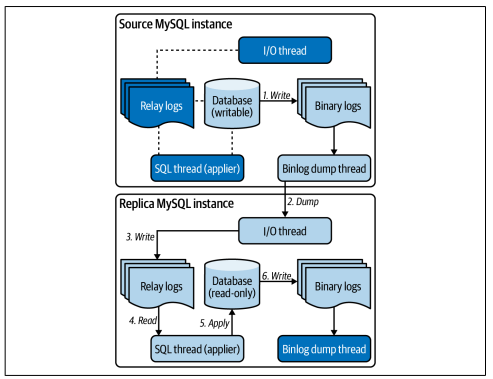
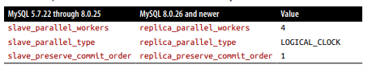

# Chapter 7. Replication Lag
* 복제 지연은 원본 MySQL 인스턴스에서 쓰기가 발생하는 시간과 복제 인스턴스에 적용되는 시간 사이의 지연이다
* 복제는 성능을 떨어뜨리지만 복제 없는 MySQL을 쓰고 싶어하는 사람은 없다
* 복제의 비용은 복제의 압도적인 이점으로 상쇄된다
## Foundation
* MySQL에느 2가지 유형의 복제가 있다
* Source to replica
  * 20년 이상 사용해 온 기본 복제 유형
* Group Replication
  * 5.7.17 부터 지원하는 새로운 복제 유형
  * 그룹 합의 프로토콜을 사용하여 데이터 변경 사항을 동기화 하고 그룹 구성원을 관리하는 기본과 보조
  인스턴스의 MySQL 클러스터를 생성한다
### Source to Replica

* 원본은 클라이언트가 데이터를 쓰는 서버이다
* 복제는 쓰기 가능한 여러 원본을 지원하지만 충돌 처리의 어려움으로 인해 사용되지 않는다
* 복제본은 원본의 데이터 변경 사항을 복제하는 모든 MySQL 서버이다
* 복제본은 split-brain을 방지하기 위해 읽기 전용이어야 한다
  * 스플릿 브레인(Split Brain)이란 특수한 상황 또는 네트워크 토폴로지를 갖는 Production 환경에서, 네트워크 파티셔닝 장애로 인해 시스템이 Sub-Cluster로 쪼개짐에 따라 각 Sub-Cluster가 스스로를 Primary 또는 정상적인 서비스라고 인식하는 것을 의미

1. 트랜잭션 커밋 중에 데이터 변경 사항은 원본의 바이너리 로그에 기록된다
2. 복제본의 I/O 스레드는 원본 바이너리 로그에서 바이너리 로그 이벤트를 덤프한다
3. 복제본의 I/O 스레드는 복제본의 릴레이 로그에 바이너리 로그 이벤트를 기록한다
4. SQL 스레드는 릴레이 로그에서 바이너리 로그 이벤트를 읽는다
5. SQL 스레드는 바이너리 로그 이벤트를 복제본 데이터에 적용한다
6. 복제본은 데이터 변경사항을 바이너리 로그에 기록한다

* 복제는 비동기식이 기본이다 (1단계 까지 트랜잭션)
* 반동기식 복제도 지원한다 (3단계 까지 트랜잭션)
* 복제본은 바이너리 로그가 필요없지만 고가용성을 위한 표준 관행이다, 승격을 통해 원본이 된다
### Binary Log Events
* 바이너리 로그 이벤트는 아주 낮은 레벨이지만, 애플리케이션이 실행한 트랜잭션의 직접적인 결과이다
* 복제는 쓰기가 완료된 커밋 중 데이터 변경 사항이 바이너리 로그에 커밋되므로 개별 쓰기가 아닌 트랜잭션과 바이너리 로그 이벤트에 중점을 둔다
* 높은 수준에서는 애플리케이션에, 낮은 수준에서는 복제에 의미가 있다
```roomsql
BEGIN;
UPDATE t1 SET c='val' WHERE id=1 LIMIT 1;
DELETE FROM t2 LIMIT 3;
COMMIT;
```
* 중요한 것은 UPDATE가 테이블 t1에서 1개 행을 변경하고 DELTE는 테이블 t2에서 3개 행을 삭제한다는 것이다
* 4개의 연속 이벤트가 트랜잭션을 구성한다, BEGIN, 1개의 행 UPTDATE, 3개의 행 DELETE, COMMIT


* 바이너리 로그는 이렇게 생기게 된다
### Replication Lag
* 복제 지연은 복제본에 변경 사항을 적용 하는 것이 지연될때 발생한다
* 2단계는 네트워크가 정상이라면 거의 문제가 되지 않는다
* 그러나 SQL 스레드는 변경사항 적용을 위해 많은 작업을 해야 하므로 실제로는 복제본에서
릴레이 로그를 SQL 스레드가 읽고 데이터베이스에 쓸 때 발생한다
* 엄밀하게는 복제 지연을 유지하는 것은 SQL 스레드가 아니며 제한 요소이다
* 원인은 원본의 트랜잭션 처리량이 높기 때문이다
* 반동기식 복제라고 하더라도 지연을 해결하거나 예방하지 않는다
  * 반동기식 복제를 사용하더라도 실제 지연이 발생하는 곳까지 트랜잭션으로 묶이기 때문에 원본의 처리량이 줄어들 뿐이다
* 그러나 MySQL의 복제는 매우 빠르다, 단일 SQL 스레드는 초당 수천 건의 트랜잭션으 쉽게 처리하는데
  * 이유는 원본이 실행하는 워크로드를 실행하지 않는다, 읽기X
  * 행 기반 복제를 가정하기 때문에 최종 결과만이 제공되고 적용할 위치가 함께 알려지기 때문이다
## Causes
* 그럼에도 3가지 주요 원인으로 복제 지연이 발생한다
### Transaction Throughput
* 트랜잭션 처리량은 원본의 속도가 복제본이 SQL 스레드가 변경사항을 적용할 수 있는 속도보다 빠를 때 지연을 유발한다
* 그러나 이런 문제가 있다고 원본의 쓰기 속도를 줄일 수는 없다
* 해결책으론 복제본의 SQL 스레드를 멀티로 실행하여 복제본의 속도를 높일 수 있다
  * 원본은 일반적으로 병렬로 실행되지만 복제본에서는 단일 스레드가 기본이기 때문이다
  * 따라서 트랜잭션이 클수록 복제본은 더 느려질 수 있다(단일 스레드가 트랜잭션 처리로 멈추기 때문)
* 트랜잭션 처리량은 단순히 애플리케이션에 의해서만 결정되진 않는다
  * backfiling, deleting, archiving은 배치크기를 제어하지 않으면 큰 복제 지연을 유발할 수 있다
### Post-Failure Rebuild
* MySQL 이나 하드웨어 장애시 인스턴스가 수리되어 복제 토폴로지로 돌아간다
* 또는 새 인스턴스가 기존 인스턴스르 복제하여 대신한다
### Network Issues
* 네트워크 문제로 인해 원본에서 복제본으로 바이너리 로그 이벤트 전송이 지연되면 복제 지연이 발생할 수 있다
## Risk: Data Loss
* 복제 지연은 data loss 이다(문제 발생 시 복구할 수 없음)
* semisynchronous replication은 커밋된 트랜잭션을 잃지 않을 수 있다
### Asynchronous Replication
* 
* Crash의 원인이 MySQL 이라면 자동으로 다시 시작하고 충돌 복구를 수행한 다음 정상 작동을 재개한다
* Crash의 복구가 잘 이루어진다면 4와 5는 손실되지 않지만, 복구에 몇 분 몇 시간이 걸릴 지 알 수 없다는 문제가 있다
* 가능하다면 Crash recovery가 가장 이상적이다
* 그러나 복구 할 수 없다면 DBA가 장애 조치(원본을 복제본으로 대체)하고 트랜잭션 4와 5는 잃어버린다
* 비동기식 복제를 사용할때 이러한 복구 방법을 사용한다면 데이터의 손실은 불가피하다
* 그러므로 비동기 복제를 사용할때 복제 지연은 데이터가 손실될 위험을 지연 시간으로 가정하는게 합리적이다
### Semisynchronous Replication
* 반동기식 복제를 사용하면 원본이 복제본의 트랜잭션 승인을 기다린다
  * ack는 복제본이 바이너리 로그 이벤트를 릴레이 로그에 기록했음을 의미한다
  * 적용이 아니라 수신 확인 이므로 반동기라고 부른다
* 
* 반동기 복제를 사용하면 커밋된 모든 트랜잭션이 적어도 하나의 복제본에 복제되었음을 보장한다
## Reducing Lag: Multithreaded Replication
* MySQL 복제는 비동기/단일 스레드이다(반동기식 복제도 단일 스레드이다)
* 단일 SQL 스레드는 복제 지연을 일으키지는 않지만 제한하는 요소이다, 다중 스레드 복제로 해결할 수 있다
* 
* 위 시스템 변수를 이용해 활성화 할 수 있다
* [replica_parallel_workers](https://dev.mysql.com/doc/refman/8.0/en/replication-options-replica.html#sysvar_replica_parallel_workers) 는 수행할 멀티 스레드의 숫자
* [replica_parallel_type](https://dev.mysql.com/doc/refman/8.0/en/replication-options-replica.html#sysvar_replica_parallel_type)
  * 기본값은 DATABASE 이며 데이터 베이스 별로 thread를 분리한다 
  * LOGICAL_CLOCK을 통해 하나의 database를 multi thread로 처리할 수 있다
  * replica_preserve_commit_order와 함께 하용할 때 병렬화 기능을 향상시킬 수 있다
* [replica_preserve_commit_order](https://dev.mysql.com/doc/refman/8.0/en/replication-options-replica.html#sysvar_replica_preserve_commit_order)
  * 기본값은 비활성화 이지만 활성화 되지 않은 경우 순서에 오류가 발생할 수 있다
  * 이 값을 활성화 하여 멀티스레드와 트랜잭션의 순서를 동시에 유지할 수 있다
## Monitoring
* 복제 지연을 모니터링하는 가장 좋은 방법은 전용 도구를 사용하는 것이다
* 기본값으로 제공되는 Second_Behind_Source는 악명이 높다
  * 바이너리 로그의 이벤트 타임스탬프에만 의존하므로 바이너리 로그 이벤트가 오기 전에 발생한 문제와 분리되어 값이 표현된다
  * 값이 0과 0이 아닌 값 사이를 반복한다(값이 트랜잭션 별로 별도로 적용된다)
  * 복제본이 언제 따라 잡을 수 있는가? 를 보여주지 못한다
  * + 멀티 슬레이브 인 경우 각각의 지연 시간을 정확하게 보여줄 수 없다
## Recovery Time
* 가장 중요한 것은, `그래서 언제 복구 되는가?` 이다
* 
* 복구 시간은 문제가 해결된 변곡점 이후부터 의미가 있다
  * 필자의 경험 : 복제 지연이 일 단위로 측정되면 문제 해결 후 몇시간 내에 복구된다
## Summary
* MySQL has three types of replication: asynchronous, semisynchronous, and Group Replication.
* Asynchronous (async) replication is the default.
* Asynchronous replication can lose numerous transactions on failure.
* Semisynchronous (semisync) replication does not lose any committed transactions on failure, only one uncommitted transaction per client connection.
* Group Replication is the future of MySQL replication and high availability (but not covered in this chapter or book): it turns MySQL instances into a cluster.
* The foundation of MySQL async and semisync replication is sending transactions, encoded as binary log events, from a source to a replica.
* Semisync replication makes a transaction commit on the source wait for at least one replica to acknowledge receiving and saving (not applying) the transaction.
* A replica has an I/O thread that fetches binary log events from the source and stores them in local relay logs.
* A replica has, by default, one SQL thread that executes binary log events from the local relay logs.
* Multithreaded replication can be enabled to run multiple SQL threads (applier threads).
* Replication lag has three main causes: (high) transaction throughput on the source, a MySQL instance catching up after failure and rebuild, or network issues.
* SQL (applier) threads are the limiting factor in replication lag: more SQL threads reduce lag by applying transaction in parallel.
* Semisync replication can incur replication lag.
* Replication lag is data loss, especially with asynchronous replication.
* Enabling multithreaded replication is the best way to reduce replication lag.
* The MySQL metric for replication lag, Seconds_Behind_Source, can be misleading; avoid relying on it.
* Use a purpose-built tool to measure and report MySQL replication lag at subsecond intervals.
* Recovery time from replication lag is imprecise and difficult to calculate.
* MySQL will recover, eventually—it always does once the cause is fixed.