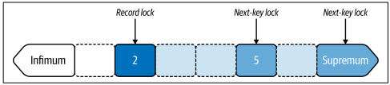
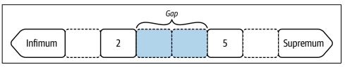

# Chapter 8. Transactions
## Row Locking
* 읽기는 행을 잠그지 않지만 쓰기는 항상 행을 잠근다
* 그렇다면 어떤 행을 잠글까?
  * 실행중인 행은 물론이지만 REPEATABLE READ 트랜잭션에서 InnoDB는 쓰는 행 말고도 잠글 수 있다
  * 
  * 그림과 같이 2개의 프라미어리 키 레코드, 2개의 의사 레코드, 3개의 공백으로 표시할 수 있다

* READ UNCOMMITTED: 가장 낮은 격리 수준, 팬텀 리드, 더티 리드 등이 모두 발생할 수 있음.
* READ COMMITTED: 커밋된 데이터만 읽을 수 있지만, 팬텀 리드는 여전히 발생할 수 있음.
* REPEATABLE READ: 동일한 쿼리를 여러 번 실행해도 같은 결과를 보장. InnoDB에서 기본 격리 수준이며, 팬텀 리드를 방지함.
* SERIALIZABLE: 가장 높은 격리 수준. 트랜잭션 간에 상호 배제 수준의 강력한 잠금이 걸리며 팬텀 리드가 발생하지 않음.

| 잠금유형                  | 축약형              | 공백 잠금 | 잠금               |
|-----------------------|------------------|-------|------------------|
| Record lock           | REC_NOT_GAP      |       | 단일 레코드 락         |
| Gap lock              | GAP              | v     | 레코드 이전 갭을 락      |
| Next-key lock         |                  | v     | 단일 레코드와 그 이전 갭을 락 |
| Insert intention lock | INSERT_INTENTION |       | 간격에 INSERT 허용    |

```roomsql
CREATE TABLE `elem` (
 `id` int unsigned NOT NULL,
 `a` char(2) NOT NULL,
 `b` char(2) NOT NULL,
 `c` char(2) NOT NULL,
 PRIMARY KEY (`id`),
 KEY `idx_a` (`a`)
) ENGINE=InnoDB;

+----+-----+----+----+
| id | a | b | c |
+----+-----+----+----+
| 2 | Au | Be | Co |
| 5 | Ar | Br | C |
+----+-----+----+----+
```
* 다음과 같은 테이블이 있다고 하자

### Record and Next-Key Locks
```roomsql
UPDATE elem SET c='' WHERE id BETWEEN 2 AND 5;

+------------+-----------+---------------+-------------+-----------------------+
| index_name | lock_type | lock_mode | lock_status | lock_data |
+------------+-----------+---------------+-------------+-----------------------+
| NULL | TABLE | IX | GRANTED | NULL |
| PRIMARY | RECORD | X,REC_NOT_GAP | GRANTED | 2 |
| PRIMARY | RECORD | X | GRANTED | supremum pseudo-record|
| PRIMARY | RECORD | X | GRANTED | 5 |
+------------+-----------+---------------+-------------+-----------------------+
```
* 각 행의 의미를 살펴보자
  1. Table lock : InnoDB는 로우 레벨 락 스토리지 엔진이지만, Table lock도 필요하다
  2. 키값 2에 대한 record lock
  3. 키값 2에 대한 next key lock
  4. 키값 5에 대한 next key lock
* 
```roomsql
mysql> INSERT INTO elem VALUES (3, 'Au', 'B', 'C');
mysql> INSERT INTO elem VALUES (6, 'Au', 'B', 'C');
```
* 따라서 위 두 줄 모두 transaction으로 인해 실패한다
* 왜? phantom read를 막기 위해서

### Gap Locks
* 다른 트랜잭션이 갭에 행을 삽입하는 것을 금지하고 방지
```roomsql
SELECT * FROM elem WHERE id = 3 FOR SHARE;
+------------+-----------+-----------+-------------+-----------+
| index_name | lock_type | lock_mode | lock_status | lock_data |
+------------+-----------+-----------+-------------+-----------+
| NULL | TABLE | IS | GRANTED | NULL |
| PRIMARY | RECORD | S,GAP | GRANTED | 5 |
+------------+-----------+-----------+-------------+-----------+
```
* 
* 아무것도 검색하지 않았지만, 2와 5 사이의 gap lock을 만들어 낸다
```roomsql
UPDATE elem SET c='' WHERE id IN (2, 5);
UPDATE elem SET c='' WHERE id IN (2, 3, 5);
```
* 처음 쿼리는 갭을 만들지 않지만 두번째 쿼리는 3이 없으므로 gap을 만든다 
### Secondary Indexes
* 세컨더리 인덱스는 row lock, 특히 인덱스가 고유하지 않은 경우 광범위한 결과를 초래한다 
```roomsql
UPDATE elem SET c='' WHERE a BETWEEN 'Ar' AND 'Au';

+------------+-----------+---------------+-------------+------------------------+
| index_name | lock_type | lock_mode | lock_status | lock_data |
+------------+-----------+---------------+-------------+------------------------+
| NULL | TABLE | IX | GRANTED | NULL |
| a | RECORD | X | GRANTED | supremum pseudo-record |
| a | RECORD | X | GRANTED | 'Au', 2 |
| a | RECORD | X | GRANTED | 'Ar', 5 |
| PRIMARY | RECORD | X,REC_NOT_GAP | GRANTED | 2 |
| PRIMARY | RECORD | X,REC_NOT_GAP | GRANTED | 5 |
+------------+-----------+---------------+-------------+------------------------+
```
* 
* 두 줄의 변경이 필요했지만 전체 행이 잠기는 효과가 발생했다
* Ar이 5와 일치하므로 Ar,1의 삽입을 막기 위해 Ar-하한 gap lock, Au가 2와 일치하므로 Au, 6의 삽입을 막기 위해 Au-상항 gap lock이 발생한다
* 이것은 특수한 경우이지만, 고유하지 않은 인덱스 일수록 이와 같은 gap이 커질 가능성이 높아진다
```roomsql
UPDATE elem SET a = 'Go' WHERE a = 'Au';

+------------+-----------+---------------+-------------+------------------------+
| index_name | lock_type | lock_mode | lock_status | lock_data |
+------------+-----------+---------------+-------------+------------------------+
| NULL | TABLE | IX | GRANTED | NULL |
| a | RECORD | X | GRANTED | supremum pseudo-record |
| a | RECORD | X | GRANTED | 'Au', 2 |
| a | RECORD | X,GAP | GRANTED | 'Go', 2 |
| PRIMARY | RECORD | X,REC_NOT_GAP | GRANTED | 2 |
+------------+-----------+---------------+-------------+------------------------+
```
* 
* Au를 Go로 변경했지만 Au,2 lock을 유지하고 있다
* 그러나 Go에 대한 잠근은 없다, REPEATABLE READ가 아닌 READ COMMITTED도 동일하다
### Insert Intention Locks
* 특정 트랜잭션이 테이블에 새로운 레코드를 삽입할 때, 해당 트랜잭션은 **삽입할 위치에 대한 의도(intention)**를 먼저 나타내는 잠금을 걸게 된다
* gap lock은 레코드 삽입을 막기 위함이고, Insert intetion lock은 갭 내에 특정 위치에 레코드를 삽입할 의도를 표시한다
* 여러 트랜잭션이 Insert intetion lock 잡은 갭 내에 다른 레코드를 삽입하는 것도 허용 된다
## MVCC and the Undo Logs
* InnoDb는 다중 버전 동시성 제어와 undo 로그를 사용하여 ACID의 A,C,I를 수행한다(D는 트랜잭션 로그로)
* MVCC는 처음 생성시 버전을 1로, 업데이트시 2..3..
  * MVCC의 스냅샷을 이용하여 읽고, 트랜잭션은 새 버전에 기록하기 때문에 트랜잭션 중간의 데이터가 반환되지 않는다
* undo log는 변경 사항을 이전 버전으로 롤백하는 방법을 기록한다
  * MVCC의 이전 버전이 기록되어 있으며 이를 이용해 이전 MVCC로 롤백한다
  * 트랜잭션은 MVCC에서 데이터를 읽고 업데이트 후 데이터를 Undo log의 MVCC를 통해 이전 데이터를 제공 받는다
## History List Length
* 제거 또는 플러시되지 않은 이전 행 버전의 양을 측정한다
* HLL이 커지면, 데이터베이스는 더 많은 과거 버전의 데이터를 유지하고, 이는 성능 저하를 초래할 수 있다
* HLL이 100,000을 넘으면 시스템에 문제가 발생할 수 있다, 트랜잭션 성능이 저하 되거나 MySQL crash가 발생할 수 있다
* HLL이 클수록 과거 데이터에 대한 참조가 많아지고 쿼리 응답 시간이 증가할 수 있다
* HLL의 상한을 100,000으로 설정하고 그 이상 커지지 않게 조치를 취하자
  * > 자동으로 100,000 넘으면 삭제되도록 관리하지 않는 이유?
  * > 장기 트랜잭션과 같은 것들로 인한 문제라면 이 케이스는 어차피 느려서 못 쓰는것 아닌가?
## Common Problems
* 아래와 같은 일반적인 문제들이 있다
### Large Transactions (Transaction Size)
* 대규모 트랜잭션은 과도한(inordinate) 수의 행을 수정한다
* 대규모 트랜잭션은 복제 지연의 주요 원인이고 다중 스레드 복제의 효율성을 떨어뜨린다
* 트랜잭션은 작을수록 더 좋다
### Long-Running Transactions
* 오래 실행되는 트랜잭션은 commit / roll back 하는 데 너무 오래 걸린다
* 오래의 정의
  * 사용자에게 체감이 되는 경우
  * contention 가능성이 있는 경우
  * HLL의 경고가 발생할 경우
* 원인
  * 트랜잭션을 구성하는 쿼리가 너무 느린 경우
  * 애플리케이션이 트랜잭션에서 너무 많은 쿼리를 실행한 경우
### Stalled Transactions
* 쿼리 간 대기 시간이 너무 큰 경우
* 애플리케이션에서 각 쿼리 사이의 처리가 너무 많은 경우 발생할 수 있다
```roomsql
BEGIN;
SELECT <row>
--
-- Time-consuming application logic based on the row
--
UPDATE <row>
COMMIT;
```
### Abandoned Transactions
* 애플리케이션과 데이터베이스의 연결이 끊어져, 활성 트랜잭션이지만 활성된 연결이 없는 경우(Client abort)
## Reporting
* 현재 특별한 도구가 있진 않다
### Active Transactions: Latest
```roomsql
SELECT
 ROUND(trx.timer_wait/1000000000000,3) AS trx_runtime,
 trx.thread_id AS thread_id,
 trx.event_id AS trx_event_id,
 trx.isolation_level,
 trx.autocommit,
 stm.current_schema AS db,
 stm.sql_text AS query,
 stm.rows_examined AS rows_examined,
 stm.rows_affected AS rows_affected,
 stm.rows_sent AS rows_sent,
 IF(stm.end_event_id IS NULL, 'running', 'done') AS exec_state,
 ROUND(stm.timer_wait/1000000000000,3) AS exec_time
FROM
 performance_schema.events_transactions_current trx
 JOIN performance_schema.events_statements_current stm USING (thread_id)
WHERE
 trx.state = 'ACTIVE'
 AND trx.timer_wait > 1000000000000 * 1\G
```
* 1초 이상 시행된 모든 트랜잭션에 대한 최신 쿼리를 보고한다
```roomsql
*************************** 1. row ***************************
 trx_runtime: 20729.094 //트랜잭션이 실행된 시간
 thread_id: 60 //트랜잭션을 실행 중인 스레드 아이디 
 trx_event_id: 1137 //트랜잭션 이벤트 아이디
 isolation_level: REPEATABLE READ //트랜잭션 격리 수준
 autocommit: NO
 db: test
 query: SELECT * FROM elem // 쿼리문
 rows_examined: 10 // 검사한 행의 수
 rows_affected: 0 // 수정된 행의 수
 rows_sent: 10 // 반환한 행의 수
 exec_state: done // 결과
 exec_time: 0.038 // 초 단위 쿼리 실행 시간
```
### Active Transactions: Summary
* 어떤 트랜잭션이 오래 실행되고 얼마나 많은 작업을 수행했는지
```roomsql
SELECT
 trx.thread_id AS thread_id,
 MAX(trx.event_id) AS trx_event_id,
 MAX(ROUND(trx.timer_wait/1000000000000,3)) AS trx_runtime,
 SUM(ROUND(stm.timer_wait/1000000000000,3)) AS exec_time,
 SUM(stm.rows_examined) AS rows_examined,
 SUM(stm.rows_affected) AS rows_affected,
 SUM(stm.rows_sent) AS rows_sent
FROM
 performance_schema.events_transactions_current trx
 JOIN performance_schema.events_statements_history stm
 ON stm.thread_id = trx.thread_id AND stm.nesting_event_id = trx.event_id
WHERE
 stm.event_name LIKE 'statement/sql/%'
 AND trx.state = 'ACTIVE'
 AND trx.timer_wait > 1000000000000 * 1
GROUP BY trx.thread_id\G
```
### Active Transaction: History
* 각 쿼리 트랜잭션이 얼마나 많은 작업을 수행했는지
```roomsql
SELECT
 stm.rows_examined AS rows_examined,
 stm.rows_affected AS rows_affected,
 stm.rows_sent AS rows_sent,
 ROUND(stm.timer_wait/1000000000000,3) AS exec_time,
 stm.sql_text AS query
FROM
 performance_schema.events_statements_history stm
WHERE
 stm.thread_id = 0
 AND stm.nesting_event_id = 0
ORDER BY stm.event_id;
```
```roomsql
+---------------+---------------+-----------+-----------+---------------------+
| rows_examined | rows_affected | rows_sent | exec_time | query |
+---------------+---------------+-----------+-----------+---------------------+
| 10 | 0 | 10 | 0.000 | SELECT * FROM elem |
| 2 | 1 | 0 | 0.003 | UPDATE elem SET ... |
| 0 | 0 | 0 | 0.002 | COMMIT |
+---------------+---------------+-----------+-----------+---------------------+
```
### Committed Transactions: Summary
* 커밋된 트랜잭션에 대한 기본 메트릭을 보고한다
```roomsql
SELECT
 ROUND(MAX(trx.timer_wait)/1000000000,3) AS trx_time, //트랜잭션 시간, microsecond의 precision
 ROUND(SUM(stm.timer_end-stm.timer_start)/1000000000,3) AS query_time, // 쿼리 실행 시간, microsecond의 precision
 ROUND((MAX(trx.timer_wait)-SUM(stm.timer_end-stm.timer_start))/1000000000, 3)
 AS idle_time, //트랜잭션에서 쿼리 시간을 뺀 값
 COUNT(stm.event_id)-1 AS query_count, // 트랜잭션에서 실행된 쿼리의 수
 SUM(stm.rows_examined) AS rows_examined,
 SUM(stm.rows_affected) AS rows_affected,
 SUM(stm.rows_sent) AS rows_sent
FROM
 performance_schema.events_transactions_history trx
JOIN performance_schema.events_statements_history stm
 ON stm.nesting_event_id = trx.event_id
WHERE
 trx.state = 'COMMITTED'
 AND trx.nesting_event_id IS NOT NULL
GROUP BY
 trx.thread_id, trx.event_id;
```