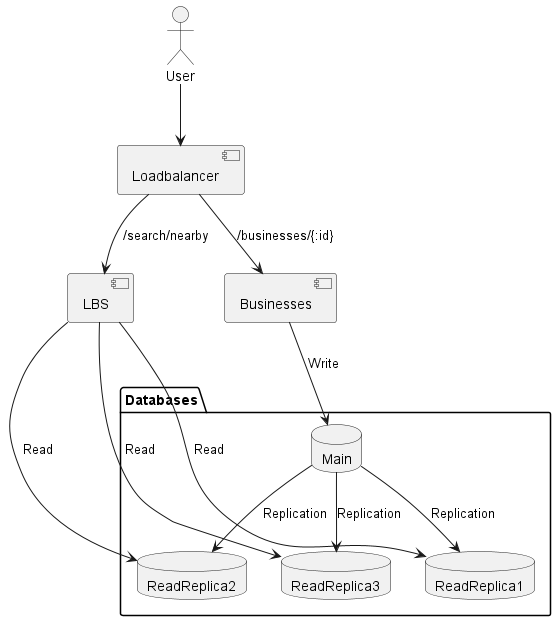
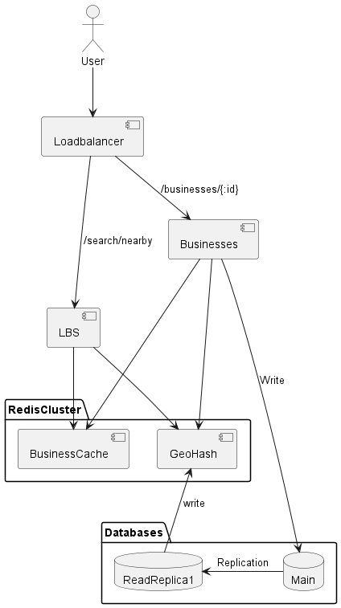

# 근접성 서비스
* Google, Yelp 등에서 가까운 식당, 주유소를 검색하는 서비스
* 먼저 시스템을 설계하기 위해선 문제 이해(요구사항 분석)이 필요하다

## 1단계: 문제 이해 및 설계 범위 확정
### 요구 사항
**기능 요구사항**
* 사용자의 위치와 검색 반경 정보에 매치되는 사업장 목록 반환
* 사업장 소유주는 사업장의 정보를 추가, 삭제, 갱신할 수 있다
* 사업장의 변경 정보는 검색 결과에 실시간으로 반영될 필요는 없다
    * 실시간 반영을 위해서 발생하는 비용이 비즈니스 가치보다 크다고 판단되지는 않음
* 고객은 사업장의 상세 정보를 볼 수 있다

**비기능 요구사항**
* 낮은 latency
* 데이터 보호
    * 사용자의 위치 정보는 민감 데이터로 분류되기 때문에 GDPR, CCPA와 같은 데이터 사생할 보호 법안을 준수해야 한다
* 고가용성 및 규모 확장성
    * 인구 밀집 지역, 이용자가 집중되는 시간에 대한 고려

**개략적 규모 추정**
* 시스템의 규모와 어떤 수준의 도전적 과제를 해결해야 하는지 결정하기 위해 갸ㅐ략적 추정을 해보자
* DAU 1억, 등록된 사업장 수 2억으로 가정한다
```
QPS 계산
- 사용자는 하루 평균 5회의 검색 시도
- 5*1억/86400 = 5787 QPS
```

## 2단계: 개략적 설계안 제시 및 동의 구하기
### API 설계

**GET /v1/search/nearby**
> 특정 검색 기준에 맞는 사업장 목록을 반환하는 API
* params
    * float latitude
    * float longitude
    * int radius


**Response**
```json
{
  "total": 10,
  "business": [{business object}]
}
```
* 여기서 business object에 표시해줄 정보는 get businesses의 결과의 축소판을 제공한다
* 사용자는 get businesses를 통하여 별도의 추가 정보를 가지고 올 수 있다

> businesses에 대한 CRUD api set

**GET /v1/businesses/:id**

**POST /v1/businesses**

**PUT /v1/businesses/:id**

**DELETE /v1/businesses/:id**


### 데이터 모델
**읽기/쓰기 비율**
* 서비스의 특성을 고려할때 읽기 비율이 쓰기보다 월등히 높을 것으로 예상됨
* 이 경우 MySQL과 같은 관계형 데이터베이스가 바람직할 수 있다
    * MySQL의 read replica를 활용하여 읽기의 수평확장이 가능하다

**데이터 스키마**

| business     |    |
|--------------|----|
| bunsiness_id | pk |
| address      |    |
| city         |    |
| state        |    |
| country      |    |
| latitude     |    |
| longitude    |    |

**개략적 설계**


* 시스템은 LBS와 Businesses 두개 컴포넌트로 구분된다

**Loadbalancer**
* 로드밸런서는 유입 트래픽을 자동으로 여러 서비스에 분산시킨다
* 일반적으로 DNS로 단일 진입점을 만들고 URI에 따라 어느 서비스로 전달할지 결정한다

**LBS(Location Based Service)**
* 시스템의 핵심으로, 주어진 위치와 반경 정보를 이용해 주변 사업장을 검색한다
* 특징
    * 읽기 요청만 발생한다
    * QPS가 높다
    * stateless, easy to horizontal scaling

**Business service**
* 사업장 소유주가 사업장 정보를 CUD(Create/Update/Delete)
* 고객이 사업장 정보를 조회, QPS가 Burst 되는 경향

**데이터베이스 클러스터**
* 주 - 부 형태로 구성할 수 있다
* 주 데이터베이스에 write, 부 데이터베이스는 read를 처리
* 주 데이터베이스에 대한 replication에 지연이 있을 수 있으나 서비스 로직상 문제는 없음

**사업장 서비스와 LBS의 규모 확장성**
* stateless 이므로 특정 시간대에 몰리는 트래픽에는 확장, 유휴 시간에는 축소로 대응할 수 있다

**주변 사업장 검색 알고리즘**
* 대부분 geohash in redis나 PostGIS가 설치된 Postgres를 활용한다
* 지리적 위치 색인이 어떻게 동작하는지 이해해보자

**1. 2차원 검색**
* 현재 위치를 반경으로 포함되는 사업장을 검색하는 방법
* database를 full scan해야 하므로 범위가 넓어질수록 기능하지 않는다
* indexing 을 한다고 하더라도 두개의 column의 교집합을 구해야 함
* 따라서 흔히 아래와 같은 방법을 사용한다


* 근본적으로는 모두 지도를 작은 영역으로 분할하고 고속 검색이 가능한 색인을 만드는 것이다

**2. 균등 격자**
* 지도를 단순히 작은 격자들로 나누는 방법
* 사업장 분포가 균등하지 않다는 문제가 있다, 태평양 한가운데에는 사업장이 없고, 뉴욕에는 너무 많은 사업장이 존재한다
    * 지역에 따라 격자의 크기를 다르게 만드는 방법이 있을 수 있다
* 인접 격자를 찾기 까다로울 수 있다

**3. Geohash**
* 잘 설명된 blog : https://scvgoe.github.io/2018-12-11-Geohash/
* 2차원의 위도 경도를 1차원의 문자열로 재생성

* 12 단계의 정밀도를 갖는데, 일반적으로 4~6 사이를 사용한다
    * 1 : 5,009.4km * 4,992.6km(지구 전체)
    * 4 : 39.1km * 19.5km
    * 6 : 1.2km * 609.4m(500 미터 반경)
    * 12 : 3.7cm * 1.9cm
* 격자 가장자리 이슈
    * 일반적으로 인근 격자는 같은 접두어를 가지지만
    * 적도의 위 아래나, 자오선상의 양쪽으로 갈라지는 경우
    * 해결책은 인접한 모든 격자를 함께 가져오는 방법
        * 상수 시간에 가능한 연산
            * 현재 cell 인근의 격자에 대한 hash 연산으로 충분하기 때문
    * https://www.movable-type.co.uk/scripts/geohash.html
* 표시할 사업장이 충분하지 않은 이슈
    * 주어진 사업장만 반환할 경우
        * 사용자의 needs를 반영할 만한 충분한 수의 사업장이 없다
    * 검색 반경을 키우는 경우
        * hash의 마지막 비트를 삭제하면서 geohash 값을 쉽게 키워서 검색할 수 있다
          **4. Quadtree**
* https://en.wikipedia.org/wiki/Quadtree
* 2차원 공간을 재귀적으로 분할
    * 예를 들어 격자에 담긴 사업장 수가 100 이하가 될 때까지 분할
* 질의에 응답할 트리 구조를 메모리에 올리는 것, 데이터베이스가 아니기 때문에 각각의 LBS 서버가 시작될때 구축해서 가지고 있어야 함
* 너무 많은 메모리의 크기가 요구되진 않을까? 메모리의 사용량을 살펴보자
    * 말단 노드 하나의 데이터
    * | 이름                             | 크기             |
          |--------------------------------|----------------|
      | 격자를 식별하는 데 사용될 좌상단과 우하단 꼭짓점 좌표 | 32 바이트         |
      | 격자 내부 사업장 ID 목록합계              | ID bytes * 100 |
      | 합계                             | 832            |
    * 내부 노드에 수록되는 데이터
    * | 이름                             | 크기     |
          |--------------------------------|--------|
      | 격자를 식별하는 데 사용될 좌상단과 우하단 꼭짓점 좌표 | 32 바이트 |
      | 하위 노드 4개를 가리킬 포인터              | 32 바이트 |
      | 합계                             | 64 바이트 |
    * 사업장의 정보는 database에 이미 레코드로 존재하기 때문에 계산에 포함하지 않는다
    * 말단 노드의 수 200만, 내부 노드의 수 67만(200만/3) * 832 바이트 =~ 1.7GB
        * https://stackoverflow.com/questions/35976444/how-many-leaves-has-a-quadtree
* 쿼드트리 구축에 소요되는 시간이 너무 길지 않을까?
    * 트리 구축에는 n log n이 소요되므로 전체 사업장 n개를 100개씩 묶었을때 소요 시간은 (n/100) log (n/100)이 된다
    * 200m개의 사업장 정보를 인덱싱 하는 경우 = 2900의 연산이 필요 하므로 대략, 2900/1억 초가 필요하다
        * 실제로는 2900의 연산이 단순 연산이 아니기 때문에 훨씬 많은 시간이 필요할 것으로 예상됨
* 주변 사업장을 검색하려면?
    * leaf node를 만날때까지 루트 노드부터 탐색한다. 노드에 100개 사업장이 있으면 해당 노드만 반환, 그렇지 않으면 인접 노드도 추가한다
* 운영 고려 사항
    * quadtree 구축에 시간이 소요되므로 서버는 시작할때마다 수분의 서버 시작 시간이 발생한다
    * 또한 한번에 여러개의 서버를 배포하면 동시에 database에서 사업장 정보를 읽어갈 것이기 때문에 문제가 발생한다
      **5. Google S2**
* 힐베르트 곡선을 이용하여 지구를 1차원 색인화 하는 방법
    * 힐베르트 곡선 상에서 인접한 두 지점은 색인화 된 1차원 공간 내에서도 인접하다는 특성이 있음
    * 즉 2차원 공간을 1차원 공간으로 변경하면서 공간적 접근성을 유지할 수 있다

**어떤 회사가 어떤 방법을 사용하는가**

| 색인 방법            | 회사                         |
|------------------|----------------------------|
| Geohash          | Bing, Redis, MongoDB, Lyft |
| Quadtree         | Yext                       |
| Geohash+Quadtree | Elasticsearch              |
| S2               | Google,Tinder              |

**Geohash vs Quadtree**
* Geohash
    * 구현과 사용이 쉽다, 트리 구축이 필요 없다
    * 지정 반경 내 사업장 검색 가능
    * 동적인 격자 크기 조정이 어렵다
    * 색인의 갱신이 쉽다
* Quadtree
    * 트리를 구축해야 하므로 구현상 고려할 부분이 더 많다
    * Top k를 쉽게 구할 수 있다
        * 가장 가까운 주유소 검색과 같은
    * 격자 크기를 동적으로 조정할 수 있다
    * 색인의 갱신이 까다롭다
        * 사업장 정보를 삭제하기 위해 트리를 순회해야 함
        * 트리의 리밸런싱에 대한 고려 필요(애초에 크게 잡는것으로 부분 해결 가능)

## 3단계: 상세 설계
### 데이터베이스의 규모 확장성
**사업장 테이블**
* 사업장테이블 데이터는 샤딩을 통해 분할하기 좋은 종류의 데이터이다

**지리 정보 색인 테이블**
* 두 가지 저장 방법이 있는데
    * geohash : [사업장]
    * [geohash : 사업장]
* 두 번째 방안을 추천한다 : 사업장 정보를 갱신할때 연산이 더 작다, 각각의 사업장간 의존이 존재하지 않는다

**지리 정보 색인의 규모 확장**
* 색인의 규모를 확장할 때 테이블에 보관되는 데이터의 크기를 고려하고 확장 방안을 결정해야 한다
* 일반적인 확장 방법인 샤딩을 고려할때 데이터의 크기가 크지 않고, 샤딩의 기준을 만들기 어렵다
* 따라서 read replica를 두어 확장하는 것이 바람직하다

**캐시**
* data의 크기가 크지 않고(=~1.7G) 읽기 역시 서버 시작시에만 발생하므로 별도의 캐시가 필요하지 않을 것으로 예상됨
* 캐시의 도입은 "정말 필요한가?" 라는 의문이 먼저 발생해야 하며, 이 경우에는 그렇지 않다

**캐시 키**
* 직관적인 캐시 키는 사용자의 위/경도 정보이다
* 그러나
    * 사용자의 위/경도 정보는 아주 정확하진 않고 작은 위/경도 변화는 대부분의 경우 큰 의미를 가지지 않는다
    * 범위를 캐시키로 지정할 수 있으면 좋겠다, 이 문제를 해결하는 것이 Geohash, Quadtree가 된다

**캐시 데이터 유형**
```python
if geohash not in cache:
    business_ids = database.get(geohash)
    cache.update(geohash, business_ids)
    return business_ids

return cache.get(geohash)
```

* 3가지 정밀도로 캐싱하더라도 5GiB 정도면 된다
* 사업장 정보는 쉽게 캐싱할 수 있다, business_id를 키로 하는 사업장 정보 객체를 캐싱한다

**지역 및 가용성 구역**
* 여러 지역과 가용성 구역에 설치한다(edge)
* 사용자와 시스템의 물리적 거리를 줄인다(latency)
* 트래픽에 따라 부하를 분산한다
* 지역의 사생활 보호법을 준수한다

### 추가 질문: 시간대, 혹은 사업장 유형별 검색
* 만약 현재 영업중인 사업장만 가지고 오고 싶다면?
* 일반적으로 100개 이내의 사업장을 가지고 온닥 하면 가지고 온 이후에 필터링 하는것이 더 합리적이다
* 만약 현재 영업중인 100개의 사업장을 찾고 싶다면?
    * 어려운 문제, 100개에 도달할때까지 계속해서 확장해 나가야 한다
    * 어떤 방식이든 페이징을 서버에 의존하는것은 어려움이 있다
    * 다만 끝이 존재하는 물리적 세계의 페이징이므로
        * 일정 범위를 제한으로 두고 도달하면 100개에 도달할 수 없음을 알리고 가지고 있는것만 반환한다와 같은 형식으로 제한이 가능할 것으로 보인다

### 최종 설계도


**주변 사업장 검색**
1. 500미터 내 주변 사업장을 찾는 경우
2. 앱에서 위치와 검색 반경으로 LoadBalancer 호출
3. LBS로 요청 전달, 캐시에 있으면 반환, 없으면 캐시 업데이트
4. 상세정보는 다시 Businesss로 전달하여 확인

**사업장 정보 조회, 갱신, 추가 및 삭제**
* 갱신한 정보는 다음날 반영되기로 협의했으므로 매일 밤 작업을 돌려서 캐시를 갱신한다
    * 그럼 캐시 hit 실패시에는 하루 전에 업데이트 될 수 있는것 아닌가?
    * 결국 갱신한 정보는 사실상 준 실시간 업데이트가 되지 않을까?

## 4단계: 마무리
* 이번 장은 주변 검색 기능의 핵심인 근접성 서비스를 설계했다
* IT 기업에서 널리 쓰이는 기술은 Geohash, Quadtree, S2이다
    * 캐시를 활용한 지연 시간 감소 방법, 캐시 대상 정보, 캐시 활용법
    * 복제와 샤딩을 통한 데이터베이스 규모 확장법
    * LBS를 여러 지역과 가용성 구역에 설치하여 가용성을 높이고 지연을 줄이고 사생활 보호법을 준수하는 방법도 살펴보았다