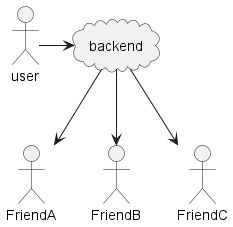
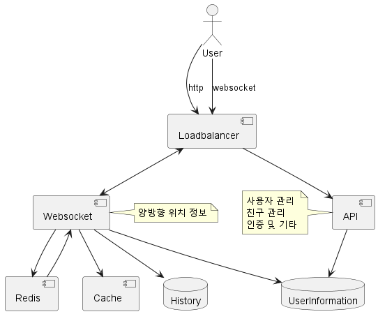
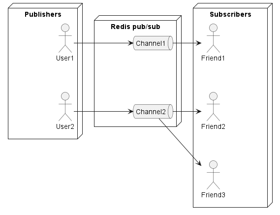

# 주변 친구
* 앱 사용자 중 본인 위치 정보 접근 권한을 허락한 사용자에 한해 인근의 친구 목록을 보여주는 서비스
* 근접성 서비스와 달리 주변 친구는 동적이다

## 1단계: 문제 이해 및 설계 범위 확정
* 주변으로 인식할 거리 : 5마일
* 경로를 고려한 거리를 계산하지 않음
* 이용자는 전체 10억명 중 10%인 1억명
* 이동 이력을 보관해야 한다
* 10분 이상 비활성 상태면 목록에서 제거됨
* GDPR과 같은 사생활 데이터 보호법은 고려하지 않는다

### 기능 요구사항
* 사용자는 모바일 앱에서 주변 친구를 확인할 수 있어야 한다
    * 목록에는 친구까지의 거리와 함께 마지막으로 갱신된 시각이 함께 표시되어야 한다
* 이 목록은 수 초마다 한 번씩 갱신되어야 한다

### 비기능 요구사항
* 지연시간이 낮아야 한다
* 때로 몇개의 데이터가 유실될 수 있으나 대부분 안정적이어야 한다
* eventual consistency

### 개략적 규모 추정
> 먼저 제약사항을 정리하고 가정해야 한다
* `주변 친구`는 8Km 이내로 정의한다 : 도메인 용어 정의
* 친구 위치 정보는 30초 주기로 갱신, 걷는 속도를 감안하면 이 시간내에 크게 변하기는 어렵다
* 평균 사용자는 1억명으로 가정
* 동시 접속은 평균 사용자의 10%인 천만명으로 가정
* 사용자 한명은 평균 400명의 친구를 갖고, 모두가 사용한다고 가정한다
* QPS : 천만 / 30 =~ 334,000
> 도메인 용어를 정의하는 것은 책에서 다루는 것보다 많은 사람의 시간과 노력이 드는 일이다

## 2단계: 개략적 설계안 제시 및 동의 구하기

**개략적 설계안**
* 이론적으로는 P2P로 해결이 가능한 문제다
* 
* 하지만 모바일 단말은 통신 연결 상태도 좋지 않고 전력 사용량도 충분하지 않다

* 백엔드를 이용하면 어떨까?
* 
* 사용자의 위치 변화를 받고 변할때마다 친구 목록에 뿌려준다
* 규모가 커질수록 문제가 생긴다
* 30초마다 갱신한다면 초당 334,000건의 갱신을 처리해야 하는데 400명의 친구중 10%가 인근에 있다면
* 1400만 qps가 필요하다

**설계안**

**Loadbalancer**
* 생략

**API**
* stateless API server cluster

**Websocket**
* 친구 위치 정보 변경을 준실시간 처리하는 stateful server cluster
* client는 websocket 연결을 지속적으로 유지
* 위치가 변경되면 이 연결을 통해 클라이언트로 전송된다

**Cache**
* TTL기능 활용하여 기간이 지나면 자동으로 캐시에서 삭제되고, 사용자가 비활성 상태로 바뀐다

**User Information**
* 사용자의 데이터 및 친구 관계 정보 저장

**History**
* 사용자의 위치 변동 이력 보관

**Redis**
* Redis의 채널은 아주 저렴한 연산이다
* GB급 redis 서버는 수백만 개의 채널을 생성할 수 있다
* 
* websocket을 통해 수신된 사용자의 위치 정보 변경을 자신의 pub/sub 채널에 발행한다
* 이를 통해 사용자의 모든 친구의 websocket 연결 핸들러가 호출되고 친구에게 나의 정보가 갱신된다

**주기적 위치 갱신**
* 기본 아이디어는 연결되어 있는 웹소켓을 통해 주기적으로 위치 변경 내역을 전송한다
1. 모바일 클라이언트가 로드 밸런서로 위치 변경을 전송한다
2. 로드밸런서는 웹소켓 서버로 보낸다
3. 웹소켓 서버는 이벤트를 위치 이동 이력 데이터베이스에 저장한다
4. 캐시에도 업데이트 하며 TTL을 갱신한다
5. 웹소켓 서버는 레디스에 새로운 위치 변경 이벤트를 발행한다
6. 발행된 이벤트는 모든 구독자에게 브로드캐스트 된다
7. 웹소켓 서버는 새로운 위치에 대해서 거리를 계산한다
8. 거리가 검색 반경 내라면 구독자의 클라이언트로 위치를 전송한다

* 이 과정은 채널의 모든 구독자(친구)에게 적용되며, 400명의 친구중 약 10% 가 온라인이라면 40건의 위치 정보 변경 수신이 발생할 것이다

**API 설계**
- empty

**데이터모델**
* 위치 정보 캐시
    * 키(사용자 ID) : 값(위도, 경도, 시각)
* 위치 정보 저장에 데이터베이스를 사용하지 않는 이유는?
    * 데이터의 특성을 생각해보자
    * 현재 위치는 단 하나의 row만 있으면 된다
    * 시간이 지나면 사라져야 한다
    * 영속성을 보장할 필요가 없다
        * 데이터가 사라진다고 하더라도 조금의 시간이 경과하면 다시 데이터가 채워진다
        * 한두 번 업데이트에 실패하더라도 충분히 수용 가능한 실패이다
    * 이러한 요건을 만족시키는 컴포넌트에는 redis가 적합하다

**위치 이동 이력 데이터베이스**
* 스키마는 다음과 같다
    * user_id(partition), latitude, longitude, timestamp(range)
* 막대한 쓰기를 감당해야 하고 수평적 규모 확장이 가능해야 한다
    * nosql은 이러한 요건을 만족한다
    * rdb를 사용할 수도 있겠지만 데이터의 양이 많아질 경우 샤딩을 고려해야 한다

## 3단계: 상세 설계
### 중요 구성요소별 규모 확장성
**API 서버**
* stateless 서버로 별도의 설명 X

**웹소켓 서버**
* stateful이기 때문에 서버를 제거할때 주의가 필요하다
    * 로드밸런서에 노드 상태를 연결 종료 중으로 변경한다
    * 모든 연결이 종료되면 서버슬 제거한다

### 클라이언트 초기화
* 웹소켓 연결이 초기화되면 사용자의 위치 정보를 전송한다
1. 위치 정보 캐시에 보관된 사용자의 위치를 갱신한다
2. 계산 과정에 사용하기 위해 연결 핸들러 내의 변수에 저장해둔다
3. 사용자 데이터베이스에서 친구 목록을 가지고 온다
4. 위치 정보 캐시에서 일괄적으로 친구의 위치를 한번에 가져온다, TTL에 의해 삭제되기 때문에 비활성화된 친구의 캐시는 없을 것이다
5. 캐시가 돌려준 값에 대해 각각의 거리를 계산한다, 검색 반경 이내이면 상세정보를 반환한다
6. 웹소켓 서버는 각 친구의 레디스 서버 채널을 구독한다
7. 사용자의 현재 위치를 레디스 채널을 통해 모든 친구에게 전송한다

### 사용자 데이터베이스
* 두 가지 종류의 데이터가 보관된다
* 사용자의 상세 정보 / 친구 관계 데이터
* 시스템의 규모를 생각할때 이러한 규모의 시스템을 운영하기 위해선 사용자 및 친구 데이터를 관리하는 팀이 별도로 존재해야 할 것이다
* 따라서 시스템은 데이터베이스를 직접 조회하는 것이 아닌 API를 통해 데이터를 가져오게 된다

### 위치 정보 캐시
* 각 항목의 키에는 TTL을 설정하기 때문에 시스템의 최대 메모리 사용량은 일정 한도 아래로 유지된다
* 하지만 사용자가 늘고 주기를 줄일 수록 필요한 사양은 높아진다
* 그러나 위치 정보는 서로 독립적인 데이터이므로 사용자 ID를 기준으로 여러 서버에 샤딩할 수 있다

### 레디스 pub/sub 서버
* 레디스 pub/sub 서버는 위치 변경 내역 메시지의 라우팅 계층으로 활용된다
* 선택한 이유는 채널을 만드는 비용이 저렴하기 때문이다
* 구독자가 없는 채널로 전송된 메시지는 버려지지만 그 과정에서 서버에 가해지는 부하가 거의 없다
    * 소량의 메모리만을 낭비할 뿐이다
1. `주변 친구` 기능을 활요하는 모든 사용자에게 채널을 하나씩 부여한다. 초기화 시점에 모든 친구의 채널과
   구독관계를 설정한다. 이때 친구의 상태를 확인하지 않는데, 이렇게 하면 설계가 매우 단순해진다.
2. 유의점은 낭비되는 메모리가 발생하는데, 확장의 비용과 아키텍처의 단순함을 고려할때 더 이익이라고 볼 수 있다

### 얼마나 많은 레디스 pub/sub 서버가 필요한가?

**메모리 사용량**
* 모든 사용자에게 할당된 채널의 숫자는 1억(10억 사용자의 10%)
    * 친구 중 100명이 주변 친구 기능을 사용한다고 가정(on되어 채널이 필요한 경우)
    * 구독자 한명을 추적하기 위해 20 바이트의 포인터를 저장해야 한다고 하자
    * 모든 채널을 저장하는데는 200GB(1억 * 20 * 100 / 10^9)의 메모리가 필요하다

**CPU 사용량**
* 계산에 따르면 pub/sub 서버가 구독자에게 전송해야 하는 위치 정보 업데이트의 양은 초당 1400만 건이다
* 보수적으로 한대의 서버가 10만의 요청을 감당할 수 있다고 할때 필요한 서버는 140대 이다
* 따라서 레디스 pub/sub의 병목은 메모리가 아니라 cpu 사용량이다

**분산 레디스 pub/sub 서버 클러스터**
* 각 채널은 독립적이므로 ID를 기준으로 샤딩하는 단순한 방법을 사용할 수 있다
* 그러나 수백 대의 서버가 관련되어 있으므로 어떤 정책이 필요할 수 있다
* 서비스 탐색 컴포넌트를 도입하여 이 문제를 풀어보자
    * etcd/ Zookeeper 등이 가장 널리 사용된다
1. 가용한 서버 목록을 유지하는 기능 및 목록을 갱신하는 데 필요한 API를 사용한다
2. 가용한 서버 목록을 가지고 와서 명시된 레디스 서버에서 발생한 변경 내역을 구독한다

### 레디스 pub/sub 클러스터의 규모 확장 고려사항
* 레디스의 메시지는 stateless다
* 레디스의 커넥션은 stateful이다
* 따라서 레디스 pub/sub 클러스터는 stateful 서버라고 보는것이 바람직하다
* 확장해야 할때는 아래와 같은 문제가 발생한다
    * 서버가 추가 될때 많은 채널이 재배치 되며 구독 요청이 순간적으로 몰려서 발생한다
    * 이로 인해 서비스의 상태가 불안정해질 수 있으므로 클러스터의 크기 조정을 트래픽이 낮은 시간대를 골라서 작업해야 한다

**크기의 조정은 어떻게 할까**
* 새 링 크기를 계산하고 링의 키에 매달린 값을 새 내용으로 갱신한다
    * ? 어떻게?
* 모니터링 한다

### 운영 고려사항
* 문제가 발생한 서버를 대기중인 새 서버로 교체한다
* 이때 웹소켓 서버에 교체가 통지되면 웹케소ㅅ 서버는 각 핸들러에 새 서버로 채널을 다시 구독하도록 통보한다

### 친구 추가/삭제
* 새 친구를 추가하면 웹소켓 서버로 알린다
* 콜백을 통해 새 친구의 pub/sub 채널을 구독하라는 메시지를 보낸다
* 취소도 같은 형태로 처리된다

### 친구가 많은 사용자
* 친구가 많은 사용자라고 하더라도 (수천) 구독 관계는 각 웹소켓 서버에 분산되어 있을 것이다
* 따라서 부하가 나뉘어 처리되므로 핫스팟 문제는 발생하지 않는다

### 주변의 임의 사용자
* 주변에 있는 임의의 사용자를 보여주고자 한다면 어떻게 해야 할까
* 기존 설계안을 유지하면서 지원하는 방안 중 하나로 `Geohash`가 있다
* 각 Geohash에 따라 pub/sub 채널을 만들고 변경을 갱신한다

### 레디스 pub/sub 외의 대안
* Erlang, redis pub/sub 보다 더 좋은 솔루션일거라 생각되지만 좋은 개발자를 구하기 어렵다는 문제
* 경량 프로세스로 인해 (300바이트), 한대의 서버로 수백만 프로세스를 실행할 수 있음
* 작업이 없는 erlang 프로세스는 cpu 자원을 전혀 소모하지 않음
* 따라서 각각의 사용자를 별도의 프로세스로 모델링할 수 있다
## 4단계: 마무리
* 핵심 컴포넌트는 다음과 같다
    * 웹소켓 : 클라이언트와 서버 사이의 실시간 통신 지원
    * 레디스 : 위치 데이터의 빠른 r/w 지원
    * 레디스 pub/sub : 사용자의 위치 정보 변경 내역을 구독한 친구에게 전달하는 라우팅 계층
