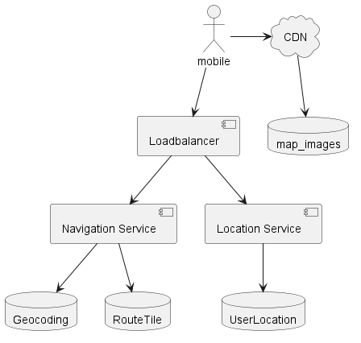

# 구글 맵
* 구글 맵은 위성 이미지, 거리 뷰, 실시간 교통 상황, 경로 계획을 제공하고 있다
* DAU 10억, 세계99% 지역의 지도를 제공하고, 매일 2500만 건의 업데이트를 반영한다

## 1단계: 문제 이해 및 설계 범위 확정
* 주요 초점은 위치 갱신, 경로 안내, ETA, 지도 표시
* 도로 데이터는 이미 존재한다
* 교통 상황을 반영하여 ETA/경로 안내가 가능해야 한다
* 다양한 이동 방법을 지원한다
* 경유지 설정 기능은 생략한다
* 사업장에 대한 사진 정보도 생략한다

### 기능 요구사항
* 사용자의 위치를 갱신할 수 있다
* 경로를 안내하고 도착 예정시간을 알 수 있다
* 지도가 표시되어야 한다
> 지도가 표시되어야 한다는 기능 요구사항은 다소 모호하다
### 비기능 요구사항 및 제약사항
* 경로 안내는 정확해야 한다
* 경로 표시는 화면에 부드럽게 표시되고 갱신되어야 한다
* 가능한 한 최소한의 데이터와 배터리를 사용해야 한다
* 일반적인 가용성 및 규모 확장성을 만족해야 한다
> 일반적인 가용성 : 99.99% ?
### 3차원 위치의 2차원 변환
* 다양한 도법이 존재한다
* 구글 맵은 웹 메르카토르 도법 사용

https://medium.com/google-design/google-maps-cb0326d165f5

### Geocoding
* 주소를 지리적 측위 시스템의 좌표로 변환하는 프로세스
* 주소 -> 위경도로 변환

https://en.wikipedia.org/wiki/Address_geocoding

### Geohashing
* 1,2장에서 많이 얘기했으므로 생략

### 지도 표시
* 맵 표시의 기본은 타일이다
* 전체를 하나의 이미지로 표현하는 대신 작은 타일로 쪼개어 표시
* 확대/축소를 지원하려면 확대 수준에 따라 다른 종류의 타일을 준비한다

### 경로 안내 알고리즘을 위한 도로 데이터 처리
* 경 로탐색 알고리즘은 대부분 Djikstra or A*의 변종이다
* 교차로를 노드로, 도로는 노드를 잇는 선으로 표현하는 그래프 자료 구조를 가정한다
* 대부분의 경로 탐색 알고리즘은 그래프 크기에 민감하므로 관리 가능 단위로 분할할 필요가 있다
* 지도 표시에서 사용되는 타일형태로 그래프를 분할해서 처리하면 유리하다
* [Djikstra](https://ko.wikipedia.org/wiki/%EB%8D%B0%EC%9D%B4%ED%81%AC%EC%8A%A4%ED%8A%B8%EB%9D%BC_%EC%95%8C%EA%B3%A0%EB%A6%AC%EC%A6%98)
* [A*](https://ko.wikipedia.org/wiki/A*_%EC%95%8C%EA%B3%A0%EB%A6%AC%EC%A6%98)

### 계층적 경로 안내 타일
* 지도의 확대 축소와 유사하게 경로 탐색에도 구체성 정도로 구분한 경로 안내 타일을 사용한다
> 네이버 지도의 경로 찾기도 유사한 형태로 동작하는듯 하다
>
> 가까운 거리는 시내버스를 안내하지만 멀어지면 ktx/고속버스나 고속도로의 안내만 나옴
>
> 예를들어 서울-부산을 탐색했을때 각 지역의 시내버스 구간을 탐색해주지는 않는다

### 개략적 규모 추정
#### 저장소 사용량
* 필요한 데이터의 종류는 아래 세 가지가 있다
    * 세계 지도
    * 메타데이터
    * 도로 정보

**세계 지도**
* 세계 지도를 21번 확대할 수 있다고 하면 최대 확대에서 4.4조개의 타일이 필요하다
* 개당 100KB라고 가정하면 440PB의 저장 공간이 필요하다
* 다만 지구의 대부분은 사람이 살지 않는 곳이므로 90%의 절감이 가능하다 가정하면 50PB 정도로 줄일 수 있다

**서버 대역폭**
* 대역폭 추정을 위해서는 어떤 유형의 요청을 처리해야 하는지 살펴봐야 한다

1. 경로 안내 요청
2. 위치 갱신 요청
* 10억 사용자가 주당 35분 사용한다면 주당 350억 분, 하루에 50억 분이다
* 매초 전송한다고 가정하면 하루 3,000억 초당 300만 qps가 발생한다
* 매초 새로운 좌표를 보낼 필요는 없을 것이므로 15 또는 30초마다 한번씩 보내어 낮출 수 있다
* 15초마다 한번 보낸다고 가정하면 qps는 20만, 최대를 5배로 가정할대 최대 qps는 100만이 된다
## 2단계: 개략적 설계안 제시 및 동의 구하기


### 위치 서비스(Location Service)
* 사용자의 위치를 기록하는 서비스
* 클라이언트는 t초마다 자신의 위치를 전송한다, 여기엔 몇가지 좋은 점이 있는데
  * 데이터 스트림을 활용하여 시스템을 개선할 수 있다
    * 예를들면 교통 상황을 모니터링하거나, 새로 만들어진 도로 폐쇄된 도로를 탐지할 수 있다
  * ETA를 더 정확하게 산출할 수 있고, 교통 상황에 따라 다른 경로를 안내할 수도 있다
    * > 이미 해당 구간을 지난 사용자의 ETA와 실제의 차이를 통해 막히는지 여부를 판단할 수도 있을듯
* 위치가 바뀔때마다 전송할 필요는 없지만 그렇다고 하더라도 10억 MAU에는 엄청난 쓰기 부하가 발생한다
  * cassandra나 kafka와 같은 시스템을 활용해야 할 가능성이 있다
  * > 적절한 지역별 분산 클러스터를 구축하는 것도 좋은 방법이 될 수 있을 듯
* 통신 프로토콜은 keep-alive 옵션을 활용한 http 요청도 좋은 선택이 될 것이다

### 경로 안내 서비스
* A->B로 가는 합리적으로 빠른 경로를 찾아주는 서비스
* 결과 확인은 시간 지연이 발생할 수 있으며 최단 경로는 아니더라도 정확해야 한다
```bash
curl -X POST -d '{
  "origin":{
    "location":{
      "latLng":{
        "latitude": 37.419734,
        "longitude": -122.0827784
      }
    }
  },
  "destination":{
    "location":{
      "latLng":{
        "latitude": 37.417670,
        "longitude": -122.079595
      }
    }
  },
  "travelMode": "DRIVE",
  "routingPreference": "TRAFFIC_AWARE",
  "departureTime": "2023-10-15T15:01:23.045123456Z",
  "computeAlternativeRoutes": false,
  "routeModifiers": {
    "avoidTolls": false,
    "avoidHighways": false,
    "avoidFerries": false
  },
  "languageCode": "en-US",
  "units": "IMPERIAL"
}' \
-H 'Content-Type: application/json' -H 'X-Goog-Api-Key: YOUR_API_KEY' \
-H 'X-Goog-FieldMask: routes.duration,routes.distanceMeters,routes.polyline.encodedPolyline' \
'https://routes.googleapis.com/directions/v2:computeRoutes'
```
```json
{
  // The routes array.
  "routes": [
    {
      object (Route)
    }
  ],
  // The place ID lookup results.
  "geocodingResults": [
    {
      object (GeocodedWaypoint)
    }
  ],
  // The fallback property.
  "fallbackInfo": {
    object (FallbackInfo)
  }
}
```

### 지도 표시
* 확대 수준별로 한벌씩 지도 타일을 저장하면 수백 PB가 필요하고 클라이언트에 이것을 두기는 어렵다
* 확대 수준에 따라 필요한 타일을 서버에서 가지고 오자
* 언제 가지고 올 것인가?
  * 사용자가 지도를 확대하며 이동시킬 때
  * 경로 안내가 진행되며 사용자의 위치를 이동 시킬 때

**선택지1**
* on demand로 생성
  * 지도 타일을 동적으로 만들어야 하기 때문에 서버에 부하가 발생한다
  * 캐시를 사용하기 어렵다

**선택지2**
* 정적 이미지로 미리 만들어두고 전달만 한다
* 지도 타일은 정적이므로 캐싱하기 용이하다(단말에서)
  * 사용자는 일반적으로 같은 길을 일상적으로 이용하게 된다

**CDN 데이터 사용량 추정**
* 30km/h로 이동중인 사용자에게 200m*200m 크기의 지도를 표시하고 있는 중이라고 가정하면
* 1km*1km를 표현하기 위해 25장이 필요하고 이미지 크기 100kb일때 2.5MB가 된다
* 30km/h일때 시간당 75MB의 데이터가 소진되며 분당 1.25MB에 해당한다
* 매일 50억분의 경로를 처리하면 50억 * 1.25MB로 6.25PB/day에 해당한다
* 이는 62,500MB/s 이며 전세계에 있는 200개의 POP가 골고루 분산할 수 있다면 317.5MB를 각 POP에서 처리해야 한다

**실제로 가져오는 동작**
* geohash를 이용해 격자를 나누었으므로 각 격자는 고유의 geohash 값을 갖게 된다
* 따라서 file의 이름이 단순히 geohash값이기만 해도 괜찮을 것이다
```bash
.../tiles/256x256/9q9hvu.png
.../tiles/256x256/9q9hvs.png
.../tiles/64x64/9q9h.png
```

## 3단계: 상세 설계
### 데이터 모델
**경로 안내 타일**
* 도로 데이터는 외부 사업자가 만들어 둔 것을 이용한다
* 이 데이터는 수 테라바이트에 달하며 끊임없이 개선/변경된다
* 그대로 사용할 수 없으므로 경로 안내 타일 처리 서비스를 만들고 주기적으로 경로 안내 타일로 변경한다
* 그래프 형태로 표현되는 것이 가장 유리하기 때문에 메모리에 인접 리스트 형태로 보관하는 것이 좋겠지만 너무 거대하다
* database record로 두는것도 방법이겠지만, 비용이 많이 들고 db의 기능이 전혀 필요없다는 것도 문제가 있다
* 그래서 s3와 같은 object stroage에 파일을 보관하고 서비스에서 캐싱하여 전달한다


**사용자 위치 데이터**
* 사용자 위치 데이터는 가치가 높은 데이터다
  * 그래서 서버에 저장하고 처리를 하려면 끔찍하다
* 도로 데이터 및 경로 안내 타일을 갱신할 수 있고
* 실시간 교통 상황 데이터베이스를 구축할 때도 사용할 수 있다
* 지도 데이터를 갱신할 수도 있다
* 위치 데이터 저장을 위해선 엄청난 양의 쓰기 연산 처리가 필요한데 이는 수평적 규모 확장이 가능한 DB가 필요하다
* 좋은 후보군으로 카산드라가 있다

**Geocoding database**
* 레디스가 적합하다
  * 읽기는 빈번한 반면 쓰기는 드물기 때문

**미리 만들어 둔 지도 이미지**
* 이미지를 매번 새로 만들지 말고 캐싱하자


### 서비스
**위치 서비스**
* 서비스의 특성
  * 많은 쓰기 연산
  * 데이터는 일관성보다 가용성이 더 중요하다
  * 이러한 요구사항에 근거하여 가장 적합한 데이터베이스는 카산드라다
* database의 키로 user_id, timestamp 조합을 사용하고 거기에 매달리는 값으로 lat/long을 저장한다
  * partition key로 user_id, clustring key로 timestamp를 활용한다
  * 위 키들은 dynamo에서 partition key / range key로 매핑된다

**사용자 위치 데이터는 어떻게 이용되는가**
* 지도의 개선, 교통 현황 파악등으로 사용될 수 있다
* 이러한 사용성을 지원하기 위해 사용자 위치를 db에 기록하면서 kafka와 같은 message queue에 로깅한다
* 개별 서비스는 카프카를 통해 전달된 사용자 위치 데이터 스트림을 각자 용도에 맞게 활용한다


### 지도 표시
**지도 타일 사전 계산**
* 확대 수준에 따라 다른 지도 이미지를 가진다

**최적화: 벡터 사용**
* WebGL 기술을 채택하면 좋은 점
  * vector tile은 이미지에 비해 월등한 압축률을 가지기 때문에 네트워크 대역폭을 아낄 수 있다
  * rasterized에 비해 이미지가 늘어지거나 픽셀이 도드라지는 문제가 없어 시각 효과 측면에서 우수하다

### 경로 안내 서비스
 

**Geocoding Service**
* 주소를 위경도로 바꿔주는 서비스
* 경로 안내 서비스에서는 주소를 위경도로 변환한뒤 이후 서비스들에서는 위경도 데이터셋만 사용한다

**Route planner service**
* 현재 교통 상황에 입각하여 이동 시간 측면에서 최적화된 경로를 제안

**최단 경로 서비스**
* 출발지 + 목적지 위/경도로 k 개의 최단 경로를 반환하는 서비스
* 도로 상황이나 교통 상황은 고려하지 않고 도로 구조에만 의존, 따라서 도로망 그래프를 캐싱하면 hit율이 좋다
* A* 를 이용하여 실행한다

**예상 도착 시간 서비스**
* 경로 계획 서비스에서 최단 경로 목록을 받고나면 ETA service를 호출하여 경로 각각에 대한 소요 시간 추정치를 구한다
* 머신 러닝을 통해 현재 및 과거 이력에 근거하여 예상 도착 시간을 계산한다

**순위 결정 서비스**
* 사용자가 정의한 필터링 조건을 적용하여 우선순위를 결정하여 최단 시간 경로 k개를 경로 안내에 반환한다

**중요 정보 갱신 서비스들**
* 카프카 위치 데이터 스트림을 구독하다가 중요 데이터를 비동기적으로 업데이트하여 최신화하는 역할
  * 실시간 교통 정보/ 경로 안내 타일
* 경로 안내 타일 처리 서비스는 도로 데이터에 새로운/폐쇄된 도로를 반영하여 경로 안내 타일을 지속적으로 갱신한다
* 실시간 교통 상황 서비스는 활성화 상태 사용자가 보내는 위치 정보로 교통 상황 정보를 추출하고 실시간 교통 상황 데이터베이스에 반영되어 ETA의 정확도를 높인다
> 한국에서는 도로의 혼잡도도 국가에서 제공하는 것으로 알고 있음

**적응형 ETA와 경로 변경**
* 현 설계안은 적응형ETA와 경로 변경을 허용하지 않는다
* 이 문제를 해결하기 위해선 2가지를 확인해야 한다
  * 현재 경로 안내를 받고 있는 사용자는 어떻게 추적하는가?
  * 수백만 경로 가운데 교통 상황 변화에 영향을 받는 경로와 사용자를 효율적으로 가려낼 방법

* 간단하지만 효율적이지 않은 방법

## 4단계: 마무리
