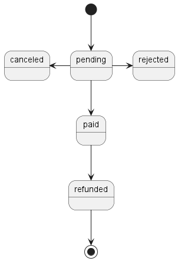
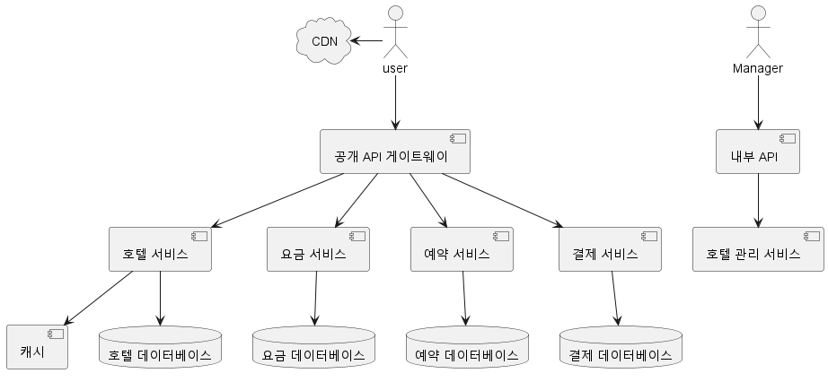

# 호텔 예약 시스템
> 에어비앤비, 항공권, 영화 티켓 예매 시스템과 같은 예약 시스템을 설계해보자

## 1단계: 문제 이해 및 설계 범위 확정
* 호텔 예약 시스템은 복잡하고 컴포넌트는 시스템을 사업에 어떻게 이용할지에 따라 달라진다.

* Q: 시스템 규모는 어느 정도입니까?
* A: 5000개 호텔 100만개 객실을 갖춘 호텔 체인이라고 가정합니다
* Q: 대금은 예약 시에 지불인가? 현장 결제인가?
* A: 예약할 때 지불한다
* Q: 휍사이트로만 가능한가?
* A: 웹 사이트나 앱에서만 가능
* Q: 취소할 수도 있는지?
* A: 물론이다
* Q: 고려할 다른 사항이 더 있는지?
* A: 10% 초과 예약이 가능해야 한다. 취소 고객을 얘상하여 실제보다 많은 객실 판매가 가능하다
* Q: 시간이 제한되어 있으므로 객실 검색은 범위에 넣지 않겠다. 아래 요구사항을 상정하고 진행하겠다
  * 호텔 정보 표시
  * 객실 정보 표시
  * 객실 얘약
  * 객실 정보를 추가/삭제/갱신하는 관리자 페이지 지원
  * 초과 예약 지원
* A: 객실 가격은 유동적이고 그날 객실의 여유가 얼마나 있는지에 따라 달라진다, 또한 매일 달라질 수 있다

### 비기능 요구사항
* 높은 수준의 동시성(concurrency) 지원: 성수기, 대규모 이벤트 기간에는 일부 인기 호텔의 예약이 몰릴 수 있다
* 적절한 지연 시간: 사용자가 예약할 때 응답이 빠를수록 좋으나 몇 초 정도는 괜찮다

### 개략적 규모 추정
* 5천개 호텔 100만 개의 객실이 있다고 가정하자
* 평균 이용률은 70%이고 평균 투숙 기간은 3일로 가정한다
* 하루에 70만개의 객실이 예약되지만 3일간 투숙하므로 233,333건의 애약이 발생한다
* 이는 약 3TPS 정도로 트래픽이 많지는 않다
* 그럼 각각의 페이지의 QPS를 계산해보자
1. 호텔/객실 상세 페이지
2. 예약 상세 정보 페이지
3. 객실 예약 페이지
* 대략 각 단계에서 10%만 진행한다고 가정하면
* 객실 상세 페이지 300TPS, 예약 상세 페이지 30TPS, 예약 페이지 3TPS가 된다

## 2단계: 개략적 설계안 제시 및 동의 구하기
### API 설계
* 호텔 API
* GET /v1/hotels/id : 호텔의 상세정보
* POST /v1/hotels : 신규 호텔 추가
* PUT /v1/hotels/id : 호텔 정보 갱신
* DELETE /v1/hotels/id : 호텔 정보 삭제

* 객실 관련 API
* GET /v1/hotels/:id/rooms/id : 객실의 상세정보
* POST /v1/hotels/:id/rooms : 객실 추가
* PUT /v1/hotels/:id/rooms/id : 객실 갱신
* DELETE /v1/hotels/:id/rooms/id : 객실 삭제

* 예약 관련 API
* GET /v1/reservations : 로그인 사용자의 예약 이력 반환
* GET /v1/reservations/id : 특정 예약의 상세 정보 반환
* POST /v1/reservations : 신규 예약
* DELETE /v1/reservations/id : 예약 취소

* 핵심 API는 신규 예약 접수라고 할 수 있다
* request body는 아래와 같다. reservationId는 이중 예약을 막고 동일한 예약을 한번만 이루어지도록 보증하는 멱등 키이다. 동시성 절에서 자세히 알아보자
```json
{
  "startDate": "2021-04-28",
  "endDate":"2021-04-30",
  "hotelId": "245",
  "roomId": "U12345623",
  "reservationId": "13422445"
}
  ```
### 데이터 모델
* 호텔 예약 시스템은 다음 질의를 지원해야 한다
  1. 호텔 상세 정보 확인
  2. 지정된 날짜 범위에 사용 가능한 객실 유형 확인
  3. 예약 정보 기록
  4. 예약 내역 또는 과거 예약 이력 정보 조회 
* 시스템 규모가 크지 않으나 대규모 이벤트가 있을때는 급증할 수 있으니 대비해야 한다
* RDB를 사용할 예정인데 이유를 알아보자
  * 데이터 쓰기 패턴은 읽기가 압도적이다
  * RDB는 ACID(원자성, 일관성, 격리성, 영속성)를 보장한다
    * 잔액이 마이너스 되거나, 이중 청구 문제, 이중 예약 문제를 방지하기 위해 필요하다
    * RDB는 이 문제를 단순하고 이해하기 쉽게 만든다
  * 데이터의 모델링이 쉬워진다
* 데이터의 스키마는 아래와 같다
  * 호텔 / 룸
  * 요금 / 예약
  * 투숙객
* reservation table은 status 필드를 가진다
  * pedning, paid, refunded, canceled, rejected를 가진다
  * 
* room_id는 에어비앤비와 같은 서비스에는 적합하나 호텔에는 적합하지 않다
  * 객실 번호는 투숙객이 체크인 하는 시점에 부여되기 때문이다
> 이런 차이를 면접 과정에서 알 수 있을까?
### 개략적 설계안

  * 사용자 : 서비스의 end user
  * 관리자 : 고객 환불, 예약 취소, 객실 정보 갱신
  * CDN : 웹사이트의 로드 성능을 개선하기 위한 캐시
  * 공개 API 게이트웨이 : 처리율 제한, 인증 등의 기능을 지원, API를 적절한 서비스로 전달한다
  * 내부 API : 승인된 호텔 직원만 사용 가능하도록 망을 분리해 외부 공격으로부터 보호한다
  * 호텔 서비스 : 호텔과 객실에 대한 상세 정보를 제공한다, 정적인 데이터로 캐싱에 유리하다
  * 요금 서비스 : 미래의 어떤 날에 어떤 요금을 받아야 하는지 데이터를 제공하는 서비스
  * 예약 서비스 : 예약 요청을 받고 객실을 예약하는 과정을 처리. 객실이 예약되거나 취소될 때 잔여 객실 정보를 갱신한다
  * 결제 서비스 : 고객의 결제를 맡아 처리하고, 절차가 성공적으로 마무리되면 예약 상태를 결제 완료로 갱신한다
  * 호텔 관리 서비스 : 관리자가 사용하는 API 서버 
---
* 실제로는 조금 더 많은 의존성이 필요하지만 생략되었다

## 3단계: 상세 설계
### 개선된 데이터 모델
* 앞에서 살펴봤듯 특정한 객실을 고르는 것이 아니라 객실 유형을 고르게 된다
* 따라서 아래와 같이 변경한다
```json
{
  "startDate": "2021-04-28",
  "endDate":"2021-04-30",
  "hotelId": "245",
  "roomType": "U12345",
  "reservationId": "13422445"
}
```
* 예약 서비스를 확장하여 room_type_inventory를 추가한다
* hotel_id, room_type_id, date, total_inventory, total_reserved를 가진다
* 저장 용량은 5000개 호텔 20개의 객실 유형, 2년이면 7300만 row가 필요하다
* 고가용성을 위해 region별 데이터베이스를 복제해두자
  * > sync는 어떻게 맞출지?
* 실제로 쿼리를 해보자
  * SELECT * FROM room_type_inventory WHERE room_type_id AND hotel_id AND date
  * total_inventory > total_reserved라면 예약이 가능할 것이다
* 단일 DB로 대응할 수 없게 호텔이 많아진다면?
  * 호텔 id를 통한 샤딩도 가능하다
  * 사용자의 과거 데이터는 아카이빙 또는 cold storage로 보낸다

### 동시성 문제
* 이중 예약은 어떻게 방지할 것인가?
1. 같은 사용자가 여러 번 누른 경우
* 두 가지 접근 방법이 있을 수 있는데
  * 클라이언트에서 요청을 한번 누르면 그 이후에는 비활성화 하는 것이다
  * 사용자가 두개의 브라우저를 띄워놨다면 막기 어렵다
  * javacript를 비활성화...?
* 멱등 API
* 
2. 하나밖에 없는 객실을 여러 사용자가 동시에 예약하려 할 경우
* 두 사용자 모두 조회시점에 99개의 방이 예약되어 1개의 방이 남았다
* 동시에 예약을 누르면 모두 성공하고 101개의 방이 예약된다
* 이 문제는 락을 잡지 않고 해결할 수 없다. 각각의 락 메커니즘을 살펴보자
  * Pessimistic lock
  * Optimistic lock
  * database constraint
* Pessimistic lock
  * Mysql의 경우 SELECT ... FOR UPDATE 문을 사용할 수 있다
  * SELECT 문의 반환에 락이 걸리기 때문에 트랜잭션 2에서는 기다려야 한다
  * 장점
    * 변경 중이거나 변경이 끝난 데이터를 갱신하는 일을 막을 수 있다
    * 구현이 쉽고 갱신 연산을 직렬화하여 충돌을 막는다, 데이터에 대한 경합이 심할 때 유용하다
  * 단점
    * deadlock 발생 가능성이 있다
      * transactiond에 두개의 리소스가 필요한 경우 각 트랜잭션이 하나씩 선점하는 경우
    * 확장성이 낮다, 트랜잭션이 오랫동안 락을 해제하지 않으면 성능에 큰 영향을 끼친다
* Optimistic lock
  * client는 자신이 읽었던 version attribute를 들고 write를 시도한다. 내가 읽었던 version과 다르다면 실패한다
  * Pessimistic lock 보다 빠르지만 100개의 client중 100번쨰 클라이언트는 100번 실패하고 나서야 성공하게 된다
  * 장점
    * 데이터베이스에 락을 걸 필요가 없다
    * 경쟁이 치열하지 않은 경우 우수한 성능을 보장한다
  * 단점
    * 경쟁이 치열한 경우 성능이 떨어진다

* database constraint
  * version attribute 대신 database의 제약을 사용한다
  * 장점
    * 구현이 쉬움
  * 단점
    * database 의존성이 생김

### 시스템 규모 확장
* 만약 booking.com이나 expedia.com 같은 여행 웹 사이트와 연동되어야 한다면?
  * QPS가 천 배 늘어날 수도 있다
  * 병목을 파악하고 데이터베이스의 규모를 늘리는 방법을 살펴보자
* 데이터베이스 샤딩
* 캐시
  * 호텔 잔여 객실은 현재와 미래만 관심이 있다
  * 캐시를 사용해 날짜가 지날때마다 TTL로 소멸시키는 전략이 유효하다
  * 예약 서비스를 이용해 캐시에 잔여 객실을 query하고 database에는 예약을 요청한다
* 캐시와 db의 일관성을 유지하기 위한 방법
  * CDC 메커니즘 사용
    * log / trigger / 타임스탬프 방식이 있는데 trigger는 db 성능에 영향을 주고 타임스탬프 방식은 공백이 발생할 수 있다
  * 보편적으로 드베지움 사용
    * log 기반의 오픈 소스 CDC 플랫폼, kafka로 streaming 가능

### 서비스 간 데이터 일관성
* 설계안에서는 MSA와 Monolith의 하이브리드 접근법을 선택했다
* MSA에서 데이터 일관성을 유지하기 위해 증가하는 복잡성과 기능, 비기능 요구사항 간의 trade off를 고려하자
