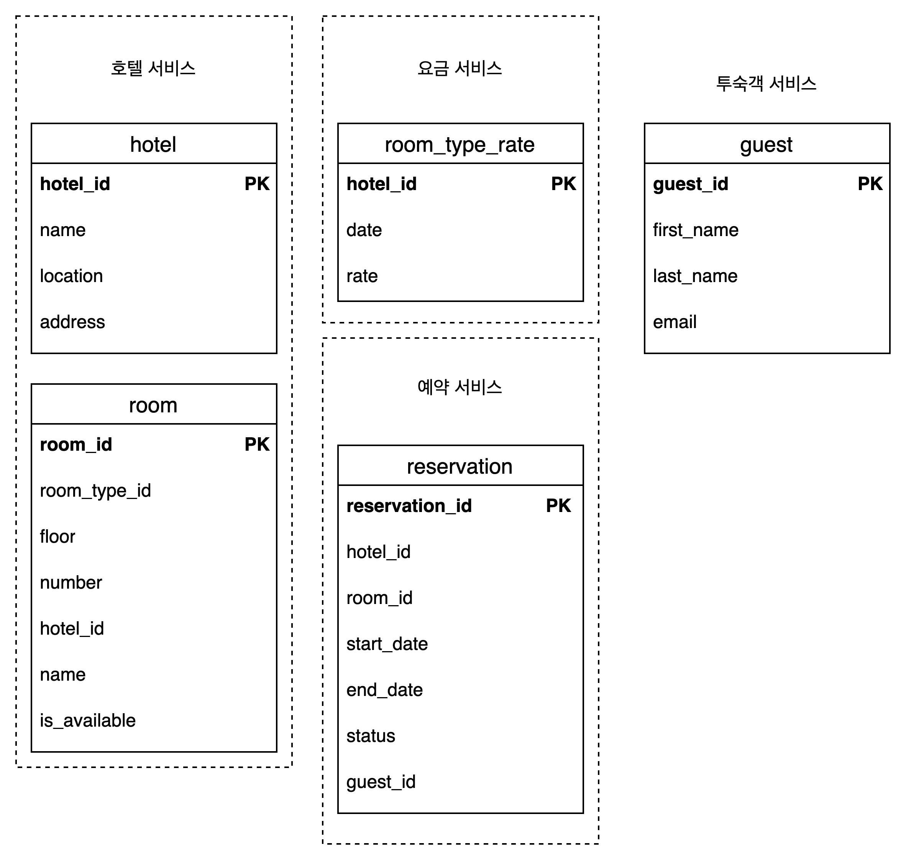
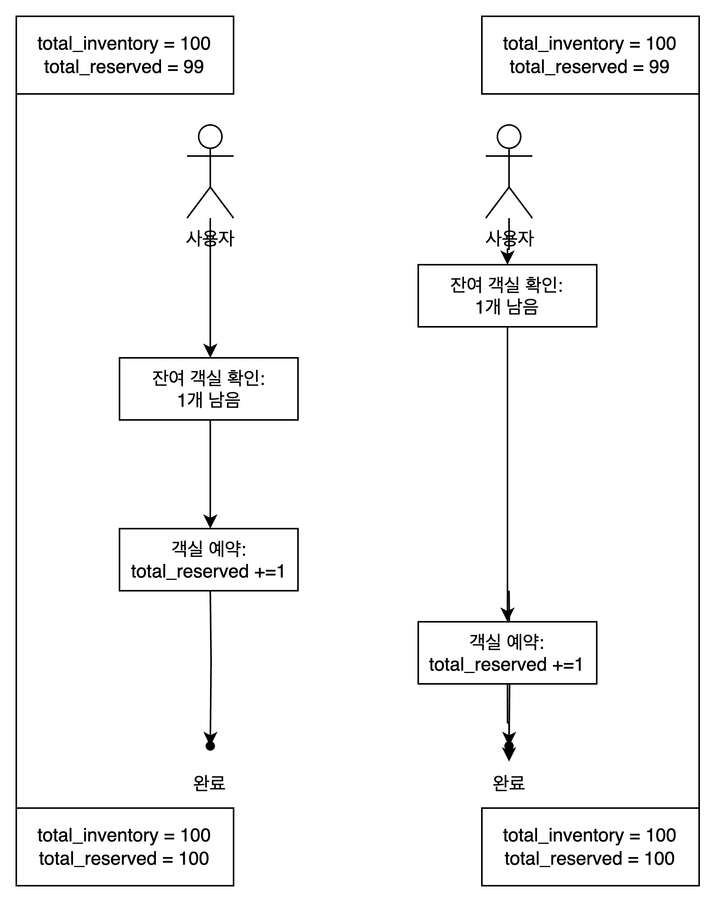
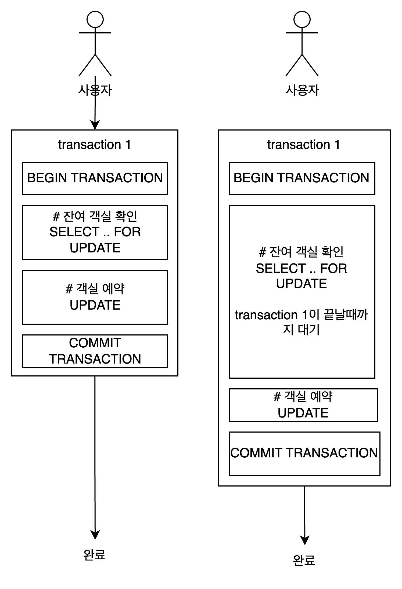

# chapter 7 호텔 예약 시스템

## 1단계: 문제 이해 및 설계 범위 확정

- 시스템 규모: 5000개 호텔, 100만개 객실을 갖춘 호텔 체인
- 대금 지불 방식: 예약할 때 전부 지불
- 예약 방법: 호텔 웹사이트나 앱에서만 가능
- 필수 구현 사항
    - 호텔 정보 페이지 표시
    - 객실 정보 페이지 표시
    - 객실 예약 지원
    - 호텔이나 객실 정보를 추가/삭제/갱신하는 관리자 페이지 지원
    - 초과 예약 지원
- 추가 고려사항
    - 10% 초과 예약이 가능해야 함
    - 객실 가격은 유동적.

### 비기능 요구사항

- 높은 수준의 동시성(concurrency) 지원
    - 성수기, 대규모 이벤트 기간에는 일부 호텔의 특정 객실을 예약하려는 고객이 몰릴 수 있음
- 적절한 지연시간
    - 예약 요청 처리에 몇 초 정도 걸리는 것은 괜찮음

### 개략적 규모 추정

- 일일 예상 예약 건수

    ```json
    1백만(객실수) * 0.7 (평균적으로 사용중인 객실의 비율) / 3 (평균 투숙 기간) ~= 240,000
    ```

- 초당 예약 건수: 초당 예약 transaction 수 TPS 는 3 정도로 높지 않음

    ```json
    240000 (일일 예약 건수) / 하루에 10^5초 = ~3 
    ```

- QPS query per second
    - 대략 10%의 사용자가 다음 단계로 진행하고 90%의 사용자는 최종 단계에 도달하기 전에 흐름을 이탈한다고 가정
        - 단계별 QPS
            - 호텔/객실 상세 페이지 - 조회 , 300 QPS
            - 예약 상세 정보 페이지 - 조회 , 30 QPS
            - 객실 예약 페이지 - 트랜젝션 발생, 3 QPS

## 2단계: 개략적 설계안 제시 및 동의 구하기

### API 설계

RESTful

- 호텔 관련 API


    | API | 설명 |
    | --- | --- |
    | GET /v1/hotels/id | 호텔의 상세 정보 반환 |
    | POST /v1/hotels | 신규 호텔 추가, admin |
    | PUT /v1/hotels/id | 호텔 정보 갱신, admin |
    | DELETE /v1/hotels/id | 호텔 정보 삭제, admin |
- 객실 관련 API


    | API | 설명 |
    | --- | --- |
    | GET /v1/hotels/:id/rooms/id | 객실의 상세 정보 반환 |
    | POST /v1/hotels/:id/rooms | 신규 객실 추가, admin |
    | PUT /v1/hotels/:id/rooms/id | 객실 정보 갱신, admin |
    | DELETE /v1/hotels/:id/rooms/id | 객실 정보 삭제, admin |
- 예약 관련 API


    | API | 설명 |
    | --- | --- |
    | GET /v1/reservations | 로그인 사용자의 예약 이력 반환 |
    | GET /v1/reservations/id | 특정 예약의 상세 정보 반환 |
    | POST /v1/reservations/id | 신규 예약 |
    | DELETE /v1/reservations/id | 예약 취소 |
    - 신규 예약의 body는
        
        ```json
        {
        	"startDate": "2022-02-22",
        	"endDate": "2022-02-28",
        	"hotelId": "245",
        	"roomId": "U12341234",
        	"reservationID": "12315123"
        }
        ```
        
        - reservationID
            - 이중 예약을 방지하는 멱등성 idempotent key

### 데이터 모델

- 데이터 접근 패턴
    - 질의1: 호텔 상세 정보 확인
    - 질의2: 지정된 날짜 범위에 사용 가능한 객실 유형 확인
    - 질의3: 예약 정보 기록
    - 질의4: 예약 내역 또는 과거 예약 이력 정보 조회
- 관계형 데이터베이스의 선택
    - 읽기 빈도가 쓰기 연산에 비해 높은 작업 흐름을 잘 지원
        - NoSQL 데이터베이스는 대체로 쓰기 연산에 최적화
    - ACID (원자성, 일관성, 격리성, 영속성)을 보장
        - 관계형 데이터베이스는 일반적으로 ACID를 지원
    - 데이터를 쉽게 모델링할 수 있다
- 스키마의 설계

  

    - reservation status
        - pending, paid, refunded, canceled, rejected
        - 7.3 상태 천이도 state machine 으로 표현
    - 스키마에 room_id가 있으므로 에어비앤비 같은 회사에는 적합하지만 호텔은 객실 유형을 예약 후 투숙객이 체크인 하는 시점에 객실 번호가 부여되므로 적합하지 않다.

### 개략적인 설계안

- 호텔 예약 시스템은 MSA 를 사용한다
- 그림 7.4
- 구성요소
    - 사용자: 호텔을 예약하는 당사자
    - 관리자(호텔 직원): 고객 환불, 객실정보 갱신 등을 할 있는 admin
    - CDN contents delivery network
        - es code bundle, html, 이미지, 동영상 등 정적인 컨텐츠를 캐시하여 웹사이트 로드 성능을 개선하는데 이용
    - 공개 API gateway
        - rate limit, 인증 등의 기능을 지원하는 fully managed service
    - 내부 API
        - 승인된 호텔 직원만 사용할 수 있는 api
        - VPN virtual private network 기술을 이용해 외부 공격으로부터 보호
    - 호텔 서비스: 호텔과 객실에 대한 상세 정보. 정적이라 쉽게 캐쉬 가능
    - 요금 서비스: 미래의 어떤 날 어느 요금을 받아야 하는지 데이터를 제공하는 서비스
    - 예약 서비스
        - 예약 요청을 받고 객실을 예약하는 과정을 처리
        - 객실 예약, 취소 시 잔여 객실 정보를 갱신
    - 결제 서비스
        - 고객의 결제
        - 절차가 마무리되면 예약 상태를 결제 완료로 갱신, 실패하면 승인 실패로 갱신
    - 호텔 관리 서비스
        - 승인된 직원만 이용 가능
        - 임박한 예약기록 확인, 고객 객실 예약, 예약 취소 등
    - 예약 서비스는 총 객실 요금 계산을 위해 요금 서비스에 질의할 필요가 있음 (그림 7.5)

## 3단계: 상세 설계

### 개선된 데이터 모델

- 특정 객실 유형을 예약하도록 수정

  

    - 이때 요청 body 는 아래와 같이 변경된다

        ```json
        {
        	"startDate": "2022-02-22",
        	"endDate": "2022-02-28",
        	"hotelId": "245",
        	"**roomTypeId**": "U12341234",
        	"reservationID": "12315123"
        }
        ```

    - 스키마 특징
        - room: 객실에 관한 정보
        - room_type_rate: 특정 객실 유형의 특정 일자 요금 정보
        - total_inventory
            - 총 객실 수에서 일시적으로 제외한 객실수를 뺀 값
            - 일부 객실은 유지보수를 위해 예약 가능 목록에서 빼둘 수 있어야 함
        - total_reserved: 지정된 hotel_id, room_type, date 에 예약된 모든 객실의 수
        - 날짜당 하나의 레코드를 사용하면 날짜 범위에서 예약을 쉽게 관리하고 질의할 수 있다.
- 저장 용량 추정
    - 5000개의 호텔, 20개의 객실 유형이 있다고 가정하면 레코드의 수는

        ```json
        5000 * 20 * 2년 이내 모든 미래 날짜에 대한 가용 객실 * 365 일 = 7300만 
        ```

        - 데이터베이스 하나면 가능하지만 SPOF 문제와 고 가용성을 달성하기 위해 여러지역 또는 가용성 구역에 데이터베이스를 복제해두는 것이 좋다.
- 특정 유형의 객실을 예약할 수 있는지 확인하려면
    1. 입력: startDate, endDate, roomTypeId, hotelId, numberOfRoomstoReserve

        ```sql
        SELECT date, total_inventory_total_reserved
        FROM room_type_inventory
        WHERE room_type_id = ${roomTypeId} and hotel_id = ${hotelId}
        and date between ${startDate} and ${endDate}
        ```

    2. 출력:  해당 유형의 객실에 여유 있고 예약이 가능한 상태이면 true, 아니면 false
        1. 반환된 레코드마다 아래의 조건을 확인

            ```java
            if((total_reserved + ${numberOfRoomsToReserve}) <= total_inventory
            
            // but 10% 더 예약 가능해야 하므로
            if((total_reserved + ${numberOfRoomsToReserve}) <= 100% * total_inventory
            ```


### 동시성 문제

이중 예약을 방지

- 시나리오 1 같은 사용자가 예약버튼을 여러번 누르는 경우 그림 7.7
    - 클라이언트 측 구현으로 버튼 비활성화 등의 방법으로 방지할 수 있으나 우회할 수 있다.
    - 멱등 idempotent API
        - 예약 API에 멱등 키를 추가
        - 몇 번을 호출해도 같은 결과를 내는 API를 멱등 API라고 한다.
        - 그림 7.8은 reservation_id를 멱등키로 사용

            ```mermaid
            sequenceDiagram
                actor 사용자
                사용자->>+예약서비스: 1. 예약주문 생성
                예약서비스-->>-사용자: 2. 예약주문서 표시(reservation_id)
                사용자->>+예약서비스: 3a. 예약 제출 (reservation_id)
                사용자->>+예약서비스: 3b. 예약 제출 (reservation_id) x
            ```

            - 유일성 조건이 위배되어 새로운 레코드가 생성되지 않는다.
- 시나리오 2 여러 사용자가 잔여객실 하나밖에 없는 유형의 객실을 동시에 예약할 때

  

    - transaction isolation level ≠ serializable 가정
    - 데이터베이스 ACID 중 I (Isolation) 은 각 트렌젝션은 다른 트렌젝션과는 무관하게 작업을 완료해야한다는 뜻
        - 트랜젝션 1이 commit 되기 전에는 transaction2 에는 보이지 않는다.
        - 둘다 성공적으로 100으로 commit 된다
        - 이를 해결하기 위해 lock을 활용해야 한다

### Lock

- 비관적 락
    - 비관적 동시성 제어 방안
    - 사용자가 레코드를 갱신하려는 순간 즉시 락을 걸어 동시 없데이트를 방지
    - 장점
        - application이 변경중이거나 변경이 끝난 데이터를  갱신하는 것을 막음
        - 구현이 쉽고 모든 갱신 연산을 직렬화 하여 충돌을 막음
    - 단점
        - dead lock이 발생할 수 있다.
        - 확장성이 낮다. 트랜잭션의 수명이 길거나 많은 엔티티가 관련된 경우 성능에 영향

      

- 낙관적 락
    - 테이블에 version 이라는 새 열을 추가
    - 사용자가 갱신하기 전에데이터베이스 레코드를 수정하기 전에 application은 해당 레코드의 버전 번호를 읽는다
    - 사용자가 record를 갱신할 때 어플리케이션은 버전 번호에 1을 더한 다음 데이터베이스에 다시 기록한다
    - 이 때 유효성 검사를 한다. 즉 다음 버전 번호는 현재 버전 번호보다 1만큼 큰 값이어야 한다. 이게 실패하면 transaction은 abort되고 다시 2단게부터 시작
    - 데이터베이스에 락을 걸지 않기 때문에 일반적으로 비관적 락보다 빠르다
    - 동시성 수준이 높으면 성능이 급격히 나빠진다.
    - 장점
        - 어플리케이션이 유효하지 않은 데이터를 편집하는 일을 막는다
        - 데이터베이스 자원에 락을 걸 필요가 없다.
        - 데이터 경쟁이 치열하지 않은 상황에 적합
    - 단점
        - 데이터 경쟁이 치열한 경우 성능이 나빠진다
- 데이터베이스 제약 조건
    - room_type_inventory에 제약조건을 추가

        ```sql
        CONSTRAINT `check_room_count` CHECK ((`total_inventory - total_reserved ` >= 0 ))
        ```

    - 장점: 구현이 쉽다
    - 단점
        - 낙관적 락과 마찬가지로 데이터 경쟁이 심하면 실패하는 연산이 엄청 늘 수 있다.
        - 버전 통제가 어렵다

### 시스템 규모 확장

- 예약 시스템이 booking.com, expedia.com과 같은 유명 웹사이트와 연동되어야 한다면?
- 데이터베이스 샤딩
    - 데이터베이스의 규모를 늘리는 방법
    - 대부분의 질의는 hotel_id를 필터링 조건으로 활용하므로 hotel_id를 샤딩 조건으로 쓰면 좋다.
    - 그림 7.15
- 캐시
    - 현재 또는 미래의 데이터만 중요한 시스템이므로 낡은 데이터는 TTL time to live을 설정하여 자동으로 소멸되도록 설정
    - 레디스는 이 상황에 적합 LRU (least recently used)와 TTL 정책 캐시 교체 정책을 이용해 메모리를 최적으로 활용할 수 있기 떄문
    - 데이터베이스와 캐시의 불일치 문제를 해결하기 위해 예약 / 취소 시 캐시를 갱신한다
        - CDC라는 change data capture 메커니즘을 이용하면 손쉽게 구현할 수 있다.
            - 드베지움
- 서비스간 데이터 일관성
    - monolith 아키텍쳐의 경우 데이터 일관성을 보장하기 위해 RDBMS를 공유하는 것이 보통
        - RDBMS의 ACID 속성을 이용해 많은 동시성 문제를 효과적으로 처리 가능
    - MSA는 RDBMS를 공유하지 않음
        - 하나의 트랜젝션으로 데이터의 일관성을 보증하는 기법을 사용할 수 없다.
    - 2단게 커밋 2 phase commit
        - 여러 노드에 걸친 원자적 트랜잭션 실행을 보증하는 database protocol
        - 비중단 실행이 가능한 Protocol이 아니므로 한 노드에 장애가 발생하면 복구될 때까지 진행이 중단됨.
        - 성능이 별로임
        - 하나의 트랜잭션을 통해 acid 속성을 만족시키는 개념
    - 사가 Saga
        - 여러 노드에 국지적으로 발생하는 transaction을 하나로 묶은 것임
        - 각 transaction은 완료되면 다음 transaction을 trigger할 메세지를 만들어 보낸다.
        - 어느 한 transaction이라도 실패하면 전부를 되돌리는 순차적으로 실행한다.
        - 각 단계가 하나의 transaction이라 결과적 일관성에 의존하는 것으로 봐야 한다.