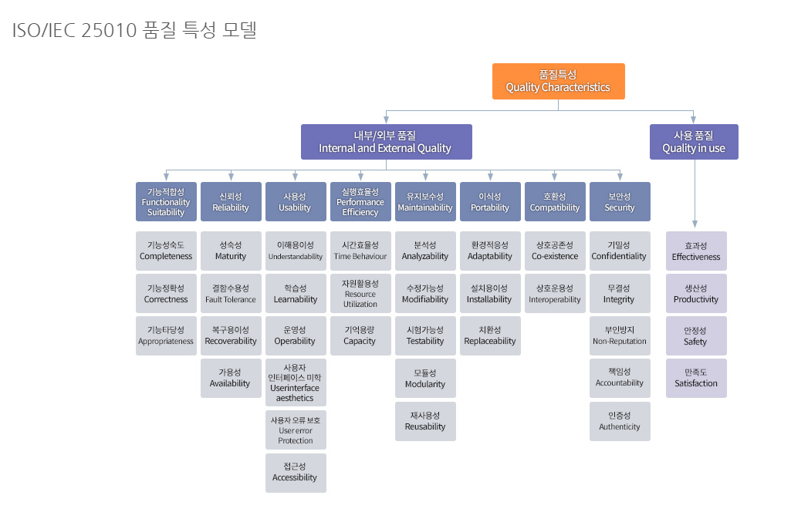
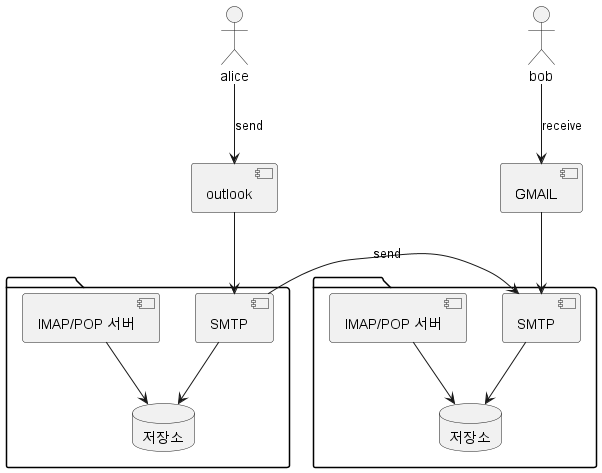
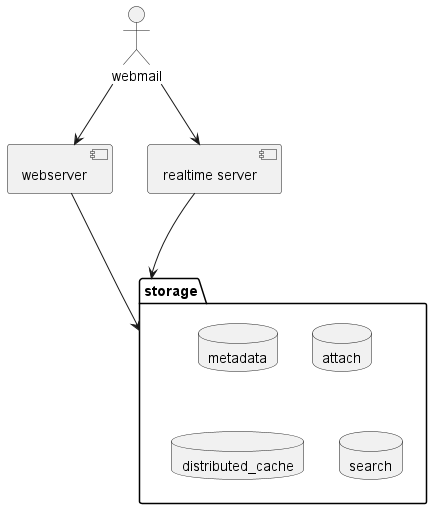
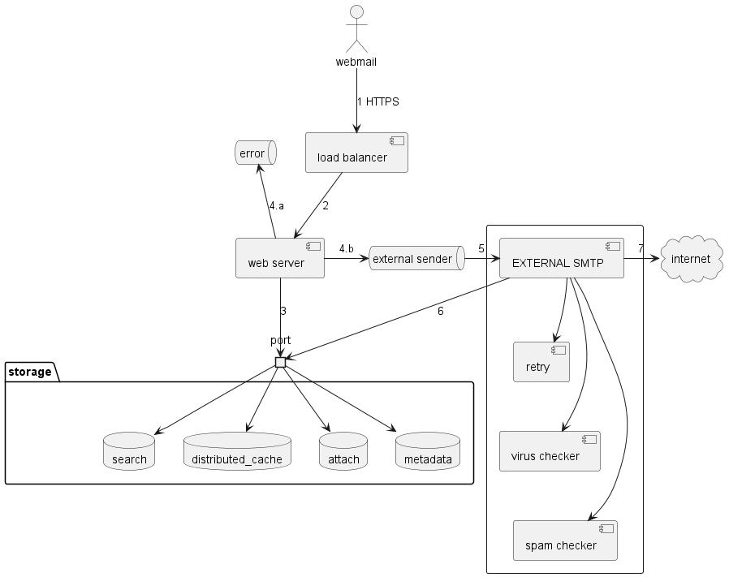

# 분산 이메일 서비스
> Gmail, Outlook, Yahoo! Mail과 같은 대규모 이메일 서비스를 설계해보자

## 1단계: 문제 이해 및 설계 범위 확정
> Q: 얼마나 많은 사람들이 사용하나요?
> 
> A: 10억 명 입니다.

> Q: 다음 기능이 필요할 것 같다.
> * 인증
> * 이메일 수/발신
> * 모든 이메일 가져오기
> * 읽음 여부에 따른 이메일 필터링
> * 제목, 발신인, 메일내용에 따른 검색
> * 스팸 및 바이러스 방지
>
> A: 인증을 제외한 이메일의 순수한 기능만을 설계하자

> Q: 메일 서버에 사용할 수 있는 프로토콜의 목록은?
>
> A: SMTP, POP, IMAP 과 서비스 제공자 전용 프로토콜을 사용할 수 있어야 한다. 지금은 HTTP로 가정하자

> Q: 첨부 파일도 지원 가능한가?
>
> A: 그렇다.

### 비기능 요구사항
* 안정성(Integrity) : 이메일 데이터는 유실되어선 안된다.
* 가용성(Availability, Fault tolerance)
* 확장성(Extensibility)
* 수정 용이성(Modifiability)


> ISO/IEC 25010에서 정의한 품질속성

### 개략적인 규모 추정
* 10억명의 사용자가 하루 평균 10개의 메일을 전송한다고 가정한다면, 100,000 QPS이다.
* 하루 평균 40건의 이메일을 수신하고, 평균 50KB로 가정한다.
* Database에 저장한다고 가정하면 1년간 유지하기 위해 10억 * 40 * 365 * 50KB = 730 PB
* 첨부파일은 20%의 이메일에 포함되며 평균 500KB로 가정한다.
* 이에 따라 연간 이메일 저장 용량은 1460PB

* 데이터의 크기는 일반적인 database에 저장하기 어렵다는 사실이 드러난다.

## 2단계: 개략적 설계안 제시 및 동의 구하기
### 이메일 101
* 이메일은 대부분 POP, IMAP, SMTP 같은 프로토콜을 사용해 왔다.
* SMTP : Simple Mail transfer Protocol, 전송용 표준 프로토콜
* POP : 수신용 표준 Protocol, 이메일을 일부만 읽을 수 없으며 읽으면 서버에서 삭제된다.
* IMAP : 수신용 표준 Protocol, 헤더만 다운로드 받고 서버에서 삭제되지 않는다. 여러개의 디바이스에서 이메일을 읽을 수 있다.

### DNS
* 수신자 도메인의 메일 교환기 레코드(Mail Exchange) 검색에 이용된다.


* preference에 있는 값이 낮은것이 우선순위가 높은 서버로 연결 실패시 다음 우선순위로 넘어간다.

### 첨부 파일
* 첨부 파일은 이메일 메시지와 함께 전송되며 일반적으로 BASE64 인코딩을 사용한다.
* 개인 계정이냐 기업 계정이냐에 따라 일반적으로 용량 제한이 있다. 
* Mime type은 인터넷을 통해 첨부 파일을 전송할 수 있도록 하는 표준 규격이다.

### 전통적 메일 서버


#### 저장소
* 이메일을 파일 시스템의 디렉터리에 저장한다.
* 사용자가 많지 않을 때는 잘 동작하지만 수십억 개의 메일을 검색하고 백업하는 목적에는 곤란하다.
* DISK I/O가 병목이 되기도하고, DISK 손상이나 서버 장애의 문제도 있다.
* 따라서 분산 저장소 계층이 필요하다.

### 분산 메일 서버
#### 이메일 API
* 모바일을 위한 SMTP/POP/IMAP API
* 서버 간의 SMTP 통신
* 웹 기반을 위한 HTTP RESTful API

1. POST /v1/message 엔드포인트
* To, Tc, Bcc 헤더에 명시된 수신자에게 메시지를 전송한다.

2. GET /v1/folders 엔드포인트
* 주어진 이메일 계정에 존재하는 모든 폴더를 반환한다.

3. GET /v1/folders/{:folder_id}/messages 엔드포인트
* 메시지 객체 목록을 반환한다. 실제로는 pagination을 지원해야 하므로 훨씬 복잡하다.

4. GET /v1/messages/{:message_id} 엔드포인트
* 주어진 메시지의 모든 정보를 반환한다.

#### 분산 메일 서버 아키텍처

* realtime server : 새로운 이메일 내역을 클라이언트에 실시간으로 전달, stateful 서버. long polling이나 websocket을 사용한다.
websocket이 더 유려하지만 브라우저 호환성 문제가 있을 수 있다.
* metadata : 이메일 제목, 본문, 발신인, 수신인 목록 등의 메타데이터를 저장하는 데이터베이스
* attach : Blob storage를 사용하여 첨부파일을 저장한다.
  * Cassandra가 Blob을 지원하지만 실제로는 1MB 이상의 데이터가 저장되기 어렵다.
* distributed cache : 최근 이메일은 자주 읽을 가능성이 높으므로 클라이언트가 메모리에 캐싱하도록 하면 좋다. 서버에서는 redis와 같은 형태의 분산 cache를 활용하자.
* search : 검색을 지원하기 위한 inverted index 자료구조를 저장해둔다.

#### 이메일 전송 절차

1. 사용자의 메일을 load balancer로 전송한다.
2. load balancer는 web server로 전달한다.
3. web server에서는 이메일을 검증하거나, domain을 검사한다, 보내는 쪽은 여기서 종료된다.
4. message queue에서 검증에 실패하면 error queue로 보낸다. 그렇지 않은 경우 attach를 분리하여 전달한다.
5. External SMTP는 바이러스와 스팸 검사를 한다.
6. 저장한다.
7. 수신자의 메일 서버로 메일을 전달한다.
* external sender는 핵심 컴포넌트로 lag에 대한 모니터링이 필요하다.
  * 수신 측 메일 서버 장애시 replay 또는 exponential backoff 통해 해결
  * 송신 측 부족 시 확장

#### 이메일 수신 절차

1. 이메일이 SMTP 로드밸런서에 도착
2. SMTP 서버에서 Policy 확인하고 불필요한 처리량을 줄인다
3. 이메일의 첨부파일 처리
4. 수신 큐로 이메일 이동
5. 메일을 처리하고
6. 저장한다
7. 수신자가 온라인인 경우 즉시 전달한다
8. 웹소켓 통해서 실시간으로 받는다
9. 오프라인인 경우 저장하고 온라인이 되었을때 HTTPS 통해서 가져간다
10. 웹 서버에서 새로운 이메일을 가지고 와 반환한다.

## 3단계: 상세 설계
### 메타데이터 데이터베이스
#### 이메일 메타데이터의 특성
* 이메일의 헤더는 일반적으로 작고, 빈번하게 사용됨
* 이메일 본문의 크기는 매우 다양하지만 사용 빈도가 낮다. 사용자는 일반적으로 한 번만 읽는다.
* 이메일 가져오기, 읽은 메일로 표시, 검색 등의 이메일 관련 작업은 사용자 별로 격리 수행되어야 한다.
* 데이터의 신선도는 데이터 사용 패턴에 영향을 미친다. 질의의 82%는 최근 16일의 메일이다.
* 데이터의 높은 안정성이 보장되어야 한다. 유실은 용납되지 않는다.

#### 올바른 데이터베이스의 선정
* RDB : 이메일 검색에 효율적, 헤더와 본문에 대한 인덱스를 통해 간단한 질의를 빠르게 처리할 수 있다. 그러나 관계형 데이터베이스는 데이터 크기가
커질수록 성능이 급격하게 떨어지므로 바람직하지 않다.
* Distributed Object Storage : S3와 같은 저장소에 보관하는 방법, 백업에는 좋지만 이메일의 읽음 표시, 키워드 검색, 이메일 타래 등의 기능에는 좋지 않다.
* NoSQL : gmail은 google bigtable을 사용한다. 그러나 오픈되어 있지 않고 cassandra가 대안이 될 수 있겠지만 확인된 업체는 없다.
* 이렇기 때문에 대형 이메일 서비스 업체는 대체로 독자적 데이터베이스를 만들어 사용한다. 만든다면 아래 조건을 충족해야 한다.
  * 단일 컬럼의 크기는 n MB가 될 수 있다.
  * 강력한 데이터 일관성 보장
  * DISK I/O가 최소화 되어야 한다.
  * 가용성이 높고 장애를 감내할 수 있어야 한다.
  * 증분 백업이 쉬워야 한다.

#### 데이터 모델
* user_id를 파티션 키로 하여 특정한 사용자를 같은 샤드에 보관하는 방법이 있다.
  * 이 문제는 메시지를 여러 사용자와 공유할 수 없다는 단점이 있으나 요구사항과는 관계가 없다.
* partition key : 데이터를 여러 노드에 분산한다. 균등하게 분산되도록 하는 파티션 키를 골라야 한다.
* cluster key : 같은 파티션에 속한 데이터를 정렬한다.
* 지원해야 하는 query는 아래와 같다.
  * 주어진 사용자의 모든 폴더를 구한다.
  * 특정 폴더 내의 모든 이메일을 표시한다.
  * 메일을 새로 만들거나 삭제, 가져온다.
  * 이미 읽은 메일 전부 또는 읽지 않은 메일 전부를 가져온다.

**query1 : 특정 사용자의 모든 폴더**
* partition key로 묶여 있으므로 가지고 오면 된다.

**query2 : 특정 폴더에 속한 모든 이메일 표시**
* TIMEUUID를 cluster key로 사용하여 이메일을 시간순으로 정렬하고 가지고 온다.

**query3 : 이메일 생성/삭제/수신**
* 상세 정보를 가져오기 위해서는 
```sql
SELECT * FROM emails_by_user WHERE email_id = 123;
```
* 으로 가지고 온 후 attachment table에서 email_id로 첨부 파일도 읽어오는 형태로 작성하면 된다.

**query4 : 읽은, 또는 읽지 않은 모든 메일**
```sql
SELECT * 
FROM emails_by_folder 
WHERE user_id = <user_id> and folder_id = <folder_id> and is_read = true(false)
ORDER BY email_id
```
* 그러나 여기서 제안하는 DATABASE는 NOSQL이므로 위와 같은 query를 지원하지 않는다.
  * > dynamoDB나 cassandra에서도 index를 만들어 처리 가능하긴 함.
* NOSQL 테이블을 비정규화 하여 읽은 table과 읽지 않은 table로 쪼갠다
  * > 이 경우 sync에 대한 문제가 발생할 수 있지 않을까? unread에서 read로 옮길때  unread에서만 지워져버리면..?   

**이메일 thread**
* 이메일 헤더에 이메일에 대한 reference key를 포함하여 만들고 reference key 통하여 thread를 생성한다.

#### 일관성 문제
* 높은 가용성을 위해 replication에 의존하는 분산 데이터 베이스는 일관성과 가용성 사이에서 타협할 수 밖에 없다.
* 이메일은 여기서 일관성에 더 중점을 두어야 하며 primary가 유실되었다면 복원될때까지 동기화/갱신 작업을 차단해야 한다.

### 이메일 전송 가능성
* 새로운 이메일 서버의 대부분의 메일은 스팸처리된다. reputation을 쌓을 수 없었기 때문이다.
* 이를위해 아래와 같은 요소들을 고려해야 한다.
* 전용 IP : 대부분의 이메일 서비스 사업자는 이력이 없는 IP에서 온 메일을 무시한다.
* 범주화 : 범주가 다른 이메일은 다른 IP 주소를 통해 보내야 한다. 마케팅과 중요한 메일을 같은 서버에서 발송하면 안된다.
* 발신인 평판 : 새로운 이메일 서버의 IP주소는 사용 빈도를 서서히 올려야 한다. 그래야 reputation이 쌓이고 대형 사업자가 스팸으로 분류할 가능성이 낮아진다.
* 스팸 발송자의 신속한 차단 : 스팸을 뿌리는 사용자는 서버 reputation을 낮추기 때문에 신속히 차단해야 한다.
* 피드백 처리 : ISP 에서의 피드백을 쉽게 받아 처리할 수 있는 경로를 만들어야 한다.
  * hard bound : 이메일 주소가 틀려 ISP가 거부한 경우
  * soft bounce : ISP의 이메일 처리 자원 부족 등으로 일시적인 전달 불가
  * complaint : 수신인이 '스팸으로 신고' 버튼을 누른 경우
* 이메일 인증 : 여러 인증 과정을 통과하는 메일을 만들어야 한다.(SPF, DKIM, DMARC 등)

### 검색
* 기본적인 이메일 검색은 제목이나 본문에 특정 키워드가 포함되었는지 찾는다.
* 고급 기능으로 발신인, 제목, 읽지 않음과 같은 속성에 따른 필터링이 추가된다.
* 특징으로는 검색의 결과가 정확해야 하고, 색인이 실시간으로 이루어져야 한다. 
* 방안 1 : elastic search
* 방안 2 : 맞춤형 검색 솔루션

|비교항목|elastic search|맞춤형 검색 엔진|
|:--:|:--:|:--|
|규모 확장성| 어느 정도까지 확장 가능| 이메일 사용 패턴에 따라 시스템을 최적화 할 수 있다|
|시스템 복잡도|두 가지 상이한 시스템을 유지해야 함|하나의 시스템|
|데이터 일관성|데이터의 사본이 검색 시스템과 메타 저장소에 존재|메타데이터 저장소에 하나의 사본만 유지|
|데이터 손실 가능성|없다|없다|
|개발 비용|통합이 쉽지만 elastic search 유지가 어려움|솔루션 구현을 위한 엔지니어링 노력이 필요|

### 규모 확장성 및 가용성
* region 별 사본을 저장하여 가용성을 확장한다.


## 4단계: 마무리
* 추가로 논의할 만한 주제는 다음과 같다.
* 결함 내성(fault tolerance) : 시스템의 각 부분의 장애에 어떻게 대처할 것인가
* 규정 준수(compliance) : 이메일 서비스는 전 세계 다양한 시스템과 나라의 준수해야할 것들이 있다.
* 보안(security) : 이메일에서 보안은 매우 중요하다. 피싱 방지나, 안전 브라우징, 보안 결함에 대한 경고, 계정 보안, 기밀 모드, 이메일 암호화..
* 최적화(optimization) : 같은 이메일이 여러 수신자에게 전달될 때 중복 데이터를 저장하지 않도록..