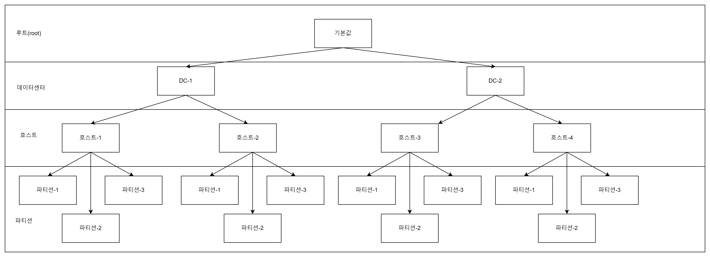
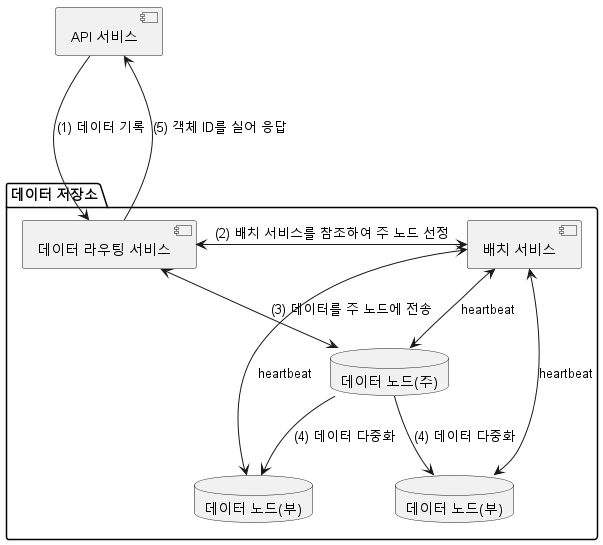

# S3와 유사한 객체 저장소
* S3는 AWS가 제공하는 서비스로 RESTful API 기반 인터페이스로 이용 가능한 객체 저장소다.

## 저장소 시스템 101(모든 분야의 초보자 대상으로 준비된 과정을 지칭하는 용어다.)
### block 저장소
* 1960년대 등장한 저장소로 HDD가 있다.
* raw block을 volume 형태로 제공하는 유연하고 융통성이 높은 저장소

### File 저장소
* block 저장소 위에 구현된다.
* File과 Directory를 다루는데 필요한 추상화를 제공한다.
* SMB/CIFS/NFS와 같은 파일 수준 프로토콜을 사용하면 하나의 저장소를 여러 서버에 동시에 붙일 수도 있다.

### 객체 저장소
* 데이터의 영속성을 높이고 비용을 낮추기 위해 의도적으로 성능을 희생한다.
* 실시간 갱신이 필요없는 cold data 보관에 초점을 맞추며 아카이브나 백업에 주로 사용된다.
* 모든 데이터를 수평적 구조 내에 객체로 보관한다.

### 저장소 비교
|제목|block|file|blob|
|:--:|:--:|:--:|:--|
|저장된 내용의 변경 가능성|Y|Y|N|
|비용|H|M|L|
|성능|H|M|L|
|데이터 일관성|H|H|H|
|데이터 접근|SAS/iSCSI/FC|표준 파일 접근, CIFS/SMB,NFS|RESTfulAPI|
|규모 확장성|M|H|EXTRA HIGH|
|적합한 응용|가상 머신, database|범용적 file 시스템|이진 데이터, 구조화되지않은 데이터|

### 용어 정리
* bucket : 객체를 보관하는 논리적 컨테이너
* object : bucket에 저장된 개별 데이터
* versioning : 한 object의 여러 버전을 같은 버킷 안에 둘 수 있도록 하는 기능
* URI : 저장소는 URI를 통해 접근한다
* SLA : Service Level Agreement
  * S3 기준 99.999999999% 내구성 제공
  * ZONE 전체 소실에도 데이터 복원 가능
  * 연간 99.9% 가용성 제공(8.77시간)

## 1단계: 문제 이해 및 설계 범위 확정
* 버킷 생성, 객체 업/다운로드, 객체 버전, 객체 목록 출력 기능이 필요하다
* 데이터의 크기는 GB이상의 데이터부터 KB 크기의 데이터까지 효율적으로 저장 할 수 있어야 한다
* 매년 100PB가 추가된다고 가정한다
* 99.9999%의 내구성과 99.99%의 가용성을 보장한다

### 대략적인 규모 추정
* 객체 저장소는 디스크 용량과 IOPS가 병목이 될 가능성이 높다
* 디스크 용량
  * 객체 가운데 20%는 크기가 1MB 미만의 작은 객체다
  * 60%는 1~64MB의 크기다
  * 20%는 64MB 이상의 대형으로 가정한다
* IOPS : SATA 인터페이스 7200rpm 하드 디스크 하나가 100~150IOPS를 지원한다고 가정한다

* 100PB는 대략 6억 8천만개의 객체를 저장할 수 있다(각 크기의 중간값으로 산정)
* 메타 데이터 크기를 1KB로 가정하면 0.68TB의 저장소가 필요하다

## 2단계: 개략적 설계안 제시 및 동의 구하기
* 객체 저장소의 특징
  * 객체 불변성 : 객체는 변경이 불가능하다. 새 버전 객체로 바꿀 수 있어도 값을 점진적으로 변경할 수는 없다
  * 키-값 저장소 : 객체 저장소를 사용하는 경우 URI를 사용해 데이터를 가져올 수 있다. URI는 키고 데이터는 값에 해당하므로 키-값 저장소라고 볼 수 있다
  * 저장은 1회, 읽기는 여러 번 : 데이터 접근 패턴에서 보면 쓰기 1회 읽기는 여러 번 발생한다.
  * 소형 및 대형 객체 동시 지원 : 크기에 관계없이 저장할 수 있다.
* 객체 저장소 철학은 UNIX 파일 시스템과 유사하다. UNIX에서는 File과 메타 데이터는 별도로 관리된다. 메타 데이터는 inode라고 불리는 자료 구조에 보관되고 데이터는 디스크의 다른 위치에 저장된다.
  * 따라서 file을 이동해도 inode가 변하지 않는다.
  * 따라서 file을 삭제해도 inode가 삭제될뿐 데이터가 삭제되지 않는다.(별도의 lifecycle을 가짐)

### 개략적 설계안

#### upload
1. 클라이언트는 객체저장을 위한 버킷 생성을 보낸다
2. MetadataDB에 버킷 정보가 저장된다.
3. 클라이언트는 객체를 업로드 하기 위한 요청을 보낸다
4. API 서비스는 body를 저장소로 보내고 메타 데이터는 Metadata db로 보낸다
> Consistency 관점에서는 유리하지만 큰 객체의 경우에는 분할해서 보내는 것이 유리하기 때문에 잘 사용하지 않는 방식
> 
> 또한 실패에 대한 비용이 크기도 하다.
> 
> Upload를 위한 metadata를 먼저 전송하고, 승인되면 업로드할 주소를 반환한다. 
> 
> 업로드할 주소가 반환되면 분할하여 저장소에 업로드하고 모든 데이터가 올라온것이 확인되면 active 한다.

#### download
* 버킷은 디렉터리 계층 구조가 없지만 객체 이름을 이용하여 지원한다.
  * path/for/object.txt와 같은 형태
* download는 객체의 URI에 get 요청을 보내고 body로 전송 받는다.

## 3단계: 상세 설계
### 데이터 저장소
* ...
### 데이터 저장소의 개략적 설계

### 데이터 라우팅 서비스
* 데이터 노드에 접근하기 위한 RESTful 또는 gRPC 서비스를 제공한다.
* 확장이 용이한 stateless 서비스다.
* 배치 서비스를 통해 데이터를 저장할 최적의 노드 판단
* 데이터 노드에서 데이터를 읽어 API 서비스에 반환
* 데이터 노드에 데이터 기록

### 배치 서비스
* 어느 데이터 노드에 데이터를 저장할지 결정하는 역할
* 내부적으로 virtual cluster map을 통해 cluster의 물리적 형상 정보를 보관한다.
* 물리적 형상 분리를 통해 높은 데이터 내구성을 지원한다.

### 데이터 노드
* 객체 데이터가 실제 보관되는 곳
* 여러 노드에 복제하여 안정성과 내구성을 보증 : 다중화 그룹이라고 부른다(replication group)
* 각 데이터 노드는 주기적으로 heartbeat을 보내는 서비스 데몬이 돌고 있다
  * 데이터 노드에 부착된 disk의 수
  * 각 드라이브에 저장된 데이터의 양
* 최초 heartbeat을 받으면 배치서비스에서 데이터 노드에 ID를 부여한다

### 데이터 저장 흐름

1. API 서비스는 객체 데이터를 데이터 저장소로 포워딩하고
2. 데이터 라우팅 서비스는 객체에 UUID를 할당한 후 배치 서비스에 어디로 저장할지 질의한다. 배치 서비스는 virtual cluster map을 확인하고 반환한다.
3. 데이터 라우팅 서비스는 저장할 데이터를 UUID와 함께 주 데이터 노드에 전송한다
4. 주 데이터 노드는 자기 노드에 저장하면서 두개의  부 데이터 노드에 복제한다, 복제에 성공하고 나면 데이터 라우팅 서비스에 응답을 보낸다
5. 객체의 UUID를 서비스에 반환한다.

* 2단계에서 저장할 노드를 어떻게 찾을까?
  * 계산 결과는 deterministric 이어야 하고, 다중화 그룹이 추가되거나 삭제되는 경우에도 유지되어야 한다.
  * 이런 경우 보통 안정 해시를 사용한다.
* 4단계에서 응답을 반환하기 전에 모든 데이터를 다중화에 성공해야 하기 때문에 높은 consistency가 보장되지만 지연시간의 문제가 있다.

### 데이터는 어떻게 저장되는가
* 가장 단순한 방법은 각 객체를 개별 파일로 저정하는 것이다.
  * 두 가지 문제가 발생하는데
  * 낭비되는 데이터 block이 많아진다
  * inode의 용량 한계를 초과할 수 있다(inode는 가장 많이 사용하는 EXT4 기준 1TB당 10억개 즉 1KB 미만 object인 경우 모두 할당할 수는 없음)
* 뭉쳐서 저장하는 방법이 있다
  * 주의할 점은 병렬로 처리할 경우 파일의 일관성이 깨질 수 있다
  * 그렇다면 대기해야 하는 IO WAIT은 가장 느린 연산중 하나로 시스템의 성능을 크게 떨어뜨린다.
    * 코어별로 전담 읽기-쓰기 파일을 두어 해결하자
    * ex : 코어 1 : 파일 1~100을 읽고 쓴다, 코어2 : 파일 101~200을 읽고 쓴다

### 객체 소재 확인
* UUID로 어떻게 객체의 위치를 찾을까?

* UUID와 파일 이름, 파일의 위치와 크기를 저장하고 sequential IO를 이용해 start offeset -> object_size 까지 읽어서 가지고 온다.
* 읽기가 더 많이 발생하는 형태이므로 관계형 데이터베이스에 저장하는 것이 더 유리하다.
* 너무 많은 데이터를 저장해야 하는 문제가 있지만
  * SQLite 같은 형태의 RDB를 노드마다 설치하여 해결할 수 있다.

### 개선된 데이터 저장 흐름
1. 새로운 데이터 저장 요청 발생
2. 데이터 노드 서비스는 객체를 파일의 끝 부분에 추가한다
3. 객체에 대한 레코드를 database에 저장한다
4. 데이터 노드 서비스는 API 서비스에 해당 객체의 UUID를 반환한다

### 데이터 내구성
* 99.9999%의 내구성을 제공하기 위해서는 무엇이 필요할까?

#### 하드웨어 장애와 장애 도메인
* 하드 디스크 장애는 피할 수 없다
* 따라서 여러 대의 디스크에 복제하여 내구성을 높여야 한다
* 일반 회전식 디스크의 연간 장애율이 0.81%라고 할때 3중 복제하면 0.999999의 내구성을 가질 수 있다
* 데이터센터의 Availability zone 은 다른 데이터 센터와 물리적 인프라를 공유하지 않으므로 여러 AZ에 복제하면 장애 여파를 줄일 수 있다

#### 소거 코드
* 데이터를 복구하기 위한 패리티를 만들어 중복성을 확보하는 방법
* 다중화로 인해 여러 노드에서 데이터를 분할해서 가지고 와야 하는 구조적 단점이 있다.
* latency는 증가하고, 내구성이 향상되며 저장소 비용이 줄어든다
  * 저장 비용이 큰 객체 저장소 특성상 고려할 가치가 있다
  * 3중 복제와 비교할때 오버헤드는 50% : 200%로 큰 차이가 있다.
* > cold storage에 사용하고 있지 않을까?

#### 정확성 검증
* 체크섬을 이용해 파일이 정확한지 확인할 수 있다

### 메타데이터 데이터 모델
#### 스키마
1. 객체 이름으로 객체 ID 찾기
2. 객체 이름으로 객체 삽입 또는 삭제
3. 같은 접두어를 갖는 버킷 내의 모든 객체 목록 확인

#### bucket 테이블의 규모 확장
* bucket은 규모가 그리 크지 않으므로(백만 고객 당 10개 버킷 10kb라면 10GB로 충분하다) replication 통한 읽기 부하만 분산해도 된다

#### object 테이블의 규모 확장
* bucket 샤딩 : bucket에 수십억개의 객체가 있는 핫스팟 샤드를 지원하지 못함
* object_id 샤딩 : 1,2를 효율적으로 지원할 수 없음
* bucket + object_id 샤딩
  * 3을 지원하기 애매하다

#### 그럼 어떻게?
* 단일 데이터베이스는 간단하지만 규모가 커지면 감당할 수 없는 문제가 있다
* 분산 데이터베이스는 성능은 떨어지지만 지원 가능하다. 하지만 pagination 문제가 있다
  * 1,2,3에서 각각 3,4,5개의 아이템을 반환했을때 다음을 위한 cursor를 3개 가지고 있어야 한다.
  * 1000개의 shard라면 1000개의 cursor를 보관해야 한다.
* 객체 목록 조회용 데이터베이스 비정규화
  * consistency 가 깨질 수 있는 우려가 있으나 구현을 단순하게 만들 수 있다
* > 그래서 어떻게 할 수 있는건지?

#### 객체 버전
* 하나의 버킷 안에 한 객체의 여러 버전을 둘 수 있도록 하는 기능
* rollback이나 delete cancel 가능

|bucket_name|object_name| object_version | object_id |
|:--:|:--:|:--------------:|:----------|
|a|b|     11234c     | d1        |
|a|b|     11235c     | d2        |
|a|b|     11236c     | d3        |
|a|b|     11237c     | d4        |
* 빠른 조회를 위해 object_version을 TIMEUUID로 만들어서 정렬한다
* 삭제는 delete mark(dirty check)을 한다.
* 이때 TIMEUUID가 업데이트 되기 때문에 객체의 최신 상태는 삭제 상태가 된다

#### 큰 파일의 업로드 성능 최적화
* 파일이 너무 큰 경우 Multipart 업로드를 수행한다.

* 모든 조각이 업로드 되고나면 파일을 조립하고 조각을 제거해야 한다.

#### Garbage collection
* 객체의 지연 삭제 처리
* 업로드가 중단된 데이터
* checksum 검사에 실패한 데이터
* 삭제는 주 저장소 뿐 아니라 부 저장소에서도 삭제해야 한다. 소거 코드를 사용하는 경우 12개의 노드에서 삭제 처리가 필요하다

### 4단계: 마무리
* 잘했다!