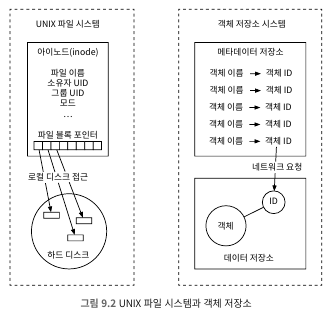
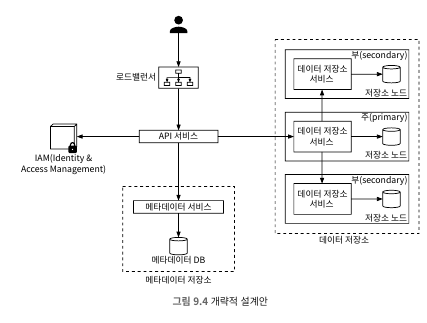
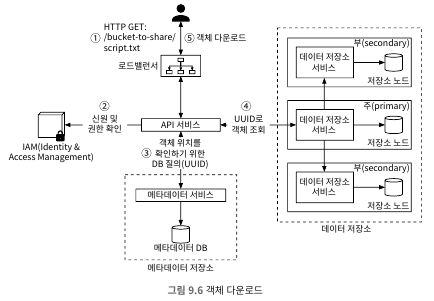
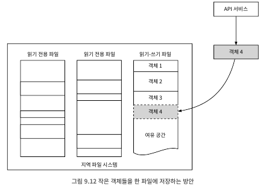
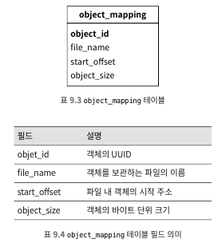
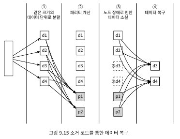
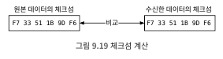
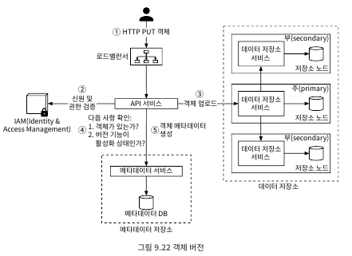
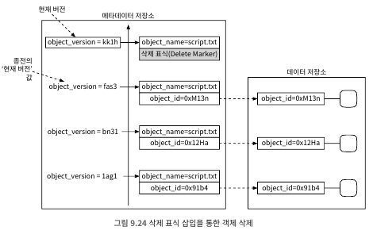
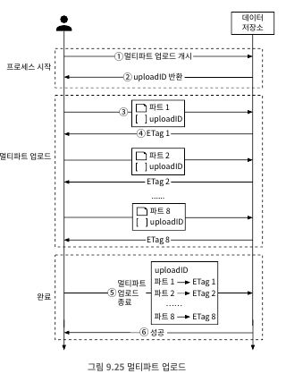

# 9. S3와 유사한 객체 저장소
- 아마존 S3(Simple Storage Service)와 유사한 객체 저장소 서비스 설계
- S3는 AWS가 제공하는 서비스로 RESTful API 기반 인터페이스로 이용 가능한 객체 저장소

##### 저장소 시스템 101
- 블록(block) 저장소
  - HDD 처럼 서버에 물리적으로 연결되는 형태의 드라이브가 가장 흔한 형태
  - 원시 블록(raw block)을 서버에 볼륨(volume)형태로 제공함
  - 가장 유연하고 융통성이 높은 저장소
  - 업계 표준 연결 프로토콜인 FC(Fibre Channel)이나 iSCSI 연결
- 파일 저장소
  - 블록 저장소 위에 구현되며, 파일과 디렉터리를 손쉽게 다루는데 필요한 추상화를 제공
  - 데이터는 계층적으로 구성되는 디렉터리 안에 보관
  - 가장 널리 사용되는 범용 저장소 솔루션
  - SMB/CIFS나 NFS와 같은 파일 수준 네트워크 프로토콜 사용하여 하나의 저장소를 여러 서버에 동시에 붙일 수 있음
  - 서버가 블록을 직접 제어하기에 볼륨 포맷등에 까다로운 작업 불필요
- 객체 저장소
  - 새로운 형태의 저장소
  - 데이터 영속성을 높이고 낮은 비용을 지원하기 위해 성능을 희생
  - 실시간으로 갱신할 필요가 없는 차가운(cold) 데이터 보관에 초점을 맞추며 데이터 아카이브나 백업에 주로 사용
  - RESTful API를 통해 데이터 접근

##### 용어 정리
- 버킷(bucket)
  - 객체를 보관하는 논리적 컨테이너
  - 버켓 이름은 전역적으로 유일해야 함
- 객체(object)
  - 객체는 버킷에 저장하는 개별 데이터를 말함
  - 데이터(페이로드)와 메타데이터를 갖음
  - 메타데이터는 개체를 기술하는 이름-값 쌍의 집함
- 버전(versioning)
  - 한 객체의 여러 버전을 같은 버킷 안에 둘 수 있도록 하는 기능
  - 실수로 지웠거나 덮어 쓴 객체를 복구 가능
- URI(Uniform Resource Identifier)
  - 객체 저장소는 버킷과 객체에 접근할 수 있도록 하는 RESTful API 제공
- SLA(Service-Level Agreement)
  - 서비스 수준 협약은 서비스 제공자와 클라이언트 사이에 맺어지는 계약
  - 아마존 S3 Standard-IA 저장소 클래스는 다음 SLA를 만족
    - 여러 가용성 구역에 걸쳐 99.99999999%의 객체 내구성을 제공하도록 설계
    - 하나의 가용성 구역 전체가 소실되어도 데이터 복원 가능
    - 연간 99.9%의 가용성 제공
## 9.1 문제 이해 및 설계 범위 확정
##### 비기능 요구사항
- 100PB 데이터
- 식스 나인(six nines, 99.9999%) 수준의 데이터 내구성
- 포 나인(six nines, 99.99%) 수준의 서비스 가용성
- 저장소 효율성: 높은 수준의 안전성과 성능은 보장하되 저장소 비용은 최대한 낮춤

##### 대략적 규모 추정
- 객체 저장소는 디스크 용량이나 초당 디스크 IO(IOPS)가 병목이 될 가능성이 높음
  - 디스크 용량: 객체 크기가 다음 분포를 따른다고 가정
    - 객체 가운데 20%는 그 크기가 1MB 미만의 작은 객체
    - 60% 정도의 객체는 1MB~64MB 정도 크기의 중간 크기 객체
    - 나머지 20% 정도는 64MB 이상의 대형 객체
  - IOPS: SATA 인터페이스를 탑재하고 7200RPM을 지원하는 하드 디스크 하나가 초당 100~150회 임의 데이터 탐색 지원(100~150 IOPS)
- 계산을 쉽게 하기 위해 객체 유형별 중앙값 활용(소형 0.5MB, 중형 32MB, 대형 200MB)
- 40%의 저장공간 사용률을 유지하는 경우 저장소에 수용 가능한 객체의 수는 다음과 같음
  - 100PB=100 X 1000 X 1000X 1000MB = 10<sup>11</sup>MB
  - 10<sup>11</sup> x 0.4 /(0.2 x 0.5 + 0.6 x 32 + 0.2 200) = 6억 8천만 개 객체
  - 모든 객체의 메타데이터 크기가 대략 1KB 정도라고 가정하면 모든 메타데이터 정보 크기는 0.68TB

## 9.2 개략적 설계안 제시 및 동의 구하기
##### 객체 불변성
- 객체 저장소와 다른 두가지 유형의 저장소 차이점: 보관되는 객체들은 변경이 불가능
- 삭제한 다음 새 버전 객체로 완전히 대체할 수 있어도 그 값을 변경할 수 없음

##### 키-값 저장소
- 해당 객체의 URI를 사용하여 데이터를 가져올 수 있음
- URI는 키이며, 데이터는 값에 해당 함
````
요청: 
GET /bucket1/object1.txt HTTP/1.1

응답:
HTTP/1.1 200 OK
Content-Length: 4567

[해당 객체의 데이터 4567 바이트]
````
##### 저장은 1회, 읽기는 여러 번
- 데이터 접근 패턴 측면에서 쓰기는 1회, 읽기는 여러번 발생
##### 소형 및 대형 객체 동시 지원
- 다양한 크기의 객체를 문제없이 저장 가능

##### 객체 저장소와 UNIX 파일 시스템의 설계 철학<br>
<br>
- UNIX는 로컬에 파일 저장할 때, 파일의 이름과 데이터를 같은 곳에 저장되지 않음
  - 아이노드(inode)라고 불리는 자료 구조에 보관, 데이터는 디스크의 다른 위치에 저장
  - 파일을 읽을때 아이노드에 있는 파일 블록 포인트를 통해 데이터를 읽음
- 객체 저장소도 아이 노드에 대응되는 '메타데이터 저장소' 가 존재
- 메타데이터와 실제 데이터를 분리하면? 실제 데이터와는 독립적으로 메타데이터를 유연하게 변경 가능(구현 최적화)

##### 개략적 설계안
- 시스템 개략적인 설계안<br>
  <br>
  - 로드밸런서: RESTful API에 대한 요청을 API 서버들에 분산하는 역할 담당
  - API 서비스: IAM 서비스, 메타데이터 서비스, 저장 서비스에 대한 호출 조율 담당, 무상태 및 수평적 확장 가능
  - IAM 서비스: 인증, 권한 부여, 접근 제어등을 중앙에서 맡아 처리
  - 데이터 자장소: 실제 데이터를 보관하고 필요할 때마다 읽어가는 저장소, 데이터 관련 연상은 객체ID(UUID)를 통함
  - 메타데이터 저장소: 객체 메타데이터를 보관
- 메타데이터 저장소와 데이터 저장소는 논리적일 구분일 뿐, 구현 방법은 여러 가지 있을 수 있음
- 객체 업로드<br>
  <br>
  - ① 클라이언트 bucket-to-share 버킷 생성을 위해 HTTP PUT 요청을 보냄
  - ② API 서비스는 IAM를 호출하여 write 권한 체크
  - ③ API 서비스는 버킷 정보를 등록하기 위해 메타 데이터 저장소 호출
  - ④ 버킷이 만들어지면 클라이언트는 script.txt 객체를 생성하기 위해 HTTP PUT 요청
  - ⑤ API 서비스는 신원 및 write 권한 체크
  - ⑥ 확인 결과 문제 없으면 HTTP PUT 요청에 담긴 객체 데이터를 저장소로 보냄, 객체 저장 후 반환 값으로 UUID 반환
  - ⑦ API 서비스는 메타데이터 저장소 호풀하여 새로운 항목 등록

  | object_name | object_id                            | bucket_id                             |
  |-------------|--------------------------------------|---------------------------------------|
  | script.txt  | 239D5866-0052-00F6-014E-C914E61ED42B | 82AA1B2E-F599-4590-B5E4-1F51AAE-5F7E4 |

````
요청: 
PUT /bucket-to-share/script.txt HTTP/1.1
Host: foo.s3example.org
Date: Sun, 12 Sept 2021 17:51:00 GMT
Authorization: [권한 문자열]
Content-Type: text/plain
Content-Length: 4567 
x-amz-meta-author: Alex
[객체 데이터 4567 바이트]
````
- 객체 다운로드<br>
  - 버켓은 디렉터리 같은 구조를 지원하지 않음, 버켓이름과 객체이름을 연결하면 논리적 계층 가능
  - 아래 처럼 요청 가능
````
요청: 
GET /bucket-to-share/script.txt HTTP/1.1
Host: foo.s3example.org
Date: Sun, 12 Sept 2021 18:30:01 GMT
Authorization: [권한 문자열]
````
- 객체 다운로드 프로세스<br>
  <br>
  - ① 클라이언트로 'GET /bucket-to-share/script.txt' 요청을 로드밸런서로 보냄, 로드밸런서는 API 서버로 전달
  - ② API 서비스는 IAM에게 Read권한 체크
  - ③ 권한 확인 후 API 서비스는 해당 객체의 UUID를 메타데이터 저장소에서 가져옴
  - ④ API 서비스는 해당 UUID를 사용해 데이터 저장소에서 객체 데이터를 가져옴
  - ⑤ API 서비스는 HTTP GET 요청에 대한 응답으로 해당 객체 데이터를 반환

## 9.3 상세 설계##### 데이터 저장소
- API 서비스 사용자의 요청을 받으면 해당 요청 처리를 위해 다른 서비스들 호출(객체 저장, 업로드 등)
- 개략적 설계<br>
<br>
  - 데이터 라우팅 서비스
    - 데이터 노드 클러스터에 접근하기 위한 RESTFful 또는 gRPC 서비스 제공
    - 더 많은 서버를 쉽게 규모 확장 가능한 무상태 서비스
      - 배치 서비스를 호출하여 데이터를 저장할 최적의 데이터 노드 판단
      - 데이터 노드에서 데이터를 읽어 API 서비스에 반환
      - 데이터 노드에 데이터 기록
  - 배치 서비스
    - 어느 데이터 노드에 데이터를 저장할지 결정하는 역할
    - 내부적으로 가상 클러스터 지도를 유지하고, 클러스터의 물리적 형상 정보 보관
    - 지도에 보관된 데이터 노드의 위치 정보를 이용하여 데이터 사본이 다른 물리적 위치에 놓이도록 함 -> 높은 데이터 내구성 보장
    - 모든 데이터 노드와 박동 메시지를 통한 상태 모니터링
    - 해당 서비스는 매우 중요하므로 합의 프로토콜을 사용하여 구축할 것을 권장
  - 데이터 노드
    - 실제 객체가 데이터가 보관되는 곳, 여러 노드에 데이터를 복제함으로써 안정성과 내구성 보장
    - 배치 서비스에 주기적으로 박동 메시지를 보내는 서비스 데몬이 돔
      - 해당 데이터 노드에 부착된 디스크 드라이브(HDD/SSD)의 수
      - 각 드라이브에 저장된 데이터의 양
    - 배치 서비스가 처음 데이터 노드에 박동 메시지를 받으면 해당 노드 ID 반환 및 아래 정보 반환
      - 해당 데이터 노드에 부여한 고유 식별자
      - 가상 클러스터 지도
      - 데이터 사본을 보관할 위치

- 데이터 저장 흐름<br>
  <br>
  - ① API 서비스는 객체 데이터를 데이터 저장소로 포워딩
  - ② 데이터 라우팅 서비스는 해당 객체의 UUID를 할당하고 배치 서비스에 해당 객체를 보관할 데이터 노드를 질의,<br>
    배치 서비스는 가상 클러스터 지도를 확인하여 데이터를 보관할 주 데이터 노드를 반환
  - ③ 데이터 라우딩 서비스는 저장할 데이터를 UUID와 함께 주 데이터 노드에 직접 전송
  - ④ 주 데이터 노드는 데이터 저장 및 두 개의 부 데이터 노드에 다중화, 부 데이터 노드까지 완료하면 라우팅 서비스에게 응답 전송
  - ⑤ 객체의 UUID를 API 서비스에 반환
  - 2단계: 배치서비스 UUID입력을 주고 질의하면 해당 객체에 대한 다중화 그룹 반환
  - 4단계: 응답을 반환하기 전 모든 부 노드에 다중화 -> 강력한 일관성 보장된다는 뜻, 데이터 일관성과 지연간 타협 관계 존재<br>
    <br>
    - 1 선택지: 세 노드에 전부 보관하면 성공적으로 간주 -> 일관성 최상, 응답 속도 최하
    - 2 선택지: 주 노드 & 2개의 부 노드 중 하나 성공하면 성공 간주 -> 일관성 중간, 응답 속도 중간
    - 3 선택지: 주 노드만 성공하면 성공적으로 저장 -> 일관성 최하, 응답 속도 최상
    - 2와 3은 결과적 일관성의 한 형태
- 데이터는 어떻게 저장되는가
  - 객체를 개별 파일로 저장하는 것 -> 작은 파일이 많이 지면 성능이 떨어짐
    - 낭비되는 데이터 블록(block) 수가 늘어남
    - 아이노드 용량 한계를 초과하는 문제 발생
  - WAL(Write-Ahead Log) 방식을 통해 파일 저장<br>
    <br>
    - 읽기-쓰기 파일에 대한 쓰기 연산은 순차적으로 이루어져야 함
- 객체 소재 확인 
  - UUID를 통해 객체 위치를 찾을 수 있는 필요 정보
    - 객체가 보관된 데이터 파일
    - 데이터 파일 내 객체 오프셋
    - 객체 크기
  - 다음과 같은 스키마<br>
    <br>
    - 키-값 저장소 또는 RDB 선택지 -> 읽기 연산 성능이 높은 RDB 선택
  - 데이터 노드마다 RDB 설치하는 방안 선택 -> SQLite 활용
- 개선된 데이터 저장 흐름<br>
  <br>
  - ① AI 서비스는 새로운 객체 저장 요청을 데이터 노드 서비스에 전송
  - ② 데이터 노드 서비스는 객체를 읽기-쓰기 파일 /data/c의 마지막 부분에 추가
  - ③ 해당 객체 정보를 object_mapping 테이블에 추가
  - ④ 데이터 노드 서비스는 API 서비스에 해당 객체 UUID 반환
- 데이터 내구성
  - 하드웨어 장애와 장애 도메인
    - 데이터를 데이터 센터의 가용성 구역에 맞춰 분산 저장
  - 소거 코드
    - 데이터를 작은 단위로 분할 하여 다른 서버에 배치
    - 일부 손실 되었을 때, 복구 하기 위핸 패리티라는 정보를 만들어 중복성 확보
    - 소거 방식을 통해 분실된 정보 복구<br>
      <br>
  - 데이터 다중화와 소거 코드의 장단점<br>
    <br>
- 정확성 검증
  - 데이터 훼손 문제는 디스크에 국한되지 않음 -> 메모리로 인해 발생도 가능
  - 메모리 데이터 훼손에 대해 프로세스 경계에 체크섬(checksum)을 통한 데이터 검증 가능<br>
    <br>
  - 다음 절차를 통해 확인 가능
    - 새로 계산한 체크섬이 원본 체크섬과 다르면 데이터 망가짐
    - 같은 경우 아주 높은 확률로 데이터 온전하다고 봄 -> 완전하진 않음<br>
      <br>
  - 소거법과 같이 활용 가능<br>
    <br>
##### 메타데이터 데이터 모델
- 스키마
  - 3가지 질의를 지원할 수 있어야 함
    - 객체 이름으로 객체 ID 찾기
    - 객체 이름에 기반하여 객체 삽입 또는 삭제
    - 같은 접두어를 갖는 버킷 내의 모든 객체 목록 확인
  - 이 조건을 만족하는 데이터베이스 스키마<br>
    <br>
- bucket 테이블의 규모 확장
  - 보통 한사용자가 만들 수 있는 버킷의 수는 제한적
    - 고객이 100만명이고, 고객마다 10개의 버킷을 갖고 있으며 한 레코드의 크기는 10KB라고 가정 -> 10GB(백만 x 10 x 10KB)의 저장공간 필요
  - 전체 테이블은 최신 데이터베이스 서버 한 대에 충분히 저장 가능할수도 있지만 모든 읽기 요청을 처리하기에는 CPU 용량이나 네트워크 대역폭 부족 -> 사본을 통해 해결
- object 테이블의 규모 확장
  - 객체 메타데이터를 보관 -> 데이터베이스 한대에 보관 불가능 -> 샤딩을 통해 테이블 규모 확장
  - 테이블 샤딩하는 한 가지 방법은 bucket_id를 기준으로 배치 -> 핫스팟 샤드 지원이 안되어 좋은 방안이 아님
  - object_id를 기준으로 샤딩 -> 부하를 균등하게 분산하지만 질의 1과 2를 효율적으로 지원 못함
  - 본 설계안에서는 bucket_name과 object_name을 결합하여 샤딩 활용 -> 연산이 객체 URI를 기준 -> 세 번째 질의는 다소 애매
##### 버킷 내의 객체 목록 확인
- 객체를 파일 시스템처럼 계층적 구조로 보관히자 않음 -> s3://<버킷 이름>/<객체 이름>의 수평적 접근
  - s3://my-bucket/abc/d/e/f/file.txt -> my-bucket은 버킷 이름, abc/d/e/f/file.txt는 객체 이름
- 사용자가 버킷 내 객체를 잘 정리할 수 있도록 하기 위해 S3s는 '접두어'라는 개념을 지원 -> 잘 활용하면 디렉터리와 비슷하게 데이터 정리 가능
- 어떤 접두어에 대응되는 객체 목록을 얻으려하면 오직 해당 접두어로 시작하는 이름의 객체만 반환
  - 'aws s3 ls s3://mybucket/abc/'로 하면 출력되지 않음 -> 'aws s3 ls s3://mybucket/abc/ --recursive'
- 단일 데이터베이스 서버
  - 특정 사용자가 가진 모든 버킷을 출력하려면 다음 질의 실행
  ````
  SELECT * FROM bucket WEHRE owner_id={id}  
  ````
  - 같은 접두어를 갖는, 버킷 내 모든 객체를 출력하려면 다음과 같은 질의 실행
  ````
  SELECT * FROM object WEHRE bucket_id="123" AND object_name LIKE 'abc/%'  
  ````
  - 위와 같은 방법으로 세번째 용례(같은 접두어를 갖는 버킷 내의 모든 객체 목록) 구현 가능
- 분산 데이터베이스
  - 메타데이터 테이블을 샤딩하면 어떤 샤드에 데이터가 있는지 모르므로 목록 출력 기능 구현 어려움
  - 해결안으로 검색 질의를 모든 샤드에 돌린 다음 결과 취합
    - 메타데이터 서비스는 모든 샤드에 다음 질의를 돌림
     ````
      SELECT * FROM object WEHRE bucket_id="123" AND object_name LIKE 'abc/%'  
     ````
    - 메타데이터 서비스는 각 샤드가 반환한 객체들을 취합하여 그 결과를 반환
  - 해당 방법에 페이지 나눔(patination)기능을 구현하기 복잡함
    - 객체가 여러 샤드에 나눠져 있으므로, 샤드마다 반환하는 객체 수는 제각각 -> 샤드마다 추적해야할 오프셋이 달라질 수 있음
    - 데이터가 많아지면 모든 샤드의 오프셋을 추적 -> 샤드 개수가 수백개면 오프셋도 수백개
  - 객체 저장소는 객체 목록 출력 명령의 성능보다 규모와 내구성 최적화가 더 중요
  - 버킷 ID로 샤딩하는 별도 테이블에 목록 데이터를 비정규화 하는 방법도 존재
##### 객체 버전
- 버킷 안에 한 객체의 여러 버전을 둘 수 있도록 하는 기능 -> 실수로 지우거나 덮어 쓴 객체를 쉽게 복구
- 객체 저장소는 해당 문서의 모든 이전 버전을 메타데이터 저장소에 유지하고, 이전 버전에 삭제 표시를 하지 않음
- 버전 유지 되는 객체의 업로드<br>
  <br>
  - 클라이언트는 script.txt 객체를 업로드하기 위해 HTTP PUT 요청
  - API 서비스는 신원 및 권한 확인
  - 확인 후, API 서비스는 데이터를 데이터 저장소에 업로드 -> 저장 후 UUID 반환
  - API 서비스는 메타데이터 저장소를 호출하여 새 객체의 메타데이터 정보를 보관
  - 버전 기능 지원을 위해 메타데이터 저장소의 객체 테이블에는 object_version 열 존재 -> 버전 기능 활성화에만 사용
    - 기존 레코드를 덮어쓰는 대신, bucket_id와 object_name은 같지만 object_id, object_version은 새로운 값인 레코드를 추가
    - object_version은 TIMEUUID -> 가장 큰 값이 최신 버전
- 객체를 삭제할 때는 해당 객체의 모든 버전을 버킷 안에 그대로 둔 채 단순히 삭제 표식만 추가<br>
  <br>
  - 삭제된 버전을 조회하면 404 Object Not Found 오류 반환
##### 큰 파일의 업로드 성능 최적화
- 개략적으로 시스템 규모 추정 시, 20% 정도는 크기가 크다고 가정 -> 몇 GB 객체일 수 도 있음
- 직적 업로드도 가능하지만 큰 객체를 작게 쪼갠 다음에 독립적으로 올리는게 더 좋음
  - 업로드 중간에 네트워크 문제로 처음부터 업로드 문제 해소
- 모든 조각이 업로드되고 나면 객체 저장소는 조각을 모아 원본 객체를 복원 -> 멀티파트(multipart)업로드라고 부름
- 멀티파트 업로드 동작 방식<br>
  <br>
  - ① 클라이언트가 멀티파트 업로드 시작을 위해 객체 저장소 호출
  - ② 데이터 저장소가 uploadID 반환 -> 업로드를 유일하게 식별한 ID
  - ③ 클라이언트는 파일을 작은 객체로 분할한 뒤에 업로드 시작, 조갠 조각을 ETag와 함께 데이터 저장소에 올림
  - ④ 조각 하나가 업로드 될 때마다 데이터 저장소는 ETag를 반환 -> ETag는 해당 조각에 대한 MD5 해시 체크섬(업로드 정상 유무 검사용)
  - ⑤ 모든 조각을 업로드하고 나면 클라이언트는 멀티파트 업로드 종료 요청, uploadID, 조각번호 목록, Etag 목록 포함
  - ⑥ 데이터 저장소는 조각 번호 목록을 사용해 원본 객체를 복원, 복원 성공 후 성공 메시지 반환
- 객체 조립이 끝난 뒤에는 조각이 더 쓸모가 없어진다는 문제점 -> 조각 삭제를 통해 저장 용량 확보 필요(쓰레기 수집 프로세스 필요)
##### 쓰레기 수집(garbage collection)
- 더이상 사용되지 않는 데이터에 할당된 저장 공간을 자동으로 회수하는 절차
- 다음과 같은 경우에 쓰레기 데이터가 생길 수 있음
  - 객체의 지연 삭제: 삭제했다고 표시는 하지만 실제 지우지 않음
  - 갈 곳 없는 데이터: 반쯤 업로드된 데이터, 또는 취소된 멀티파트 업로드 데이터
  - 훼손된 데이터: 체크섬 검사에 실패한 데이터
- 쓰레기 수집기는 객체를 데이터 저장소에서 바로 지우지 않음 -> 객체 정리 매커니즘을 주기적으로 실행하여 지움
  - 쓰레기 수집기는 사용되지 않는 사본에 할당된 저장 공간을 회수하는 역할
- 데이터를 다중화하는 경우에는 주 저장소와 함께 부 저장소 노드에서도 지워야함
- 쓰레기 수집기의 정리 매커니즘<br>
  <br>
  - 쓰레기 수집기는 /data/b의 객체를 /data/d로 복사, 객체 2와 객체 5는 건너뜀(삭제된 객체임을 알리는 플래그가 참)
  - 모든 객체를 복사한 다음 쓰레기 수집기는 object_mapping 테이블을 갱신 -> 갱신 연산은 같은 트랜잭션 안에서 수행하는 것이 바람직함
- 정리 후 새파일 크기는 종전보다 작음 -> 작은 파일이 많이 만들어지는 것을 방지하기 위해 읽기 전용 파일이 많아 질때까지 기다림
- 추후 여러 일기 전용 파일에 기록된 객체를 하나의 파일로 모음

## 9.4 마무리
- 면접의 핵심은 객체 저장소를 설계하는 것
  - 객체 업로드
  - 객체 다운로드
  - 버킷 내 객체 목록 표시
  - 객체 버전
