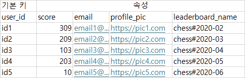
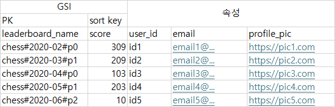

# 실시간 게임 순위표
## 1단계: 문제 이해 및 설계 범위 확정
* Q : 순위표의 점수는 어떻게 계산하나?
  * A : 사용자는 경기에서 승리하면 포인트를 얻고 이것으로 점수를 계산한다. 경기에서 이길 때마다 1점의 포인트를 추가로 획득한다.
* Q : 모든 플레이어가 순위표에 포함되어야 하는가?
  * A : 그렇다
* Q : 한 순위표는 얼마 동안이나 유효한가?
  * A : 매달 새로운 토너먼트를 시작할 때마다 만들어진다
* Q : 상위 10명의 사용자를 위한 순위표가 필요한가?
  * A : 그렇다. 추가로 특정 사용자의 순위를 순위표에 표시할 수 있어야 한다. 추가로 특정 사용자의 4순위 위 아래도 논의해보자.
* Q : 토너먼트에 참가하는 사용자는 몇 명인가?
  * A : DAU 500만, MAU 2,500만으로 가정한다.
* Q : 토너먼트 기간 동안 평균 몇 경기가 진행되는가?
  * A : 각 선수는 하루 평균 10 경기를 치른다
* Q : 점수가 같으면 순위를 어떻게 결정하는가?
  * A : 동일하다. 가능하면 동점자 간 순위를 가르는 것도 생각해보자.
* Q : 순위표는 실시간인가?
  * A : 실시간 또는 준 실시간에 가깝게 표시하자.

### 기능 요구사항
* 순위표에 상위 10명을 표시한다.
* 특정 사용자의 순위를 표시한다.
* 어떤 사용자보다 4순위 위와 아래에 있는 사용자를 표시한다.

### 비기능 요구사항
* 점수 업데이트는 실시간이다.
* 일반적인 확장성, 가용성 및 안정성 요구사항

### 개략적 규모 추정
* 24시간 동안 고르게 게임이 분포된다고 하면 초당 평균 50명의 사용자가 게임을 플레이한다(5,000,000 / 10^5초 =~ 50)
* 최대 부하는 5배로 가정하자, 초당 250명의 사용자를 감당할 수 있어야 한다.
* 하루 평균 10개의 게임을 플레이한다고 가정하면 점수를 획득하는 이벤트는 50 x 10 =~ 500, 최대 5배로 가정했으므로 500 x 5 = 2,500이다.(?)
  * > 아니지 않나?
* 상위 10명 순위표 가져오기 QPS는 각 사용자가 첫 게임을 열 때만 표시한다고 가정하면 QPS는 50이다.

## 2단계: 개략적 설계안 제시 및 동의 구하기
### API 설계
* 사용자가 게임에서 승리하면 사용자의 순위를 갱신하는 API, 게임서버의 호출로 한정된다.

* POST /v1/scores
* request : 
* ```{"user_id": "uid1234", "points": 1515}```

* GET /v1/scores
* response :
```json
{
  "data":[
    {
      "user_id" : "user_id1",
      "user_name" : "alice",
      "rank" : 1,
      "score" : 976
    },
    {
      "user_id" : "user_id2",
      "user_name" : "bob",
      "rank" : 2,
      "score" : 975
    }
  ],
  "total" : 10
}
```

* GET /v1/scores/{:user_id}
* response
```json
{
  "user_info" : {
    "user_id" : "user5",
    "score" : 940,
    "rank" : 6
  }
}
```

### 개략적 설계안


1. 사용자가 승리하면 클라이언트에서 게임 서비스에 요청을 보낸다
2. 게임 서비스는 요청을 검사하고 순위표 서비스에 점수 갱신 요청을 보낸다
3. 점수를 저장소에 저장한다
4. 클라이언트는 순위표 서비스에 직접 요청해 데이터를 가지고 온다

#### 클라이언트가 순위표 서비스와 직접 통신해야 하는가?
* 다른 대안으로 클라이언트가 점수를 정하는 방식이 있다.
* 사용자가 프락시를 설치하고 점수를 마음대로 바꾸는 중간자 공격(man in the middle attack)을 할 수 있어 보안상 안전하지 않다.

#### 게임 서비스와 순위표 서버 사이에 메시지 큐가 필요한가?
* 게임 점수가 어떻게 사용되는지에 따라 달라진다.
* 다른 곳에서도 이용되거나 여러 기능을 지원해야 한다면 카프카에 넣는 것이 합리적이다.
  * 순위표, 분석, 푸시 알림 등 여러 곳에서 동일한 데이터를 사용할 수 있기 때문이다.

### 데이터 모델
#### 관계형 데이터베이스
* 규모 확장성이 그다지 중요하지 않고 사용자 수가 많지 않다면 어떻게 하는 것이 좋을까?
* RDB를 사용할 가능성이 높다.
* 점수 변화와 조회에 필요한 CREATE, READ, UPDATE만 단순하게 처리하면 된다.
* 데이터가 많지 않을때는 효과적이지만 레코드가 수백만 개 정도로 많아지면 성능이 나빠지는 문제가 있다.
* RDB는 지속적으로 변하는 대량의 정보를 신속하게 처리할 수 없기 때문이다.
* Index와 LIMIT을 이용하여 처리할 수 있겠지만 특정 사용자의 순위를 찾기 어렵고, 순위표 하단의 사용자를 찾기도 어렵다.

#### 레디스
* 레디스는 정렬 집합을 지원한다
* 정렬 집합
  * Skip list를 두어 빠른 검색을 가능하게 하는 자료 구조
  * Sorted linked list는 O(n) 시간 복잡도로 삽입 삭제 검색을 수행할 수 있다.
  * 다단계 색인을 통해 Binary search를 구현한다.
  * 따라서 정렬 집합은 O(log(n))의 시간 복잡도를 가진다.
* 레디스 정렬 집합을 사용한 구현
  * ZADD : 기존에 없던 사용자를 집합에 삽입 또는 업데이트 한다.O(log n)
  * ZINCRBY : 점수를 지정한 만큼 증가시킨다.O(log n)
  * ZRANGE / ZREVRANGE : 특정 범위의 사용자를 가지고 온다. O(log(n) + m)
  * ZRANK / ZREVRANK : 특정 사용자의 위치를 가져온다. O(log n)

#### 저장소 요구사항
* 최악의 시나리오는 MAU에 속한 모두가 승리하여 월 순위표가 변경되어야 하는 경우다
* ID가 24바이트고 점수가 2바이트라면 26 바이트의 저장소가 필요하다.
* MAU * 26 바이트 = 650MB의 저장공간이 레디스에 필요하다
* 스킵 리스트로 인해 2배로 필요하다고 해도 레디스 한대로 충분하다, QPS 2500도 마찬가지다
* 레디스 Active - Passive 또는 클러스터를 활용하자

## 3단계: 상세 설계
### 클라우드 서비스 사용 여부
#### 자체 서비스를 이용하는 방안

#### 클라우드 서비스를 이용하는 방안(Serverless)
* 서버 대신 AWS Lambda와 같은 기술을 이용할 수 있다.

* 인프라의 규모가 필요에 맞게 확장이 자동으로 되는 장점이 있고 유지보수를 따로 할 필요가 없다.
#### 레디스 규모 확장
* 5백만 DAU라면 한 대의 레디스 캐시로도 충분하다, 그러나 100배라면?
* 저장 용량 65GB , 250,000 QPS를 처리해야 한다
* 샤딩을 하자, 샤딩에서 가장 중요한 것은 어떤 데이터를 기준으로 샤딩할 것인가가 된다
* 고정 파티션
  * 점수의 범위에 따라 파티션을 나눈다면?
  * 점수의 분포가 고르게 되어야 한다. 애플리케이션에서 샤딩을 처리한다면 해당 사용자가 어느 샤드에 있는지 알아야 한다.
  * 사용자의 점수가 변경되어 다른 샤드로 옮겨야 할 때는 기존 샤드에서 제거하고 새 샤드로 옮겨야 한다.
  * 상위 10명의 점수를 가져오려면 가장 높은 점수가 저장된 샤드에서 가지고 오면 된다
  * 특정 사용자의 점수는 샤드내 순위 + 보다 높은 점수를 가진 샤드에 속한 사용자를 가지고 와야한다. 이는 O(1)시간에 알아낼 수 있다.

* 해시 파티션
  * 레디스 클러스터를 사용하는 방법
  * 특정 점수 대역에 과도하게 모여 있는 경우에 효과적이다.
  * 여러 노드에 데이터를 자동으로 샤딩하는 방법으로 각각의 키가 특정한 해시 슬롯에 속하도록 하는 샤딩 기법을 사용한다.
  * CRC16(key) % 16384 연산을 수행하여 어느 슬롯에 속하는지 계산한다.
  * 상위 10명을 계산하는 것은 좀 까다로운데 각 샤드에서 상위 10명을 받고 그것을 애플리케이션에서 다시 정렬해야 한다.
    * 상위 k개 반환에서 k가 아주 크다면 샤드에서 많은 데이터를 읽고 정렬해야 하므로 지연 시간이 늘어난다
    * 가장 느린 파티션에서 데이터를 읽고 나서야 결과를 계산할 수 있다
    * 특정 사용자의 순위를 결정한 방법이 없다
  * 따라서 고정 노드를 사용한다.
    * > 상위는 따로 저장해두면 간단한데, 특정 사용자의 순위를 결정하기 어려울듯

* 레디스 노드 크기 조정
  * redis-benchmark 도구를 이용해 시뮬레이션 하고 얼마나 많은 요청을 처리할 수 있는지 측정해두자.

### 대안: NOSQL
* 쓰기 연산에 최적화 되어 있고
* 같은 파티션 내의 항목을 점수에 따라 효율적으로 정렬 가능하다.
* 후보군으로는 DDB, Cassandra, MongoDB 등이 있다
* DDB를 예로 들어보자

* 
* 위와 같이 생긴 데이터는 순위표와 사용자 테이블을 denormalization 하여 모든 정보를 담고 있다.
* 레코드가 많아지면 상위 점수를 찾기 위해 테이블을 전부 뒤져야 한다.
* sort key를 추가하여 정렬해보자.
* 
* 이 방법은 부하가 높을때 문제가 된다.
* DDB는 안정 해시를 이용하여 데이터를 분산하는데, 최근 데이터가 같은 PK에 몰려 hot partition이 되고 만다.
* 파티션을 분산하기 위한 파티션 번호를 키에 추가하는 방법이 있으나 읽기 및 쓰기를 모두 복잡하게 만든다.
* 또한 얼마나 많은 파티션을 만들어야 하는지도 문제가 된다.
* 
* partition number를 추가한 테이블의 예제이다.
* 앞에서와 같이 분산-수집을 통해 파티션별 상위 10개를 읽어오고 정렬해야 한다.
* 파티션의 수가 많을 수록 부하는 줄겠지만 최종 순위표를 만들기 위해 더 많은 파티션을 읽어야 한다.
* 사용자의 상대적 순위를 쉽게 정할 수 없지만 백분위수를 구하는 것은 가능하다.
* 각 샤드의 분포가 거의 동일하다면 샤드의 점수 분포로 사용자의 percentage를 구할 수 있다.

## 4단계: 마무리
* 정렬 집합을 사용하여 순위표를 구현하였다.
### 더 빠른 조회 및 동점자 순위 판정 방안
1. 사용자 ID와 객체 사이의 대응 관계를 레디스에 저장하면 더 빠르게 사용자 정보를 확인할 수 있다
2. 두 사용자의 점수가 같은 경우 점수를 받은 순서에 따라 순위를 매길 수 있다. TIMESTAMP와 사용자 ID의 대응 관계를 저장해두면 된다.
### 시스템 장애 복구
* 레디스도 장애가 발생할 수 있다. 
* MYSQL로부터 REDIS를 복구하는 스크립트를 만들어 장애를 대비할 수 있다.
