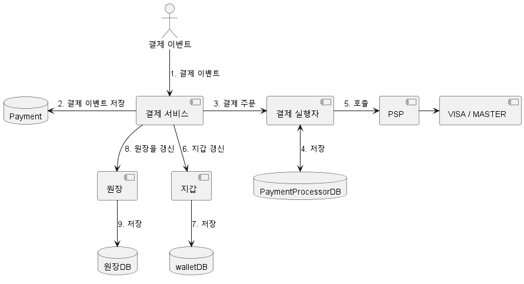
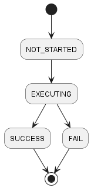
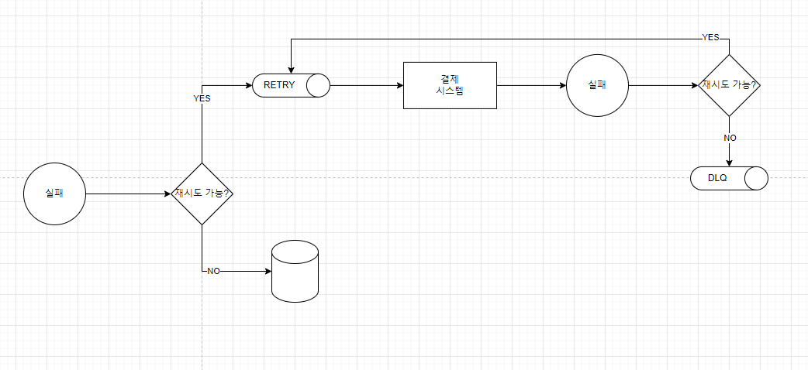

# 결제 시스템
## 1단계: 문제 이해 및 설계 범위 확정
* 결제 시스템에 대한 생각은 사람마다 다르기 때문에 범위를 정확히 하자
* apple pay, google pay 같은 디지털 지갑일수도, paypal stripe 같은 결제 처리 백엔드 일 수도 있다
* Q : 어떤 종류의 결제 시스템인가?
  * A : 아마존과 같은 전자상거래 서비스의 결제 백엔드라고 가정한다.
* Q : 어떤 결제 방법을 지원해야 하는가?
  * A : 신용 카드 결제만 해보자
* Q : 직접 처리해야 하는가?
  * A : 아니다. 대행 업체를 사용하자.
* Q : 신용 카드 데이터를 시스템에 저장해야 하는가?
  * A : 시스템이 직접 저장하거나 처리하지 않고 대행 업체에 의존한다.
* Q : Global 인가? 다양한 통화 및 국제 결제를 지원해야 하는가?
  * A : 하나의 통화만 사용한다고 가정한다.
  * > 환율 및 국가별 결제 관련 법 개념이 포함되면 아주 어려워지기 때문인듯
* Q : 하루 몇 건의 결제를 가정해야 하는가?
  * A : 일 100만 건으로 가정한다.
* Q : 아마존과 같은 전자상거래 사이트에서 판매자에게 대금을 지급하는 절차를 지원해야 하는가?
  * A : 그렇다.
* Q : 다른 주의사항이 있는가?
  * A : 장애로 인해 서비스 간 상태가 다를 수 있다. 조정 작업을 수행하고 불일치하는 부분이 발견되면 교정해야 한다.

### 기능 요구사항
* pay-in : 결제 시스템이 판매자를 대신하여 고객으로부터 대금을 수령한다
* pay-out : 결제 시스템이 전 세계의 판매자에게 제품 판매 대금을 송금한다

### 비기능 요구사항
* 신뢰성 및 내결함성 : 결제 실패는 신중하게 처리해야 한다
* 내부 서비스(결제 시스템, 회계 시스템)와 외부 서비스(결제 서비스 제공업체) 간의 조정 프로세스

### 개략적인 규모 추정
* 일 100만 건의 트랜잭션을 처리해야 하는데, 10 TPS 가 된다.
* 10 TPS는 일반적인 데이터베이스에서 무리없이 처리할 수 있으므로 정확한 트랜잭션 처리에 초점을 맞춰야 한다.

## 2단계: 개략적 설계안 제시 및 동의 구하기
* 크게 대금 수신/정산 흐름으로 나눌 수 있다
[flow]
### 대금 수신 흐름
#### 결제 서비스
* 사용자로부터 결제 이벤트를 수락하고 결제 프로세스를 조율한다.
* AML/CFT와 같은 규정을 준수하는지, 자금 세탁이나 테러 자금 조달과 같은 범죄 행위의 증거가 있는지 평가하는 위험 점검이다.
* 일반적으로 제3자 제공업체를 사용한다.

#### 결제 실행자
* PSP를 통해 결제 주문 하나를 실행한다.
#### 결제 서비스 공급자(PSP)
* A 계정에서 B 계정으로 돈을 옮기는 역할을 담당한다. 구매자의 신용 카드 계좌에서 돈을 인출하는 역할을 맡는다.
#### 카드 유형
* 카드사는 신용 카드 업무를 처리하는 조직이다. VISA, Mastercard, Discovery 등이 있다.
#### 원장(Ledger)
* 결제 트랜잭션에 대한 금융 기록
* 사용자가 판매자에게 1달러를 결제하면 사용자로부터 1달러를 인출하고 판매자에게 1달러를 지급하는 기록을 남긴다.
#### 지갑
* 판매자의 계정 잔액을 기록한다.
* 특정 사용자가 결제한 총 금액을 기록할 수도 있다.

### 결제 서비스 API
* POST /v1/payments
* 결제 이벤트를 실행한다

**request body**

|필드|설명|자료형|
|:---:|:---:|:---:|
|buyer_info|구매자 정보|json|
|checkout_id|해당 결제 이벤트를 식별하는 ID|String|
|credit_card_info|암호화된 신용 카드 정보 또는 결제 토큰|json|
|payment_orders|결제 주문 목록|list|

**payment_order**

|        필드        |      설명       |   자료형  |
|:----------------:|:-------------:|:------:|
|  seller_account  |      판매자      | String |
|      amount      |      대금       | String |
|     currency     | 주문에 사용된 통화 단위 | String |
| payment_order_id |  주문을 식별하는 ID  | String |
* amount에 String을 사용하는 이유
  * protocol, sw, hw에 따라 serialize/deserialize에 사용하는 숫자 정밀도가 다를 수 있다.
  * 매우 크거나 작을 수 있다

* GET /v1/payments/{:id}
* payment_order_id가 가리키는 단일 결제 주문의 상태를 반환한다.
### 결제 서비스 데이터 모델
* 결제 서비스에는 결제 이벤트와 결제 주문 두 개 테이블이 필요하다.
* 중점은 성능보다는 안정성, 모니터링, DBA채용을 쉽게 할 수 있는가에 둔다.
**결제 이벤트**

|이름|자료형|
|:--:|:--|
|checkout_id|string PK|
|buyer_info|string|
|seller_info|string|
|credit_card_info|카드 업체에 따라 다름|
|is_payment_done|boolean|

**결제 주문**

|이름| 자료형 |
|:--:|:--:|
|payment_order_id|string PK|
|buyer_account|string|
|amount|string|
|currency|string|
|checkout_id|string FK|
|payment_order_status|string|
|ledger_updated|boolean|
|wallet_updated|boolean|

* checkout_id는 foreign key로 하나의 결제가 하나의 이벤트를 만들고 하나의 이벤트에 여러 결제 주문이 포함될 수 있다

### 복식부기 원장 시스템(double-entry, accountng/bookeeping)
* 정확한 기록을 남기는 데 핵심적 역할을 한다.
* 모든 결제 거래는 두 개의 별도 원장 계좌에 같은 금액으로 기록한다.

|계정|차감|증가|
|--|--|--|
|구매자|$1||
|판매자||$1|

* 항상 모든 거래의 합계는 0 이어야 한다.

### 외부 결제 페이지
* 신용 카드 정보를 내부에 저장하려면 미국의 PCI DSS와 같은 복잡한 규정을 준수해야 한다.
* 따라서 PSP에서 제공하는 외부 신용 카드 페이지를 사용한다.
### 대금 정산 흐름
* pay-out 역시 유사한 방식을 사용하지만 반대로 타사 정산 서비스를 이용해 전자상거래 웹사이트 은행 계좌에서 판매자 은행 계좌로 돈을 이체한다
* 이 역시 대금 정산을 위해 Tipalti와 같은 외상 매입금 지급 서비스 제공업체를 이요한다.
## 3단계: 상세 설계
* 고객이 여러번 결제를 누르면? 결제 실패는 어떻게 처리할 것인가? 와 같은 정합성 문제를 알아보자.
### PSP 연동
* 직접 카드사에 연결할 수 있다면 PSP가 필요 없지만 직접 연결에 투자할 수 있는 것은 아주 큰 회사 뿐이다. 일반적으로 다음 두 가지 방법중 하나를 사용한다.
1. 회사가 민감한 결제 정보를 저장할 수 있다면 API를 통해 PSP와 연동하는 방법이 있다.
2. 복잡한 규정 및 보안 문제로 결제 정보를 저장하지 않기로 한 경우 PSP는 카드 결제 세부 정보를 수집하여 PSP에 안전하게 저장할 수 있도록 외부 결제 페이지를 제공한다.

### 조정
* 시스템 구성 요소가 비동기적으로 통신하는 경우 메시지가 전달되거나 응답이 반환된다는 보장이 없다.
* 따라서 정확성 보장을 위해 조정을 수행해야 한다.

* 조정중에 발견된 차이는 일반적으로 재무팀에 의뢰하여 수동으로 고친다.
1. 문제의 유형을 알고 있으며 자동화할 수 있는 경우, 엔지니어는 발생한 불일치 문제의 분류와 조정을 모두 자동화할 수 있다.
2. 유형은 알지만 자동화할 수 없는 경우, 재무팀에서 수동 조정한다.
3. 분류할 수 없는 유형인 경우, 재무팀에서 수동 조사한다.
### 결제 지연 처리
* PSP가 해당 결제 요청의 위험성이 높다고 보고 담당자 검토를 요구하는 경우
* 신용 카드사가 카드 소유자의 추가 정보를 요청하는 3D 보안 인증 같은 추가 보호 장치를 요구하는 경우
* PSP는 위 이슈를 다음과 같이 처리한다.
* 결제가 pending임을 알리는 상태 정보를 클라이언트에 반환하고 사용자에게 표시한다. 고객이 현재 결제 상태를 확인할 수 있는 페이지도 제공한다.
* PSP는 회사를 대신하여 대기 중인 결제의 진행 상황을 추적하고, 상태가 바뀌면 웹훅을 통해 결제 서비스에 알린다.
### 내부 서비스 간 커뮤니케이션
#### Synchronous
* 단점
  * 성능 저하, 장애 격리 어려움, 높은 결합도, 낮은 확장성
#### Asynchronous
* 크게 두 가지 범주로 나눌 수 있다.
  * 단일 수신자 : 각 요청은 하나의 수신자 또는 서비스가 처리한다. 복수의 구독자가 있어도 처리된 메시지는 바로 제거되므로 한번만 수행된다.
  * 다중 수신자 : 각 요청을 여러 수신자 또는 서버가 처리한다. 카프카는 이런 시나리오에 최적화 되어있다.
    * 하나의 요청을 푸시 알림, 재무 보고 업데이트, 분석 결과 업데이트 등의 다양한 용도에 쓰일 수 있어 결제에 유용한다.
* 일반적으로 동기식 통신은 설계는 쉽지만 서비스의 자율성을 높이기 적합하지 않다.
### 결제 실패 처리
* 안정성 및 결함 내성은 결제 시스템의 핵심적 요구사항이다.
#### 결제 상태 추적
* 결제 상태를 모든 단계에서 정확하게 유지하는 것은 매우 중요하다.
* 실패가 일어날 때마다 결제 거래의 현재 상태를 파악하고 재시도 또는 환불이 필요한지 여부를 결정한다.
#### 재시도 큐 및 실패 메시지 큐
* 실패를 잘 처리하기 위해 retry queue와 dlq를 두는 것이 바람직하다.
* retry : 일시적 오류
* dlq : 반복적으로 처리에 실패한 메시지는 dlq로 보낸다.

### Exactly Once
#### Retry
* 일반적으로 사용되는 재시도 전략은 다음과 같다.
* immediate : 즉시
* fixed interval : 재시도 전에 고정된 시간 대기
* incremental interval : 실패 횟수에 따라 점차 대기를 늘려 나간다.
* exponential backoff : 직전 대비 두 배씩 늘려 나간다.
* cancel : 취소
* 지나치게 공격적인 재시도 전략은 자원을 낭비하고 과부하를 유발한다. Retry-After 헤더를 함께 보내자.
* 재시도 시 발생할 수 있는 잠재적 문제는 이중 결제가 있다.
  * scenario 1 : 사용자가 결제 버튼을 두번 누른다.
  * scenario 2 : PSP가 결제를 성공했으나 네트워크 오류로 응답이 결제 시스템에 도달하지 못했다. 사용자가 다시 결제를 시도한다.
#### idempotency
* 멱등성은 연산을 여러 번 수행하여도 최초 실행 결과가 그대로 보존되는 특성을 일컫는다.
* Scenario 1 : 고객이 '결제' 버튼을 빠르게 두 번 클릭한 경우
  * 결제 서비스는 동일한 키로 많은 요청을 받으면 하나만 처리하고 나머지는 429 Too Many Requests를 반환한다.
* Scenario 2 : PSP가 결제를 처리했지만 네트워크 오류로 결제 시스템에 전달되지 못한 경우
  * 결제 서비스는 PSP에 비중복 난수를 전송하고 이 난수는 결제 주문을 유일하게 식별하는 역할을 한다.
    * > 다시 만들어도 같은 값이려면 결제 ID 자체를 보내는 방법밖에 없을듯
  * 같은 결제 주문은 PSP로 전송되는 토큰도 같다. 이중 결제로 판단하고 종전 실행 결과를 반환한다.

### 일관성
* 결제 실행 과정에서 상태 정보를 유지 관리하는 여러 서비스가 호출된다.
1. 결제 서비스는 nonce, token, 결제 주문, 실행 상태 등 결제 관련 데이터를 유지한다.
1. 원장은 모든 회계 데이터를 보관한다.
1. 지갑은 판매자의 계정 잔액을 유지한다.
1. PSP는 결제 실행 상태를 유지한다.
1. 데이터는 신뢰성을 높이기 위해 여러 데이터베이스 복제본 간에 복제될 수 있다.
* 데이터를 다중화하는 경우 복제 지연으로 사본과 불일치하는 일이 생길 수 있다.
1. 주 DB에서만 읽기 쓰기를 처리하고 사본은 안정성 보장에만 사용한다. 자원이 낭비된다.
2. 사본을 항상 동기화하는 Paxos, Raft와 같은 합의 알고리즘을 사용하거나, YugabyteDB, CockroachDB와 같은 합의 기반 분산 DB를 사용한다.
### 결제 보안
| 문제       | 해결책                                             |
|----------|-------------------------------------------------|
| 요청/응답 도청 | HTTPS 사용                                        |
| 데이터 변조   | 암호화 및 무결성 강화 모니터링                               |
| 중간자 공격   | 인증서 고정과 함께 SSL사용                                |
|데이터 손실| 여러 지역에 걸쳐 DB 복제 및 snapshot 생성                   |
|DDoS| 처리율 제한 및 방화벽                                    |
|카드 도난| 토큰화, 카드 번호를 토큰으로 저장하고 결제에 사용                    |
|PCI 규정 준수| PCII DSS는 브랜드 신용 카드를 처리하는 조직을 위한 정보 보안 표준이다(?). |
|사기| 주소 확인 카드 확인번호, 사용자 행동분석 등                       |
## 4단계: 마무리
* 대금 수신 흐름과 정산 흐름을 살펴보았다.
* 재시도, 멱등성, 일관성에 대해서도 자세히 살펴보았다.
* 그외
  * 모니터링, 경보, 디버깅 도구, 환율, 지역, 현금 결제, 구글/애플 페이 연동과 같은 다양한 주제가 남아있다.