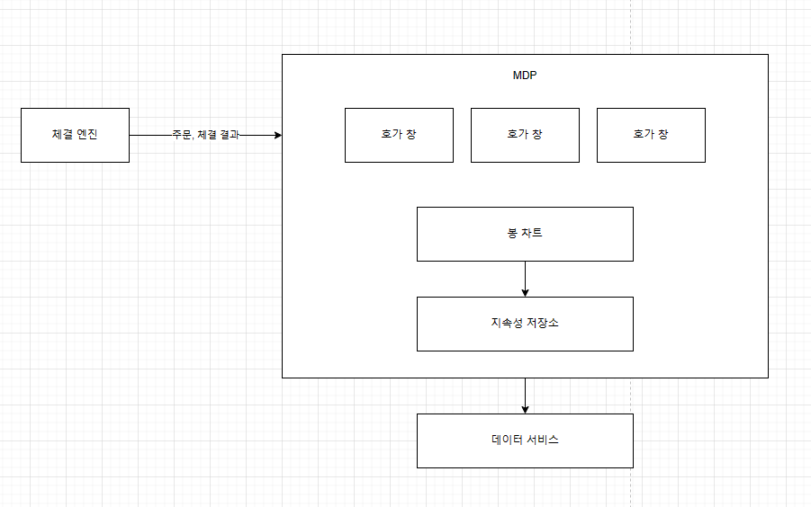

# 증권 거래소
* 거래소는 다양한 유형이 존재한다.
* 설계에 뛰어들기 전 면접관에게 질문을 던져 거래소 규모 등 중요 특징을 먼저 확인하자

## 1단계: 문제 이해 및 설계 범위 확정
* 증권 걸소는 지연 시간, 처리량, 안정성에 대한 요구사항이 엄격한 복잡한 시스템이다.
* Q : 어떤 증권을 거래한다고 가정할 것인가?
  * A : 주식만 거래한다
* Q : 새 주문, 주문 취소, 주문 수정, 지정가 주문..등 모든 주문 유형을 지원해야 하는가?
  * A : 새 주문, 주문 취소, 지정가 주문이 가능해야 한다
* Q : 시간 외 거래가 가능해야 하는가?
  * A : 아니다
* Q : 사용자 수, 증권 수, 주문 수등 규모에 대한 부분도 설명해주세요
  * A : 주문이 체결된 경우 실시간으로 파악할 수 있어야 한다. 호가 창의 정보는 실시간 갱신되어야 한다. 최소 수만 명 사용자가 동시에 거래할 수 있어야 하며, 100가지 주식 거래가 가능해야 한다.
거래량은 하루 수십억 건이상 발생할 수 있고, 규제 시설이므로 위험성 점검이 가능해야 한다.
* Q : 위험성 점검에 대해 조금 더 자세히.
  * A : 사용자가 하루 거래할 수 있는 애플 주식이 100만 주 이하라는 규제가 있을때 규제를 위반하는 거래가 이루어지지 않도록 하면 된다.
* Q : 사용자 지갑에 대한 고려가 필요한가?
  * A : 주문 전에 충분한 자금이 있는지, 아직 체결되지 않은 주문이 있는 경우 해당 주문에 이용된 자금은 다른 주문에 쓰일 수 없어야 한다.

### 비기능 요구사항
* 가용성(Availability) : 최소 99.99%
* 결함 내성(Fault tolerance) : 프로덕션 장애의 파급을 줄이기 위한 결함 내성과 빠른 복구 메커니즘
* 지연 시간(latency) : 왕복 지연 시간은 ms 수준이어야 하며, 특히 p99 지연시간이 중요하다.
* 보안(security) : 거래소는 계정 관리 시스템을 갖추어야 한다. 법률 및 규정 준수도 중요한 문제다.

### 개략적 규모 추정
* 100가지 주식
* 하루 10억 건 주문
* 영업시간 (NYSE 기준 6.5시간)
* QPS : 10억 / 6.5시간 x 3600 =~ 43,000
* 최대는 5배수로 215,000로 가정한다. 거래량은 장 시작 직후, 마감 직전에 스파이크 친다.

## 2단계: 개략적 설계안 제시 및 동의 구하기
### 증권 거래 101
* 브로커 : 증권사
* 기관 고객 : 대량 거래를 수행하는 고객, 거래 빈도는 낮고 거래량이 많다. 시장 영향을 줄이기 위한 주문 분할과 같은 기능이 필요하다.
일반 고객보다 특별히 더 낮은 latency를 원한다.
* 지정가 주문 : 가격이 고정된 매수 또는 매도 주문, 즉시 이루어지지 않을 수 있고, 부분만 체결될 수도 있다.
* 시장가 주문 : 가격을 지정하지 않는 주문으로 즉시 체결된다.
* 시장 데이터 수준 : 미국 기준 L1, L2, L3  세 가지 가격 정보 등급이 있다.
  * L1 : 최고 매수 호가, 매도 호가, 수량
  * L2 : L1 + 물량
  * L3 : L2 + 각 가격별 물량
* candle 차트 : 특정 기간 동안의 주가, 최고가, 시작가, 종가, 최저가를 표현한다. 1분,5분,1시간,1일,1주,1개월..
* FIX : 금융 정보 교환 프로토콜

### 개략적 설계안
* 
#### Trading flow
1. 고객이 브로커의 웹 또는 앱을 통해 주문한다.
2. 브로커가 주문을 거래소에 전송한다.
3. 주문이 클라이언트 게이트웨이를 통해 거래소로 들어간다.
   1. 여기서 입력 유효성, 속도 제한(?), 인증, 정규화와 같은 기본 게이트키핑 기능을 수행한다.
4. 위험 관리자가 설정한 점검을 수행한다.
5. 지갑에 자금이 충분한지 확인한다.
6. 주문이 체결 엔진으로 전송된다. 매수,매도 측에 각각 두 개의 집행 기록을 생성한다. 시퀀서는 주문 및 집행 기록을 일정 순서로 정렬한다.
7. 주문 집행 사실을 클라이언트에 전송한다.

#### Market data flow
* M1. 체결 엔진은 주문이 체결되면 집행 기록 스트림을 만든다. 그리고 시장 데이터 게시 서비스로 전송한다.
* M2. 시장 데이터 게시 서비스는 집행 기록 및 주문 스트림에서 얻은 데이터를 시장 데이터로 사용하여 candle/호가 창을 구성한다. 그리고 데이터 서비스로 보낸다.
* M3. 시장 데이터는 실시간 분석 전용 스토리지에 저장된다. 브로커는 데이터 서비스를 통해 실시간 시장 데이터를 읽는다.

#### Report flow
* 보고 서비스는 주문 및 실행 기록에서 보고에 필요한 모든 필드의 값을 모은 다음 그 값을 종합해 만든 레코드를 데이터베이스에 기록한다.

**중요한 것은 각 flow는 지연 시간 요구 사항이 다르다**

### Tradig flow
#### 체결 엔진
* matching engine, cross engine
1. 각 주식 심벌에 대한 주문서나 호가 창을 유지 관리한다. 이것은 특정 주식에 대한 매수 및 매도 주문 목록이다.
2. 매수 주문과 매도 주문을 연결한다.
3. 집행 기록 스트림을 시장 데이터로 배포한다.
* 여기서 만들어지는 체결 순서는 결정론적이어야 한다. 입력으로 주어지는 주문 순서가 같으면 체결 엔진이 만드는 집행 기록 순서는 언제나 동일해야 한다.
#### Sequencer
* 체결 엔진을 결정론적으로 만드는 핵심 구성 요소
* 체결 엔진에 주문을 전달하기 위해 sequence ID를 붙인다
* 처리를 끝낸 모든 집행 기록에도 sequence ID를 붙인다
* 누락을 쉽게 확인할 수 있는 일련번호 형식의 sequence ID가 좋다
1. 시의성(timeliness) 및 공정성(fairness)
2. 빠른 복구(recovery) 및 재생(replay)
3. 정확한 1회 실행 보증(exactly-once guarantee)
* sequencer의 역할은 메시지 큐 역할을 하지만, 지연 시간의 문제로 카프카를 구현에 사용하기는 어렵다

#### Order manager
* 주문 상태를 관리한다
* 종합적 위험 점검 담당 컴포넌트에 주문을 보내어 위험성을 검토한다
* 사용자의 지갑에 충분한 자금이 있는지 확인한다
* 주문을 sequencer에 전달한다

#### 클라이언트 게이트웨이
* 인증, 유효성 검사, 처리율 제한, 정규화, FIXT 지원 의 기능을 제공한다
* 가능한 한 빠르게 동작해야 한다. 이를 위해 복잡한 기능을 뒤로 미루는 것이 좋을 수 있다
* 
* 고객 유형별로 다양한 클라이언트 게이트웨이가 존재하며, 브로커/딜러가 코로케이션 엔진을 호출하는 경우는 지연 시간을 빛(!)과 같은 속도로 제공해야한다.

#### 시장 데이터 흐름
* 
* 체결 엔진의 집행 기록을 수신하고 집행 기록 스트림에서 호가 창과 candle 차트를 만들어 낸다.

#### 보고 흐름
* 거래 이력, 세금 보고, 규정 준수 여부 보고, 결산 등의 기능 제공
* 거래 흐름과 달리 지연 시간보다 정확성과 규제 준수에 중점을 둔다
* 입력과 출력을 모아 속성을 구성하는 것이 일반적인 관행이다
* 

### API 설계
* 고객은 브로커를 통해 증권 거래소와 상호 작용하여 주문, 체결 조회, 시장 데이터 조회, 분석을 위한 과거 데이터 다운로드 등을 수행한다.
* RESTful API는 헤지 펀드와 같은 기관 고객의 지연 시간 요구사항을 충족하지 못할 수도 있다.
* 주문
  * POST /v1/order
* 집행
  * GET /v1/execution?symbol&orderId&startTime&endTime
* 호가 창/주문서
  * GET /v1/marketdata/orderBook/L2?symbol&depth
* 가격 변동 이력(candle chart)
  * GET /v1/marketdata/candles?symbol&resolution&startTime&endTime

### 데이터 모델
#### 상품, 주문, 집행
* 상품 : 거래 대상 주식이 가진 속성
* 주문 : 매수 또는 매도 실행 명령
* 집행 : 실행 결고
* 주문과 집행 기록은 거래소가 취급하는 가장 중요한 데이터
* 주문과 집행은 빠른 속도를 요구하기 때문에 데이터베이스의 저장은 장이 마감된 이후에 수행된다. 그 이전에는 메모리 상에서 처리한다.
  * > 서비스의 shutdown 등으로 유실되면 어떻게 해야 할까?
* 보고 서비스는 데이터베이스에 주문 및 집행 기록을 저장한다
* 집행 기록은 시장 데이터 프로세서로 전달되어 호가 창/주문서와 candle 차트 데이터 재구성에 쓰인다

#### 호가 창
* 호가 창은 특정 증권 또는 금융 상품에 대한 매수 및 매도 주문 목록
* 자료 구조는 아래 요구 사항을 만족해야 한다
  * 일정한 조회 시간 : 주문량 조회
  * 빠른 추가/취소/실행 : 가급적 O(1) 시간 복잡도를 만족해야 한다, 새 주문, 주문 취소, 주문 체결
  * 빠른 업데이트 : 주문 변경
  * 최고 매수 호가/최저 매도 호가 질의
  * 가격 수준 순회(?)
* 2700주를 매수한다고 했을때 가격 대별 매도 잔량에서 빠르게 탐색하여 처리해야 한다
  * 100.11 900/700/400
  * 100.10 200/400/1100/100
  * 100.10의 200+400+1100+100을 체결하고 매도 호가는 100.11로 올라간다, 그리고 잔여 900주를 체결한다
* 그러나 위와 같은 형태는 Linked list를 사용하므로 시간 복잡도가 O(n)이 된다. (취소를 수행 할 경우, 탐색 후 제거)
* doubly-linked list + map과 같은 형태를 사용하여 O(1)에 처리할 수 있다.
> O(1)을 보장하기 위해 노력한 적이 있는지?
> 
> 어떻게 확인 할 수 있을까?
#### candle 차트
* 시장 데이터를 만들 때 호가창과 더불어 사용하는 핵심 자료 구조
* 메모리 사용량을 최적화 하기 위해 미리 할당해 둔 링 버퍼에 candle을 보관한다
  * > 무슨 의미인지 모르겠음
* 메모리에 두는 candle을 제한하고 나머지는 디스크에 보관한다

## 3단계: 상세 설계
### 성능
* 지연 시간은 거래소에 아주 중요한 문제다
* 평균 지연 시간은 낮고, 전반적인 지연 시간 분포는 안정적이어야 한다
* 지연 시간 = ∑ route 지연 시간
  * 줄이기 위한 방법
  1. 중요 경로에서 실행할 작업 수를 줄인다(모수 축소)
  2. 각 작업의 소요 시간을 줄인다
* 중요 경로에는 꼭 필요한 구성 요소만 두고, 로깅 조차도 지연 시간을 줄이기 위해 중요 경로에서는 제거한다
  * > 유실.. 유실.. 유실..? 대응 방안이 궁금
  * > 로깅 제거는 방안 2에 대한 대응 방법이 아닐까?
* 왕복 네트워크의 지연 시간은 약 500 μs다
  * > 내부 네트워크로 보임 cloud의 경우 500 마이크로초 보장 어려울 것 같음
* Sequencer는 이벤트를 디스크에 저장하는데, 디스크는 아무리 빨라봐야 수십 ms가 걸린다
* 이를 모두 고려하면 end to end 지연시간은 수십 ms에 달한다. 과거에는 나쁘지 않았으나 현대의 거래소들은 μs단위의 지연시간을 가지고 있다.
* 검증된 설계안의 요체는 모든 것을 동일한 서버에 배치하여 네트워크 구간을 제거하는 것이다.
* 컴포넌트 간 통신은 이벤트 저장소인 mmap을 사용한다.
* 
#### 애플리케이션 루프
* 하나의 작업을 하나의 CPU에 고정하여 성능 효율을 높인다.(thread affinity)
  1. context switch가 발생하지 않는다
  2. 단일 스레드로 lock contention도 발생하지 않는다
* 단점은 코딩이 복잡해진다.
  1. 플랫폼 종속적인 코드 작성 필요(Linux, Windows..)
  2. OS가 제공하는 성능 최적화 기능 사용 불가(자동 할당)
  3. 디버깅 어려움

#### mmap
* file을 메모리 주소 공간에 매핑하는 기술
* 이를 이용하여 이벤트 저장소를 구현하면 각 프로세스는 disk I/O 없이 공유 메모리를 사용할 수 있다

#### 이벤트 소싱
* 변경이 발생한 모든 이벤트를 immutable 한 로그로 저장하는 것
* 카프카의 pub-sub 모델과 유사하지만 지연 시간에 대한 엄격한 요구사항으로 인해 사용하기 어렵다
1. 게이트웨이는 주문을 이벤트 저장소 클라이언트를 사용하여 미리 정의된 NewOrderEvent 형태로 전송한다
2. 체결 엔진은 이벤트 저장소로부터 이벤트를 수신하고 유효성을 검사한 후 내부 주문 상태에 추가한다. 이후 주문 처리 담당 CPU 코어로 전송된다
3. 주문이 체결되면 OrderFilledEvent가 생성되어 이벤트 저장소로 보내진다
4. 시장 데이터 프로세서 및 보고 서비스와 같은 구성요소는 이벤트 저장소를 구독하고 처리한다

### 고가용성
* 시스템의 SPOF는 체결 엔진과 같은 컴포넌트가 된다. 다중화 해야 한다.
  * > 단일 장비인데 다중화는 어떻게? multi core?
  * > active - passive 전략 사용한다고 책에 나옴
  * 그러나 단일 장비 내에서 동작한다는 문제가 있다
  * 따라서 active-passive engine이 아니라 서버의 클러스터를 active-passive로 확장해야 한다는 의미이다.
  * 그러나 여기서 이벤트 저장소를 복제하는데 시간이 걸리기 때문에 reliable UDP를 이용하여 메시지를 broadcast 하여 항상 sync를 맞춰둔다
* 장애 감지 및 백업 인스턴스로의 장애 조치 결정이 빨라야 한다.

### 결함 내성
* 데이터 센터 자체의 shutdown과 같은 문제는 어떻게 해결할까?
* 여러 region에 걸쳐서 복제해두는 방법이 있다. 그러나 고민해야 할 것들이 있는데
1. active 서버가 다운되면 언제, 어떻게 passive로 전환할 결정을 내리는가?
2. passive 서버 가운데 새로운 리더는 어떻게 선출하는가?
3. 복구 시간 목표는?(Recovery Time Objective, RTO)
4. 어떤 기능을 복구해야 하는가(Recovery Point Objective, RPO)?

* 답변하기 전에 장애를 어떻게 정의할 것인지가 중요하다.
1. 시스템에서 잘못된 경보를 전송하면 불필요한 Failover가 수행된다.
2. 코드의 버그로 인해 active가 다운되었다면 passive 역시 같은 결과를 맞을 수 있다
* 카오스 엔지니어링을 통해 드물게 발생하는 까다로운 사례를 수면으로 끌어내고 운영 경험을 빠르게 축적할 수 있다.
* Raft와 같은 합의 알고리즘을 통해 어떤 서버가 Active 서버가 될지 결정 할 수 있다
  * leader는 follower에게 heartbeat을 보낸다.
  * 일정 기간 동안 heartbeat을 받지 못한 follower는 새 leader를 선출하는 선거 타이머를 시작한다
  * 이 과정을 반복하고 과반 이상의 표를 받으면 새로운 leader가 된다
* 복구 시간의 경우 증권거래소는 2등급 RTO를 달성해야 한다.
  * 자동 복구가 반드시 가능해야 한다
  * > 2등급이 정확히 뭘 의미하는지?
* 데이터 손실이 허용될 수 있는 범위를 파악하자
  * RPO는 비즈니스에 심각한 피해가 발생하기 전에 손실될 수 있는 데이터의 양, 즉 손실 허용 범위를 의미한다.
  * 증권 거래소는 거의 0에 가깝다.
  * 여러 복제된 사본에서 복구하자

### 체결 알고리즘
* FIFO로 체결

### 결정론(determinism)
* 기능적 결정론과 지연 시간 결정론이 있다
* 이벤트 소싱 아키텍처를 이용해 동일한 순서로 재생하면 항상 같은 결과를 얻는것이 기능적 결정론
* 지연 시간 결정론은 각 거래의 처리 시간이 거의 동일해야 한다는 의미
  * 지연 시간의 변동폭이 크면 각 거래의 처리 시간에 따라 결과가 변경될 수 있는 위험이 있음

### 시장 데이터 게시 서비스 최적화
* candle 차트는 비싼 컴퓨팅 파워를 사용하기 때문에 최적화가 필요하다.
* 이를 위해 circular buffer를 사용하여 계속해서 업데이트만 할 수 있도록 하는 방법이 있다.

### 시장 데이터의 공정한 배포
* 시장 데이터를 다른 사람보다 빨리 받는 다는것은 미래를 예측할 수 있다는 것이나 마찬가지다.
* 따라서 모든 수신자가 동시에 시장 데이터를 받을 수 있도록 보장하는 것이 중요하다.
* 첫번째 구독자가 항상 먼저 받는다면 문제가 된다.
  * UDP multicast를 통해 브로드 캐스트 하거나
  * 무작위 순서로 주는 방법이 있다
#### 멀티캐스트
1. unicast : 하나의 출처에서 하나의 목적지로만 보내는 방법
2. broadcast : 하나의 출처에서 전체 하위 네트워크로 보내는 방법
3. multicast : 하나의 출처에서 여러 하위 네트워크로 보내는 방법
* 그러나 UDP는 신뢰성이 낮은 protocol 이므로 모든 수신자에게 도달하지 못할 수 있다
  * > 그래서 NACK oriented reliable multicast와 같은 방법을 사용함  
  1. packet을 sequential 하게 전송함
  2. sequence가 빠지면 NACK를 sequence를 기록하여 전송자에게 보냄
  3. 전송자는 NACK를 받으면 다시 전송함
  4. 수신자는 받으면 NACK를 보내지 않음으로 받았음을 확인함
#### 코로케이션
* 공정성 논란이 있을 수 있으나 유료 VIP 서비스로 본다.(기관....)

#### 네트워크 보안
* 거래소는 일반적으로 공개된 몇가지 인터페이스가 있어 DDoS에 대응할 수 있어야 한다
1. 공개 서비스와 데이터를 비공개와 분리하여 중요한 클라이언트에 영향을 미치지 않도록 한다. 필요한 경우 읽기 전용 사본으로 문제를 격리
2. 업데이트가 잦지 않은 경우 캐싱
3. URL 보안
4. 네트워크 게이트 등을 통한 safe / blocklist 관리
5. 처리율 제한

