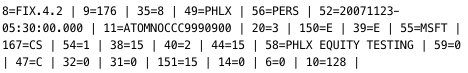
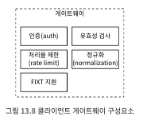
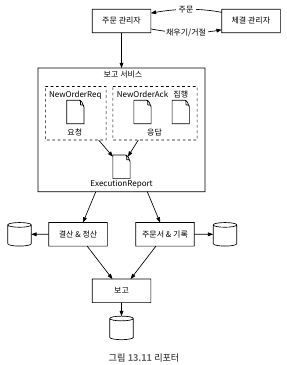
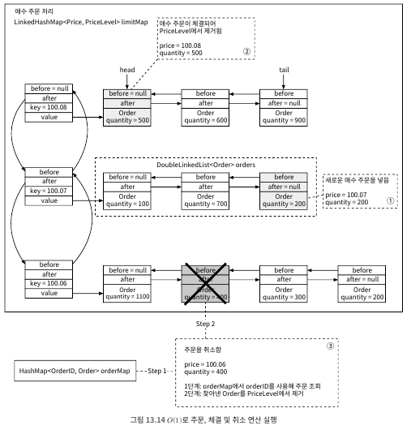
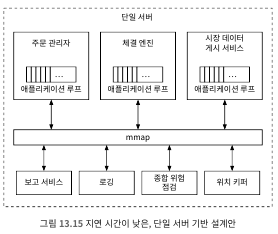
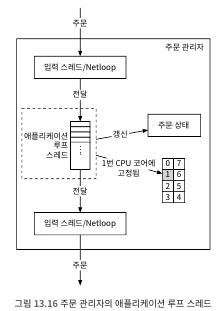
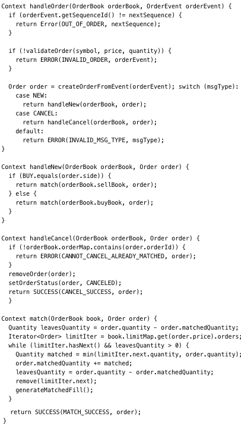
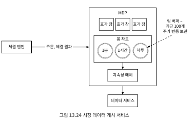

# 13. 증권 거래소
- 현대에서는 하루에 수십 억건의 거래와 수천억 달러의 주식이 거래되고 있음

## 13.1 문제 이해 및 설계 범위 확정
##### 비기능 요구사항
- 가용성: 최소 99.99% 가용성 중요
- 결함 내성: 프로덕션 장애 파급 감소
- 지연 시간: 왕복 지연 시간은 밀리초 수준, p99 지연시간 중요
- 보안: 계정 관리 시스템을 갖춰기에 법률 및 규정 준수, 공개자원의 경우 DDoS 장어

##### 개략적 추정
- 100가지 주식
- 하루 10억 건의 주문
- 하루 6.5시간 영업
- QPS: 10억/(6.5시간 x 3600) =~ 43,000
- 최대 QPS: 5 x QPS = 21,500, 거래량은 장 시작 직후, 마감 직전이 높음

## 13.2 개략적 설계안 제시 및 동의 구하기
##### 기본 개념 및 용어(증권 거래 101)
- 브로커
  - 개인 사용자가 증권을 거래하고 시장 데이터를 확인할 수 있도록 인터페이스 제공
  - 예를 들어 한국으로는 하나증권
- 기관 고객
  - 전문 증권 거래 소프트웨어를 사용하여 대량으로 거래
  - 기관 고객마다 거래  시스템에 대한 요구사항은 다름
- 지정가 주문
  - 가격이 고정된 매수 또는 매도 주문
  - 즉시 이루어지지 않을 수 있으며, 부분적으로 체결 가능
- 시장가 주문
  - 가격을 지정하지 않은 주문
- 시장 데이터 수준
  - L1, L2, L3의 세 가지 가격 정보 등급 존재
    - L1: 최고 매수 호가, 매도 호가 및 수량
    - L2: L1 + 깊이(depth) 체결 
    - L3: L2 + 주문 가격에 체결을 기다리는 물량 정보
- 봉차트
  - 특정 기간 동안의 주가
  - 하나의 봉막대로 시작가, 종가, 최고가, 최저가 표시 가능
  - 지원되는 시간은 1분, 5분, 1시간, 1일, 1주일, 1개월
- FIX(Financial Information Exchange Protocol)
  - 금융 정보 교환 프로토콜<br>
    <br>

##### 개략적 설계안
<br>
- 거래 흐름: 하나의 주문 절차, 지연시간 요건이 엄격
  - 1단계: 고객이 브로커의 웹 또는 모바일 앱을 통해 주문
  - 2단계: 브로커가 주문을 거래소에 전송
  - 3단계: 주문이 클라이언트 게이트웨이를 통해 거래소로 전달
    - 유효성 검사, 속도 제한, 인증, 정규화등 진행
  - 4~5단계: 주문 관리자는 위험 관리자가 설정한 규칙에 따라 위험성 점검
  - 6단계: 위험성 점검 통과 후, 주문 관리자는 지갑에 주문 처리 자금이 충분하지 확인
  - 7단계~9단계: 주문 체결 엔진으로 전송, 체결 엔진은 매수측과 매도 측에 각각 두개의 집행 기록 생성
    - 위의 과정이 항상 결정론적으로 동일한 결과가 나오도록 보장
  - 10~14단계: 주문 집행 사실을 클라이언트에 전송
- 시장 데이터 흐름: 하나의 주문이 체결엔진부터 데이터 서비스를 거쳐 브로커로 전달 및 집행 과정
  - M1 단계: 체결 엔진은 주문이 체결되면 집행 기록 스트림을 생성 -> 해당 스트림은 시장 데이터 게시 서비스로 전송
  - M2 단계: 시장 데이터 게시 서비스는 집행 기록 및 주문 스트림으로 봉 차트와 호가 창 구성 후 시장 데이터를 데이터 서비스로 전달
  - M3 단계: 시장 데이터는 실시간 분석 전용 스토리지에 저장, 브로커는 데이터 서비스를 통해 실시간 시장 데이터를 읽음
- 보고 흐름
  - R1~R2단계: 보고 서비스는 주문 및 실행 기록에서 보고에 필요한 모든 필드의 값을 모은 다음 레코드 생성 및 데이터 베이스 기록
- 거래 흐름은 중요 경로를 따라 진행, 시장 데이터 흐름이나 보고 흐름은 다름
  - 두가지 이연 요구사항이 다름

##### 거래 흐름
- 체결 엔진
  - 교차 엔진이라고도 함
  - 주요 역할
    - 주문서 내지 호가 창을 유지 관리 -> 주문서 또는 호가 창은 특정 주식에 대한 매수 및 매도 주문 목록
    - 매수 주문과 매도 주문을 연결 -> 체결은 빠르고 신속하게 처리
    - 집행 기록 스트림을 시장 데이터로 배포
  - 가용성 높아야 하고 체결 순서는 결정론적이어야 함
- 시퀀서
  - 체결 엔진을 결정론적으로 만드는 핵심 구성 요소
  - 체결 엔진에 주문을 전달하기 전에 순서 ID를 붙여 보냄
    - 시의성(timeliness) 및 공정성(fairness)
    - 빠른 복구 및 재생
    - 정확한 1회 실행 보증
  - 입력 시컨서와 출력 시권서 두가지 있으며, 각각 고유한 순서를 유지
- 주문 관리자
  - 한쪽에서 주문을 받고 다른쪽에서 집행 기록을 받음, 주문 상태 관리
  - 클라이언트 게이트웨이를 통해 주문 수신
    - 종합적 위험 점검 담당 컴포넌트에 주문을 보내어 위험성 검토
    - 사용자의 지갑에 거래를 처리하기 위한 자금이 있는지 확인
    - 주문을 시퀀서에 전달
  - 시퀀서를 통해 체결 엔진으로부터 집행 기록 수신 -> 집행 기록을 게이터웨이를 통해 브로커에 반환
- 클라이언트 게이트웨이<br>
  <br>
  - 거래소 문지기 -> 클라이언트로부터 주문을 받아 주문 관리자에게 전달
  - 지연시간에 민감하며 가벼워야 함
  - 고객 유형별 클라이언트 게이트웨이는 다양 -> 지연 시간, 거래량, 보안 요구사항 등
##### 시장 데이터 흐름
<br>
- 시장 데이터 게시 서비스(MDP)는 체결 엔진에서 집행 기록을 수신 집행 기록 스트림에서 호가 창과 봉 차트를 생성
  - 호가 창과 봉 차트를 통칭하여 시장 데이터라 칭함
- 시장 데이터는 데이터 서비스로 전송 -> 해당 서비스의 구독자가 사용
##### 보고 흐름
<br>
- 중요한 경로에 있진 않지만 시스템의 중요한 부분 -> 보고는 필수 요소
- 거래 이력, 세금 보고, 규정 준수 여부 보고 등 기능 제공
- 거래 흐름은 효율성과 짧은 지연 시간이 중요하지만, 보고 서비스는 그렇지 않음 -> 정확성 과 규정 준수가 핵심
- 입력으로 들어오는 주문과 결과로 나가지는 집행 기록 모두에서 정보를 모아 레코드 구성

##### API 설계
- 주문
  - POST /v1/order -> 주문 처리, 인증 필요
  - 인자
    - symbol(String): 주식을 나타내는 심벌
    - side(String): 매수 또는 매도
    - price(Long): 지정가 주문의 가격
    - orderType(String): 지정가 또는 시장가
    - quantity(Long): 주문 수량
  - 응답
    - id(Long): 주문 ID
    - creationTime(Long): 주문이 시스템에 생성된 시간
    - filledQuantity(Long): 집행이 완료된 수량
    - remainingQuantity(Long): 아직 체결되지 않은 주문 수량
    - status(String): new/cancled/filled
  - 코드
    - 200: 성공
    - 40x: 인자 오류/ 접근 불가/ 권한 없음
    - 500: 서버 오류
- 집행
  - GET /v1/execution?symbol={:symbol}&orderId={:orderId}&startTime={:startTime}&endTime={:endTime} -> 집행 정보 질의, 인증 필요
  - 인자
      - symbol(String): 주문 심벌
      - orderId(String): 주문의 ID, 선택적 인자
      - startTime(Long): 질의 시작 시간, 기원 시간(epoch) 기준
      - endTime(Long): 질의 종료 시간, 기원 시간(epoch) 기준
  - 응답
      - executions(Array): 범위 내 모든 집행 기록의 배열
      - id(Long): 집행 기록 ID
      - orderId(String): 주문의 ID
      - symbol(String): 주식을 나타내는 심벌
      - side(String): 매수 또는 매도
      - price(Long): 체결 가격
      - orderType(String): 지정가 또는 시장가
      - quantity(Long): 체결 수량
  - 코드
    - 200: 성공
    - 40x: 인자 오류/ 접근 불가/ 권한 없음
    - 500: 서버 오류
- 호가 창/주문서
    - GET /v1/marketdata/orderBook/L2?symbol={:symbol}&depth={:depth}&startTime={:startTime}&endTime={:endTime} -> 주식 심벌, 주어진 깊이 값에 대한 L2 호가 창 질의 결과 반환
    - 인자
        - symbol(String): 주문 심벌
        - depth(Int): 반환할 호가 창의 호가 깊이
        - startTime(Long): 질의 시작 시간, 기원 시간(epoch) 기준
        - endTime(Long): 질의 종료 시간, 기원 시간(epoch) 기준
    - 응답
        - bids(Array): 가격과 수량 정보를 담은 배열
        - asks(Long): 가격과 수량 정보를 담은 배열
    - 코드
        - 200: 성공
        - 40x: 인자 오류/ 해당 자원 없음/ 접근 불가/ 권한 없음
        - 500: 서버 오류
- 가격 변동 이력(봉 차트)
    - GET /v1/marketdata/candles?symbol={:symbol}&resolution={:resolution}&startTime={:startTime}&endTime={:endTime} -> 주어진 시간 범위, 해당도, 심벌에 대한 봉차트 데이터
    - 인자
        - symbol(String): 주문 심벌
        - resolution(Long): 봉 차트의 윈도 길이(초 단위)
        - startTime(Long): 질의 시작 시간, 기원 시간(epoch) 기준
        - endTime(Long): 질의 종료 시간, 기원 시간(epoch) 기준
    - 응답
        - candles(Array): 각 봉의 데이터를 담은 배열
        - open(Double): 해당 봉의 시가
        - close(Double): 해당 봉의 종가
        - high(Double): 해당 봉의 고가
        - low(Double): 해당 봉의 저가
    - 코드
        - 200: 성공
        - 40x: 인자 오류/ 해당 자원 없음/ 접근 불가/ 권한 없음
        - 500: 서버 오류

##### 데이터 모델
- 상품, 주문, 집행<br>
  <br>
  - 상품(Product): 거래 대상 주식, 해당 데이터는 자주 변경되지 않음, 주로 UI 데이터 -> 캐시 적용하기 좋음
  - 주문(Order): 매수 또는 매도 실행 명령
  - 집행 기록(Execution): 충족(fill)이라고도 부름
  - 주문과 집행 기록은 거래소가 취급하는 가장 중요한 데이터
  - 세가지 중요 흐름에서 해당 데이터는 다른 형태로 이용
    - 중요 거래 경로는 주문과 집행 기록을 데이터베이스에 저장하지 않음
      - 성능을 위해 메모리에서 거래 체결하고 공유 메모리를 활용하여 주문과 집행 기록을 저장 및 공유
      - 주문과 집행 기록은 빠른 복구를 위해 시퀀서에 저장 -> 데이터 보관은 장 마감 후에 진행
    - 보고 서비스는 조정이나 세금 보고등을 위해 데이터베이스에 주문 및 집행 기록 저장
    - 집행 기록은 시장 데이터 프로세서로 전달되어 호가 창/주문서와 봉 차트 데이터 재구성에 사용
- 호가 창
  - 특정 증권 또는 금융 상품에 대한 매수및 매도 주문 목록 -> 가격 수준별로 정리
  - 체결 엔진이 빠른 주문 체결을 위해 사용하는 핵심 자료 구조
  - 다음 요구 사항을 만족해야 함
    - 일정한 조회 시간: 주문량 등의 조회 포함
    - 빠른 추가/취소/실행 속도: 가극적 O(1) 시간 복잡도 만족
    - 빠른 업데이트: 주문 교체등 포함
    - 최고 매수 호가/최저 매도 호가 질의
    - 가격 수준 순회
  - 호가창 실제 구현 코드
    ```
     class PriceLevel {
        private Price limitPrice;
        private long totalVolume;
        private List<Order> orders;
     }
     class Book<Side> {
        private Side side;
        private Map<Price, PriceLevel> limitMap;
     }
     class OrderBook {
        private Book<Buy> buyBook;
        private Book<Sell> sellBook;
        private PriceLevel bestBid;
        private PriceLevel bestOffer;
        private Map<OrderId, Order> orderMap;
     }
    ```
  - 호율적인 호가 창을 만드려면 "orders"의 자료구조는 이중 연결 리스트로 변경 필요 -> O(1)로 처리
    - 새 주문을 넣는 것은 PriceLevel 리스트 마지막에 새 Order를 추가하는 것을 의미 -> O(1)
    - 주문 체결한다는 것은 PriceLevel 리스트 맨 앞에 있는 Order를 삭제한다는 것 -> O(1)
    - 주문을 취소한다는 것은 호가 창(OrderBook)에서 Order를 삭제한다는 뜻 -> Map을 이용해서 O(1)<br>
      <br>
- 봉 차트
  - 시장 데이터 프로세서가 시장 데이터를 만들 때 호가 창과 더불어 핵심 자료 구조
  - 하나의 봉이 커버하는 시간 범위가 경과하면 다음 주기를 커버할 새 Candlestick 생성하여 CandlestickChart 추가
    ```
     class Candlestick {
        private long openPrice;
        private long closePrice;
        private long highPrice;
        private long lowPrice;
        private long volume;
        private long timestamp;
        private int interval;
     }
     class CandlestickChart {
        private LinkedList<Candlestick> sticks;
     }
    ```
  - 봉 차트에서 많은 종목의 가격 이력을 다양한 시간 간격을 사용해 추적하려면 많은 메모리 필요 -> 성능 최적화
    - 미리 메모리를 할당해 둔 링 버퍼에 봉을 보관 -> 새 객체 할당 횟수 줄일 수 있음
    - 메모리에 두는 봉의 개수를 제한하고 나머지는 디스크에 보관
  - 시장 데이터 실시간 분석을 위해 메모리 상주 -> 시장 마감된 후 데이터베이스에 저장
## 13.3 상세 설계
- 일부 대형 거래소는 하나의 거대 서버로 거의 모든 것을 운영
##### 성능
- 지연시간은 아주 중요한 문제 -> 평균 지연 시간은 낮아야 하며, 지연 시간 분포도 안정(p99)
  - 지연 시간 = 중요한 경로상의 컴포넌트 실행 시간
- 지연 시간을 줄이는 방법 두가지
  - 중요 경로에서 실행할 작업 수를 줄임
    - 중요 경로에 꼭 필요한 구성 요소만 둠 -> 로깅도 제외
  - 각 작업의 소요 시간을 줄임
    - 네트워크 및 디스크 사용량 경감
      - 시퀀서도 이벤트를 저장하는 디스크 저장소이기에 디스크 엑세스 지연 생김
      - 단일 서버에서 이벤트 저장소로 mmap 활용<br>
        <br>
    - 각 작업의 실행 시간 경감
      - 애플리케이션 루프 활용<br>
        <br>
        - 문맥전환이 필요 없음
        - 스레드가 하나라 잠금 경합이 없음
##### 이벤트 소싱
- 상태 변경하는 모든 이벤트의 변경 불가능 로그 유지 -> 데이터베이스에 상태를 유지하면 문제 발생 시, 원인 추적이 어려움
- mmap 이벤트 저장소를 메시지 버스로 사용 -> 지연 시간에 대한 엄격한 규격 없으면 카프카 활용도 가능<br>
  <br>
- 위의 설계안에서 조정한 부분이 몇 가지 존재
  - 주문관리자를 검포넌트에 내장되는 재사용 가능 라이브러리로 변경
    - 주문 상태는 많은 컴포넌트에 중요하며 중앙화된 주문관리자는 지연시간을 늘림
  - 시퀀서를 없앰
    - 이벤트 저장소에 보관된 항목에는 시퀀스 필드가 존재
    - 각 에븐트 저장소에는 하나의 시퀀서만 있음 -> 시퀀서가 여러개면 이벤트 저장소에 쓰는 권한을 두고 갱쟁하기에 좋지 않음
      - 거래소 같이 바쁜 시스템의 경우 락경합에 낭비할 시간 없음
##### 고가용성
- 본 설계안은 99.99% 가용성 염두하여 설계 -> 거래소 다운될 수 있는 시간은 하루에 8.64초를 넘기면 안됨
- 가용성을 높여야할 때는 다음과 같은 사항 고려
  - 거래소 아키텍처의 단일 장애 지점 식별
  - 장애 감지 및 백업 인스턴스로의 장애 조치 결정이 빨라야 함
- 클라이언트 게이트웨이 등의 무상태 서비스는 단순 수평적 확장이 가능
- 주문 관리자나 체결 엔진처럼 상태를 저장하는 컴포넌트는 사본 간 상대 데이터를 복사해야함<br>
  <br>
  - 부 엔진은 동일한 이벤트 수신하지만 이벤트 전송하지 않음
  - 주 인스턴스가 죽으면 부 인스턴스가 승계 후 이벤트 전송
  - 부 인스턴스가 죽으면 재시작하고 이벤트 저장소 데이터를 사용해 모든 상태 복구 -> 이벤트 소싱 아키텍처는 거래소에 적합
- 주 인스턴스 문제를 자동 감지할 메커니즘도 필요
  - 모니터링 외에도 박동 메시지를 주고 받는 것도 고려
- 단일 서버 내 주/부 인스턴스가 아닌 주/부 서버의 클러스터 구성 필요
##### 결함 내성
- 주/부 설계안에서 부 서버까지 전부 다운되면? 확률은 낮지만 치명적인 상황 대비 필요
- 핵심 데이터를 여러 지역의 데이터센터에 복제하여 문제 해결
- 결함 내성은 아래와 같은 많은 질문에 대한 답 필요
  - 주 서버가 다운되면 어떻게 부 서버로 전환하는 결정할 껀지
  - 부 서버 가운데 새로운 리더는 어떻게 선출하는지
  - 복구 시간 목표(RTO)는 얼마인지
  - 어떤 기능을 복구해야 하는지(RPO)
- 장애가 생김에 대한 전환
  - 장애가 생겼다는 판단은 생각만큼 간단하지 않은 문제
    - 시스템에서 잘못된 경보를 전송하면 불필요한 장애 극복 절차 진행
    - 코드 버그로 인해 주서버가 다운되면 부 서버로 자동 전환해도 같이 다운됨
  - 몇가지 해결책 고려
    - 새 시스템을 출시 할대는 수동으로 장애 복구 조치 -> 추후 자동으로 장애 감지하여 복구 프로세스 도입
    - Raft 알고리즘을 통해 리더 선출 과정으로 주에서 부 서버로 전환
- 복구 시간
  - 애플리케이션이 다운되어도 사업에 심각한 피해가 없는 시간의 최댓값
  - 증권 거래소의 경우 2등급 복구 시간 목표(RTO)를 달성 -> 서비스의 자동 복구가 반드시 가능해야함
  - 우선 순위에 따라 서비스를 분류하고 최소 서비스 수준을 유지하기 위한 성능 저하 전략 정의
- 데이터 손실 허용 범위 파악
  - 복구 지점 목표(RPO)는 비즈니스에 심각한 피해가 발생하기 전에 손실될 수 있는 데이터 양
  - 증권거래소는 RPO가 거의 0에 가깝게 해야함
  - 래프트 매커니즘을 사용하면 데이터 사본이 많기에 가능
##### 체결 알고리즘
- 의사 코드는 아래와 같음<br>
  <br>
  - 해당 의사 코드는 FIFO 체결 알고리즘 활용 -> 특정 가격 수준에 먼저 들어온 주문 선체결
- 체결 알고리즘은 많음
##### 결정론
- 결정론에는 기능적 결정론과 지연 시간 결정론 존재
- 기능적 결정론
  - 시퀀서나 이벤트 소싱 아키텍처를 도입함으로써 이벤트를 동일한 순서로 재생하면 항상 같은 결과를 얻을 수 있도록 보장
  - 이벤트가 발생하는 실제 시간은 대체로 중요하지 않음 -> 순서가 중요
- 지연 시간 결정론
  - 각 거래의 처리 시간이 거의 같다는 뜻이며 사업에서 가장 중요한 부분
  - p99의 지연시간이 낮게 하여 모든 거래에 안정적 성능 제공
  - 지연 시간이 변동 폭이 커지면 원인 조사 필요 -> 자바의 경우 안전지점이 요인인 경우가 많음
##### 시장 데이터 게시 서비스 최적화
- 시장 데이터 데시 서비스는 체결 엔진의 체결 결과를 받아 호가 창과 봉차트를 재구축 후 구독자에게 게시
- MDP는 다양한 수준의 서비스를 제공함 -> 많은 메모리 필요
- MDP의 메모리는 무한대로 확장할 수 없음-> 봉 차트에는 상한선을 둠
- 이 설계안은 링 버퍼를 활용 -> 공간 사전 할당<br>
  <br>
##### 시장 데이터의 공정한 배포
- 거래소에서 지연 시간이 낮다는건 미래를 예측할 수 있는것과 같음 -> 모든 수신자가 동시에 시장 데이터 수신 필요
- 안정적 UDP를 사용하는 멀티캐스트를 통해 한 번에 업데이트 데이터 발송
##### 멀티캐스트
- 인터넷에서 데이터는 세 가지 유형의 프로토콜 통해 전송
  - 유니캐스트: 하나의 출처에서 하나의 목적지로 전송
  - 브로드캐스트: 하나의 출처에서 전체 하위 네트워크로 전송 
  - 멀티캐스트: 하나의 출처에서 다양한 하위 네트워크상의 호스트로 보내는 방식
- 거래소 설계에 보편적으로 이용되는 것은 멀티캐스트
- UDP는 신뢰성이 낮은 프로토콜이기에 손실 가능성 존재 -> 재처리 전송 필요
##### 코로케이션
- 브로커와 서버를 거래소와 같은 데이터 센터에 둘 수 있도록 코로케이션 서비스 제공
- 체결 엔진에 주문을 넣는 지연 시간은 전송 길이에 비례
- 위와 같은 서비스는 유로 VIP 서비스
##### 네트워크 보안
- 일반적으로 몇가지 인터페이스를 공개하고 있음 -> DDos 공격에 대응 필요
  - 공개 서비스와 비공개 서비스를 분리 -> 중요한 클라이언트에 영향 가지 않게 함
  - 자주 업데이트되지 않는 데이터 캐싱 -> 대부분의 질의가 DB 영향 미치지 못함
  - 디도스 공격에 대비해 URL 강화 -> /data?from=123&to=456 보단 data/recent 형식
  - 효과적인 허용/차단 리스트 매커니즘 사용
  - 처리율 제한(rate limit) 기능 활용